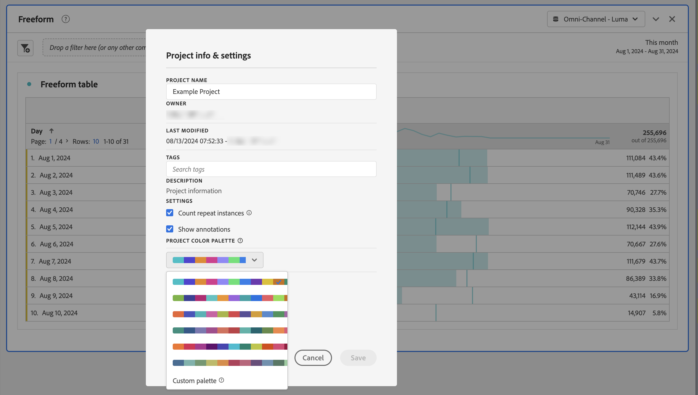

# 視覺化圖形調色盤 {#visualization-color-palettes}

<!-- markdownlint-disable MD034 -->

>[!CONTEXTUALHELP]
>id="workspace_project_colorpalette"
>title="專案調色盤"
>abstract="變更在此專案中使用的調色盤。"

<!-- markdownlint-enable MD034 -->

您可以變更 Workspace 中使用的視覺效果調色盤。 您可以選取預先定義的調色板，也可以指定與您公司品牌顏色相符的調色板。 此功能會影響工作區中大部分的視覺效果，但&#x200B;**不會**&#x200B;影響摘要變更、自由格式表格中的條件式格式及地圖視覺效果。

>[!NOTE]
>
>Internet Explorer 11 並不支援調色盤。

請記住：

* 有六種預先設定的調色盤可供選擇。 預設調色盤與列為第二的調色盤已針對對比度進行最佳化，兩者皆變得更方便供色盲使用者使用。
* 其他調色板已針對顏色和諧度進行最佳化。

## 若要變更調色盤：

1. 導覽至「**[!UICONTROL 工作區]** > **[!UICONTROL 專案]** > **[!UICONTROL 專案資訊和設定]**」。
1. 從&#x200B;**[!UICONTROL 專案調色盤]**&#x200B;下拉式功能表，您可以挑選其中一個預先設定的色彩配置。
1. 若要指定您自己的調色盤，請選取預先設定選項下方的「**[!UICONTROL 自訂調色盤]**」。
1. 指定最多 16 個以逗號分隔的十六進位值 (例如， `#00a4e4`) 來建立您自己的調色盤。 舉例來說，如果您只想使用 4 個值，則顏色會在包含更多顏色的視覺效果中自動重複。
