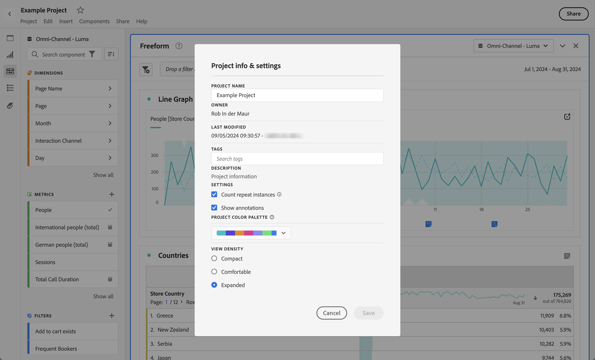

# 專案概觀

Workspace 專案可讓您合併資料元件、表格和視覺效果，以進行分析並與貴組織的任何人分享。在開始第一個專案之前，請先了解如何存取、瀏覽及管理您的專案。

## 專案清單 {#project-list}

當您第一次前往 **[!UICONTROL Analytics]** > **[!UICONTROL 工作區]**，頁面會列出您擁有的所有專案或您共用的專案。 這也是 Adobe Analytics 的登陸頁面，除非您之前已設定自訂登陸頁面。

「專案」頁面包含下列資訊：

>[!NOTE]
>
>預設不會顯示某些欄。 若要自訂您看到的欄，請按一下 **自訂表格** 圖示 .

| 元素 | 說明 |
|---|---|
| [編輯偏好設定](/help/analysis-workspace/user-preferences.md) | 為您建立的所有新專案或面板，管理 Analysis Workspace 及其相關元件的設定。 |
| [建立資料夾](/help/analysis-workspace/build-workspace-project/workspace-folders/create-folders.md) | 將新的資料夾或子資料夾新增至專案和資料夾清單。 |
| [建立專案](/help/analysis-workspace/build-workspace-project/create-projects.md) | 從頭開始新專案。 |
| 顯示更多 | 顯示建立空白專案或行動計分卡的選項， [檢視訓練教學課程](https://experienceleague.adobe.com/docs/analytics-learn/tutorials/analysis-workspace/analysis-workspace-basics/analysis-workspace-introduction.html?lang=zh-Hant)，或 [檢視發行說明](/help/release-notes/latest.md). |
| 顯示資料夾和專案 | 選擇是否要顯示專案的資料夾結構。 如需詳細資訊，請參閱[關於 Analytics 資料夾](/help/analysis-workspace/build-workspace-project/workspace-folders/about-folders.md)。 |
| 自訂表格（圖示） | 可讓您自訂針對「專案」頁面上的每個專案顯示的資訊。 |
| 名稱 | Workspace 專案名稱。 |
| 類型 | 指示這是Workspace專案、資料夾還是 [行動計分卡](https://experienceleague.adobe.com/docs/analytics/analyze/mobapp/home.html?lang=zh-Hant). |
| 標記 | 已套用到專案中的標籤。 |
| 已排程 | 表示專案是否已排程依排程傳送電子郵件給收件者。 另請參閱 [傳送專案資料給其他人](/help/analysis-workspace/export/t-schedule-report.md). |
| 共用連結 (任何人) | 您可與任何人共用專案，即使對方無權存取Analysis Workspace。 此欄顯示是否已以這種方式共用專案。 另請參閱 [與任何人共用專案（不需要登入）](/help/analysis-workspace/curate-share/share-projects.md#share-public-link) 在 [共用專案](/help/analysis-workspace/curate-share/share-projects.md) 以取得詳細資訊。 |
| 資料檢視 | 與專案相關聯的資料檢視。 |
| [專案角色](https://experienceleague.adobe.com/docs/analytics/analyze/analysis-workspace/curate-share/share-projects.html?lang=zh-Hant) | 指示您在專案中的角色 - 所有者、編輯、複製、檢視。 |
| 所有者 | 建立此專案的人 (您或與您共用專案的人)。 |
| 共用對象 | 已共用專案的使用者。 |
| 上次修改時間 | 上次修改專案的日期和時間。 |
| 上次開啟時間 | 專案上次開啟的日期和時間。 |
| 專案 ID | 專案的ID。 |
| 最大日期範圍 | 專案的最長日期範圍。 |
| 查詢數 | 專案中包含的查詢總數。 |
| 位置 | 專案所在的資料夾。 |

## 功能表列 {#menu-bar}

在專案中，功能表會提供管理專案、新增元件、尋找說明等功能的選項。每個功能表選項也都可以使用鍵盤[快速鍵](/help/analysis-workspace/build-workspace-project/fa-shortcut-keys.md)進行存取。

| 功能表項目 | 說明 |
|---|---|
| 專案 | 包含專案管理的常見動作，例如新增、開啟、儲存和另存新檔。 您也可以按一下「重新整理專案」來重新整理整個專案，以擷取最新資料和定義。[下載專案資料](/help/analysis-workspace/export/download-send.md) 選項可讓您從Workspace匯出資料。 「**專案資訊和設定** (請參閱下圖) 提供管理專案的多個選項。 |
| 編輯 | 還原或重做您的上一個操作。「全部清除」會將您的專案重設為空白起點。 |
| 插入 | 從此功能表插入新面板或視覺效果。您也可以從左側欄插入新面板和視覺效果。 |
| [元件](/help/components/overview.md) | 從您的專案建立新篩選器、計算量度、日期範圍或警報元件。 您也可以從左側欄建立新元件。如果您的元件定義在最近有了變更，「重新整理元件」將會擷取最新的定義。 |
| [共用](/help/analysis-workspace/curate-share/send-schedule-files.md) | 組織、共用及排程 PDF/CSV 專案給貴組織中的收件者。 |
| 說明 | 存取線上文件、影片及 Analytics [Experience League 社群](https://experienceleaguecommunities.adobe.com/t5/adobe-analytics/ct-p/adobe-analytics-community)。管理 Workspace 秘訣及[偵錯工具](https://www.adobe.io/apis/experiencecloud/analytics/docs.html#!AdobeDocs/analytics-2.0-apis/master/reporting-tricks.md)的可見度。尋找有關 Workspace 及影響專案[效能](/help/admin/optimizing-performance.md)之因素的詳細資訊。 |
| 「共用」按鈕或所有者 | 如果您是專案的所有者或編輯者，右上方的「共用」按鈕為您提供管理專案收件者的單鍵存取權。如果您擁有專案的複製或檢視角色，您將會看到專案所有者的名稱。 |

### 專案資訊和設定 {#info-settings}

**[!UICONTROL Workspace]** > **[!UICONTROL 專案]** > **[!UICONTROL 專案資訊和設定]** 提供目前使用中專案的專案層級資訊。

設定包括：

| 設定 | 說明 |
|---|---|
| 專案名稱 | 提供給專案的名稱。按兩下名稱即可進行編輯。 |
| 建立者 | 專案所有者名稱 |
| 上次修改時間 | 上次修改專案的日期。 |
| 標記 | 列出為了方便分類而套用至專案的所有標籤。 |
| 說明 | 說明可用於釐清專案的用途。按兩下說明即可進行編輯。 |
| 計算專案中的重複例項 | 指定是否要將重複例項計入報表。注意，此設定不適用於「流量」或「流失」視覺效果。 |
| [專案調色盤](/help/analysis-workspace/build-workspace-project/color-palettes.md) | 您可以變更用於 Workspace 的分類調色盤，其方式為選擇已針對色盲人士最佳化的立即可用調色盤或指定您的自訂調色盤。此功能會影響工作區中的許多項目，包括大部分的視覺效果。 |
| [檢視密度](/help/analysis-workspace/build-workspace-project/view-density.md) | 可減少左側欄、自由格式表格和同類群組表格的垂直邊框間距，讓您在畫面上看到更多資料。 |

## 左側欄 {#left-rail}

在專案中，可以從左側欄存取[面板](/help/analysis-workspace/c-panels/panels.md)、表格、[視覺效果](/help/analysis-workspace/visualizations/freeform-analysis-visualizations.md)和[元件]。這些都是專案的組成要素。

您也可以從[空白面板](/help/analysis-workspace/c-panels/blank-panel.md)存取視覺效果和面板。

左側欄的元件 (維度、量度、篩選器、日期範圍) 與作用中面板資料檢視有關。 作用中面板的周圍有藍色邊框，而且作用中資料檢視將會列在元件邊欄的最上方。

## 專案畫布 {#canvas}

專案畫布是您整合面板、表格、視覺效果和元件以建立分析的地方。專案可以包含許多面板，每個面板都可以有許多表格和視覺效果。

若您想要根據時段、資料檢視或分析使用案例來組織專案時，面板會很有幫助。 作用中面板的周圍有藍色邊框，而且可決定左側欄中有哪些元件可用。

根據您為專案選擇的起點，您一開始可以在畫布中使用[自由格式表格](/help/analysis-workspace/visualizations/freeform-table/freeform-table.md)或[空白面板](/help/analysis-workspace/c-panels/blank-panel.md)。開始分析的最快速方法是選取一個或多個元件，然後將其拖放到專案畫布上。系統將會自動為您呈現資料表格。[深入了解](/help/analysis-workspace/visualizations/freeform-table/freeform-table.md)建立表格的不同選項，或利用我們的[訓練教學課程](/help/analysis-workspace/home.md)以取得建立您的第一個專案的更多指南。

## Project Manager {#manager}

您可以在 **Analytics > 元件 > 專案** 底下管理 Analysis Workspace 專案。Project Manager會顯示特定使用者建立的專案。 您可以在「管理員> Analytics使用者和資產>轉移資產」底下將專案所有權轉移給新使用者。

在Projects Manager中，您可以新增、標籤、共用、複製/複製等。 在搜尋列中搜尋專案，或使用左側欄中的篩選選項進行搜尋。您可以依標籤、所有者、專案類型等條件進行篩選。

以下是 Projects Manager 中的常見操作，您可以一次針對一個或多個專案進行這些操作：

| 動作 | 說明 |
|---|---|
| 新增 | 從頭建立新專案。 |
| 標記或核准 | 選擇「標籤」或「核准」來組織您的專案，並使其更容易搜尋。 |
| [共用](/help/analysis-workspace/curate-share/share-projects.md) | 將專案提供給貴組織中的其他 Analysis Workspace 用戶使用。 |
| 刪除 | 刪除您的專案。 |
| 重新命名 | 編輯您的專案名稱。 |
| 複製 | 建立專案的重複複本。這會建立新專案和專案 ID。將不會複製與原始專案綁定的任何共用或排程。 |
| 匯出至 CSV | 將專案下載為 CSV 檔案，其中包含純文字資料。 |
