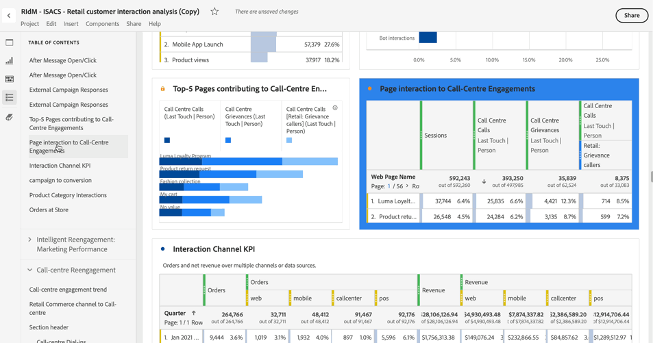

# 目錄

您可以在Analysis Workspace中檢視專案的目錄，該目錄可讓您在任何面板和專案中存在的視覺效果之間快速移動。 目錄在檢視包含許多面板和視覺效果的大型專案時特別實用。

+++ 觀看此功能的示範影片。

>[!VIDEO](https://video.tv.adobe.com/v/26990/?learn=on)

+++

>[!TIP]
>
>您可以使用區段標題視覺效果，識別並清楚表述面板中包含許多視覺效果的區段。 這些區段標題也會顯示為目錄中的專案。
>

若要檢視專案的目錄：

1. 在Analysis Workspace中，前往您要檢視目錄的專案。

1. 在按鈕面板中，選取 **[!UICONTROL 目錄]**。 如需詳細資訊，請參閱[Analysis Workspace概觀](/help/analysis-workspace/home.md)。 

   顯示專案的&#x200B;**[!UICONTROL 目錄]**，每個面板預設為展開。

1. 在&#x200B;**[!UICONTROL 目錄]**&#x200B;中，選取視覺效果。 

   選取的視覺效果會自動捲動至並短暫反白。

   
