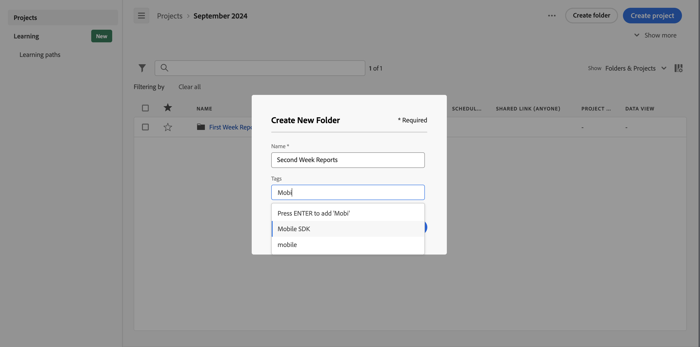

# 建立資料夾

您可以在 Workspace 登陸頁面上，將新的資料夾或子資料夾新增至專案和資料夾清單。

## 建立新資料夾

若要建立新資料夾，

1. 確保您已選取[顯示資料夾和專案](/help/analysis-workspace/build-workspace-project/freeform-overview.md#show-selector)。

1. 確保[標題區域](/help/analysis-workspace/build-workspace-project/freeform-overview.md#title-area)和[專案清單](/help/analysis-workspace/build-workspace-project/freeform-overview.md#project-list)顯示您要在其中建立新資料夾的資料夾。

1. 按一下&#x200B;**建立資料夾**。

1. 在&#x200B;**[!UICONTROL 建立新資料夾]**&#x200B;對話框中，輸入新資料夾的名稱。 例如：`Second Week Reports`。

1. 從&#x200B;**[!UICONTROL 標籤]**&#x200B;下拉式功能表中選取標籤或輸入新標籤。

   

1. 按一下&#x200B;**建立**。
新資料夾會新增至目前資料夾中。
