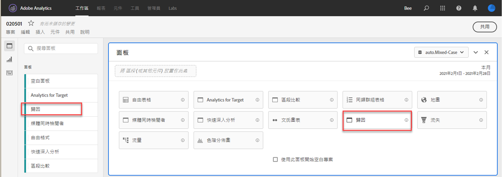
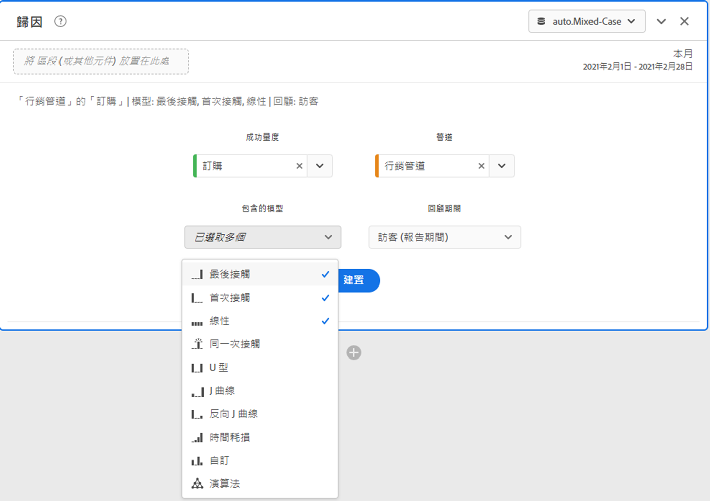
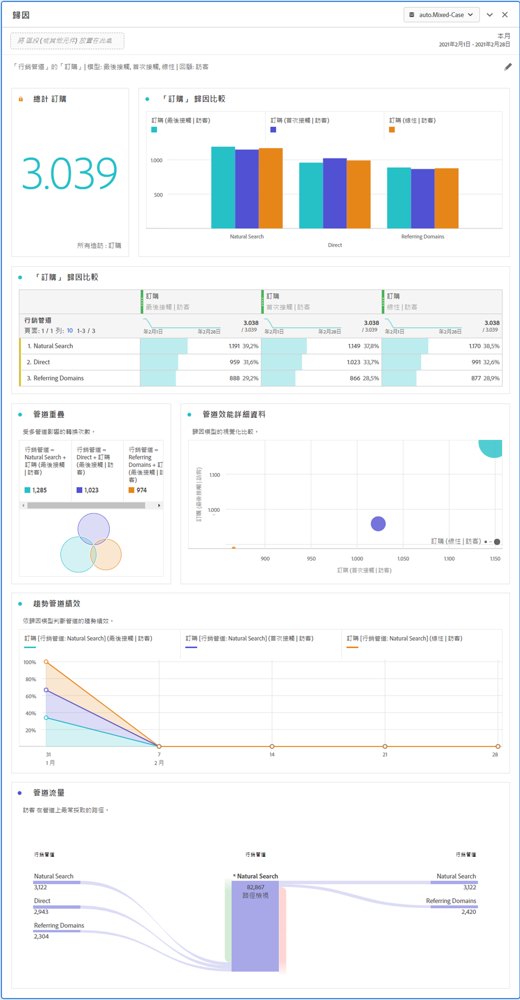

# 歸因面板

建立比較各種歸因模型的分析時，[!UICONTROL 歸因]面板是可採用的簡單方式。這項功能可讓您在專屬的工作區中使用和比較歸因模型。

Customer Journey Analytics 強化了歸因功能，讓您可以：

* 定義付費媒體以外的歸因：任何維度、量度，管道或事件都可以套用在模型上 (例如內部搜尋)，而不僅限於行銷活動。
* 不限次數利用歸因模型比較功能：動態比較任意數量的模型。
* 避免實施變更：透過報表時間處理功能和內容感知工作階段，可以建置客戶歷程內容並套用在執行階段中。
* 建構與您的歸因狀況最相符的工作階段。
* 按篩選器劃分歸因：輕鬆比較行銷管道在任何重要篩選器中的效能 (例如，新客戶與回頭客戶、產品 X 與產品 Y、忠誠度或 CLV)。
* 跨管道檢查和多點接觸分析：使用文氏圖表和長條圖，並計算歸因結果趨勢。
* 以視覺化方式分析關鍵行銷序列活動：透過多節點流量和流失視覺效果，以視覺效果方式探究帶來轉換的路徑。
* 建立計算量度：使用任何數量的歸因配置方法。

## 建立歸因面板

1. 按一下左側的面板圖示。
1. 將[!UICONTROL 歸因]拖曳到您的 Analysis Workspace 專案中。

   

1. 新增要歸因的量度，並新增任何作為歸因依據的維度。其範例包括行銷管道或自訂維度，例如內部促銷。

   

1. 選取您要比較的歸因模型和回顧期間。

1. 「歸因」面板會傳回一組豐富的資料和視覺效果，用以比較所選維度和量度的歸因。

   

## 歸因視覺效果

* **量度總計**：在報告時間範圍內發生的轉換總數。這些是在您所選取的維度中歸因的轉換。
* **歸因比較長條圖**：以視覺效果方式比較所選維度中每個維度項目的歸因轉換。每個長條的顏色代表不同的歸因模型。
* **歸因比較表**：顯示與條形圖相同的資料，以表格的形式呈現。在此表格中選取不同的欄或列可篩選長條圖，以及面板中的其他數個視覺效果。表格的作用與 Workspace 中的其他自由表格相仿 - 讓您新增量度、篩選器或劃分等元件。
* **重疊圖**：文氏圖表會顯示前三大維項目，及其共同參與轉換的頻率。舉例來說，重疊的泡泡圖大小代表訪客同時接觸到兩個維度項目時發生轉換的頻率。選取相鄰自由表格中的其他列，可依據您的選取項目更新視覺效果。
* **效能詳細資料**：可讓您使用散布圖以視覺效果方式比較最多三個歸因模型。
* **趨勢效能**：顯示排名前面的維度項目的歸因轉換趨勢。選取相鄰自由表格中的其他列，可依據您的選取項目更新視覺效果。
* **流量**：可讓您查看哪些頻道最常互動，以及訪客歷程中的順序。
