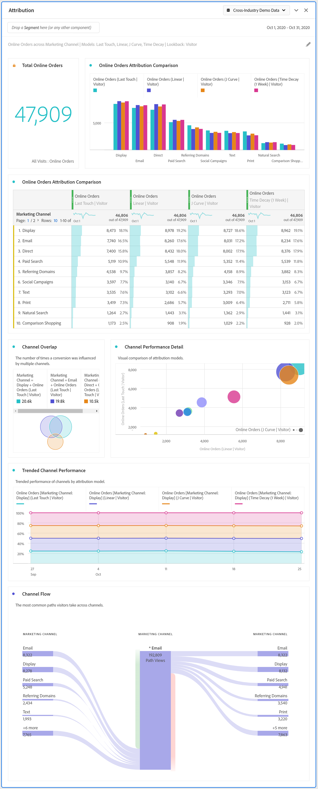

# 歸因面板 {#attribution-panel}

<!-- markdownlint-disable MD034 -->

>[!CONTEXTUALHELP]
>id="workspace_attribution_button"
>title="歸因"
>abstract="使用成功量度、管道及回顧期間，快速比較和視覺化任何數目的歸因模型。"
>additional-url="https://www.youtube.com/watch?v=Yu0hy2klzA0" text="Attribution IQ 面板"

>[!CONTEXTUALHELP]
>id="workspace_attribution_panel"
>title="歸因面板"
>abstract="快速比較並視覺化任何數目的歸因模型，以評估成功量度。選取管道 (維度)、納入的模型及回顧期間。"
>additional-url="https://www.youtube.com/watch?v=Yu0hy2klzA0" text="Attribution IQ 面板"

<!-- markdownlint-enable MD034 -->

>[!BEGINSHADEBOX]

_本文記錄了_ _**Customer Journey Analytics**_ 中的歸因面板。 _請參閱本文中 _**Adobe Analytics**版本的[歸因面板](https://experienceleague.adobe.com/zh-hant/docs/analytics/analyze/analysis-workspace/panels/attribution)_。_

>[!ENDSHADEBOX]

建立比較各種歸因模型的分析時，**[!UICONTROL 歸因]**&#x200B;面板是可採用的簡單方式。此面板提供您專用的工作區來使用和比較歸因模型。

Customer Journey Analytics 強化了歸因功能，讓您可以：

* 定義付費媒體以外的歸因：任何維度、量度，管道或事件均可套用在模式上 (例如內部搜尋)，而不僅限於行銷活動。
* 不限次數利用歸因模式比較功能：動態比較任意數量的模式。
* 避免實施變更：透過報表時間處理功能和內容感知工作階段，可以建置客戶歷程內容並套用在執行階段中。
* 建構與您的歸因狀況最相符的工作階段。
* 按照區段劃分歸因：輕鬆比較行銷管道在任何重要區段中的效能 (例如，新客與常客、產品 X 與產品 Y、忠誠度或 CLV)。
* 跨管道檢查和多點接觸分析：使用文氏圖表和直方圖，並計算歸因結果趨勢。
* 以視覺化方式分析關鍵行銷序列活動：透過多節點流量和流失視覺效果，以視覺效果方式探究帶來轉換的路徑。
* 建立計算量度：使用任何數量的歸因配置方法。

## 使用

若要使用&#x200B;**[!UICONTROL 歸因]**&#x200B;面板：

1. 建立&#x200B;**[!UICONTROL 歸因]**&#x200B;面板。有關如何建立面板的資訊，請參閱[建立面板](panels.md#create-a-panel)。

1. 指定面板的[輸入](#panel-input)。

1. 觀察面板的[輸出](#panel-output)。

### 面板輸入

您可以使用下列輸入設定來設定歸因面板：

1. 新增&#x200B;**[!UICONTROL 成功量度]**&#x200B;和要歸因的&#x200B;**[!UICONTROL 管道]**。其範例包括行銷管道或自訂維度，例如內部促銷。

   

1. 從&#x200B;**[!UICONTROL 已納入的模型]**，選取一個或多個您想要用來進行比較的[歸因模型](#attribution-models)，以及從&#x200B;**[!UICONTROL 回顧期間]**&#x200B;中選取一個您想要用來進行比較的[回顧期間](#lookback-window)。

1. 請選取「**[!UICONTROL 建置]**」，在面板中建置視覺效果。

### 面板輸出

**[!UICONTROL 歸因]**&#x200B;面板會傳回一組豐富的資料和視覺效果，用以比較指定維度和量度的歸因。

### 歸因視覺效果

以下視覺效果為面板輸出的一部分。

* **總量度**：報告時間範圍內發生的轉換總數，並歸因於您指定的維度。
* **歸因比較長條圖**：以視覺效果方式比較所選維度中每個維度項目的歸因轉換。每個長條的顏色代表不同的歸因模型。
* **歸因比較表**：顯示與長條圖相同的資料，以表格的形式呈現。在此表格中選取不同的欄或列會劃分長條圖，以及面板中的其他數個視覺效果。表格的作用與 Workspace 中的其他自由格式表格相仿，可讓您新增量度、區段或劃分等元件。
* **重疊圖**：文氏圖表會顯示前三大維度項目，及其共同參與轉換的頻率。例如，重疊的泡泡圖尺寸表示人員同時接觸到兩個維度項目時發生轉換的頻率。選取相鄰自由表格中的其他列，可依據您的選取項目更新視覺效果。
* **效能詳細資料**：透過散佈圖視覺效果，視覺化比較最多三個歸因模型。
* **趨勢效能**：顯示排名前面的維度項目的歸因轉換趨勢。選取相鄰自由表格中的其他列，可依據您的選取項目更新視覺效果。
* **流量**：可讓您查看哪些管道最常互動，以及人員歷程中的順序。

## 歸因模型

{{attribution-models-details}}

## 容器

{{attribution-container}}

## 回顧期間

{{attribution-lookback-window}}

## 範例

{{attribution-example}}

>[!MORELIKETHIS]
>
> [建立面板](/help/analysis-workspace/c-panels/panels.md#create-a-panel)
>
