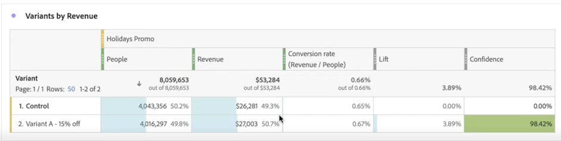

# Experimentation 面板

此 **[!UICONTROL Experimentation]** 面板可讓分析師比較不同的使用者體驗、行銷或傳送訊息變化，以確定哪一個產生特定結果的績效最好。您可以從任何實驗平台 (線上、離線、Adobe 解決方案、Adobe Journey Optimizer，甚至 BYO (自帶) 資料) 評估任何 A/B 實驗的提升度和信賴度。

>[!IMPORTANT]
>
>此時，**無法**&#x200B;在 [!UICONTROL Experimentation] 面板中分析透過 Analytics Source Connector 引入 Adobe Experience Platform 的 [Adobe Analytics for Target](https://experienceleague.adobe.com/docs/target/using/integrate/a4t/a4t.html) (A4T) 資料。這個問題預計會在 2023 年解決。

## 存取控制

所有 Customer Journey Analytics (CJA) 的使用者都能使用 Experimentation 面板。不需要管理員權限或其他權限。但是，進行設定 (下方的步驟 1 和 2) 所需的動作只有管理員才能執行。

## 步驟 1：建立與實驗資料集的連接

建議的資料結構描述是針對在[「物件」陣列](https://experienceleague.adobe.com/docs/experience-platform/xdm/ui/fields/array.html?lang=zh-Hant) 中的實驗資料，其中包含在二個獨立維度中的實驗與變數資料。 如果您的實驗資料是在一個單獨的維度內，實驗與變數資料在分隔字串內，您可以使用資料檢視中的[子字串](/help/data-views/component-settings/substring.md)將它們一分為二，以便用於面板中。

將您的實驗資料[引入](https://experienceleague.adobe.com/docs/experience-platform/ingestion/home.html?lang=zh-Hant) Adobe Experience Platform 後，[在 CJA 中建立與一個或多個實驗資料集的連接](/help/connections/create-connection.md)。

## 步驟 2：在資料檢視中新增內容標籤

在 CJA 資料檢視設定中，管理員可以將[內容標籤](/help/data-views/component-settings/overview.md)新增到維度或量度，CJA 服務 (如 [!UICONTROL Experimentation] 面板) 可針對其目標使用這些標籤。Experimentation 面板使用了兩個預先定義的標籤：

* [!UICONTROL 實驗中的實驗]
* [!UICONTROL 實驗中的變體]

在包含實驗資料的資料檢視中，選擇兩個維度，一個包含實驗資料，一個包含變體資料。然後使用&#x200B;**[!UICONTROL 實驗]**&#x200B;和&#x200B;**[!UICONTROL 變體]**&#x200B;標籤標記這些維度。

如果沒有這些標籤，Experiment 面板會因沒有可用的實驗而無法運作。

## 步驟 3：設定 Experiment 面板

1. 在 CJA Workspace 中，將 Experimentation 面板拖到專案中。

>[!IMPORTANT]
>如果尚未完成 CJA 資料檢視中的必要設定，在可以繼續之前，您將收到此訊息：「&quot;[!UICONTROL 請在「資料檢視」中設定實驗與變體維度]」。

1. 進行面板輸入設定。

   | 設定 | 定義 |
   | --- | --- |
   | **[!UICONTROL 實驗]** | 一組向一般使用者展示的體驗變體，用來決定要永久保存的最佳變體。一個實驗由兩個或多個變體組成，其中一個會視為控制變體。此設定預先填入了資料檢視中已用&#x200B;**[!UICONTROL 實驗]**&#x200B;標籤標記的維度，以及過去 3 個月的實驗資料。 |
   | **[!UICONTROL 控制變體]** | 一般使用者體驗中的兩個或多個變動之一，它們會被比較以找出較好的替代方案。必須選擇一種變體作為對照，並且只能將一種變體視為控制變體。此設定預先填入了資料檢視中已用&#x200B;**[!UICONTROL 變體]**&#x200B;標籤標記的維度。此設定會提取與此實驗關聯的變體資料。 |
   | **[!UICONTROL 成功量度]** | 使用者用來比較變體的一個或多個量度。轉換量度 (無論是最高還是最低) 具有最理想結果的變體會宣告為實驗的「最佳表現變體」。可最多新增 5 個量度。 |
   | **[!UICONTROL 標準化量度]** | 執行測試的基礎 ([!UICONTROL 人員]、[!UICONTROL 工作階段][!UICONTROL 或事件])。例如，測試可能會比較幾種變體的轉換率，其中&#x200B;**[!UICONTROL 轉換率]**&#x200B;是以&#x200B;**[!UICONTROL 每個工作階段轉換次數]**&#x200B;或&#x200B;**[!UICONTROL 每人轉換次數]**&#x200B;計算。 |
   | **[!UICONTROL 日期範圍]** | 日期範圍會根據 CJA 中收到第一次點擊所選實驗而自動設定。如果需要，您可以更具體的時間範圍來限制或擴大日期範圍。 |

1. 按一下&#x200B;**[!UICONTROL 建置]**。

## 步驟 4：檢視面板輸出

Experimentation 面板會傳回一組豐富的資料和視覺效果，以幫助您更好地了解實驗的執行情況。面板頂端會提供一個摘要行，提示您所選取的面板設定。您可以隨時按一下右上方的編輯鉛筆來編輯面板。

您還將收到文字摘要，以表示實驗是否具有結論性，並總結結果。結論性是以統計顯著性為基礎。(參見下方的「統計方法」。)您可以查看具有最高提升度和信賴度的最佳表現變體總結數字。

對於您所選取的每個成功量度，都會顯示一個自由表格和一個轉換率趨勢。

[!UICONTROL 折線圖]可提供[!UICONTROL 控制]與[!UICONTROL 控制變體]的表現：

>[!NOTE]
>
>該面板目前不支援 A/A 測試分析。

## 步驟 5：解釋結果

1. **實驗具有結論性**：每次查看實驗報告時，Adobe 都會分析到目前為止在實驗中累積的資料，並在&#x200B;*至少一個*&#x200B;變體 (當超過雙臂時套用 Bonferonni 校正，以校正多個假設檢驗) 的隨時有效信賴度超過 95% 臨界值時宣告實驗為具有「結論性」。

2. **最佳表現變體**：當一個實驗宣告為具有結論性時，具有最高轉換率的變體將標記為「最佳表現變體」。請注意，此變體必須是控制變體或基線變體，或者是超過 95% 隨時有效信賴度臨界值的變體之一 (套用 Bonferonni 校正)。

3. **轉換率**：顯示的轉換率是成功量度值與標準化量度值的比例。請注意，如果量度不是二進位 (實驗中的每個單位為 1 或 0)，則轉換率可能大於 1

4. **提升度**：實驗報告摘要會顯示提升基線，它衡量了指定變體的轉換率相對於基線的增進百分比。精確的定義是指定變體與基線之間的表現差異，除以基線的表現 (以百分比表示)。

5. **信賴度**：顯示的隨時有效信賴度是對有多少證據表示指定變體與控制變體相同的機率測度。信賴度越高表示控制和非控制變體具有相同表現假設的證據越少。更準確地說，如果實際上真實的潛在轉換率沒有差異，顯示的信賴度是我們觀察到指定變體和控制變體之間轉換率差異較小的機率 (以百分比表示)。就 *P 值*&#x200B;而言，顯示的信賴度為 1 - *P 值*。

>[!NOTE]
>
>對結果的完整描述應考慮所有可用的證據 (即實驗設計、樣本量、轉換率、信賴度等)，而不僅僅是宣告是否具有結論性。即使結果尚未具有「結論性」，仍可以有令人信服的證據表示變體之間各有相異信賴區間 (例如，信賴區間幾乎不重疊)。理想情況下，應由所有統計證據提供的資訊做決策，並在連續範圍內進行解釋。

## Adobe 的統計方法

為了提供易於解釋和安全的統計推斷，Adobe 採用一種以[隨時有效的信賴序列](https://doi.org/10.48550/arXiv.2103.06476)為基礎的統計方法

信賴序列是信賴區間的模擬「順序」。若想了解信賴序列，您可以想像重複實驗一百次，然後計算&#x200B;*每個進入實驗新使用者*&#x200B;的平均商業量度 (例如電子郵件的開啟率) 估計值及其相關的 95% 信賴序列。

95% 信賴序列是指在您執行 100 個實驗中有 95 個包含商業量度「確判為真」值。(為了提供相同的 95% 覆蓋率保證，每個實驗只能計算一次 95% 信賴區間；而不是針對每個新使用者計算)。因此，信賴序列可讓您持續監視實驗，而不會增加「誤判為真」的錯誤率，也就是它們允許「偷看」結果。

## 計算量度中的新函數

已新增了兩個進階函數：[!UICONTROL 提升度]和[!UICONTROL 信賴度]。如需詳細資訊，請參閱「[參考 - 進階函數](/help/components/calc-metrics/cm-adv-functions.md)」。