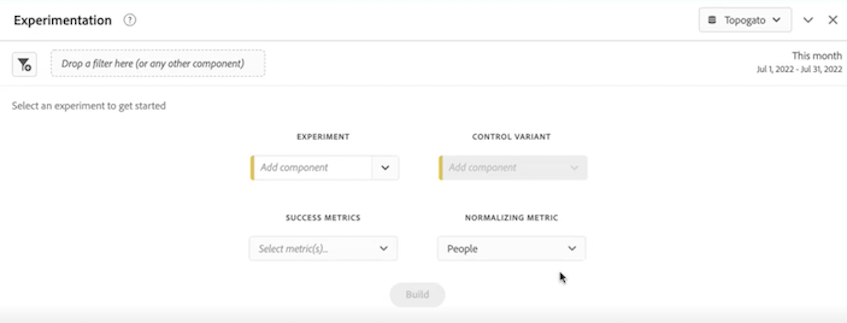

# 實驗面板

>[!NOTE]
>
>此功能目前正在進行[有限測試](/help/release-notes/releases.md)。

的 **[!UICONTROL 實驗]** 使用面板，您可以比較不同的用戶體驗、市場營銷或消息傳遞變化，以確定哪些是最能促成特定結果的。 您可以從任何實驗平台評估任何A/B實驗的提升和信心 — 線上、離線、Adobe解決方案、Adobe Journey Optimizer甚至BYO（隨你帶來）資料。

>[!IMPORTANT]
>
>現在， [Adobe Analytics為塔吉特](https://experienceleague.adobe.com/docs/target/using/integrate/a4t/a4t.html) 無法在 [!UICONTROL 實驗] 的子菜單。

## 存取控制

「實驗」面板可供所有Customer Journey Analytics(CJA)用戶使用。 不需要管理員權限或其他權限。 但是，安裝程式要求資料視圖中只有管理員才能分配的標籤。

## 術語

* **實驗**:實驗是針對向最終用戶提供的體驗進行的一組變體，以確定哪一種最好保持永久。 實驗由兩個或兩個以上的變數組成，其中一個被考慮為控制變數。

* **變異**:為了識別更好的備選方案而比較的最終用戶體驗中的兩種或多種改變之一。 必須選擇一個變數作為控制，只能將一個變數視為控制變數。

* **控制項**:表示用戶體驗現狀或預設狀態的特定變體。 其他的變體被比較。

* **標準化度量**:運行test的基礎（會話或人員）。 例如，test可以比較幾個變體的轉換率，其中轉換率計算為每個會話的轉換或每個人的轉換。

* **轉換度量**:用戶將變體與進行比較的度量。 轉換度量（無論最高還是最低）與最理想結果的變化被宣佈為實驗的&quot;贏家&quot;。

## 步驟1:建立與實驗資料集/s的連接

在你的實驗資料 [食](https://experienceleague.adobe.com/docs/experience-platform/ingestion/home.html?lang=en) 進入Adobe Experience Platform, [在CJA中建立連接](/help/connections/create-connection.md) 到一個或多個實驗資料集。

## 步驟2:在資料視圖中添加上下文標籤

在CJA資料視圖設定中，管理員可以添加 [上下文標籤](/help/data-views/component-settings/overview.md) 到維或度量和CJA服務 [!UICONTROL 實驗] 面板可以使用這些標籤。 「實驗」面板使用兩個預定義的標籤：

* [!UICONTROL 實驗]
* [!UICONTROL 變體]

在包含實驗資料的資料視圖中，選擇二維，一個包含實驗資料，一個包含變型資料。 然後使用 **[!UICONTROL 實驗]** 和 **[!UICONTROL 變體]** 標籤。

如果沒有這些標籤，「實驗」面板將無法正常工作。

## 第3步：配置「實驗」面板

1. 在CJA Workspace中，將「實驗」面板拖到項目中。

