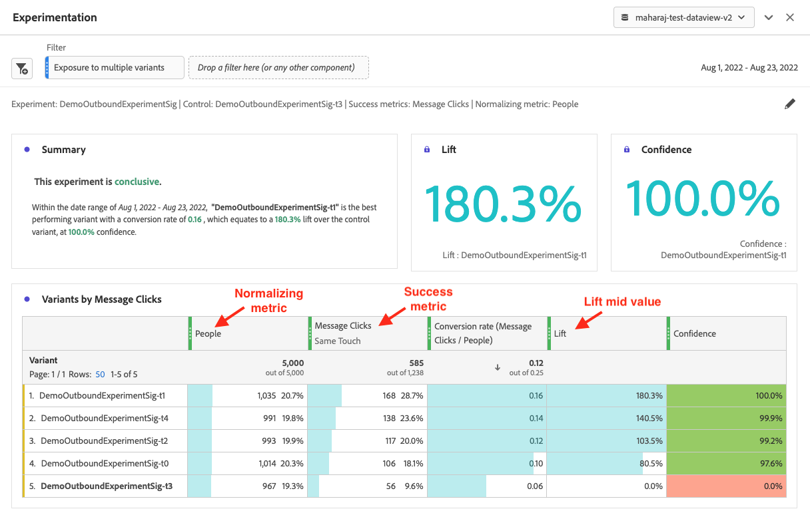

# Experimentation 面板

此 **[!UICONTROL Experimentation]** 面板可讓分析師比較不同的使用者體驗、行銷或傳送訊息變化，以確定哪一個產生特定結果的績效最好。您可以從任何實驗平台評估任何A/B實驗的提升度和信賴度 — 線上、離線、來自Target或Journey Optimizer等Adobe解決方案，甚至BYO （自備）資料。

深入瞭解 [Adobe Customer Journey Analytics與Adobe Target的整合](https://experienceleague.adobe.com/en/docs/target/using/integrate/cja/target-reporting-in-cja).

## 存取控制 {#access}

實驗面板可供所有Customer Journey Analytics使用者使用。 不需要管理員權限或其他權限。但是，進行設定 (下方的步驟 1 和 2) 所需的動作只有管理員才能執行。

## 計算量度中的新函數 {#functions}

已新增了兩個進階函數：[!UICONTROL 提升度]和[!UICONTROL 信賴度]。如需詳細資訊，請參閱「[參考 - 進階函數](/help/components/calc-metrics/cm-adv-functions.md)」。

## 步驟 1：建立與實驗資料集的連接 {#connection}

建議的資料結構描述是針對在[「物件」陣列](https://experienceleague.adobe.com/en/docs/experience-platform/xdm/ui/fields/array) 中的實驗資料，其中包含在二個獨立維度中的實驗與變數資料。 兩個維度都必須位於 **單一** 物件陣列。 如果您的實驗資料在單一維度中（實驗與變數資料在分隔字串中），您可以使用 [子字串](/help/data-views/component-settings/substring.md) 在資料檢視中設定，將維度一分為二以用於面板。

在您的實驗資料完成後 [已內嵌](https://experienceleague.adobe.com/en/docs/experience-platform/ingestion/home) 移至Adobe Experience Platform， [在Customer Journey Analytics中建立連線](/help/connections/create-connection.md) 到一個或多個實驗資料集。

## 步驟 2：在資料檢視中新增內容標籤 {#context-labels}

在Customer Journey Analytics資料檢視設定中，管理員可以新增 [內容標籤](/help/data-views/component-settings/overview.md) 變更為維度或量度以及Customer Journey Analytics服務，例如 [!UICONTROL 實驗] 面板可針對其用途使用這些標籤。 Experimentation 面板使用了兩個預先定義的標籤：

* [!UICONTROL 實驗中的實驗]
* [!UICONTROL 實驗中的變體]

在包含實驗資料的資料檢視中，選擇兩個維度，一個包含實驗資料，一個包含變體資料。然後使用&#x200B;**[!UICONTROL 實驗]**&#x200B;和&#x200B;**[!UICONTROL 變體]**&#x200B;標籤標記這些維度。

如果沒有這些標籤，Experiment 面板會因沒有可用的實驗而無法運作。

## 步驟 3：設定 Experiment 面板 {#configure}

1. 在Customer Journey Analytics Workspace中，將Experimentation面板拖曳到專案中。

>[!IMPORTANT]
>
>如果尚未完成Customer Journey Analytics資料檢視中的必要設定，在可以繼續之前，您會收到此訊息： 」[!UICONTROL 請在資料檢視中設定實驗和變體維度]「。
>

1. 進行面板輸入設定。

   | 設定 | 定義 |
   | --- | --- |
   | **[!UICONTROL 實驗]** | 一組向一般使用者展示的體驗變體，用來決定要永久儲存的最佳變體。 一個實驗由兩個或多個變體組成，其中一個會視為控制變體。此設定預先填入了資料檢視中已用&#x200B;**[!UICONTROL 實驗]**&#x200B;標籤標記的維度，以及過去 3 個月的實驗資料。 |
   | **[!UICONTROL 控制變體]** | 一般使用者體驗中的兩個或多個變動之一，它們會被比較以找出較好的替代方案。必須選擇一種變體作為對照，並且只能將一種變體視為控制變體。此設定預先填入了資料檢視中已用&#x200B;**[!UICONTROL 變體]**&#x200B;標籤標記的維度。此設定會提取與此實驗關聯的變體資料。 |
   | **[!UICONTROL 成功量度]** | 使用者用來比較變體的一個或多個量度。轉換量度 (無論是最高還是最低) 具有最理想結果的變體會宣告為實驗的「最佳表現變體」。可最多新增 5 個量度。 |
   | **[!UICONTROL 標準化量度]** | 基礎([!UICONTROL 人員]， [!UICONTROL 工作階段]，或 [!UICONTROL 活動])執行測試。 例如，測試可能會比較幾種變體的轉換率，其中&#x200B;**[!UICONTROL 轉換率]**&#x200B;是以&#x200B;**[!UICONTROL 每個工作階段轉換次數]**&#x200B;或&#x200B;**[!UICONTROL 每人轉換次數]**&#x200B;計算。 |
   | **[!UICONTROL 日期範圍]** | 日期範圍會根據所選取實驗在Customer Journey Analytics中收到的第一個事件自動設定。 如果需要，您可以更具體的時間範圍來限制或擴大日期範圍。 |

1. 按一下&#x200B;**[!UICONTROL 建置]**。

## 步驟 4：檢視面板輸出 {#view}

Experimentation 面板會傳回一組豐富的資料和視覺效果，以幫助您更好地了解實驗的執行情況。面板頂端會提供一個摘要行，提示您所選取的面板設定。您可以隨時按一下右上方的編輯鉛筆來編輯面板。

您還將收到文字摘要，以表示實驗是否具有結論性，並總結結果。結論性是以統計顯著性為基礎。(參見下方的「統計方法」。)您可以查看具有最高提升度和信賴度的最佳表現變體總結數字。

對於您所選取的每個成功量度，都會顯示一個自由表格和一個轉換率趨勢。

[!UICONTROL 折線圖]可提供[!UICONTROL 控制]與[!UICONTROL 控制變體]的表現：

>[!NOTE]
>
>該面板目前不支援 A/A 測試分析。

## 步驟 5：解釋結果 {#interpret}

1. **實驗已有結果**：每次檢視實驗報告時，都會分析到目前為止在實驗中累積的資料。 並且會在隨時有效的信賴度超過95%的臨界值時宣告實驗為具有「結論性」 *至少一個* （當超過雙臂時套用Benjamini-Hochberg校正，以校正多個假設檢驗）。

2. **最佳表現變體**：當一個實驗宣告為具有結論性時，具有最高轉換率的變體將標記為「最佳表現變體」。請注意，此變體必須是控制變體或基線變體，或者是超過95%隨時有效信賴度臨界值的變體之一（套用Benjamini-Hochberg校正）。

3. **轉換率**：顯示的轉換率是成功量度值與標準化量度值的比例。 請注意，如果量度不是二進位（實驗中的每個單位為1或0），此值有時可能大於1

4. **提升度**：實驗報告摘要會顯示提升基線，它衡量了指定變體的轉換率相對於基線的增進百分比。 精確的定義是指定變體與基線之間的表現差異，除以基線的表現 (以百分比表示)。

5. **信賴度**：顯示的隨時有效信賴度是對有多少證據表示指定變體與控制變體相同的機率測度。 信賴度越高表示控制和非控制變體具有相同表現假設的證據越少。更準確地說，如果實際上真實的基本轉換率沒有差異，顯示的信賴度是您觀察到指定變體和控制變體之間轉換率差異較小的機率（以百分比表示）。 就 *P 值*&#x200B;而言，顯示的信賴度為 1 - *P 值*。

>[!NOTE]
>
>對結果的完整描述應考慮所有可用的證據（例如實驗設計、樣本量、轉換率、信賴度等），而不僅僅是宣告是否具有結論性。 即使結果尚未具有結論性，仍可以有令人信服的證據表示一種變體與另一種不同（例如，信賴區間幾乎不重疊）。 理想情況下，所有統計證據，在連續範圍內解釋，都應有助於決策。

## Adobe 的統計方法 {#statistics}

為了提供易於解釋和安全的統計推斷，Adobe 採用一種以[隨時有效的信賴序列](https://arxiv.org/abs/2103.06476)為基礎的統計方法

信賴序列是 *循序* 信賴區間的類比。 若要瞭解信賴序列，您可以想像重複實驗一百次，然後計算平均商業量度的預估值（例如電子郵件的開啟率）及其相關的95%信賴序列 *每個新使用者* 進入實驗的物件。

95%信賴序列包含您執行的100個實驗中的95個商業量度的「真」值。 （每個實驗只能計算一次95%信賴區間，以提供相同的95%覆蓋率保證；而不是針對每個新使用者）。 因此，信賴序列可讓您持續監視實驗，而不會增加誤判錯誤率，也就是它們允許「窺視」結果。

## 解讀非隨機維度 {#non-randomized}

Customer Journey Analytics可讓分析師選取任何維度當作「實驗」。 但是對於選擇的實驗維度不是隨機人員的分析，您該如何解讀？

例如，以個人看到的廣告為例。 如果您決定顯示人員是「廣告B」而非「廣告A」，可能會對測量某些量度的變更感興趣（例如平均收入）。 顯示廣告B來取代廣告A的因果關係，對達成行銷決策至關重要。 如果您以顯示廣告B的替代策略取代顯示廣告A的現狀，這種因果效應可能會以整個母體的平均收入來衡量。

A/B測試是業界客觀衡量此類干預措施效果的黃金標準。 A/B測試產生因果估計的重要原因是接收其中一個可能變體的人員隨機化。

現在，假設有一個不是透過隨機化實現的維度，例如個人的美國州。 假設人員主要來自兩個州：紐約和加州。 由於地區天氣差異，這兩個州冬季服裝品牌的平均銷售收入可能不同。 在這種情況下，天氣可能是冬季服裝銷售背後的真正因果因素，而不是人的地理狀態不同這一事實。

Customer Journey Analytics中的實驗面板可讓您依人員的狀態將資料分析為平均收入差異。 在這種情況下，輸出沒有因果解釋。 不過，此類分析可能仍值得關注。 它提供個人所在州平均收入差異的估計值（以及不確定性的測量值）。  此值也稱為「統計假設測試」。 此分析的輸出可能會很有趣，但不一定可操作，因為您沒有，有時也無法將人員隨機化為維度的可能值之一。

下圖對比了這些情況：

當您想要測量干預X對結果Y的影響時，兩者的真正原因可能是混淆因素C。如果資料不是藉由在X上隨機化人員而獲得，則影響更難測量，且分析明確說明了C。隨機化會中斷X對C的依賴，讓我們不必擔心其他變數，即可測量X對Y的影響。

## 在Experimentation面板中使用計算量度

請參閱這篇部落格，瞭解更多資訊 [在Experimentation面板中使用衍生度量](https://experienceleaguecommunities.adobe.com/t5/adobe-analytics-blogs/using-derived-metrics-in-cja-s-experimentation-panel/ba-p/593119).
