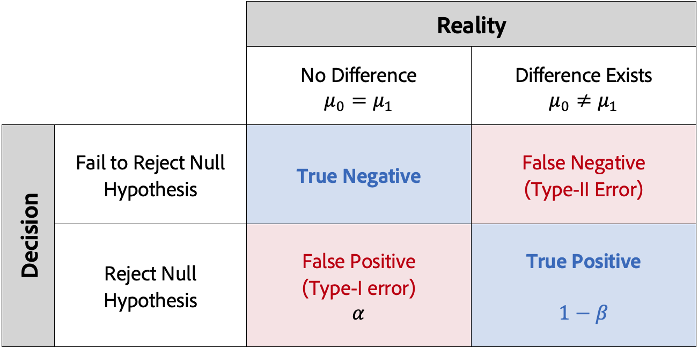

# CJA實驗小組統計方法簡介

本文介紹了CJA中實驗面板的統計計算。 CJA使用高級統計方法計算 **信心** 它在任何時間都有效，允許您隨時運行實驗並持續監視結果。

本文介紹A/Btest的工作原理，並直觀介紹Adobe ***任意時間有效置信序列***。 對於專家用戶，最後將提供技術細節和參考。

## A/B檢驗與因果關係

A/Btest通常被描述為評估某種&quot;干預&quot;的因果影響的「金本位」 。 它們是隨機試驗，在線上測試的背景下，這意味著我們將一些隨機選擇的用戶暴露在網站、郵件或電子郵件的給定變體中，而另一組隨機選擇的用戶則暴露在其他用戶中 **變異** 或 **治療**。 暴露後，我們測量結果 **度量** 我們感興趣（例如，開啟電子郵件、訂閱或購買）。

如下圖所示，我們隨機將用戶分配給每個變型組意味著平均而言這些組將共用相同的特徵。 因此，任何結果上的差異都可以被解釋為由於所收到的變體之間的差異，即我們能夠建立 **因果** 我們的干預措施和我們感興趣的結果之間的聯繫。 這使您能夠在優化業務目標時做出嚴格、可解釋的、由資料驅動的決策，因此A/B測試是任何現代個性化實踐者工具包的基本部分。

現在，一個重要的問題是任何觀察到的差異是「真實效應」，還是由隨機性引起。 從直覺上講，如果群體之間的結果衡量標準差別很小，那麼這可以偶然地觀察到，而更大的差異更可能是「真實的」。 這裡的技術術語是我們的測量 *估計* 每個變型組的均值的真值。 統計推斷技術為我們提供了量化估算中不確定性的方法 — 這就是我們的概念 **p值** 和 **置信區間** 出現，但要理解這些，我們首先應該理解統計誤差。

## 統計測試與誤差控制

許多統計推斷方法都被設計用來控制兩種類型的誤差： **誤報** （I類錯誤）, **假負片** （II類錯誤）。 下表說明了這些問題。

假陽性是對空假說的錯誤拒絕，而實際上它是真的。 在線上A/Btest中，這意味著我們（錯誤地）得出結論，即不同部門之間的結果業務指標不同，而實際上是相同的。 在進行實驗之前，我們通常會選擇一個閾值 *α*。 實驗結束後， *p*&#x200B;計算 — value，如果 *p&lt;α*。 常用閾值是 *α*= 0.05，這意味著從長期看，我們預計每100個實驗中有5個是誤報。

同時，假否定意味著當假設實際上是假的時候，我們不會拒絕假設。 對於A/B測試，這意味著我們不拒絕空假設（回想，空假設表示變異臂之間的結果業務度量相同），而實際上它不同。 為了控制這種錯誤，我們通常需要有足夠的用戶來保證我們實驗中的某種 **電源**，定義為1-*β* （即1減去II類錯誤的概率）。

大多數統計推斷技術都要求您提前根據要確定的效果大小以及容錯能力(*α* 和 *β*)。 但是，Adobe的方法體系旨在讓您能夠持續查看結果，查看任何樣本大小。

## Adobe的統計方法： _任何有效置信序列_

為了提供易於解釋和安全的統計推斷，Adobe採用了基於 [_任何有效置信序列_](https://doi.org/10.48550/arXiv.2103.06476)。

置信序列是置信區間的「順序」模擬。 要瞭解置信度序列是什麼，請想像重複100次您的實驗，並計算平均業務度量（如電子郵件的開啟率）及其關聯的95%置信度序列的估計值 *每個新用戶* 進入實驗。 在您運行的100個實驗中， 95%置信度序列將包括業務度量的「真」值。 (95%置信區間只能計算一次，以保證95%的覆蓋率；不是每個新用戶)。 因此，置信序列允許您持續地監控實驗，而不增加誤報率，即允許「窺視」結果。

以下動畫顯示了單個實驗的置信序列和置信區間之間的差異：

我們注意到置信序列將A/Btest的焦點轉移到 *估計* 而不是假設檢驗，即專注於對處理之間手段差異的準確估計，而不是基於統計意義閾值是否拒絕零假設。

但是，與$p$值（或置信度）和置信度間隔之間的關係類似，置信度序列與任何有效的$p$值（或任何有效置信度）之間也存在關係。 由於對信心等數量的熟悉，CJA在其報告中提供了隨時有效的信心。

置信序列的理論基礎來源於隨機變數序列的研究，稱為鞅。 下面為專家讀者列出了一些主要結果，但從業人員的做法是明確的：

> 置信序列可以解釋為置信區間的「安全」序列類似物：您可以隨時查看和解釋A/Btest中的資料，並安全地停止或繼續實驗。 相應的「Anytime Valid Confice（任何時間有效置信度）」(或 *p*-value)也可以進行解釋。

必須指出，由於統計方法是&quot;任何時間有效的&quot;，因此它比在同一樣本大小下採用的固定水準方法更保守。 這意味著「任何時間都有效」 *p* — 值通常大於相應的固定水準線 *p*-values（即任何有效置信度都會更小）

## 解釋結果

1. **實驗是結論性的**:每次您查看實驗報告時，Adobe都會分析實驗中累積到此時的資料，並會宣佈當任何有效置信度超過95%的閾值時，該實驗即為「結論性」 *至少一個* （當兩個臂以上時，應用Bonferonni修正，以便進行多重假設檢驗）。

2. **最佳效能變型**:當實驗被宣佈為結論性的時候，轉換率最高的變數被標籤為「效能最佳的變數」。 請注意，此變數必須是控制項或基線變數，或者在任何有效置信度閾值（應用Bonferonni修正時）超過95%的變數之一。

3. **轉換率**:所示的轉換率是成功度量值與標準化度量值的比率。 請注意，如果度量不是二進位（實驗中每個單位為1或0），則這有時可能大於1

4. **提升**:「實驗」報告摘要顯示「提高基線」(Lift over Baseline)，它是對給定變數的轉換率相對於基線的百分比提高的度量。 精確定義是給定變數與基線之間的效能差異，除以基線的效能，以百分比表示。

5. **信心**:所示的Anytime Valid Compite是一個概率度量，它衡量給定變數與控制變數相同的證據的數量。 置信度越高，表明控制變數和非控制變數具有相同效能的假設的證據越少。 更準確地說，所顯示的置信度是一種概率（以百分比表示），如果實際上真實的基礎轉換率沒有差異，我們將觀察到給定變數和控制之間的轉換率差異較小。 按 *p*-values，顯示的置信度為1 - *p*-value。

但請注意，對結果的全面描述應考慮所有可得證據（即實驗設計、樣本大小、轉換率、置信度等），而不僅應考慮結論性或非結論性聲明。 即使結果還不是&quot;結論性的&quot;，仍然可以有令人信服的證據證明一個變數與另一個變數不同（例如，置信區間幾乎不重疊）。 理想情況下，決策應根據所有統計證據來作出，並以連續譜進行解釋。
