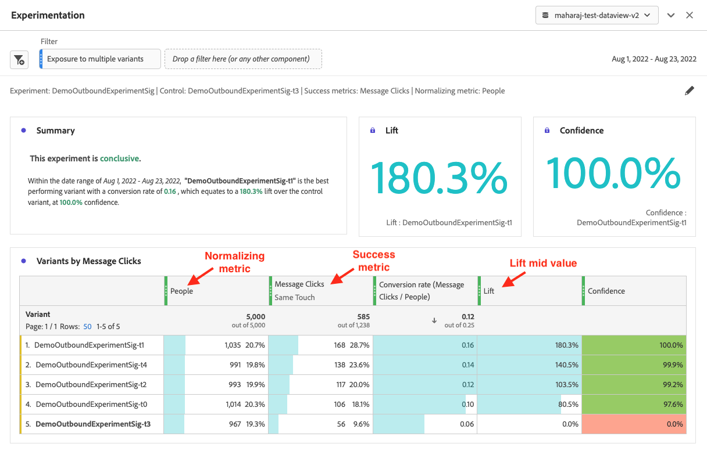

# 實驗面板

>[!NOTE]
>
>此功能目前正在進行[有限測試](/help/release-notes/releases.md)。

的 **[!UICONTROL 實驗]** 面板使分析人員可以比較不同的用戶體驗、營銷或消息傳遞變化，以確定哪種方式最能推動特定結果。 您可以從任何實驗平台評估任何A/B實驗的提升和信心 — 線上、離線、Adobe解決方案、Adobe Journey Optimizer甚至BYO（隨你帶來）資料。

>[!IMPORTANT]
>
>現在， [Adobe Analytics為塔吉特](https://experienceleague.adobe.com/docs/target/using/integrate/a4t/a4t.html) (A4T)資料通過分析源連接器傳入Adobe Experience Platform **不能** 在 [!UICONTROL 實驗] 的子菜單。 我們期待2023年解決這一問題。

## 存取控制

「實驗」面板可供所有Customer Journey Analytics(CJA)用戶使用。 不需要管理員權限或其他權限。 但是，安裝（下面步驟1和2）需要只有管理員才能執行的操作。

## 步驟1:建立與實驗資料集/s的連接

建議的資料模式是實驗資料位於包含實驗和變型資料的兩個不同維的Object陣列中。 如果您在單個維中使用實驗資料，而變型資料以分隔字串形式顯示，則可以使用 [子字串](https://experienceleague.adobe.com/docs/analytics-platform/using/cja-dataviews/component-settings/substring.html?lang=en#) 在資料視圖中設定，將其拆分為兩個，以便在面板中使用。

在你的實驗資料 [食](https://experienceleague.adobe.com/docs/experience-platform/ingestion/home.html?lang=en) 進入Adobe Experience Platform, [在CJA中建立連接](/help/connections/create-connection.md) 到一個或多個實驗資料集。

## 步驟2:在資料視圖中添加上下文標籤

在CJA資料視圖設定中，管理員可以添加 [上下文標籤](/help/data-views/component-settings/overview.md) 到維或度量和CJA服務 [!UICONTROL 實驗] 面板可以使用這些標籤。 「實驗」面板使用兩個預定義的標籤：

* [!UICONTROL 實驗]
* [!UICONTROL 變體]

在包含實驗資料的資料視圖中，選取兩個維度，一個包含實驗資料，另一個包含變型資料。 然後使用 **[!UICONTROL 實驗]** 和 **[!UICONTROL 變體]** 標籤。

如果沒有這些標籤，「實驗」面板將不起作用，因為沒有可用的實驗。

## 第3步：配置「實驗」面板

1. 在CJA Workspace中，將「實驗」面板拖到項目中。

>[!IMPORTANT]
>如果CJA資料視圖中的必要設定尚未完成，則在繼續之前，您將收到一條消息。

1. 配置面板輸入設定。

   | 設定 | 定義 |
   | --- | --- |
   | **[!UICONTROL 實驗]** | 一組針對最終用戶體驗的變體，以確定哪些是永久不變的。 實驗由兩種或多種變體組成，其中一種被視為控制變體。 此設定預填充了已使用  **[!UICONTROL 實驗]** 資料視圖中的標籤，以及最近3個月的實驗資料。 |
   | **[!UICONTROL 控制項變數]** | 為了識別更好的備選方案而比較的最終用戶體驗中的兩種或多種改變之一。 必須選擇一個變型作為控制項，並且只能將一個變型視為控制變型。 此設定預填充了已使用  **[!UICONTROL 變體]** 標籤。 此設定將提取與此實驗關聯的變數資料。 |
   | **[!UICONTROL 成功度量]** | 用戶比較變型的度量或度量。 對於轉換度量（無論最高還是最低），具有最理想結果的變數被聲明為實驗的「最佳效能變數」。 最多可以添加5個指標。 |
   | **[!UICONTROL 標準化量度]** | 基準([!UICONTROL 人物]。 [!UICONTROL 會話]或 [!UICONTROL 事件])，以運行test。 例如，test可以比較多個變數的轉換率，其中 **[!UICONTROL 轉換率]** 按 **[!UICONTROL 每個會話的轉換]** 或 **[!UICONTROL 每人轉換]**。 |
   | **[!UICONTROL 日期範圍]** | 根據在CJA中為所選實驗接收的第一次命中自動設定資料範圍。 如果需要，可以修改此選項，以限制日期範圍或將日期範圍擴展到更具體的時間範圍。 |

1. 按一下&#x200B;**[!UICONTROL 「建置」]**。

## 第4步：解釋面板輸出

「實驗」面板返回一組豐富的資料和可視化效果，以幫助您更好地瞭解實驗的運行情況。 將添加一個全局篩選器，以用於暴露於多個變體的人員或會話。 無法編輯或刪除此篩選器。 面板頂端會提供一個摘要行，為您提示您所選取的面板設定。您可以隨時通過按一下右上角的編輯鉛筆來編輯面板。

您還會得到一個文本摘要，它指示實驗是否具有決定性，並總結結果。 結論是基於統計意義的。 （見下文&quot;統計方法&quot;。） 最佳效能變體僅提供用於結論性的試驗，並基於顯著變體的轉換率來選擇。 您可以看到效能最佳的變型的摘要數字，其提升和信心最強。

文本摘要和摘要數字僅為面板輸入中選取的第一個成功度量生成。

>[!NOTE]
>
>提升和置信度也是CJA中高級計算的度量函式，因此您可以構建自己的提升和置信度度量。

對於您所選取的每個成功量度，都會顯示一個自由表格和一個轉換率趨勢：

的 [!UICONTROL 線] 圖表給您 [!UICONTROL 控制項] 與 [!UICONTROL 控制項變數] 效能：

>[!NOTE]
>
>此面板當前不支援A/Atest分析。

## 統計方法

要關注的.
