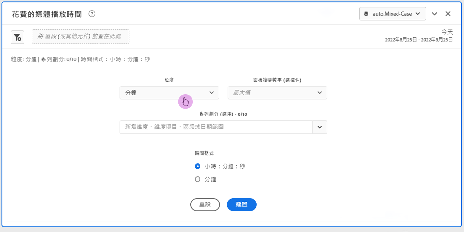
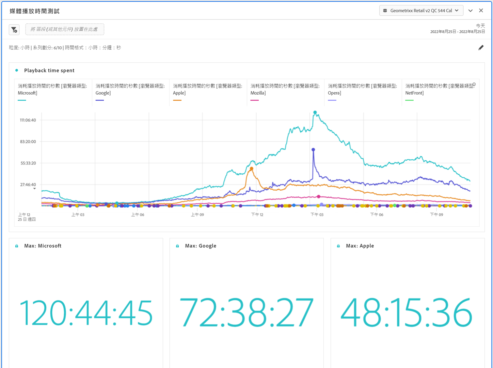

# 媒體播放時間面板 {#media-playback-time-spent-panel}

<!-- markdownlint-disable MD034 -->

>[!CONTEXTUALHELP]
>id="workspace_mediaplaybacktimespent_button"
>title="媒體播放時間"
>abstract="建立一個面板來分析一段時間內的視訊觀看量，包括各種詳細程度等級以及劃分和比較的功能。"

<!-- markdownlint-enable MD034 -->

<!-- markdownlint-disable MD034 -->

>[!CONTEXTUALHELP]
>id="workspace_mediaplaybacktimespent_panel"
>title="媒體播放時間"
>abstract="分析特定時間內的影片觀看情形、選取不同詳細程度，並可以選擇使用區段、維度、維度項目或日期範圍進行劃分與比較。"

<!-- markdownlint-enable MD034 -->

>[!BEGINSHADEBOX]

_本文記錄有_ _**Customer Journey Analytics**_ 中的媒體播放時間面板。 _請查閱本文中_  _**Adobe Analytics** 版本的[媒體播放時間面板](https://experienceleague.adobe.com/zh-hant/docs/analytics/analyze/analysis-workspace/panels/media-playback-time-spent)。_

>[!ENDSHADEBOX]

>[!NOTE]
>
>媒體平均分鐘觀眾數面板僅供已購買 Customer Journey Analytics 串流媒體集合附加元件的客戶使用。
>請聯絡您的 Adobe 銷售代表或 Adobe 帳戶團隊以取得更多資訊。
>

**[!UICONTROL 媒體播放時間]**&#x200B;面板可進行特定期間的播放分析，提供尖峰期同時觀看人數的詳細資訊，並具備劃分和比較的能力。

在 Analysis Workspace 中，播放時間是指在特定時間點觀看您媒體串流所花的時間多寡。其中包括暫停、緩衝和開始時間。

購買串流媒體收集附加元件的客戶可以分析播放時間，以獲得了解內容品質和檢視者參與度的寶貴深入分析。並有助於疑難排解或完成數量和規模的相關規劃。

播放時間有助於了解：

* 尖峰同時發生的位置。

* 發生流失的位置。

>[!BEGINSHADEBOX]

請參閱  [媒體播放時間](https://video.tv.adobe.com/v/3446711?captions=chi_hant){target="_blank"}的示範影片。

{{videoaa}}

>[!ENDSHADEBOX]

## 使用

若要使用&#x200B;**[!UICONTROL 媒體播放時間]**&#x200B;面板：

1. 建立&#x200B;**[!UICONTROL 媒體播放時間]**&#x200B;面板。有關如何建立面板的資訊，請參閱[建立面板](panels.md#create-a-panel)。

1. 確保您選取的面板資料視圖已從串流媒體集合中設定元件。

1. 指定面板的[輸入](#panel-input)。

1. 觀察面板的[輸出](#panel-output)。

### 面板輸入

您可使用以下這些輸入設定來設定「媒體播放時間」面板。

| 設定 | 說明 |
|---|---|
| 面板日期範圍 | 面板的日期範圍預設為「今天」。您可將其編輯為一次檢視一天或多個月。 此視覺效果僅限 1440 列資料 (例如，以分鐘為最小單位測量 24 小時)。如果日期範圍和詳細程度組合結果超過 1440 行，則詳細程度會自動更新以符合完整的日期範圍。 |
| 詳細程度 | 詳細程度的預設為「分鐘」。 此視覺效果僅限 1440 列資料 (例如，以分鐘為最小單位測量 24 小時)。如果日期範圍和詳細程度組合結果超過 1440 行，則詳細程度會自動更新以符合完整的日期範圍。 |
| 面板摘要數字 | 若要查看播放時間的日期或時間詳細資訊，可使用摘要數字。「最大值」會顯示高峰期同時觀看人數的詳細資訊。「最小值」會顯示低谷期的詳細資訊。「總和」會加總選取範圍所花費的總播放時間。面板預設僅顯示「最大值」，但您可加以改變，以顯示「最小值」、「總和」或三者的任何組合。 如果您使用劃分功能，每項會顯示累加數。 |
| 序列劃分 | 您可視需要將視覺效果按區段、維度、維度項目或日期範圍劃分。
- 一次最多可檢視 10 行。劃分限於單一層級。

- 拖曳一個維度時，系統將根據選取面板日期範圍自動選取最上層的維度項目。
- 若要比較日期範圍，請將 2 個或多個日期範圍拖放到序列劃分區段。 |
| 時間格式 | 您可以`Hours:Minutes:Seconds` (預設) 或`Minutes` (會以整數顯示，0.5 會四捨五入) 來檢視播放時間。 |
| 日期序列顯示 | 如果您選定至少兩個日期範圍區段進行序列劃分，您會看到可選取覆蓋 (預設) 或循序的選項。覆蓋會顯示具有常見 x 軸起點的線條，因此它們會平行執行，而序列會顯示具有特定 x 軸起點的線條。如果資料排列整齊 (例如，區段 1 在下午 8:44 結束，而區段 2 在下午 8:45 開始)，則這些線條會按序列顯示。 |

### 面板輸出

「媒體播放時間」面板會返回折線圖和摘要數字，以包括播放時間最大值、最小值和/或總和的詳細資訊。面板頂端會提供一個摘要行，為您提示您所選取的面板設定。

可隨時選取「」，以編輯和重建面板。

如果您選取序列劃分、線圖上的一條線，則每項會顯示累加數：

### 資料來源

此面板中能使用的唯一量度是「播放時間」。

| 量度 | 說明 |
|---|---|
| 播放時間 | 在選取的詳細程度期間觀看內容的總計`hours:minutes:seconds` (或`minutes`)，包括暫停、緩衝和開始時間。 |

## 常見問題

| 問題 | 回答 |
|---|---|
| 自由表格在哪裡？我如何可看到資料來源？ | 

本檢視中無法使用自由表格。若要下載資料來源，請從折線圖中的內容選單中選取下載 CSV 檔案的選項。
 |
| 
為什麼我的詳細程度改變了？
 | 
此視覺效果僅限 1440 列資料 (例如以分鐘為最小單位測量 24 小時)。如果日期範圍和詳細程度組合結果超過 1440 列，則詳細程度會自動更新以符合完整的日期範圍。

從較大的日期範圍變更至較小的日期範圍時，一旦日期範圍變更，詳細程度將更新至允許的最低詳細程度。若要查看更高的詳細程度，請編輯面板並重建。
 |
| 

我該如何比較影片名稱、區段、內容類型和更多內容？
 | 
若要在單一視覺效果中比較這些，可將區段、維度或特定維度項目拖動至系列劃分區段內。

此檢視限於 10 項劃分。若要檢視超過 10 項，您必須使用多個面板。
 |
| 我如何比較日期範圍？ | 若要比較單一視覺效果中的日期範圍，可拖動 2 個或多個日期範圍以使用系列劃分。這些日期範圍會覆寫面板日期範圍。 |
| 如何改變視覺效果類型？ | 

此面板僅允許進行時間序列的線圖視覺效果。
 |
| 我是否可執行異常偵測？ | 

否。 異常偵測不適用於此面板。
 |

>[!MORELIKETHIS]
>
>[建立面板](/help/analysis-workspace/c-panels/panels.md#create-a-panel)
>[媒體平均分鐘觀眾數面板](average-minute-audience-panel.md)
>[媒體同時檢視者面板](media-concurrent-viewers.md)
>
