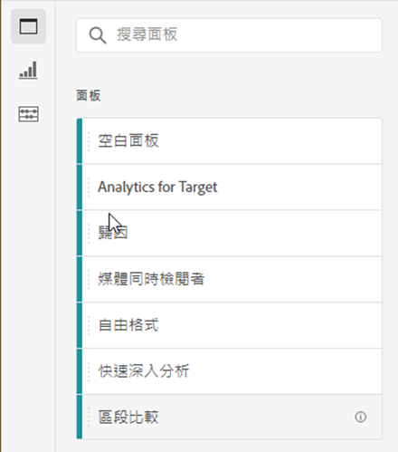
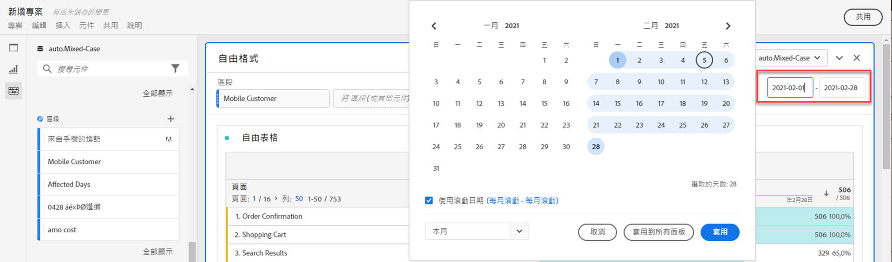
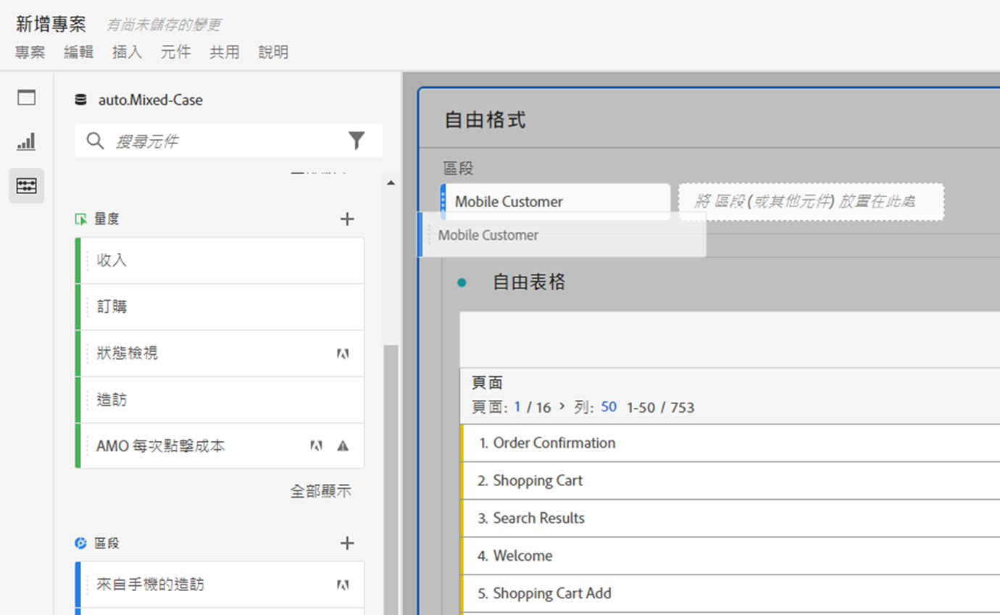
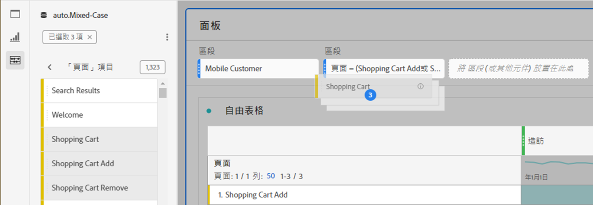
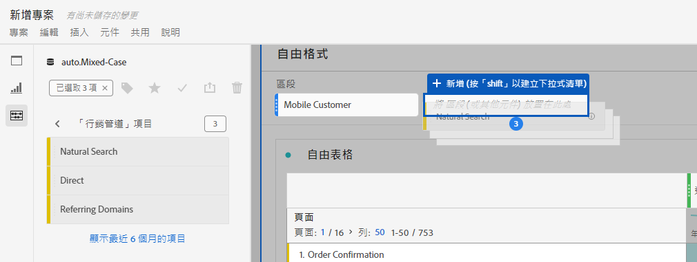
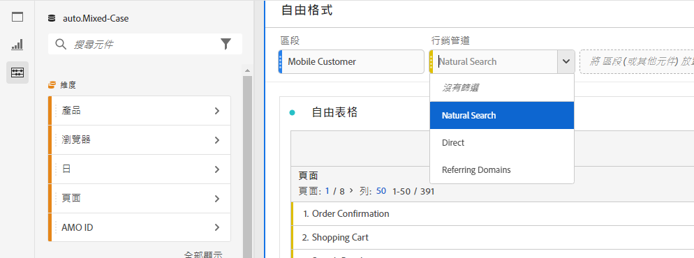
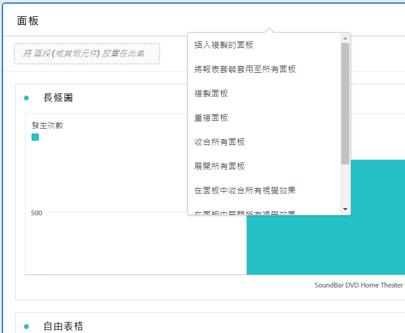

# 面板概觀

[!UICONTROL 面板]是表格與視覺效果的集合。您可以從「工作區」左上角圖示或[空白面板](/help/analysis-workspace/c-panels/blank-panel.md)來存取面板。若您想要根據時段、資料檢視或分析使用案例來組織專案時，面板會很有幫助。

## 面板類型

下列面板類型適用於Analysis Workspace [!UICONTROL Customer Journey Analytics]:

| 面板名稱 | 說明 |
| --- | --- |
| [空白面板](/help/analysis-workspace/c-panels/blank-panel.md) | 從可用面板和視覺效果中選擇以開始分析。 |
| [快速深入分析面板](quickinsight.md) | 快速建立自由格式表格和隨附的視覺效果，以更快速分析及揭秘深入分析。 |
| [歸因面板](attribution.md) | 使用任何維度和轉換量度，快速比較和視覺化任何數量的歸因模式。 |
| [自由表格面板](freeform-panel.md) | 執行無限制的比較和劃分，然後新增視覺效果以展現一個有豐富資料的故事。 |

[!UICONTROL 快速深入分析]、[!UICONTROL 空白]和[!UICONTROL 任意形狀]面板是您一開始展開分析的絕佳地方，而 [!UICONTROL Attribution IQ] 則適合更進階的分析。專案中也有 `"+"` 按鈕可供使用，讓您隨時都可以新增空白面板。

預設的開始面板為「[!UICONTROL 自由格式]」面板，但您也可以將[空白面板](/help/analysis-workspace/c-panels/blank-panel.md)設為預設面板。

## 行事曆 {#calendar}

行事曆面板會儀表板內表格和視覺效果的報告範圍。

注意：如果表格、視覺效果或下拉區域內使用 (紫色) 日期範圍元件，此日期範圍將覆蓋面板行事曆。

您可在面板行事曆的進階設定下套用以分鐘為單位的日期範圍。如果您的報表涵蓋許多天的日期範圍，則開始時間會套用在您的範圍中的第一天，而結束時間則會套用在最後一天。

## 空投區 {#dropzone}

面板空投區可讓您將篩選器和下拉式篩選器套用至面板內的所有表格和視覺效果。您可以將一個或多個篩選器套用至面板。每個篩選器上方標題都可編輯，方法是按一下編輯鉛筆圖示；或者，按一下右鍵可完全移除篩功能表。

### 篩選器

將任何篩選器從左側欄拖放至面板空投區，即可開始篩選您的面板。

### 臨機篩選

也可以直接將非篩選器元件拖曳至空投區內來建立臨機篩選器，為您節省前往篩選產生器的時間和作業。以這種方式建立的篩選器會被自動定義為點擊層級的篩選器。若要修改此定義，可按一下篩選器旁的資訊圖示 (i)，然後按一下筆狀編輯圖示，即可在篩選產生器中進行編輯。

臨機篩選屬於專案的本機部分，除非您將其公開，否則將不會在您的左側欄中顯示。

### 下拉式篩選器 {#dropdown-filter}

除了篩選器之外，下拉式篩選器可讓您以有控制的方式和資料互動。例如，您可新增適用於行動裝置類型的下拉式篩選器，因此您就可以按平板電腦、手機或桌上型電腦來篩選面板。

下拉式篩選器也可用於將許多專案合併為一個。例如，如果您的一個專案有許多版本，分別套用了不同國家/地區的篩選器，您可將所有版本合併為單一專案，並新增一個國家/地區下拉式篩選器。

若要建立下拉篩選器：

1. 若要使用[!UICONTROL 維度項目] (例如[!UICONTROL 行銷管道]維度內的值) 建立下拉篩功能表，在左側邊欄內您的維度旁邊，按一下向右的箭頭。如此即可使用所有適用項目。在左側邊欄中選取一個或多個元件項目，然後&#x200B;**按住 Shift 鍵**，將元件放至面板的下拉區域中。這樣便可將這些元件轉變為下拉式篩選器，而非單一篩選器。
1. 若要使用其他元件 (如量度、篩選器或日期範圍) 建立下拉式篩選器，可在左側欄中選取一個元件，然後按住 Shift 鍵&#x200B;**，將元件投放至面板空投區**。
1. 從下拉功能表中選取一個選項，即可變更面板中的資料。您也可選擇不要篩選任何面板中的資料，只要選取「**[!UICONTROL 不要篩選]**」即可。

[觀看影片](https://experienceleague.adobe.com/docs/analytics-learn/tutorials/analysis-workspace/using-panels/using-panels-to-organize-your-analysis-workspace-projects.html?lang=zh-Hant)，了解更多有關如何在專案中新增下拉篩選器。

## 在功能表上按一下右鍵 {#right-click}

在面板標題按一下右鍵，可以使用面板的其他功能。

有以下設定可使用：

| 設定 | 說明 |
| --- | --- |
| [!UICONTROL 插入複製的面板/視覺效果] | 讓您可將複製的面板或視覺效果貼至 (「插入」) 專案內另一個位置或完全不同的專案中。 |
| [!UICONTROL 複製面板] | 讓您按一下滑鼠右鍵並複製面板，以便將其插入專案內另一個位置或完全不同的專案中。 |
| [!UICONTROL 複製面板] | 將目前的面板依樣複製，然後可以再加以修改。 |
| [!UICONTROL 摺疊/展開所有面板] | 摺疊和展開所有專案面板。 |
| [!UICONTROL 摺疊/展開面板中的所有視覺效果] | 摺疊和展開目前面板中的所有視覺效果。 |
| [!UICONTROL 編輯說明] | 新增 (或編輯) 面板的文字說明。 |
| [!UICONTROL 取得面板連結] | 讓您可將使用者直接導向專案中的特定面板。收件者按一下連結後必須先登入系統，然後才會被導向所連結的正確面板。 |
