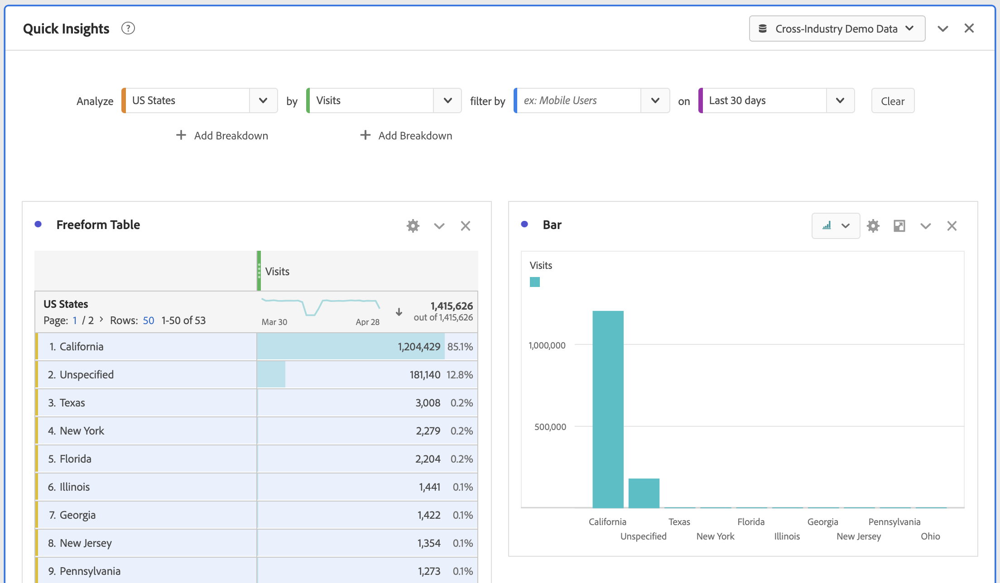

# 快速深入分析面板

>[!NOTE]
>
>您正在檢視 Customer Journey Analytics 中 Analysis Workspace 的相關文件，其功能集與傳統 Adobe Analytics 中的 [Analysis Workspace 略有不同](https://experienceleague.adobe.com/docs/analytics/analyze/analysis-workspace/home.html?lang=zh-Hant)。[了解更多...](/help/getting-started/cja-aa.md)

>[!IMPORTANT]
>
>**[!UICONTROL 快速見解]** 面板當前正在進行有限測試。 [了解更多](https://experienceleague.adobe.com/docs/analytics/landing/an-releases.html?lang=zh-Hant)

[!UICONTROL 快速深入分析]為 [!UICONTROL Analysis Workspace] 的非分析師和新使用者提供指引，瞭解如何快速輕鬆回答業務問題。對於想要快速解答簡單的問題而無須自行建立表格的進階使用者，這也是絕佳的工具。

當你第一次使用 [!UICONTROL Analysis Workspace]，您可能會想知道哪些可視化效果最有用，哪些維和度量可以促進洞察力、在何處拖放項目、在何處建立篩選器等。

要幫助解決此問題，並根據您公司在 [!UICONTROL Analysis Workspace]。 [!UICONTROL 快速見解] 利用一種算法，該算法將為您提供您公司使用的最常用的維度、度量、篩選器和日期範圍。 實際上，您將看到標籤為 [!UICONTROL 熱門] 在下拉清單中，如下所示：

[!UICONTROL 快速深入分析]可協助您

* 在 [!UICONTROL Analysis Workspace] 中適當建立資料表格及隨附的視覺效果。
* 瞭解 [!UICONTROL Analysis Workspace] 的基本元件和部件所適用的術語和辭彙。
* 執行維的簡單細目、添加多個度量或在 [!UICONTROL 自由形式表]。
* 變更或試用各種視覺效果類型，以快速且直覺地找出您的分析適用的尋找工具。

## 基本關鍵術語

以下是您需要熟悉的一些基本術語。每個資料表格都包含 2 個或更多組成要素 (元件)，讓您用來建構自己專屬的資料。

| 組成要素 (元件) | 定義 |
|---|---|
| [!UICONTROL 維度] | 維度是量度資料的描述或特性，您可以在專案中加以檢視、劃分及比較。這是可劃分為維度項目的非數值和日期。例如，「瀏覽器」或「頁面」都是維度。 |
| [!UICONTROL 維度項目] | 維度項目是維度的個別值。例如，瀏覽器維度的維度項目為「Chrome」、「Firefox」、「Edge」等。 |
| [!UICONTROL 量度] | 量度是有關訪客活動的量化資訊，例如瀏覽次數、點進、重新載入、平均逗留時間、件數、訂購、收入等。 |
| [!UICONTROL 視覺效果] | 工作區提供[許多視覺效果](/help/analysis-workspace/visualizations/freeform-analysis-visualizations.md)，可讓您建立資料的視覺化表示法，例如長條圖、環圈圖、直方圖、折線圖、地圖、散點圖等。 |
| [!UICONTROL 維度劃分] | 維度劃分是以其他維度來實際劃分某個維度的一種方式。在我們的範例中，您可以依行動裝置來劃分美國各州，以取得每州的行動裝置造訪次數，或依行動裝置類型、地區、內部促銷活動等來劃分行動裝置。 |
| [!UICONTROL 篩選] | 過濾器允許您根據特徵或網站交互確定訪問者的子集。 例如，您可以 [!UICONTROL 訪問者] 基於屬性的篩選器：瀏覽器類型、設備、訪問次數、國家/地區、性別或基於交互：市場活動、關鍵字搜索、搜索引擎或基於退出和條目：來自Facebook的訪問者，定義登錄頁、引用域或基於自定義變數：表單欄位、定義的類別、客戶ID。 |

## 開始使用快速深入分析

1. 使用您所提供的憑據登錄Customer Journey Analytics。
1. 前往[!UICONTROL 工作區]，按一下&#x200B;**[!UICONTROL 建立新專案]**，然後按一下&#x200B;**[!UICONTROL 快速深入分析]**。(您也可以從左側邊欄中的&#x200B;**[!UICONTROL 面板]**&#x200B;功能表存取此面板。)

   

   

1. 第一次使用時，請完成簡短的教學課程，以瞭解[!UICONTROL 「快速深入分析」面板]的一些基本概念。或者，您可以按一下&#x200B;**[!UICONTROL 略過教學課程]**。
1. 選擇構建基塊（也稱為元件）:維（橙色）、度量（綠色）、篩選器（藍色）或日期範圍（紫色）您必須為要自動生成的表至少選擇一個維和一個度量。

   

   選取組成要素的方式有三種：
   * 從左側邊欄加以拖放。
   * 如果您知道所要尋找的標的：開始輸入後，[!UICONTROL 快速深入分析]就會為您填入其餘內容。
   * 按一下下拉式清單，並搜尋清單。

1. 當您已新增至少一個維度和一個量度時，系統就會為您建立下列項目：

   * 自由表格，最上方會有垂直方向的維度 (此案例中為「美國州」) 和水平方向的量度 (此案例中為「造訪」)。請查看下表：

   

   * 隨附的視覺效果，在此案例中為[長條圖](/help/analysis-workspace/visualizations/bar.md)。產生的視覺效果會以您新增至表格的資料類型為基礎。任何以時間為基礎的資料 (例如，每日/月的[!UICONTROL 造訪]次數)，都會預設為[!UICONTROL 折線圖]。任何非時間型資料 (例如，每個[!UICONTROL 裝置]的[!UICONTROL 造訪]次數) 都會預設為[!UICONTROL 長條圖]。您可以按一下視覺效果類型旁的下拉箭頭，以變更視覺效果類型。

1. (可選) 按一下維度旁的 > 向右箭頭深入鑽研維度，並檢視維度項目。

1. 嘗試新增一些更精細的功能，如後續的「更多提示」所說明。

1. 按一下&#x200B;**[!UICONTROL 專案 > 儲存]**&#x200B;以儲存您的專案。

## 更多秘訣

[!UICONTROL 快速深入分析產生器]會出現其他有用的提示，其中有部分取決於您最後的動作。

* 首先，請完成&#x200B;**[!UICONTROL 更多提示]**&#x200B;教學課程：透過說明 (?)圖示加以存取 (位於[!UICONTROL 快速深入分析]標題旁)。本教學課程會在您建立專案的 24 小時後顯示，其中至少包含一個維度和一個量度。

   

* **劃分依據**：您最多可對維度使用 3 個層級的劃分，以深入鑽研您真正需要的資料。

   

* **新增更多量度**：您可以使用 AND 運算子在表格中額外新增最多 2 個量度。

   

* **添加更多篩選器**:通過使用AND或OR運算子將表添加到篩選器中，最多可添加2個篩選器。 新增「行動使用者」OR「忠誠訪客」後，請查看表格有何變更。兩者彼此相鄰，位於量度上方。如果添加了「移動用戶」和「忠誠訪問者」，您將看到兩個過濾器的結果，並且它們會疊放在桌子上。

   

## 已知限制

如果您嘗試直接在表格中進行編輯，將會導致[!UICONTROL 快速深入分析]面板不同步。您可以按一下面板右上方的&#x200B;**[!UICONTROL 重新同步產生器]**，將其還原為先前的[!UICONTROL 快速深入分析]設定。

直接在表格中新增任何項目之前，您將收到警告：

或者，直接建立將使表格此時像傳統自由表格一樣運作，而沒有可協助新使用者的功能。
