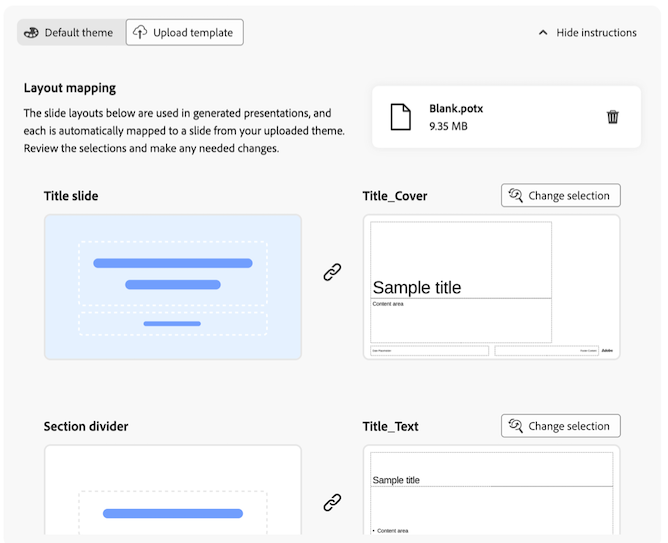

# 資料storytelling：從Workspace報表產生投影片簡報 {#generate-powerpoint}

>[!AVAILABILITY]
>
>資料Storytelling是[Data Insights Agent](/help/data-analysis-ai.md)下的技能。 此功能處於發行的有限測試階段，可能尚未在您的環境中提供。 此功能普遍開放使用時，便會移除此注意事項。有關 Customer Journey Analytics 發佈流程的資訊，請參閱 [Customer Journey Analytics 功能發佈](/help/release-notes/releases.md)。

<!-- also remove lmited testing note from: /help/technotes/access-control.md -->

<!--at GA in January, replace Limited Testing note with this: Data Storytelling is a skill under Data Insights Agent and is available to eligible customers for a limited time. Access to Data Insights Agent will end on 28th February 2026. To continue using Data Insights Agent or other Adobe Experience Platform Agents without interruption, please contact your Adobe account representative to learn more about licensing Adobe Experience Platform Agent Orchestrator. -->

具有[必要許可權](#permission-requirements-to-generate-slides)的使用者可以根據Analysis Workspace專案自動產生.pptx簡報。 在產生這些投影片簡報時，Customer Journey Analytics會識別關鍵深入分析，並將其轉換為利害關係人就緒的投影片，自動從您的資料建立故事。

此產生的資料故事可減少呈現Workspace專案中的發現專案所需的時間、精力和專業知識。 分析人員可更專注於資料探索，同時允許Customer Journey Analytics建置和格式化執行敘述，並將業務影響傳達給利害關係人。

## 瞭解投影片簡報中的資料故事

**資料故事**&#x200B;是Customer Journey Analytics根據您的Workspace資料建立的敘事。 Customer Journey Analytics會使用創作AI識別您選擇包含在幻燈片簡報中的面板和視覺效果中的重要主題。 它會產生深入分析，然後進行重複資料刪除和評分程式，以識別用來建立資料故事的深入分析子集。

以下章節說明資料內文提供的額外值、專案中有助於塑造敘述的必要元素，以及.pptx簡報輸出中包含的關鍵元素。

### 資料內文提供的其他值

資料故事可讓資料分析經驗較少的使用者存取資料，從而為Workspace專案提供價值和深入分析。

資料內文可透過以下方式補充指定Workspace專案的分析：

* 提供其他內容

* 強調重要深入分析

* 正在評估某些變數的值是否偏低或偏高

* 指出隱藏的趨勢、異常和其他因素

* 提出後續步驟的想法

### 塑造資料內文的專案元素

Analysis Workspace會考慮下列專案元素來建立資料內文：

* 維度間和量度間關係

* 構成分析基礎的個別元素（維度、量度、篩選器、自由表格結構、視覺效果和面板）

* 為面板、表格和視覺效果指定的名稱

* 自由格式表格中的量度順序（用於決定優先順序）

* 面板中視覺效果的順序（用以決定優先順序）

* 摘要數字和摘要文字（用於決定需要在資料本文中反白顯示的量度）

### 資料劇本的簡報元素

資料本文包含標題幻燈片、執行摘要幻燈片、詳細投影片和區段分隔線。

**標題投影片：**&#x200B;顯示您指定的標題和簡報者名稱。 演講者備註會顯示資訊，說明主題和敘述的建立程式、產生及使用多少深入分析，以及使用哪些面板。

**執行摘要：**&#x200B;排定最高價值深入分析的優先順序，並製作長度介於1到5個句子的整體故事。

**詳細投影片：**&#x200B;產生與Workspace專案中任何表格、面板或視覺效果相關的深入分析。 深入分析包括趨勢、季節性、異常和關聯。

**區段分隔線：**&#x200B;以適當放置和命名的區段分隔線來劃分深入分析。

## 根據Workspace專案產生.pptx簡報

<!-- markdownlint-disable MD034 -->

>[!CONTEXTUALHELP]
>id="cja-powerpoint-include-visualizations"
>title="包含的面板和視覺效果"
>abstract="選擇要包含在簡報中的面板和視覺效果。 您最多可以包含50個視覺效果。"

<!-- markdownlint-enable MD034 -->

<!-- markdownlint-disable MD034 -->

>[!CONTEXTUALHELP]
>id="cja-presentation-emphasized-components"
>title="強調元件"
>abstract="從您要在簡報中強調的視覺效果中選擇最多5個量度和5個維度。 您選擇的量度會以斜體顯示、維度會以粗體顯示，而維度專案則會以對比顏色顯示。"

<!-- markdownlint-enable MD034 -->

1. 移至包含您要用來作為投影片簡報基礎之資料的Workspace專案。

1. 選取頁面右上角的&#x200B;**[!UICONTROL 產生投影片]**。

   「產生幻燈片」對話方塊隨即顯示。

   

1. 註明下列資訊：

   | 選項 | 說明 |
   |---------|----------|
   | **[!UICONTROL 封面標題]** | 指定簡報的標題。 此標題會顯示在簡報的標題投影片上。 |
   | **[!UICONTROL 包含簡報者名稱]** | 指定簡報者的名稱。 此名稱會出現在簡報標題投影片上，位於封面標題下方。 |
   | **[!UICONTROL 要包含的面板和視覺效果]** | 選擇要包含在簡報中的面板和視覺效果。 您最多可以包含50個視覺效果。
如果視覺效果變暗，後面會接著文字&#x200B;**[!UICONTROL （不支援）]**&#x200B;或&#x200B;**[!UICONTROL （受限制的資料）]**。
<ul><li>**不支援**：支援大部分的面板和視覺效果。 如需有關不支援的面板和視覺效果的資訊，請參閱[不支援的專案元素和功能](#unsupported-project-elements-and-features)。</li><li>**受限制的資料**：視覺效果中包含的元件受到組織強制執行的資料治理原則限制，無法匯出。 請連絡您的系統管理員，檢視哪些元件受到限制無法匯出，然後在產生幻燈片之前移除受限制的元件。</li></ul> |
   | **[!UICONTROL 強調元件]** | 從視覺效果中選擇您要在簡報中強調的量度和維度。 建立資料故事的主題和總體敘述時，您選擇的元件排名較高，並獲得更多權重。 
未套用強調時，元件在簡報中顯示如下：<ul><li>**度量和維度：**&#x200B;斜體</li><li>**Dimension專案：**&#x200B;引號</li></ul>

當套用強調時，元件在簡報中顯示如下：
<ul><li>**量度和維度：**&#x200B;斜體與粗體</li><li>**Dimension專案：**&#x200B;強調對應維度時為粗體
在圖表中反白顯示維度專案時，也會將顏色套用至維度專案。
</li></ul> |

   <!-- add this later: - **[!UICONTROL Panel and visualization descriptions]** - Choose whether to include panel and visualization descriptions in your generated slide presentation. - 
   - **[!UICONTROL Annotations]** - Choose whether annotations are visible in your generated slide presentation. For more information about annotations, see [Annotations overview](/help/components/annotations/overview.md).  -  -->

1. （視條件而定）如果您想以較少的步驟產生投影片，而且您的投影片簡報不需要公司佈景主題，請選取&#x200B;**[!UICONTROL 預設佈景主題]**。

   只要選取想要的顏色，即可選擇簡報的顏色主題。

   

1. （視條件而定）如果您的投影片簡報需要符合公司主題，請選取&#x200B;**[!UICONTROL 上傳範本]**。 此選項需要您上傳自訂範本並套用自訂樣式。

   您上傳的最新自訂範本會儲存在本機瀏覽器快取中，並在產生未來的投影片簡報時提供。

   

   若要上傳自訂範本，請執行下列其中一項操作：

   +++（建議）下載空白範本並加以修改

   1. 下載[此空白範本](https://d30ln29764hddd.cloudfront.net/deploy/builds/data-storytelling.2025-10-20T15:10:19/resources/components/Blank.potx?)。

   1. 將自訂樣式套用至空白範本。

   1. 重新上傳範本而不變更任何主版面配置名稱：

      從您的檔案系統中，拖曳已套用自訂樣式的空白範本至拖放區域。

      或

      選取&#x200B;**[!UICONTROL 瀏覽]**，然後瀏覽並選取從檔案系統套用自訂樣式的空白範本。

   1. 在&#x200B;**[!UICONTROL 配置對應]**&#x200B;區段中，產生之簡報中使用的每個投影片配置會自動對應至您上傳之主題的投影片。 檢閱選取專案以確定其正確無誤。

      

   1. （視條件而定）如果投影片版面配置對應不正確，請選取從上傳簡報中選取之投影片上方的&#x200B;**[!UICONTROL 變更選取專案]**，然後選擇符合版面的投影片。

      對未正確對應的每張投影片重複此程式。

   +++

   +++直接上傳自訂範本 

   1. 從您的檔案系統，將自訂範本拖曳至拖放區域。

      或

      選取「**[!UICONTROL 瀏覽]**」，然後瀏覽並從檔案系統中選取自訂範本。

      請確定上傳的檔案具有下列名稱的主版面配置：「Title_Slide」、「Section_Divider」、「Title_Text」、「Title_Chart」、「Title_Two_Content_Mixed」、「Title_Three_Content_Mixed」。

      最多支援 25 個主要版面配置。

      支援最大 25MB 的 .pptx 和 .potx 檔案。

   1. 在&#x200B;**[!UICONTROL 配置對應]**&#x200B;區段中，產生之簡報中使用的每個投影片配置會自動對應至您上傳之主題的投影片。 檢閱選取專案以確定其正確無誤。

      

   1. （視條件而定）如果投影片版面配置對應不正確，請選取從上傳簡報中選取之投影片上方的&#x200B;**[!UICONTROL 變更選取專案]**，然後選擇符合版面的投影片。

      對未正確對應的每張投影片重複此程式。

   +++

1. 選取&#x200B;**[!UICONTROL 匯出PPT]**。

   .pptx簡報會自動下載至您的工作站。

1. （建議）開啟.pptx簡報並加以檢閱。 進行任何需要的變更。

## 產生幻燈片的許可權需求

>[!AVAILABILITY]
>
>如果您的組織無權從Workspace專案產生投影片簡報，請聯絡您的Adobe客戶代表以瞭解更多授權的相關資訊。

組織中擁有必要授權的所有使用者，預設都會啟用產生幻燈片的功能。

如有需要，其組織擁有產生投影片授權的產品設定檔管理員可停用存取權。

在[!UICONTROL Adobe Admin Console]中，[!UICONTROL 報告工具] **[!UICONTROL 資料storytelling]**&#x200B;許可權會決定此功能的存取權。 如果[產品設定檔管理員](https://helpx.adobe.com/tw/enterprise/using/manage-product-profiles.html)想要停用存取權，必須遵循[!UICONTROL Admin Console]中的下列步驟：
1. 請前往「**[!UICONTROL Admin Console]** > **[!UICONTROL 產品與服務]** > **[!UICONTROL Customer Journey Analytics]** > **[!UICONTROL 產品設定檔]**」。
1. 選取您要為其提供[!UICONTROL 資料storytelling]存取權的產品設定檔標題。
1. 在特定的產品設定檔中，選取「**[!UICONTROL 權限]**」。
1. 選取「」，可編輯「**[!UICONTROL 報告工具]**」。
1. 選取以從&#x200B;**包含的許可權專案**&#x200B;移除&#x200B;**[!UICONTROL 資料storytelling]**。

   <!--add screenshot of permission in the admin console-->

1. 選取「**[!UICONTROL 儲存]**」，儲存權限。

如需詳細資訊，請參閱[存取控制](/help/technotes/access-control.md#user-level-access)中的[使用者層級存取](/help/technotes/access-control.md#access-control)。

## 不支援的專案元素和功能 {#unsupported}

產生幻燈片時，不支援專案中使用的下列Analysis Workspace元素和功能：

* 歸因面板

  當顯示組態選項時，此面板會以灰色顯示。

  所有其他面板可包含在從Workspace專案產生的幻燈片中。

* 部分視覺效果

  大部分的視覺效果都可包含在從Workspace專案產生的幻燈片中。 不過，下列視覺效果無法納入，並在顯示組態選項時顯示為灰色：

   * 區域

   * 項目符號

   * 同類群組表格

   * 組合

   * 具有多個維度欄的自由格式表格（支援具有單一維度欄的表格）

   * 歷程畫布

   * 散佈圖

   * 樹狀圖

* 引導分析

* 資料治理原則限制無法匯出的元件

  如需詳細資訊，請參閱[疑難排解失敗的匯出](/help/components/exports/troubleshoot-exports.md)。

## 支援有限的專案元素和功能

* 劃分

  在產生相關深入分析時，做為重複資料刪除和評分程式的一部分，系統會獨立分析自由表格內的每個劃分，並只分析單一自由表格內的前5個劃分。

  僅支援劃分的第一個層級。 劃分不會包含在簡報中。

