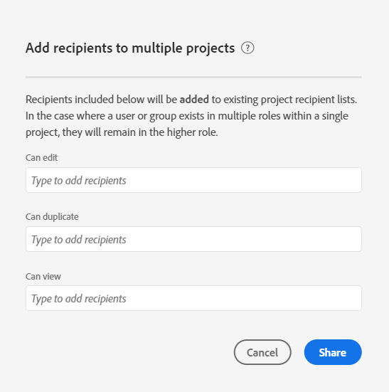

# 共用專案

您可以與以下類型的人員共用Analysis Workspace項目：

* 您組織中有權訪問Adobe Customer Journey Analytics的用戶和組

   您可以共用「編輯」、「複製」或「查看」訪問

* 您組織中無權訪問Customer Journey Analytics的用戶和組

   收件人具有只讀訪問權限

* 組織外的人員

   收件人具有只讀訪問權限

任意 [曲線](curate.md) 在收件人開啟項目時，會反映您在共用之前應用的內容。

以下是專案共用的影片概觀：

>[!VIDEO](https://video.tv.adobe.com/v/36207/?quality=12)

## 與組織中的Customer Journey Analytics用戶和組共用 {#Add}

您可以與組織中的現有Customer Journey Analytics用戶或組共用項目。 如本節所述共用項目時，與您共用的用戶必須已擁有Customer Journey Analytics帳戶。

您可以與使用者或群組共用特定角色，也可以共用連結。

* [共用特定的專案角色](#share-a-specific-project-role)

* [共用專案的連結](#share-a-link-to-a-project)

## 共用特定的專案角色

與組織中的使用者和群組共用特定專案角色時，請考慮以下事項：

* 專案角色 (**[!UICONTROL 可編輯]**，**[!UICONTROL 可複製]**，和&#x200B;**[!UICONTROL 可檢視]**) 會繫結至使用者和特定專案 ID。專案角色不受 [Adobe Experience Cloud Admin Console](https://experienceleague.adobe.com/docs/core-services/interface/manage-users-and-products/admin-getting-started.html?lang=zh-Hant) 中管理的使用者權限影響。

* 在 Customer Journey Analytics 中，群組由 [Adobe Experience Cloud Admin Console](https://experienceleague.adobe.com/docs/core-services/interface/manage-users-and-products/admin-getting-started.html?lang=zh-Hant) 中的產品設定檔所定義。管理員可將任何群組當作共用對象，包括「全部」。非管理員則可與其所屬的任何群組共用，但「全部」除外。

* 獲得多個角色的使用者一律會有最高體驗。如果同時以個人和群組成員的身分新增使用者，就可能發生此狀況。例如，如果使用者以個人身分獲得&#x200B;**[!UICONTROL 可編輯]**&#x200B;角色，並且以群組成員身分獲得&#x200B;**[!UICONTROL 可檢視]**&#x200B;角色，則其將獲得&#x200B;**[!UICONTROL 可編輯]**&#x200B;專案體驗。

* 獲得&#x200B;**[!UICONTROL 可複製]**&#x200B;或&#x200B;**[!UICONTROL 可檢視]**&#x200B;角色的管理員，在開啟專案時會獲得這些有限的體驗。如有需要，管理員可隨時透過&#x200B;**[!UICONTROL 元件] > [!UICONTROL 專案]**&#x200B;將其角色增加到&#x200B;**[!UICONTROL 可編輯]**&#x200B;中。

若要與組織中的使用者或群組共用特定專案角色：

1. 轉到要共用的項目，然後按一下 **[!UICONTROL 共用]** > **[!UICONTROL 與Workspace用戶共用]**。
如果有未儲存的變更，系統會提示您先儲存專案。

   

   有關如何同時共用多個專案的資訊，請參閱[在專案管理員中共用專案](#share-projects-in-the-project-manager)。

1. 在提供的其中一個角色欄位中新增收件者或收件者群組：

   **可編輯：**&#x200B;收件者可&#x200B;**[!UICONTROL 儲存]**&#x200B;對專案的變更，並以共同擁有者的身分操作。如果您想要與其他同事共同管理專案，此角色將有其效用；包括編輯、刪除和修改共用專案的收件者清單。 注意：Analysis Workspace 目前不支援即時共同作業，因此我們建議不要有多名使用者同時編輯一個專案。如果同時儲存專案，將會保留最後一個版本。

   **可複製：**&#x200B;收件者可以&#x200B;**[!UICONTROL 另存新檔]**，且具有左側邊欄的存取權。此角色的專案互動不受限制。如果您想要與瞭解組織資料，且知道如何使用 Analysis Workspace 的使用者共用專案，但不想讓專案遭到變更，就可以使用此角色。

   **可檢視：**&#x200B;收件者無法&#x200B;**[!UICONTROL 儲存]**&#x200B;或&#x200B;**[!UICONTROL 另存新檔]**，也無法存取左側邊欄。專案互動也有所限制。如果您想將項目共用給對您組織的資料結構不太熟悉的用戶，則此角色非常有用，通常為Analysis Workspace或Customer Journey Analytics。 但您仍希望他們能在安全的環境中使用資料和深入分析，就可以使用此角色。深入瞭解[可檢視專案體驗](/help/analysis-workspace/curate-share/view-only-projects.md)。

1. 選擇共用專案時是否啟用以下選項：

   * **共用內嵌的專案元件：**&#x200B;與所有收件者共用區段、計算量度、日期範圍。共用後，這些元件會出現在收件者 Workspace 的「元件」下拉式清單中。系統不會沿用此設定，此動作僅在單次共用中有效。

   * **設定為收件者的登陸頁面：** 將此頁面設定為收件者的登陸頁面。系統不會沿用此設定，此動作僅在單次共用中有效。

1. 按一下「**[!UICONTROL 共用]**」。(如果項目已共用，請按一下 [!UICONTROL **更新**]。)

   或

   按一下 **[!UICONTROL 建立和共用]** 自動應用項目建立。 (如果項目已共用，請按一下 **[!UICONTROL 定制和更新]**。) 深入瞭解[專案組織](curate.md)。

## 共用專案的連結

按本節所述共用連結時，請考慮以下事項：

* 使用連結的收件人必須先登錄到Customer Journey Analytics，然後才能訪問項目。

* 收件者若未獲指派任何角色，且收到專案的[連結](/help/analysis-workspace/curate-share/shareable-links.md) (**[!UICONTROL 「共用] > [!UICONTROL 取得專案連結」]**)，則根據預設，他們將會獲得角色。管理員接收 **[!UICONTROL 可編輯]** 和非管理員接收 **[!UICONTROL 可以複製]**。

若要與組織中的使用者共用專案連結：

1. 儲存專案。如果存在未保存的更改，則系統會提示您在共用連結之前保存項目。

1. 選擇 **[!UICONTROL 共用]** > **[!UICONTROL 與Workspace用戶共用]**，然後選擇 **[!UICONTROL 複製]** 的 **[!UICONTROL 按連結共用]** 的子菜單。

   

1. 與組織中的使用者共用連結。例如，您可以將其貼上到電子郵件、內部網站等。

## 與任何人共用項目（無需登錄） {#share-public-link}

{{release-limited-testing-section}}

你可以 [只讀訪問](/help/analysis-workspace/curate-share/view-only-projects.md) Analysis Workspace的項目是給那些沒有Customer Journey Analytics的人。 這可包括：

* 組織外的人員

* 組織內未設定Customer Journey Analytics的人員

>[!NOTE]
>
>在與無權訪問CJA的人共用Analysis Workspace項目時，請考慮以下事項：
>
>* CJA管理員可以禁用以這種方式共用項目的能力，如中所述 [首選項](/help/analysis-workspace/user-preferences.md)。 如果無法按本節所述共用項目，則您的CJA管理員已禁用此功能。
>
>* 無法與無權訪問CJA的人共用具有50個以上擴展可視化效果的項目。
>
>* 與您共用的用戶可以查看在期間應用到項目的任何篩選器 [曲線](curate.md)。
> 
>* 與您共用的用戶可以更改項目日期範圍。 預設情況下顯示為項目設定的日期範圍。
>
>* 如果許多用戶同時嘗試訪問給定的連結，則項目可能無法訪問。 預設情況下，每5分鐘就有190多人訪問一個連結。 如果您的組織達到此限制，請等待5分鐘，然後再次嘗試訪問連結。

與任何人共用Analysis Workspace項目：

1. 開啟要共用的Analysis Workspace項目。

1. 按一下 **[!UICONTROL 共用]** > **[!UICONTROL 與任何人共用]**。

   如果有未保存的更改，系統會提示您保存項目。

   <!-- Add screen shot of new modal -->

1. 啟用 **[!UICONTROL 連結處於活動狀態]** 頁籤

   選擇此選項將建立一個指向可以與任何人共用的項目的連結。 您可以通過禁用此選項隨時禁用對項目的訪問。

   項目的所有者也是此連結的所有者。 只有在轉移項目所有權時，連結所有權才能轉移給其他用戶，如中所述 [轉移用戶資產或設定帳戶到期日](https://experienceleague.adobe.com/docs/analytics/admin/admin-tools/user-product-management/users-assets.html?lang=en) 管理指南中。

1. 選擇是否啟用以下安全選項（此選項可由CJA管理員控制）:

   * **[!UICONTROL 需要 Experience Cloud 驗證]:**

      啟用此選項後，只有能夠登錄到建立您共用的項目的Adobe Experience Cloud組織的用戶才能訪問該項目。

      CJA管理員可以為公司配置此首選項，如中所述 [首選項](/help/analysis-workspace/user-preferences.md)。 根據管理員配置此選項的方式，您可能會遇到以下情形：

      * 如果此選項不可見，則您的CJA管理員未啟用此功能。

      * 如果此選項處於啟用狀態且呈灰色，則您的CJA管理員需要對任何訪問Analysis Workspace項目的人進行Experience Cloud驗證。

1. 在 **[!UICONTROL 與任何人共用（無需登錄）]** ，按一下 **複製連結** 表徵圖 )將連結複製到系統剪貼簿。

1. 與要訪問項目的人員共用連結。 例如，您可以在電子郵件中貼上連結。

   與您共用該連結的任何人都可以查看Analysis Workspace項目。

1. （可選）您可以按一下 **生成新連結** 表徵圖  從以前接收到項目連結的用戶中刪除訪問權限。 將生成一個新連結，您可以與想要訪問項目的用戶共用該連結。

1. 選擇 **[!UICONTROL 關閉]** 的子菜單。 您所做的更改將自動保存。

## 在 Project Manager 中共用專案 {#Manager}

您也可以從&#x200B;**[!UICONTROL 元件] > [!UICONTROL 專案]**&#x200B;來共用專案。依照上述步驟操作，可共用單一專案。如果選取了多個要共用的專案，收件者將會新增至每個專案的現有收件者清單。

例如：

* 專案 A 會與收件者 1、2、3 共用
* 專案 B 會與收件者 4、5、6 共用

在選取專案 A 和 B 後，收件者 4 和 7 會新增至共用清單。此時，每個專案新的共用清單分別為：

* 專案 A：1、2、3、4、7
* 專案 B：4、5、6、7

## 共用內嵌元件

以下是有關該主題的影片：

>[!VIDEO](https://video.tv.adobe.com/v/24713/?quality=12)

## 常見問題 {#FAQs}

| 問題 | 回答 |
|---|---|
| 如果兩個編輯者同時儲存專案，會發生什麼情況？ | 不會合併變更，而會保留最後儲存的專案版本。Analysis Workspace 目前不支援即時共同作業。 |
| 身為管理員，我會有何種專案體驗？ | 設為&#x200B;**[!UICONTROL 可複製]**&#x200B;或&#x200B;**[!UICONTROL 可檢視]**&#x200B;角色的管理員，在開啟專案時將獲得這些有限的體驗。如有需要，管理員可隨時透過&#x200B;**[!UICONTROL 元件] > [!UICONTROL 專案]**&#x200B;將其角色增加到&#x200B;**[!UICONTROL 可編輯]**&#x200B;中。 |
| 如果某個收件者以個人身分設定於某個角色，又以群組成員身分設定於另一個角色，會發生什麼情況？ | 如果收件者獲得多個角色，將一律會有較高的體驗。例如，如果收件者以個人身分獲得&#x200B;**[!UICONTROL 可編輯]**&#x200B;角色，並且以群組成員身分獲得&#x200B;**[!UICONTROL 可檢視]**&#x200B;角色，則將獲得&#x200B;**[!UICONTROL 可編輯]**&#x200B;專案體驗。 |
| 如果收件者開啟了專案連結，將有何體驗？ | 收件者會獲得您在分享模式中為其設定的角色。如果收件人未分配角色並接收到項目連結(**[!UICONTROL 共用]** > **[!UICONTROL 與Workspace用戶共用]**，然後選擇 **[!UICONTROL 複製]** 的 **[!UICONTROL 按連結共用]** 欄位)，預設情況下，它們將被置於角色中。 管理員會獲得&#x200B;**[!UICONTROL 可編輯]**&#x200B;角色，非管理員會獲得&#x200B;**[!UICONTROL 可複製]**&#x200B;角色。 |
