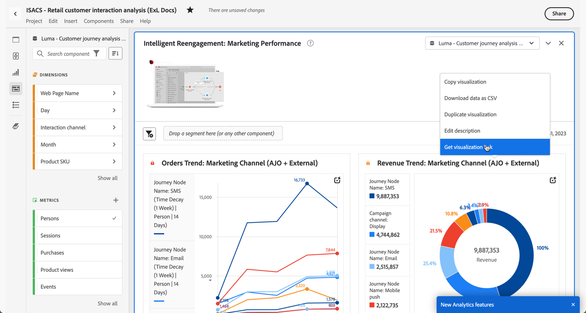

# 建立分享連結

Analysis Workspace 提供許多與用戶共用專案的方式，包括取得專案連結或專案特定部分的功能。有些連結型別會要求收件者先登入Customer Journey Analytics才能存取專案，有些則否。

## 取得專案連結，與其他 Workspace 使用者共用 {#project-link}

若要共用專案的連結，請移至您要共用的專案，然後選取移至&#x200B;**[!UICONTROL 共用]** > **[!UICONTROL 取得專案連結]** (或&#x200B;**[!UICONTROL 共用]** > **[!UICONTROL 與Workspace使用者共用]** > **[!UICONTROL 透過連結共用]**)。 您與之共用連結的使用者必須登入。

如果連結收件者尚未獲指派[專案角色](/help/analysis-workspace/curate-share/share-projects.md)，管理員會收到&#x200B;**[!UICONTROL 編輯原始專案]**，非管理員會收到&#x200B;**[!UICONTROL 編輯復本]**&#x200B;體驗。

## 取得唯讀連結，與任何人共用

您可以與無法存取Analysis Workspace的人共用指向Customer Journey Analytics專案的唯讀連結。

如需詳細資訊，請參閱[與任何人共用](/help/analysis-workspace/curate-share/share-projects.md#share-a-project-with-anyone-no-login-required)。

## 取得面板或視覺效果連結 {#panel-link}

您也可以分享專案特定部分的連結，例如面板或個別視覺效果，有時也稱為內部連結。此功能有助於讓使用者專注於專案中重要的深入分析。

* 從面板標題的內容功能表中，選取&#x200B;**[!UICONTROL 取得面板連結]**
* 從視覺效果標題的內容功能表中，選取&#x200B;**[!UICONTROL 取得視覺效果連結]**

[觀看影片](https://experienceleague.adobe.com/docs/analytics-learn/tutorials/analysis-workspace/visualizations/intra-linking-in-analysis-workspace.html?lang=zh-Hant)以了解如何建立連結，並使用連結引導收件者前往專案的特定部分。

## 在目錄中使用連結 {#TOC}

運用各種連結選項的秘訣之一，就是一律在 Analysis Workspace 專案的頂端加入目錄。您可以透過目錄連結至其他相關專案、特定面板，以及特定的視覺效果。如此有助於專案的收件者輕鬆導覽。

[觀看影片](https://experienceleague.adobe.com/docs/analytics-learn/tutorials/analysis-workspace/navigating-workspace-projects/create-a-toc-in-analysis-workspace.html?lang=zh-Hant)以了解如何使用連結和工作區功能齊全的文字編輯器，輕鬆建立目錄。

