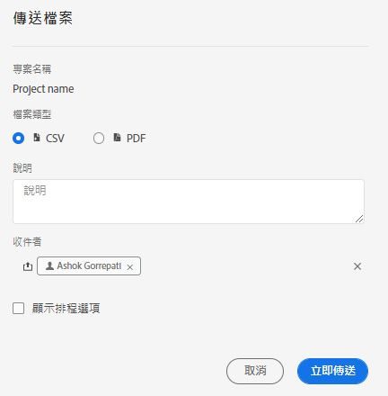
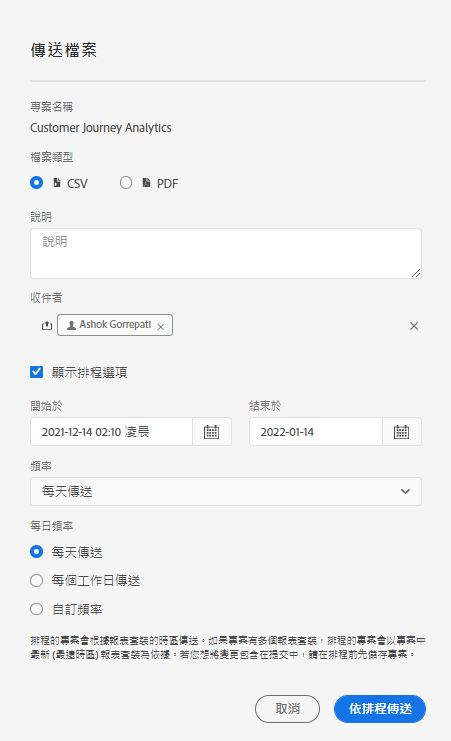

# 排程專案

您可以從工作區的&#x200B;**[!UICONTROL 「共用」]**&#x200B;功能表，透過電子郵件將 Analysis Workspace 專案傳送給選取的收件者。能以 CSV 或 PDF 格式傳送檔案。

## 立即傳送檔案 {#now}

若要透過電子郵件立即傳送檔案給收件者：

1. 按一下「**[!UICONTROL 共用] > [!UICONTROL 立即傳送檔案]**」。
1. 指定檔案類型 (CSV 或 PDF)。
1. (選用) 新增要加入電子郵件中的說明，以說明傳送的檔案。
1. 新增收件者或群組。您也可以輸入電子郵件地址。
1. (僅適用於 Healthcare Shield 客戶) 提供密碼。請參閱「密碼保護排程報告」章節。
1. 按一下「**[!UICONTROL 立即傳送]**」。
1. (選用) 按一下&#x200B;**[!UICONTROL 「顯示排程選項」]**，以指定傳送排程。

## 依排程傳送檔案 {#schedule}

若要透過電子郵件定期傳送檔案給收件者：

1. 按一下「**[!UICONTROL 共用] > [!UICONTROL 依排程傳送檔案]**」。
1. 指定檔案類型 (CSV 或 PDF)。
1. (選用) 新增要加入電子郵件中的說明，以說明傳送的檔案。
1. 新增收件者或群組。您也可以輸入電子郵件地址。
1. (僅適用於 Healthcare Shield 客戶) 提供密碼。請參閱「密碼保護排程報告」章節。
1. 修改「開始時間」和「結束時間」輸入內容，指定應傳送排程的時間範圍。結束日期必須在建立或修改排程當日起一年內。
1. 指定傳送頻率。每個頻率都允許不同的自訂內容。
1. 按一下&#x200B;**[!UICONTROL 「依排程傳送」]**。

## 排程專案管理員 {#manager}

可在「**[!UICONTROL Analytics] > [!UICONTROL 元件] > [!UICONTROL 排程專案]**」中管理已排程 Analysis Workspace 專案。

在「排程專案管理員」中，您可以編輯和刪除周期性專案排程。在搜尋列中或使用左側邊欄中的篩選選項來搜尋排程。您可以依標籤、核准的排程、擁有者等篩選。

| 欄位 | 說明 |
| --- | --- |
| [!UICONTROL 我的最愛] | 選取星號圖示可將此排程加入我的最愛。 |
| [!UICONTROL 排程 ID] | 此 ID 主要是用於偵錯。 |
| [!UICONTROL 標題和說明] | 此專案的標題和說明。 |
| [!UICONTROL 所有者] | 建立及擁有專案的人。 |
| [!UICONTROL 標記] | (選擇性) 標記是組織專案的好方法。 所有使用者都可建立標記，並將一個或多個標記套用到專案。 不過，您只能看見自己所擁有或他人與您共用的那些專案的標記。 |
| [!UICONTROL 已傳遞到] | 此排程專案的收件者。 |
| [!UICONTROL 到期日] | 預設到期日取決於排程頻率。請參閱下方的「排程專案到期日」。 |
| [!UICONTROL 頻率] | 您想要將此排程專案傳送給收件者的頻率。 |
| [!UICONTROL 執行時間] | 在一天中的什麼時間傳送此排程專案。 |
| [!UICONTROL 查詢數] | 針對此專案執行的查詢數。 |

下列是「已排程的專案管理員」中的常見動作：

| 動作 | 說明 |
|---|---|
| **[!UICONTROL 編輯排程]** | 按一下排程的標題以更新傳送設定。 |
| **[!UICONTROL 刪除排程]** | 選取清單中的排程專案，然後在功能表按一下「刪除」。這會刪除專案選取的排程，不會刪除專案本身。 |
| **[!UICONTROL 新增標籤]** | 選取清單中的排程專案，然後選擇「標籤」或「核准」來組織排程，更能輕鬆搜尋。 |
| **[!UICONTROL 檢視失敗的排程]** | 導覽至左側邊欄 >「其他篩選器 > 失敗」，查看失敗的排程。 |
| **[!UICONTROL 檢視過期的排程]** | 導覽至左側邊欄 >「其他篩選器 > 過期」，查看過期的排程。按一下排程的標題，設定新的傳送排程。 |
| **[!UICONTROL 檢視排程 ID]** | 導覽至右上角的欄選項，然後將「排程 ID」欄新增至表格。排程的 ID 對除錯而言通常很實用。 |

「排程專案管理員」會顯示特定使用者建立的項目。若應用程式內的使用者帳戶已被停用，所有已安排的傳送將停止。

## 已排程專案的到期日 {#expiration}

已排程專案的到期日取決於已排程的傳遞頻率：

* 每小時傳遞在一週後到期。
* 每日傳遞在一個月後到期。
* 每週傳遞在六個月後到期。
* 每月/每年傳遞在一年後到期。

## 密碼保護排程專案 {#password}

>[!NOTE]
>
>密碼保護排程專案的選項僅會對已購買 [Healthcare Shield](https://business.adobe.com/solutions/experience-cloud-for-healthcare.html) 附加產品的 CJA 客戶顯示。

Adobe 使用密碼來加密排程專案，無論它們是以 .pdf 或是 .csv 格式傳送。

貴公司購買 Healthcare Shield SKU 並啟用後，會在兩種情況下彈出提示，要求為排程專案建立密碼：

* 有人建立一個新排程專案時。

* 即將傳送現有排程專案時。目前排程專案將停用，直到密碼保護設定完成。排程專案的所有者將就此收到一封電子郵件。

### 密碼需求

密碼需求符合 Adobe 標準，要求至少 8 個字元，其中至少一個數字和一個特殊字元。

### 密碼保護新排程專案

1. 儲存專案後，前往 **[!UICONTROL 共用]** > **[!UICONTROL 立即傳送檔案]**，或 [!UICONTROL 共用] > **[!UICONTROL 依排程傳送檔案]**。
1. 按照上面的指示，在[立即傳送檔案](https://experienceleague.adobe.com/docs/analytics-platform/using/cja-workspace/curate-share/t-schedule-report.html?lang=zh-Hant#now)或[依排程傳送檔案](https://experienceleague.adobe.com/docs/analytics-platform/using/cja-workspace/curate-share/t-schedule-report.html?lang=zh-Hant#schedule)下面。

### 密碼保護現有排程專案

在專案排定的時間之前，專案所有者將收到類似以下內容的電子郵件：

1. 再次登入 Customer Journey Analytics。
1. 按一下 **[!UICONTROL 檢視排程專案]**。
1. 在 **[!UICONTROL 編輯排程專案]** 對話框中，輸入再重新輸入密碼。
1. (僅) 讓排程專案的收件者知道此密碼。

