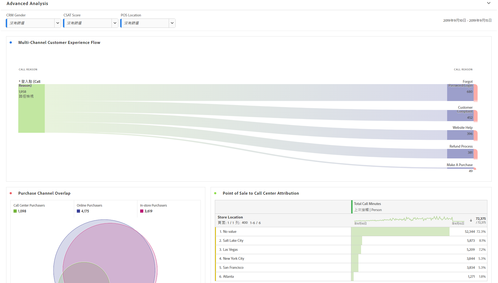
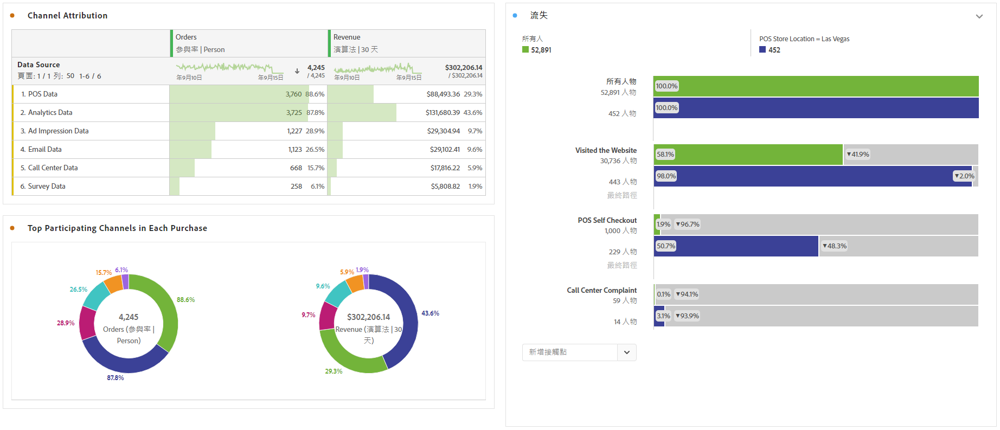

# 執行進階分析

>[!NOTE]
>
>您正在檢視客戶歷程分析中分析工作區的檔案。 其功能集與傳統Adobe Analytics中 [的「分析工作區」略有不同](https://docs.adobe.com/content/help/zh-Hant/analytics/analyze/analysis-workspace/home.html)。 [更多詳情...](/help/getting-started/cja-aa.md)

進階分析運用 [Flow](/help/analysis-workspace/visualizations/c-flow/flow.md) draims、 [Flow IQ](/help/analysis-workspace/attribution/overview.md)、Fallout [draims和維劃分](/help/analysis-workspace/visualizations/fallout/fallout-flow.md)等功能。

