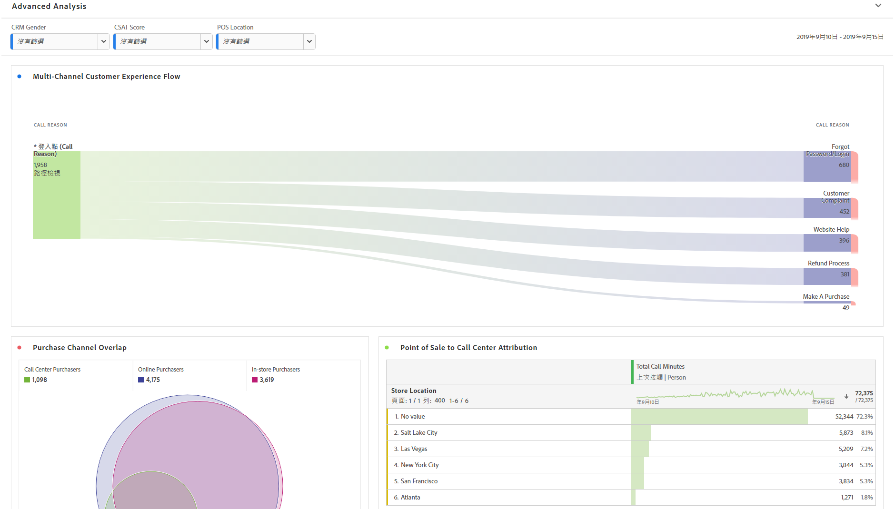
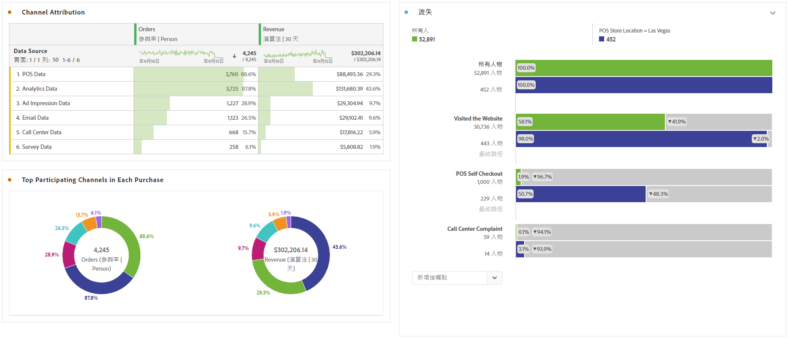

# 執行進階分析

在開始建置進階分析報告和視覺效果之前 (如下所述)，請確保您了解 [基礎分析](/help/analysis-workspace/perform-basic-analysis.md)。

進階分析會運用[流量](/help/analysis-workspace/visualizations/c-flow/flow.md)圖、[歸因](/help/analysis-workspace/c-panels/attribution.md)、[流失](/help/analysis-workspace/visualizations/fallout/fallout-flow.md)圖和[維度劃分](/help/components/dimensions/t-breakdown-fa.md)等功能。

