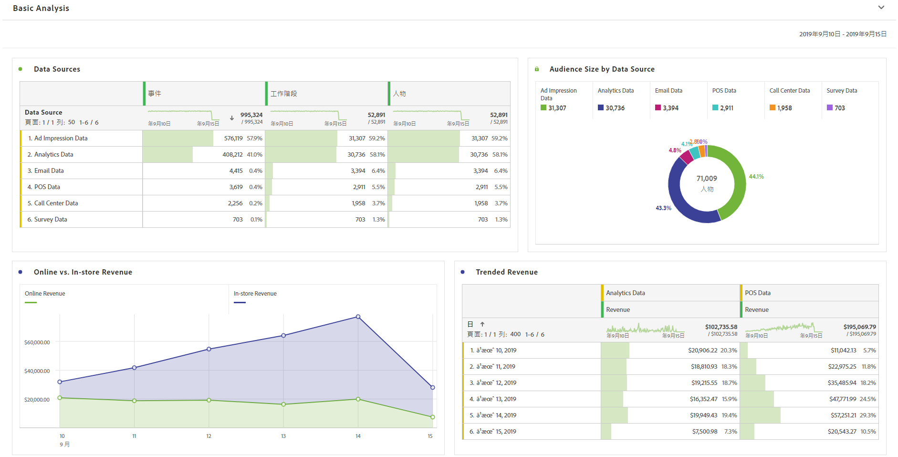
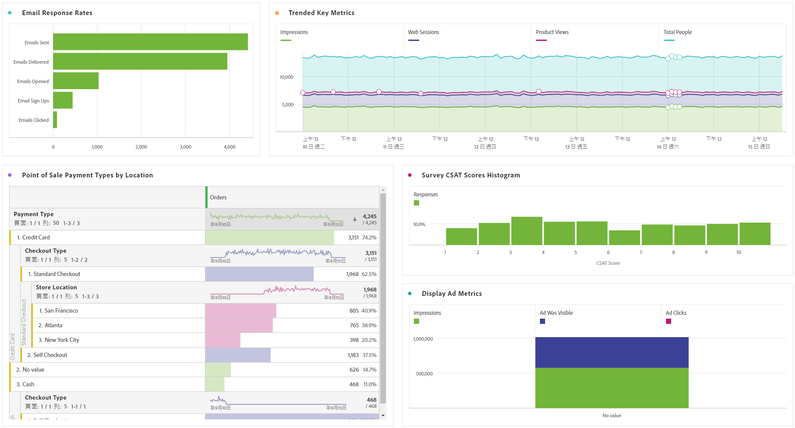

# 執行基本分析

>[!NOTE]
>
>您正在檢視 Customer Journey Analytics 中 Analysis Workspace 的相關文件，其功能集與傳統 Adobe Analytics 中的 [Analysis Workspace 略有不同](https://experienceleague.adobe.com/docs/analytics/analyze/analysis-workspace/home.html?lang=zh-Hant)。[深入了解...](/help/getting-started/cja-aa.md)

建立連線和資料檢視後，使用 Analysis Workspace 的強大功能與彈性來分析您所匯入的資料。您可以嘗試拖曳維度和量度，以及變更維度和量度歸因設定、好記的名稱、時區、工作階段設定等項目。

以下是工作區中基本視覺效果的範例。例如，您可以

* 建立排名報表，列出顯示最多事件、工作階段和人員的資料來源。

* 建立線上與店內收入的趨勢報表，比較兩個資料來源隨時間的變化。

* 依資料來源描繪對象大小，例如廣告曝光資料、Customer Journey Analytics資料、電子郵件資料、POS資料、客服中心資料和調查資料。

