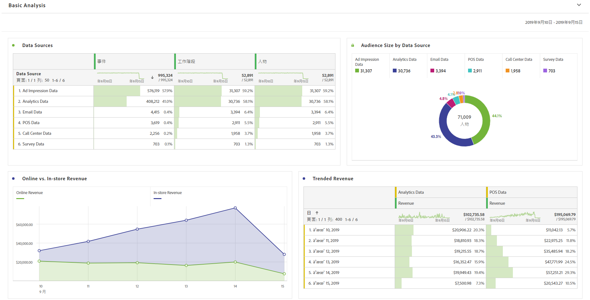
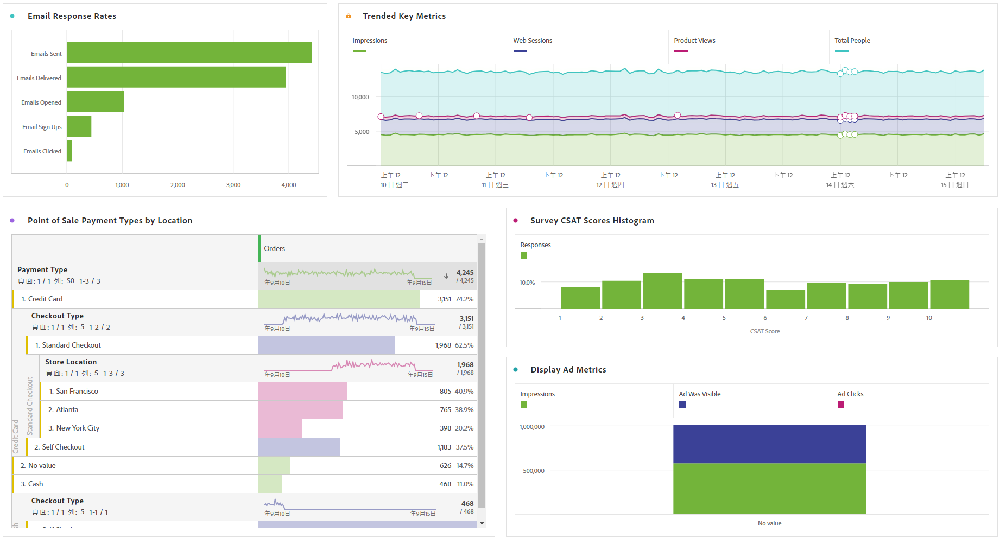

# 執行基本分析

Customer Journey Analytics 可讓您利用 Analysis Workspace 的強大功能和靈活性來分析資料。

>[!TIP]
>
>如果 Analysis Workspace 中沒有可用資料，請確保您依照[資料擷取程序](/help/data-ingestion/data-ingestion.md)進行，其中包括以下程序：<ul><li>[建立連線](/help/connections/create-connection.md#create-and-configure-the-connection)  確保連線設定為匯入新資料、回填資料或兩者。</li><li>[新增資料集](/help/connections/create-connection.md#add-and-configure-datasets)</li><li>[建立資料視圖](/help/data-views/create-dataview.md)</li></ul>

您可以嘗試拖曳維度和量度，以及變更維度和量度歸因設定、好記的名稱、時區、工作階段設定等項目。

以下是 Workspace 中基本視覺效果的範例。 例如，您可以

* 建立排名報表，列出顯示最多事件、工作階段和人員的資料來源。

* 建立線上與店內收入的趨勢報表，比較兩個資料來源隨時間的變化。

* 依資料來源描繪客群大小，例如廣告曝光資料、Customer Journey Analytics 資料、電子郵件資料、POS 資料、客服中心資料和調查資料。

