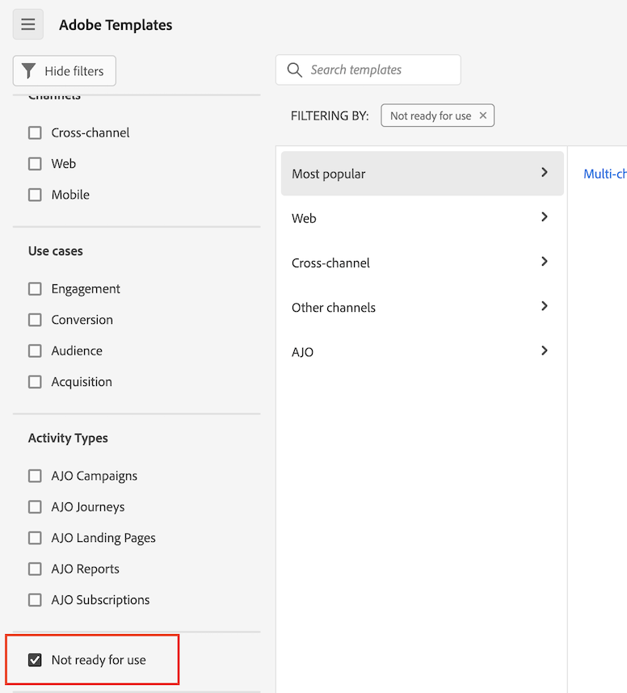

# 建立和管理範本

管理員可以建立範本並儲存，以供登入公司的其他人使用。

登入公司中的人員可以使用[使用範本](/help/analysis-workspace/templates/use-templates.md)中所述的這些公司範本。

## 建立範本

若要建立可供登入公司人員使用的新範本：

1. 在Analysis Workspace中，將專案建置為您想要的狀態。

1. 選取&#x200B;[!UICONTROL **專案**] > **[!UICONTROL 另存為範本……]**。

   

1. 在[!UICONTROL 另存為範本]對話方塊中指定下列資訊：

   | 欄位 | 說明 |
   |---------|----------|
   | **[!UICONTROL 名稱]** | 提供範本的描述性名稱。 |
   | **[!UICONTROL 說明]** | 提供範本的簡短說明，以說明其預期用途。 |
   | **[!UICONTROL 為何使用此範本]** | 提供簡短說明，告知組織內人員可如何使用此範本。 此說明會顯示在範本的「預覽」頁面上。 |
   | **[!UICONTROL 頻道]** | 選擇任何適用於此範本的適用管道。 您可以選取多個管道： **[!UICONTROL 網頁]**、**[!UICONTROL 行動裝置]**、**[!UICONTROL 跨管道]**、**[!UICONTROL 客服中心]**&#x200B;以及&#x200B;**[!UICONTROL 店內]**。
您選擇的選項決定顯示範本的位置，以及哪些篩選器適用於從「組織範本」頁面存取範本的使用者。
 |
   | **[!UICONTROL 使用案例]** | 選擇適用於此範本的任何使用案例。 您可以選取多個使用案例： **[!UICONTROL 參與]**、**[!UICONTROL 轉換]**、**[!UICONTROL 對象]**、**[!UICONTROL 贏取]**&#x200B;以及&#x200B;**[!UICONTROL Journey Optimizer]**。 
您選擇的選項會決定「組織範本」頁面上的範本位置。 使用者可瀏覽至範本，或依使用案例篩選清單。 

**注意：** **[!UICONTROL Journey Optimizer]**&#x200B;選項只有在您在Customer Journey Analytics中使用的資料檢視中存在Journey Optimizer資料時才可用。 選擇&#x200B;**[!UICONTROL Journey Optimizer]**&#x200B;讓範本可以在Adobe Journey Optimizer中使用。 在Journey Optimizer中，**[!UICONTROL 報表]**&#x200B;頁面上會有下拉式功能表，可讓使用者選取此範本或預設範本。 如需詳細資訊，請參閱Journey Optimizer檔案中的[開始使用更新的報告體驗](https://experienceleague.adobe.com/zh-hant/docs/journey-optimizer/using/reporting/channel-report/report-gs-cja)。 |
   | **[!UICONTROL Journey Optimizer活動型別]** | 選擇要與此範本關聯的Journey Optimizer活動型別： **[!UICONTROL 行銷活動]**、**[!UICONTROL 歷程]**、**[!UICONTROL 登陸頁面]**、**[!UICONTROL 報表]**&#x200B;或&#x200B;**[!UICONTROL 訂閱]**。 
如果您希望此範本與所有活動型別相關聯，請將此欄位留空。

只有在&#x200B;**[!UICONTROL 使用案例]**&#x200B;欄位中選取&#x200B;**[!UICONTROL Journey Optimizer]**&#x200B;時，才會顯示此欄位。
 |
   | **[!UICONTROL Journey Optimizer活動]** | 選擇要與此範本建立關聯的Journey Optimizer活動。 
如果您希望此範本與所選活動型別的所有活動相關聯，請將此欄位留空。

只有在&#x200B;**[!UICONTROL 使用案例]**&#x200B;欄位中選取&#x200B;**[!UICONTROL Journey Optimizer]**&#x200B;時，才會顯示此欄位。
 |
   | **[!UICONTROL 標記]** | 指定您要套用至範本的任何標籤。 人員可依您新增的標籤來篩選範本清單。 |

1. 選取&#x200B;[!UICONTROL **另存為範本**]。

如需使用者如何根據範本建立專案的詳細資訊，請參閱[使用範本](/help/analysis-workspace/templates/use-templates.md)中的[根據範本建立專案](/help/analysis-workspace/templates/use-templates.md#create-a-project-based-on-a-template)。

## 編輯或刪除範本

管理員可以編輯或刪除公司範本。

1. 在Analysis Workspace中，選取&#x200B;[!UICONTROL **Workspace**]&#x200B;索引標籤，然後在左側邊欄的&#x200B;**[!UICONTROL 範本]**&#x200B;下選取&#x200B;**[!UICONTROL _登入公司名稱&#x200B;_範本]**。

1. 如果您在資料行檢視中檢視範本：

   1. 前往您要編輯或刪除的範本，選取範本名稱旁的資訊圖示。

      

   1. 選取&#x200B;**[!UICONTROL 預覽]**。

   1. 選取「更多」圖示，然後選取&#x200B;**[!UICONTROL 編輯]**&#x200B;或&#x200B;**[!UICONTROL 刪除]**。

      

1. 如果您正在卡片檢視中檢視範本：

   1. 找到您要編輯或刪除的範本。

      

   1. 將滑鼠停留在範本上，然後選取&#x200B;**[!UICONTROL 預覽]**。

   1. 選取「更多」圖示，然後選取&#x200B;**[!UICONTROL 編輯]**&#x200B;或&#x200B;**[!UICONTROL 刪除]**。

      

1. 如果您正在編輯範本，請進行任何需要的編輯，然後選取&#x200B;[!UICONTROL **專案**] > **[!UICONTROL 另存為範本……]**。

   

1. 在[!UICONTROL 另存為範本]對話方塊中指定下列資訊：

   | 欄位 | 說明 |
   |---------|----------|
   | **[!UICONTROL 名稱]** | 提供範本的描述性名稱。 |
   | **[!UICONTROL 說明]** | 提供範本的簡短說明，以說明其預期用途。 |
   | **[!UICONTROL 為何使用此範本]** | 提供簡短說明，告知組織內人員可如何使用此範本。 此說明會顯示在範本的「預覽」頁面上。 |
   | **[!UICONTROL 頻道]** | 選擇任何適用於此範本的適用管道。 您可以選取多個管道： **[!UICONTROL 網頁]**、**[!UICONTROL 行動裝置]**、**[!UICONTROL 跨管道]**、**[!UICONTROL 客服中心]**&#x200B;以及&#x200B;**[!UICONTROL 店內]**。 如果未選取任何管道，則範本會包含在所有管道中。
您選擇的選項決定顯示範本的位置，以及哪些篩選器適用於從「組織範本」頁面存取範本的使用者。
 |
   | **[!UICONTROL 使用案例]** | 選擇適用於此範本的任何使用案例。 您可以選取多個使用案例： **[!UICONTROL 參與]**、**[!UICONTROL 轉換]**、**[!UICONTROL 對象]**、**[!UICONTROL 贏取]**&#x200B;以及&#x200B;**[!UICONTROL Journey Optimizer]**。 
您選擇的選項會決定「組織範本」頁面上的範本位置。 使用者可瀏覽至範本，或依使用案例篩選清單。 

**注意：**&#x200B;選擇&#x200B;**[!UICONTROL Journey Optimizer]**&#x200B;也會在Adobe Journey Optimizer中提供範本。 在Journey Optimizer中，**[!UICONTROL 報表]**&#x200B;頁面上有一個下拉式功能表，可讓使用者選取此範本或預設範本。 如需詳細資訊，請參閱Journey Optimizer檔案中的[開始使用更新的報告體驗](https://experienceleague.adobe.com/zh-hant/docs/journey-optimizer/using/reporting/channel-report/report-gs-cja)。 |
   | **[!UICONTROL Journey Optimizer活動型別]** | 選擇要與此範本關聯的Journey Optimizer活動型別： **[!UICONTROL 行銷活動]**、**[!UICONTROL 歷程]**、**[!UICONTROL 登陸頁面]**、**[!UICONTROL 報表]**&#x200B;或&#x200B;**[!UICONTROL 訂閱]**。 
如果您希望此範本與所有活動型別相關聯，請將此欄位留空。

只有在&#x200B;**[!UICONTROL 使用案例]**&#x200B;欄位中選取&#x200B;**[!UICONTROL Journey Optimizer]**&#x200B;時，才會顯示此欄位。
 |
   | **[!UICONTROL Journey Optimizer活動]** | 選擇要與此範本建立關聯的Journey Optimizer活動。 
如果您希望此範本與所選活動型別的所有活動相關聯，請將此欄位留空。

只有在&#x200B;**[!UICONTROL 使用案例]**&#x200B;欄位中選取&#x200B;**[!UICONTROL Journey Optimizer]**&#x200B;時，才會顯示此欄位。
 |
   | **[!UICONTROL 標記]** | 指定您要套用至範本的任何標籤。 人員可依您新增的標籤來篩選範本清單。 |

1. 選取&#x200B;[!UICONTROL **另存為範本**]。

## 重新命名、標籤或核准範本

管理員可以重新命名、標籤及核准公司範本。

1. 在Analysis Workspace中，選取&#x200B;[!UICONTROL **Workspace**]&#x200B;標籤，然後在左側邊欄中選取&#x200B;**[!UICONTROL 專案標籤]**。

1. 選取篩選圖示以篩選專案清單。

1. 在篩選器邊欄中，選取&#x200B;**其他篩選器**，然後選取&#x200B;**公司範本**。

   此時會顯示公司範本的清單。 除非已釘選，否則不會顯示所有的一般專案。

   公司範本可由範本名稱前面的識別。

   

1. 按一下範本旁的&#x200B;**...**&#x200B;省略圖示以檢視可用的選項。

   

1. 選取「**[!UICONTROL 重新命名]**」、「**[!UICONTROL 標籤]**」或「**[!UICONTROL 核准]**」。

   您也可以刪除範本，或者可以按照[編輯或刪除範本](#edit-or-delete-templates)中的說明刪除範本。

1. （選擇性）若要返回一般檢視，請在篩選邊欄中取消選取&#x200B;**[!UICONTROL 公司範本]**。

## 將缺少的元件新增至指定範本的資料檢視

根據預設，Adobe提供的某些範本無法使用，因為它們包含不在資料檢視中的元件。

對於每一個遺失的元件，您的資料檢視中都有相符的內容標籤。 您需要將相符的內容標籤新增到資料檢視中已存在的元件，或者您需要將新的元件新增到資料檢視並將內容標籤新增到其中。

若要將缺少的元件新增至範本：

1. 在Analysis Workspace中，選取&#x200B;[!UICONTROL **Workspace**]&#x200B;索引標籤，然後在左側邊欄的&#x200B;**[!UICONTROL 範本]**&#x200B;下，選取&#x200B;**[!UICONTROL Adobe範本]**。

1. 選取篩選圖示以篩選範本清單。

1. 選取「**[!UICONTROL 未就緒]**」以顯示需要不在資料檢視中的元件的範本。

   

1. 找出尚未準備好搭配資料檢視使用的範本。

1. 執行下列任一項作業：

   * **如果您正在資料行檢視中檢視範本** ：

      1. 前往尚未準備好搭配資料檢視使用的範本，然後選取範本名稱旁邊的資訊圖示。

         

      1. 選取&#x200B;**[!UICONTROL 預覽]**。

         

   * **如果您正在卡片檢視中檢視範本** ：

      1. 找出尚未準備好搭配資料檢視使用的範本。

         

      1. 將滑鼠停留在範本上，然後選取&#x200B;**[!UICONTROL 預覽]**。

         

1. 在&#x200B;**[!UICONTROL 缺少的元件]**&#x200B;區段中，會顯示資料檢視中缺少的元件清單。 選取&#x200B;**[!UICONTROL 將這些元件新增至您的資料檢視]**。

   資料檢視的設定頁面會顯示在新的標籤中。

1. 選取資料檢視的&#x200B;**[!UICONTROL 元件]**&#x200B;標籤。

   

1. 針對範本中列為遺失的每個元件，請在&#x200B;**[!UICONTROL 元件]**&#x200B;標籤上執行下列其中一項作業：

   * 在&#x200B;**[!UICONTROL 包含的元件]**&#x200B;區段中，選取資料檢視中已包含的元件，您要用於遺失的元件。

   * 將新元件新增至您要用於遺失元件的資料檢視，然後選取元件。

     若要新增元件至資料檢視，請搜尋結構描述欄位清單，然後將其拖曳至&#x200B;**[!UICONTROL 包含的元件]**&#x200B;區段。

1. 選取元件後，找到右欄中的&#x200B;**[!UICONTROL 內容標籤]**&#x200B;下拉式功能表。

   

1. 在&#x200B;**[!UICONTROL 內容標籤]**&#x200B;下拉式功能表中，選取與遺失元件同名的內容標籤。

1. 選取&#x200B;**[!UICONTROL 「儲存並繼續」]**。

1. 針對每個遺失的元件，重複將相符的內容標籤新增至資料檢視中元件的程式。

## 存取公司範本

就像Adobe提供的範本一樣，組織中的使用者可以存取管理員建立的範本。

如需有關如何存取公司範本的資訊，請參閱[使用範本](/help/analysis-workspace/templates/use-templates.md)中的[存取並執行範本](/help/analysis-workspace/templates/use-templates.md#access-and-run-a-template)。
