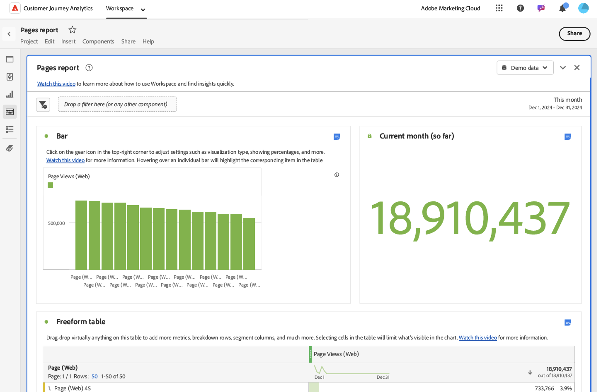

# 使用範本

Analysis Workspace 中的範本 (或公司範本) 提供最常見的報告情境之快速深入分析。以下範例是您可以使用範例回答的問題：

* 多少訪客瀏覽您的網站
* 多少訪客是獨特訪客 (僅計算一次)
* 他們如何來到站點 (例如跟隨連結到達站點，或直接到達)
* 搜尋站點內容時所用的關鍵字
* 在指定網頁或整個站點上逗留的時間
* 訪客點按的連結，以及離開網站的時間
* 產生收入或轉換事件的最有效行銷管道
* 訪客花費在觀看視訊的時間
* 他們用來造訪網站的瀏覽器和裝置

以下資訊說明如何從 Analysis Workspace 中的「[!UICONTROL 範本]」標籤存取和使用範本。

## 存取並執行範本

1. 在 Analysis Workspace 中，選取「[!UICONTROL **工作區**]」標籤。

   

1. 在「[!UICONTROL **範本**]」部分中，選取下列其中一個索引標籤：

   * **[!UICONTROL Adobe 範本]**：顯示 Adob&#x200B;&#x200B;e 提供的所有範本。

   * **[!UICONTROL _login_company_name _範本]**：顯示為您組織建立的所有公司範本。

     只有管&#x200B;&#x200B;理員可以建立公司範本。若要了解如何建立公司範本，請參閱「[建立和管理範本](/help/analysis-workspace/templates/create-templates.md)」。

1. 使用以下任一個選項來變更檢視可用範本的方式：

   * 透過選取欄視圖  或卡片視圖的圖示，來選擇要在欄視圖或卡片視圖中檢視範本。

   * 使用卡片視圖的時，請從以下排序順序中選擇：**[!UICONTROL 最近使用]**、**[!UICONTROL 最受歡迎]**、**[!UICONTROL 英文字母]**、**[!UICONTROL 類別]**。

1. 在搜尋欄位中，開始輸入要尋找範本的名稱，然後從範本清單中選取。

   或

   選取要查看的範本類別，然後從範本清單中選取範本。

   >[!TIP]
   >
   >若要使用方向鍵瀏覽選單，請按正斜線鍵 (/)，然後按向下鍵。按 Enter 鍵載入所選範本。

   有關可用範本的清單，請參閱下方的[可用範本](#available-templates)區段。

1. (選項) 您可以查看包含資料檢視中不適用元件的範本。(依預設，只有在範本使用資料檢視中可用的元件時，這些範本才會顯示。)

   >[!NOTE]
   >
   >在使用這些範本之前，管理員必須先將這些缺失元件所需的內容標籤新增至資料檢視。如需詳細資訊，請參閱[將缺少的元件新增至特定範本的資料檢視](/help/analysis-workspace/templates/create-templates.md#add-missing-components-to-the-data-view-for-a-given-template) (在[使用範本](/help/analysis-workspace/templates/create-templates.md)一文中)。
   >
   >如需有關內容標籤的詳細資訊，請參閱[元件設定](/help/data-views/component-settings/overview.md)。

   1. 選取區段圖示。

   1. 選取「**[!UICONTROL 未準備好供使用]**」，顯示需要附加元件的範本。

      

1. 選取範本以根據您選擇的範本來建立報告。

1. (有條件) 如果範本包含資料檢視中不適用的元件，則會顯示不相容的資料檢視對話框，內容指資料檢視與範本不相容，並且顯示缺少哪些元件。

   進行下列一項：

   * 在「**[!UICONTROL 變更資料檢視]**」下拉式選單中，選擇不同的資料檢視。

   * 選取「**[!UICONTROL 繼續進行]**」，查看缺少元件的範本。

## 根據範本建立專案 {#use-reports}

範本也許不完全符合您的需求，但是可以接近您的需求。在這些情況下，您可以使用範本作為專案的起點，然後對範本進行自訂以最適合您的特定目的。

如果您在變更範本後要離開並瀏覽其他頁面，系統會提示您儲存或捨棄變更。儲存範本的變更會將範本另存為新專案。

若要自訂範本並將其儲存為專案：

1. 在 Customer Journey Analytics 中，選取 [!UICONTROL **Workspace**] 索引標籤。

1. 選取「[!UICONTROL **範本**]」索引標籤。

1. 選取想要查看的範本。 例如，在「[!UICONTROL **最常用**]」底下，選取「[!UICONTROL **頁面**]」範本。

   「頁面」範本 (如 Analysis Workspace 中所顯示) 會顯示兩種[視覺效果](/help/analysis-workspace/visualizations/freeform-analysis-visualizations.md) ([橫條圖](/help/analysis-workspace/visualizations/bar.md)和[摘要數字](/help/analysis-workspace/visualizations/summary-number-change.md)) 和一個[自由表格](/help/analysis-workspace/visualizations/freeform-table/freeform-table.md)。使用的量度為發生次數。

   <!--update screenshot. The following is AA -->

   

1. 執行以下任一操作：

   * 檢視範本。
   * 將一或多個區段拖曳到頂部的「區段」放置區。例如，拖曳「[!UICONTROL **Mobile 客戶**]」區段，然後檢視結果。
   * 前往右上方的行事暦，變更日期範圍。
   * 新增維度劃分、在其他量度中拖曳，且通常會根據您的需求自訂範本。

1. (選用) 選取「[!UICONTROL **專案**]」>「[!UICONTROL **儲存**]」，將範本另存為專案。

   該範本會另存為新專案，而不會修改現有的範本。有關儲存專案的詳細資訊，請參閱「[儲存專案](/help/analysis-workspace/build-workspace-project/save-projects.md)」。

## 可用的範本

若要存取所有可用的預先建立範本：

1. 在 Adob&#x200B;&#x200B;e Analytics 中，選取 [!UICONTROL **Workspace**] 索引標籤，然後選取「[!UICONTROL **範本**]」索引標籤。

   預先建立範本會按類別整理排列。

   <!--add screenshot-->

1. 選擇一個類別來查看其中的範本。

   以下區段對應於適用類別，並提供有關每個範本的資訊。

   * **[[!UICONTROL 最熱門]](#most-popular)**

   * 「**[[!UICONTROL 網頁]」** > **「[!UICONTROL 參與度]](#engagement)**」

   * 「**[[!UICONTROL 網頁]」** > **「[!UICONTROL 轉換]](#web-conversion)**」

   * 「**[[!UICONTROL 網頁]」** > **「[!UICONTROL 客群]](#web-audience)**」

   * 「**[[!UICONTROL 網頁]」** > **「[!UICONTROL 贏取]](#web-acquisition)**」

   * 「**[[!UICONTROL 行動]」** > **「[!UICONTROL 行動應用程式]](#mobile-mobile-app)**」

   * 「**[[!UICONTROL 行動]」** > **備[!UICONTROL 行動裝置資訊]](#mobile-mobile-device-information)**」

   * **[[!UICONTROL 時間分割]](#time-parting)**

   * **[[!UICONTROL 跨管道]](#cross-channel)**

   * **[[!UICONTROL 其他管道]](#other-channels)**

   * **[[!UICONTROL AJO]](#ajo)**

### 最受歡迎 {#most-popular}

<!--AA only-->

<!-- markdownlint-disable MD034 -->

>[!CONTEXTUALHELP]
>id="aa-template--unitsOvertimeReport"
>title="檢視所有訂單中購買的單位總數。會顯示一段期間內的資料，並與先前的時段進行比較。"
>abstract="**這可以幫助您**&#x200B;更加了解單位銷售量隨時間增加或減少的情況。您可以套用區段來了解哪些客戶或地區購買的單位最多，以及這些單位銷售量隨時間呈現的趨勢分析。 **根據您所了解的內容，您可以**&#x200B;採取各種行動，例如比較行銷活動發起前與發起後的單位銷售量，評估最近發起之行銷活動的成效。或者您可以比較逐年的假期期間單位銷售量。 此範本使用「日」維度和「單位」量度。"

<!-- markdownlint-enable MD034 -->

<!--both AA and CJA-->

<!-- markdownlint-disable MD034 -->

>[!CONTEXTUALHELP]
>id="template--training"
>title="培訓教學課程範本"
>abstract="了解常見的 Analysis Workspace 術語，及建置首次分析所需的步驟。"

<!-- markdownlint-enable MD034 -->

<!-- markdownlint-disable MD034 -->

>[!CONTEXTUALHELP]
>id="template--pagesRankedReport"
>title="找出最受歡迎和最不受歡迎頁面。"
>abstract="**這可以幫助您**&#x200B;更加了解您的客群，以及他們最感興趣的資訊類型。 **根據您所了解的內容，您可以**&#x200B;採取各種行動，例如調整頁面中繼資料來提高瀏覽數較少之頁面的可見度，或花時間改善瀏覽數最多之頁面的內容。 此範本使用頁面維度和頁面瀏覽數量度。"

<!-- markdownlint-enable MD034 -->

<!-- markdownlint-disable MD034 -->

>[!CONTEXTUALHELP]
>id="template--pageViewsOvertimeReport"
>title="檢視頁面總瀏覽數。會顯示一段期間內的資料，並與先前的期間進行比較。 "
>abstract="**這可以幫助您**&#x200B;更加了解網站上的流量隨時間可能增加或減少的情況。 **根據您所了解的內容，您可以**&#x200B;採取各種行動，例如比較行銷活動發起前與發起後的網站流量，評估最近發起之行銷活動的成效。或者您可以比較逐年的假期流量。 此範本使用日維度和頁面瀏覽數量度。"

<!-- markdownlint-enable MD034 -->

<!-- markdownlint-disable MD034 -->

>[!CONTEXTUALHELP]
>id="template--visitsOvertimeReport"
>title="檢視造訪總次數。會顯示一段期間內的資料，並與先前的期間進行比較。"
>abstract="**這可以幫助您**&#x200B;更加了解網站上的流量隨時間可能增加或減少的情況。 **根據您所了解的內容，您可以**&#x200B;採取各種行動，例如比較行銷活動發起前與發起後的網站流量，評估最近發起之行銷活動的成效。或者您可以比較逐年的假期流量。 此範本使用日維度和造訪次數量度。"

<!-- markdownlint-enable MD034 -->

<!-- markdownlint-disable MD034 -->

>[!CONTEXTUALHELP]
>id="template--visitorsOvertimeReport"
>title="檢視不重複訪客總數。會顯示一段期間內的資料，並與先前的期間進行比較。 "
>abstract="**這可以幫助您**&#x200B;更加了解網站的觸及範圍和客群規模，隨時間或與先前時期相比增加或減少的情況。 **根據您所了解的內容，您可以**&#x200B;採取各種行動，例如比較行銷活動發起前和發起後的不重複訪客，評估最近發起之行銷活動是否成功吸引新使用者造訪網站。或者您可以比較逐年的假期期間造訪網站的人數。 此範本使用日維度和不重複訪客量度。 "

<!-- markdownlint-enable MD034 -->

<!-- markdownlint-disable MD034 -->

>[!CONTEXTUALHELP]
>id="template--keyMetricsReport"
>title="檢視以並排方式顯示頁面瀏覽數、造訪次數與不重複訪客量度的報告。會顯示一段期間內的資料，並與先前的期間進行比較。"
>abstract="**這可以幫助您**&#x200B;比較這些重要量度，更全面地了解造訪網站的不重複訪客數量、頁面造訪次數，以及工作階段數量。 **根據您所了解的內容，您可以**&#x200B;採取各種行動，例如評估每個人在特定一週或一個月內於造訪網站時檢視的頁面平均數量，以及在一年中的特定時期或行銷活動展開前與展開後的變化情況。 此範本使用日維度、頁面瀏覽數量度、造訪次數量度，和不重複訪客量度。"

<!-- markdownlint-enable MD034 -->

<!-- markdownlint-disable MD034 -->

>[!CONTEXTUALHELP]
>id="template--siteSectionRankedReport"
>title="檢視您網站上最受歡迎或績效最好的區段。"
>abstract="**這可以幫助您**&#x200B;更加了解使用者最常造訪網站的哪些區段。 **根據您所了解的內容，您可以**&#x200B;採取各種行動，例如評估您提供的哪些產品或服務最能引起人們興趣。 此範本使用網站區段維度和造訪次數量度。"

<!-- markdownlint-enable MD034 -->

<!-- markdownlint-disable MD034 -->

>[!CONTEXTUALHELP]
>id="template--next-page-report"
>title="檢視人們在造訪特定頁面之後最常去的地方。"
>abstract="**這可以幫助您** 更了解使用者造訪特定頁面後的行為。 **根據您所了解的內容，您可以**&#x200B;採取各種行動，例如評估是否能夠將頁面設計或版面最佳化，引導人們前往更理想的頁面，例如購買或留下評論的頁面。 此範本使用「頁面」維度和「事件」量度。"

<!-- markdownlint-enable MD034 -->

<!-- markdownlint-disable MD034 -->

>[!CONTEXTUALHELP]
>id="template--previous-page-report"
>title="檢視人們在造訪特定頁面之前最常去的地方。"
>abstract="**這可以幫助您**&#x200B;更了解哪些頁面會將最多流量引導至特定頁面。 **根據您所了解的內容，您可以**&#x200B;採取各種行動，例如評估未顯示為先前頁面的頁面，與目前頁面之間的連結是否需要更醒目。"

<!-- markdownlint-enable MD034 -->

<!-- markdownlint-disable MD034 -->

>[!CONTEXTUALHELP]
>id="template--campaignRankedReport"
>title="檢視將流量導向您的網站效果最好的連結。"
>abstract="**這可以幫助您**&#x200B;更加了解在造訪您的網站時，哪些追蹤程式碼 (以及與其相關的連結) 最常被使用。 **根據您所了解的內容，您可以**&#x200B;採取各種行動，例如針對在網站上新增連結的位置調整相關策略。 此範本使用追蹤程式碼維度和造訪次數量度。"

<!-- markdownlint-enable MD034 -->

<!-- markdownlint-disable MD034 -->

>[!CONTEXTUALHELP]
>id="template--productsRankedReport"
>title="按照產品檢視訂單數目。會顯示一段期間內的資料。"
>abstract="**這可以幫助您**&#x200B;了解哪些產品的需求量最高或最低。 **根據您所了解的內容，您可以**&#x200B;採取各種行動，例如調整您的行銷策略推銷高績效產品，或是改善或停止績效不佳的產品。您也可以根據資料分析來調整產品庫存。 此範本使用產品維度和訂單量度。"

<!-- markdownlint-enable MD034 -->

<!-- markdownlint-disable MD034 -->

>[!CONTEXTUALHELP]
>id="template--lastTouchChannelRankedReport"
>title="檢視訪客在參與期間 (預設為 30 天) 符合的最新行銷管道。"
>abstract="**這可以幫助您**&#x200B;了解哪些行銷管道最能有效地吸引人們造訪您的網站並成功轉換為客戶。 **根據您所了解的內容，您可以**&#x200B;採取各種行動，例如分配更多資源給績效好的管道，或分配較少資源給績效不佳的管道。 此範本使用上次接觸管道維度和不重複訪客量度。"

<!-- markdownlint-enable MD034 -->

<!-- markdownlint-disable MD034 -->

>[!CONTEXTUALHELP]
>id="template--lastTouchChannelDetailRankedReport"
>title="檢視訪客在參與期間 (預設為 30 天) 符合的最新行銷管道的詳細資訊。"
>abstract="**這不僅有助於您**&#x200B;了解哪些行銷管道最能有效地吸引人們造訪您的網站並成功轉換為客戶，還可以了解這些行銷管道的詳細資訊。例如，當訪客進入您的網站，並找到相符的「付費搜尋」行銷管道時，您可以使用管道詳細資料來瞭解他們使用了哪個搜尋引擎，或搜尋了哪個關鍵字。 **根據您所了解的內容，您可以**&#x200B;採取各種行動，例如分配更多資源給績效好的管道，或分配較少資源給績效不佳的管道。 此範本使用上次接觸管道詳細資料維度和不重複訪客量度。 "

<!-- markdownlint-enable MD034 -->

<!-- markdownlint-disable MD034 -->

>[!CONTEXTUALHELP]
>id="template--revenueOvertimeReport"
>title="檢視所有訂單中所購買產品的金額。會顯示一段期間內的資料，並與先前的期間進行比較。"
>abstract="**這可以幫助您**&#x200B;了解收入隨時間增加或減少的情況。您可以將這個量度與任何維度結合，以了解哪些維度項目對收入有貢獻。 **根據您所了解的內容，您可以**&#x200B;採取各種行動，例如根據先前的趨勢預測未來的收入。您還可以新增另一個維度，例如追蹤程式碼維度，以了解哪些行銷活動所產生的收入最多。 此範本使用日維度和收入量度。"

<!-- markdownlint-enable MD034 -->

<!-- markdownlint-disable MD034 -->

>[!CONTEXTUALHELP]
>id="template--ordersOvertimeReport"
>title="檢視購買事件總數。會顯示一段期間內的資料，並與先前的期間進行比較。"
>abstract="**這可以幫助您**&#x200B;更加了解人們對您的產品和服務之興趣，隨時間而增加或減少的情況。您可以應用區段來了解哪些客戶或地區的訂單最多，以及這些訂單隨時間所呈現的趨勢。 **根據您所了解的內容，您可以**&#x200B;採取各種行動，例如透過比較行銷活動發起前和發起後的訂單量，評估最近發起之行銷活動的成效。或者您可以比較逐年的假期訂單量。 此範本使用日維度和訂單量度。"

<!-- markdownlint-enable MD034 -->

有以下範本可使用：

| 範本名稱 | 為什麼使用此範本 <!-- What do you do with it? What can it help you learn? and What are the potential actions? --> |
| --- | --- | 
| [!UICONTROL **訓練教學課程**] | 了解常見的 Analysis Workspace 術語，及建置首次分析所需的步驟 |
| [!UICONTROL **頁面**] | <!--duplicated in Engagement section--> 找出最受歡迎和最不受歡迎頁面。 
**這可以幫助您**&#x200B;更加了解您的客群，以及他們最感興趣的資訊類型。

**根據您所了解的內容，您可以**&#x200B;採取各種行動，例如調整頁面中繼資料來提高瀏覽數較少之頁面的可見度，或花時間改善瀏覽數最多之頁面的內容。

此範本使用頁面維度和頁面瀏覽數量度。
 |
| [!UICONTROL **頁面檢視**] | <!--duplicated in Engagement section--> 檢視頁面總瀏覽數。會顯示一段期間內的資料，並與先前的期間進行比較。 
**這可以幫助您**&#x200B;更加了解網站上的流量隨時間可能增加或減少的情況。

**根據您所了解的內容，您可以**&#x200B;採取各種行動，例如比較行銷活動發起前與發起後的網站流量，評估最近發起之行銷活動的成效。或者您可以比較逐年的假期流量。

此範本使用日維度和頁面瀏覽數量度。
 |
| [!UICONTROL **網頁瀏覽次數**] | <!--duplicated in Engagement section--> 檢視造訪總次數。會顯示一段期間內的資料，並與先前的期間進行比較。 
**這可以幫助您**&#x200B;更加了解網站上的流量隨時間可能增加或減少的情況。

**根據您所了解的內容，您可以**&#x200B;採取各種行動，例如比較行銷活動發起前與發起後的網站流量，評估最近發起之行銷活動的成效。或者您可以比較逐年的假期流量。

此範本使用日維度和造訪次數量度。
 |
| [!UICONTROL **網頁瀏覽次數**] | <!--duplicated in Engagement section--> 檢視不重複訪客總數。會顯示一段期間內的資料，並與先前的期間進行比較。 
**這可以幫助您**&#x200B;更加了解網站的觸及範圍和客群規模，隨時間或與先前時期相比增加或減少的情況。

**根據您所了解的內容，您可以**&#x200B;採取各種行動，例如比較行銷活動發起前和發起後的不重複訪客，評估最近發起之行銷活動是否成功吸引新使用者造訪網站。或者您可以比較逐年的假期期間造訪網站的人數。

此範本使用日維度和不重複訪客量度。
 |
| [!UICONTROL **關鍵量度**] | <!--duplicated in Engagement section--> 檢視以並排方式顯示頁面瀏覽數、造訪次數與不重複訪客量度的報告。會顯示一段期間內的資料，並與先前的期間進行比較。 
**這可以幫助您**&#x200B;比較這些重要量度，更全面地了解造訪網站的不重複訪客數量、頁面造訪次數，以及工作階段數量。

**根據您所了解的內容，您可以**&#x200B;採取各種行動，例如評估每個人在特定一週或一個月內於造訪網站時檢視的頁面平均數量，以及在一年中的特定時期或行銷活動展開前與展開後的變化情況。 

此範本使用日維度、頁面瀏覽數量度、造訪次數量度，和不重複訪客量度。
 |
| [!UICONTROL **網站區域**] | 檢視您網站上最受歡迎或績效最好的區段。 
**這可以幫助您**&#x200B;更加了解使用者最常造訪網站的哪些區段。

**根據您所了解的內容，您可以**&#x200B;採取各種行動，例如評估您提供的哪些產品或服務最能引起人們興趣。
 
此範本使用網站區段維度和造訪次數量度。
 |
| [!UICONTROL **下一頁**] | 檢視人們在造訪特定頁面之後最常去的地方。 
**這可以幫助您** 更了解使用者造訪特定頁面後的行為。

**根據您所了解的內容，您可以**&#x200B;採取各種行動，例如評估是否能夠將頁面設計或版面最佳化，引導人們前往更理想的頁面，例如購買或留下評論的頁面。
 
此範本使用「頁面」維度和「事件」量度。
 |
| [!UICONTROL **上一頁**] | 檢視人們在造訪特定頁面之前最常去的地方。 
**這可以幫助您**&#x200B;更了解哪些頁面會將最多流量引導至特定頁面。

**根據您所了解的內容，您可以**&#x200B;採取各種行動，例如評估未顯示為先前頁面的頁面，與目前頁面之間的連結是否需要更醒目。

此範本使用「頁面」維度和「事件」量度。
 |
| [!UICONTROL **追蹤代碼**] | 檢視將流量導向您的網站效果最好的連結。 
**這可以幫助您**&#x200B;更加了解在造訪您的網站時，哪些追蹤程式碼 (以及與其相關的連結) 最常被使用。

**根據您所了解的內容，您可以**&#x200B;採取各種行動，例如針對在網站上新增連結的位置調整相關策略。

此範本使用追蹤程式碼維度和造訪次數量度。
 |
| [!UICONTROL **產品**] | 按照產品檢視訂單數目。會顯示一段期間內的資料。 
**這可以幫助您**&#x200B;了解哪些產品的需求量最高或最低。

**根據您所了解的內容，您可以**&#x200B;採取各種行動，例如調整您的行銷策略推銷高績效產品，或是改善或停止績效不佳的產品。您也可以根據資料分析來調整產品庫存。

此範本使用產品維度和訂單量度。
 |
| [!UICONTROL **上次接觸管道**] | 檢視訪客在參與期間 (預設為 30 天) 符合的最新行銷管道。
**這可以幫助您**&#x200B;了解哪些行銷管道最能有效地吸引人們造訪您的網站並成功轉換為客戶。

**根據您所了解的內容，您可以**&#x200B;採取各種行動，例如分配更多資源給績效好的管道，或分配較少資源給績效不佳的管道。

此範本使用上次接觸管道維度和不重複訪客量度。
 |
| [!UICONTROL **上次接觸管道詳細資料**] | 檢視訪客在參與期間 (預設為 30 天) 符合的最新行銷管道的詳細資訊。
**這不僅有助於您**&#x200B;了解哪些行銷管道最能有效地吸引人們造訪您的網站並成功轉換為客戶，還可以了解這些行銷管道的詳細資訊。例如，當訪客進入您的網站，並找到相符的「付費搜尋」行銷管道時，您可以使用管道詳細資料來瞭解他們使用了哪個搜尋引擎，或搜尋了哪個關鍵字。

**根據您所了解的內容，您可以**&#x200B;採取各種行動，例如分配更多資源給績效好的管道，或分配較少資源給績效不佳的管道。

此範本使用上次接觸管道詳細資料維度和不重複訪客量度。
 |
| [!UICONTROL **收入**] | <!--duplicated in Web Conversion section-->檢視所有訂單中所購買產品的金額。會顯示一段期間內的資料，並與先前的期間進行比較。
**這可以幫助您**&#x200B;了解收入隨時間增加或減少的情況。您可以將這個量度與任何維度結合，以了解哪些維度項目對收入有貢獻。

**根據您所了解的內容，您可以**&#x200B;採取各種行動，例如根據先前的趨勢預測未來的收入。您還可以新增另一個維度，例如追蹤程式碼維度，以了解哪些行銷活動所產生的收入最多。

此範本使用日維度和收入量度。
 |
| [!UICONTROL **訂購**] | <!--duplicated in Web Conversion section-->檢視購買事件總數。會顯示一段期間內的資料，並與先前的期間進行比較。 
**這可以幫助您**&#x200B;更加了解人們對您的產品和服務之興趣，隨時間而增加或減少的情況。您可以應用區段來了解哪些客戶或地區的訂單最多，以及這些訂單隨時間所呈現的趨勢。

**根據您所了解的內容，您可以**&#x200B;採取各種行動，例如透過比較行銷活動發起前和發起後的訂單量，評估最近發起之行銷活動的成效。或者您可以比較逐年的假期訂單量。

此範本使用日維度和訂單量度。
 |

### 網頁：參與度 {#web-engagement}

<!--AA only-->

<!-- markdownlint-disable MD034 -->

>[!CONTEXTUALHELP]
>id="aa-template--real-time"
>title="檢視目前在您的網站上收集的維度和量度。"
>abstract="**這可以幫助您**&#x200B;更了解您網站的趨勢。 **根據您所了解的內容，您可以**&#x200B;採取各種行動，例如回應並主動管理目前行銷內容和行銷活動的成效。"

<!-- markdownlint-enable MD034 -->

<!-- markdownlint-disable MD034 -->

>[!CONTEXTUALHELP]
>id="aa-template--timeSpentVisitOvertimeReport"
>title="檢視訪客每次造訪期間平均在您網站上逗留的時間。會顯示一段期間內的資料，並與先前的時段進行比較。"
>abstract="**這可以幫助您**&#x200B;更加了解訪客參與度以及訪客在網站上逗留的時間。 **根據您所了解的內容，您可以**&#x200B;採取各種行動，例如評估網站的變更是否會讓訪客在網站上停留更長時間。 此範本使用「日」維度和「每次造訪逗留時間 (秒)」量度。"

<!-- markdownlint-enable MD034 -->

<!-- markdownlint-disable MD034 -->

>[!CONTEXTUALHELP]
>id="aa-template--timePriorRankedReport"
>title="檢視使用者在成功事件之前的平均逗留時間。"
>abstract="**這可以幫助您**&#x200B;更加了解訪客執行其所需動作 (例如進行購買) 所花的時間。 **根據您所了解的內容，您可以**&#x200B;採取各種行動，例如評估網站的變更是否讓訪客更能夠快速達到成功事件。 此範本使用「事件之前時間」維度和「不重複訪客」量度。"

<!-- markdownlint-enable MD034 -->

<!-- markdownlint-disable MD034 -->

>[!CONTEXTUALHELP]
>id="aa-template--falloutReport"
>title="檢視在一系列預先定義的連續頁面中，訪客在哪個位置離開和繼續通過。"
>abstract="**這可以幫助您**&#x200B;更加了解人們在使用者歷程中的哪些位置流失。 **根據您所了解的內容，您可以**&#x200B;採取各種行動，例如透過網站上的特定流程 (像是購買或註冊流程) 分析轉換率，或分析網站上事件之間的關聯。(例如，查看您的隱私權原則並繼續購買產品的人所佔的百分比)。您也可以使用此範本，在同一份報表中執行兩個不同區段的並排比較。 此範本使用「流失」視覺效果。"

<!-- markdownlint-enable MD034 -->

<!-- markdownlint-disable MD034 -->

>[!CONTEXTUALHELP]
>id="aa-template--cross-device-analysis"
>title="檢視訪客在歷程的所有時間點使用了哪些裝置。"
>abstract="**這可以幫助您**&#x200B;更加了解有多少人與您的品牌互動、他們使用的裝置類型，以及他們對多種裝置的使用如何影響其體驗。舉例來說，人們在行動裝置上開始工作，且稍後再移至桌上型電腦完成工作的頻率為何？使用者在裝置間移動最常採取的路徑為何？他們在哪裡退出？他們在哪裡獲得成功？以此類推。 **根據您所了解的內容，您可以**&#x200B;採取各種行動，例如針對行動體驗將使用者歷程的特定部分最佳化。 此範本使用「流量」視覺效果、「流失」視覺效果、「同類群組」分析、「人員」量度和「不重複裝置」量度。"

<!-- markdownlint-enable MD034 -->

<!-- markdownlint-disable MD034 -->

>[!CONTEXTUALHELP]
>id="aa-template--web-retention"
>title="檢視誰是您的忠實客戶，以及他們在您的網站上進行什麼動作。"
>abstract="**這可以幫助您**&#x200B;更加了解使用者造訪您網站的平均次數、返回網站的頻率，以及回訪之間的天數。 **根據您所了解的內容，您可以**&#x200B;採取各種行動，例如分析哪些內容最能有效地吸引人們返回網站。 此範本使用「造訪次數」量度和「不重複訪客」量度。"

<!-- markdownlint-enable MD034 -->

<!-- markdownlint-disable MD034 -->

>[!CONTEXTUALHELP]
>id="aa-template--audio-consumption-template"
>title="檢視所有數位裝置上媒體音效消費的趨勢和熱門量度。"
>abstract="**這可以幫助您**&#x200B;更加了解訪客如何在您的網站上使用音訊內容。 **根據您所了解的內容，您可以**&#x200B;採取各種行動，例如分析哪些內容最常被使用。 此範本使用「造訪次數」量度和「不重複訪客」量度。"

<!-- markdownlint-enable MD034 -->

<!-- markdownlint-disable MD034 -->

>[!CONTEXTUALHELP]
>id="aa-template--media-recency-frequency-loyalty"
>title="檢視所有數位裝置上媒體使用的趨勢和熱門量度。"
>abstract="**這可以幫助您**&#x200B;更加了解使用者造訪您網站的平均次數、返回網站的頻率，以及回訪之間的天數。 **根據您所了解的內容，您可以**&#x200B;採取各種行動，例如分析哪些內容最能有效地吸引人們返回網站。 此範本使用「造訪次數」量度和「不重複訪客」量度。"

<!-- markdownlint-enable MD034 -->

<!-- markdownlint-disable MD034 -->

>[!CONTEXTUALHELP]
>id="aa-template--reloadsRankedReport"
>title="檢視重新載入期間維度項目出現的次數。訪客重新整理瀏覽器是觸發重新載入的最常見方式。"
>abstract="**這可以幫助您**&#x200B;判別特定頁面上何時可能出現問題，且會提示訪客重新載入頁面。 **根據您所了解的內容，您可以**&#x200B;採取各種行動，例如評估哪些頁面有需要解決的問題。 此範本使用「重新載入」量度。"

<!-- markdownlint-enable MD034 -->

<!-- markdownlint-disable MD034 -->

>[!CONTEXTUALHELP]
>id="aa-template--timeSpentPageRankedReport"
>title="檢視訪客每次造訪期間平均在您網站上逗留的時間。會顯示一段期間內的資料，並與先前的時段進行比較。"
>abstract="**這可以幫助您**&#x200B;更加了解訪客參與度以及訪客在網站上逗留的時間。 **根據您所了解的內容，您可以**&#x200B;採取各種行動，例如評估網站的變更是否會讓訪客在網站上停留更長時間。 此範本使用「日」維度和「每次造訪逗留時間 (秒)」量度。"

<!-- markdownlint-enable MD034 -->

<!-- markdownlint-disable MD034 -->

>[!CONTEXTUALHELP]
>id="aa-template--entryPageOriginalRankedReport"
>title="檢視訪客在期限中首次造訪您網站時的熱門存取頁面。"
>abstract="**這可以幫助您**&#x200B;更加了解哪些頁面為您的網站帶來最多流量，或進一步了解訪客對於網站的第一印象。 **根據您所了解的內容，您可以**&#x200B;採取各種行動，例如將人們登入網站的初始體驗最佳化，或確保人們登入您的網站時最先看到的頁面呈現良好的互動氛圍，並且提供前往網站其他區域的必要連結。 此範本使用工作階段量度。此範本也使用「長條圖」視覺效果和「自由格式表格」視覺效果。"

<!-- markdownlint-enable MD034 -->

<!-- markdownlint-disable MD034 -->

>[!CONTEXTUALHELP]
>id="aa-template--singlePageVisitsRankedReport"
>title="檢視包含單一不重複頁面的造訪次數。"
>abstract="**這可以幫助您**&#x200B;更加了解訪客參與度以及訪客在網站上逗留的時間。 **根據您所了解的內容，您可以**&#x200B;採取各種行動，例如評估網站的變更是否會讓訪客在網站上停留更長時間。 此範本使用「單頁造訪次數」維度。"

<!-- markdownlint-enable MD034 -->

<!-- markdownlint-disable MD034 -->

>[!CONTEXTUALHELP]
>id="aa-template--sitePerformanceOverview"
>title="檢視 Adobe Experience Manager 網站的績效資料。"
>abstract="**這可以幫助您**&#x200B;更加了解 Adobe Experience Manager 的價值實現。 **根據您所了解的內容，您可以**&#x200B;採取各種行動，例如將 Experience Manager 設定最佳化。"

<!-- markdownlint-enable MD034 -->

<!-- markdownlint-disable MD034 -->

>[!CONTEXTUALHELP]
>id="aa-template--formsPerformanceOverview"
>title="檢視 Adobe Experience Manager Forms 的成效資料。"
>abstract="**這可以幫助您**&#x200B;更加了解 Adobe Experience Manager 的價值實現。 **根據您所了解的內容，您可以**&#x200B;採取各種行動，例如將 Experience Manager 設定最佳化。"

<!-- markdownlint-enable MD034 -->

<!-- markdownlint-disable MD034 -->

>[!CONTEXTUALHELP]
>id="aa-template--itp-impact"
>title="檢視並分析智慧追蹤預防 (ITP) 對資料收集和報告的影響。"
>abstract="**這可以幫助您**&#x200B;更加了解由於 ITP 施加的 Cookie 限制而導致的潛在資料遺失。 **根據您所了解的內容，您可以**&#x200B;採取各種行動，例如調整您的分析設定以將 ITP 的影響降至最低。"

<!-- markdownlint-enable MD034 -->

<!--Both AA and CJA-->

<!-- markdownlint-disable MD034 -->

>[!CONTEXTUALHELP]
>id="template_time_spent"
>title="檢視訪客每次造訪期間在您的網站上平均花費的時間，以及使用者在成功事件之前平均花費的時間。會顯示一段期間內的資料，並與先前的期間進行比較。"
>abstract="**這可以幫助您**&#x200B;更加了解訪客參與度，以及訪客執行其目標動作 (例如進行購買) 所需的時間。 **根據您所了解的內容，您可以**&#x200B;採各種行動，例如評估網站的變更是否讓訪客更能夠快速達到成功事件。 此範本使用日維度和每次造訪所花費的時間 (秒) 量度。"

<!-- markdownlint-enable MD034 -->

<!-- markdownlint-disable MD034 -->

>[!CONTEXTUALHELP]
>id="template--web-content-consumption"
>title="檢視使用者最常使用以及對使用者有吸引力的網頁內容。"
>abstract="**這可以幫助您**&#x200B;更加了解人們首次登入網站時會前往哪些部分、人們最常造訪網站的哪些區段，以及哪些頁面最有可能導致人們離開網站。 **根據您所了解的內容，您可以**&#x200B;採取各種行動，例如評估網站上哪些路徑會吸引人們前往最重要的頁面，以及哪些頁面比較可能導致人們離開網站。 此範本使用頁面維度和頁面瀏覽數量度、造訪次數量度、不重複訪客量度、登入率量度、跳出率量度、退出率量度和內容速度量度。此範本亦使用流量視覺效果呈現進入、退出和熱門區段。"

<!-- markdownlint-enable MD034 -->

<!-- markdownlint-disable MD034 -->

>[!CONTEXTUALHELP]
>id="template--media-content-consumption"
>title="檢視使用者最常使用以及對使用者有吸引力的媒體內容。"
>abstract="**這可以幫助您**&#x200B;更加了解人們首次登入網站時會前往哪些部分、人們最常造訪網站的哪些區段，以及哪些頁面最有可能導致人們離開網站。 **根據您所了解的內容，您可以**&#x200B;採取各種行動，例如評估網站上哪些路徑會吸引人們前往最重要的頁面，以及哪些頁面比較可能導致人們離開網站。 此範本使用頁面維度和頁面瀏覽數量度、造訪次數量度、不重複訪客量度、登入率量度、跳出率量度、退出率量度和內容速度量度。此範本亦使用「流量」視覺效果顯示進入、退出以及熱門區段；「散點圖」視覺效果顯示最常用頁面的頁面檢視次數；「長條圖」視覺效果根據時段顯示頁面檢視次數；「折線圖」視覺效果顯示網站平均逗留時間的趨勢檢視。"

<!-- markdownlint-enable MD034 -->

<!-- markdownlint-disable MD034 -->

>[!CONTEXTUALHELP]
>id="template--flowreport"
>title="檢視人們在造訪特定地點之前或之後最常去的地方。"
>abstract="**這可以幫助您**&#x200B;了解流量如何從特定頁面移到網站的其他部分，並了解人們到達特定頁面的路徑。 **根據您所了解的內容，您可以**&#x200B;採取各種行動，例如評估是否能夠將頁面設計或版面最佳化，引導人們前往更理想的頁面，例如購買或留下評論的頁面。或者評估目前頁面上的資訊，是否可能為從先前頁面到達這裡的人們提供所尋找的方向或動作。或者您可以評估那些並未像先前頁面一樣出現的頁面，其與目前頁面之間的連結是否需要更加顯眼。 此範本使用下一個或上一個項目面板。"

<!-- markdownlint-enable MD034 -->

<!-- markdownlint-disable MD034 -->

>[!CONTEXTUALHELP]
>id="template--page-summary-report"
>title="檢視您各項屬性中任何頁面的重要資訊。呈現頁面瀏覽數、趨勢線、流量視覺化影像等。"
>abstract="**這可以幫助您**&#x200B;更加了解人們與特定頁面互動的情況。 **根據您所了解的內容，您可以**&#x200B;採取各種行動，例如分析一段期間內頁面的績效，或加強了解是哪些因素將流量導向頁面。 此範本使用頁面瀏覽數量度。此範本亦使用折線圖視覺效果和流量視覺效果。"

<!-- markdownlint-enable MD034 -->

<!-- markdownlint-disable MD034 -->

>[!CONTEXTUALHELP]
>id="template--entryPageRankedReport"
>title="檢視人們首次造訪您網站時最常存取的頁面。"
>abstract="**這可以幫助您**&#x200B;更加了解哪些頁面為您的網站帶來最多流量，或進一步了解訪客對於網站的第一印象。 **根據您所了解的內容，您可以**&#x200B;採取各種行動，例如將人們登入網站的初始體驗最佳化，或確保人們登入您的網站時最先看到的頁面呈現良好的互動氛圍，並且提供前往網站其他區域的必要連結。 此範本使用工作階段量度。此範本也使用「長條圖」視覺效果和「自由格式表格」視覺效果。"

<!-- markdownlint-enable MD034 -->

<!-- markdownlint-disable MD034 -->

>[!CONTEXTUALHELP]
>id="template--exitPageRankedReport"
>title="檢視人們在離開您的網站前最常存取的頁面。"
>abstract="**這可以幫助您**&#x200B;更加了解哪些頁面會導致人們離開網站。 **根據您所了解的內容，您可以**&#x200B;採取各種行動，例如更新常見的退出頁面，讓人們離開網站之前享有最佳化的體驗，或加入內容或連結來鼓勵人們停留在您的網站上。 此範本使用工作階段量度。此範本也使用「長條圖」視覺效果和「自由格式表格」視覺效果。"

<!-- markdownlint-enable MD034 -->

<!-- markdownlint-disable MD034 -->

>[!CONTEXTUALHELP]
>id="template--productUsageOverviewReport"
>title="檢視 Customer Journey Analytics 產品在您組織內的使用方式。"
>abstract="**這可以協助您**&#x200B;更了解有多少人使用 Customer Journey Analytics、其使用頻率以及一段時間內的使用趨勢。您也可以查看正在建立的專案數量和有關這些專案的詳細資訊 (例如最常使用哪些元件、視覺效果和面板)，以及許多其他使用情況統計資料。 **根據所了解的內容，您可以**&#x200B;採取各種行動，例如刪除未使用的專案或元件，或為使用者提供熱門功能的培訓。"

<!-- markdownlint-enable MD034 -->

<!-- markdownlint-disable MD034 -->

>[!CONTEXTUALHELP]
>id="template--content-analytics"
>title="了解哪些內容和內容屬性效能最佳。"
>abstract="**這可以協助您**&#x200B;了解如何於細微層級上執行您的內容。您可以查看個別資產或特定屬性的效能。Content Analytics 使用 AI 自動產生屬性，並用其標記您的內容。&lt;a href=\&quot;https://experienceleague.adobe.com/zh-hant/docs/analytics-platform/using/content-analytics/content-analytics\&quot; target=\&quot;_blank\&quot;>深入瞭解</a>。 **根據您所了解的情況，您可能會**&#x200B;採取各種行動，例如在首頁推廣高效能資產、針對特定細分市場個人化內容以包括高效能屬性，或者輪換已開始過時的內容。"

<!-- markdownlint-enable MD034 -->

有以下範本可使用：

| 範本名稱 | 為什麼使用此範本<!-- What do you do with it? What can it help you learn? and What are the potential actions? --> |
| --- | --- | 
| [!UICONTROL **關鍵量度**] | <!--duplicated in Most popular section--> 檢視以並排方式顯示頁面瀏覽數、造訪次數與不重複訪客量度的報告。會顯示一段期間內的資料，並與先前的期間進行比較。 
**這可以幫助您**&#x200B;比較這些重要量度，更全面地了解造訪網站的不重複訪客數量、頁面造訪次數，以及工作階段數量。

**根據您所了解的內容，您可以**&#x200B;採取各種行動，例如評估每個人在特定一週或一個月內於造訪網站時檢視的頁面平均數量，以及在一年中的特定時期或行銷活動展開前與展開後的變化情況。 

此範本使用日維度、頁面瀏覽數量度、造訪次數量度，和不重複訪客量度。
 |
| [!UICONTROL **頁面檢視**] | <!--duplicated in Most popular section-->檢視頁面總瀏覽數。會顯示一段期間內的資料，並與先前的期間進行比較。 
**這可以幫助您**&#x200B;更加了解網站上的流量隨時間可能增加或減少的情況。

**根據您所了解的內容，您可以**&#x200B;採取各種行動，例如比較行銷活動發起前與發起後的網站流量，評估最近發起之行銷活動的成效。或者您可以比較逐年的假期流量。

此範本使用日維度和頁面瀏覽數量度。
 |
| [!UICONTROL **頁面**] | <!--duplicated in Most popular section-->找出最受歡迎和最不受歡迎頁面。 
**這可以幫助您**&#x200B;更加了解您的客群，以及他們最感興趣的資訊類型。

**根據您所了解的內容，您可以**&#x200B;採取各種行動，例如調整頁面中繼資料來提高瀏覽數較少之頁面的可見度，或花時間改善瀏覽數最多之頁面的內容。

此範本使用頁面維度和頁面瀏覽數量度。
 |
| [!UICONTROL **造訪數**] | <!--duplicated in Most popular section-->檢視造訪總次數。會顯示一段期間內的資料，並與先前的期間進行比較。 
**這可以幫助您**&#x200B;更加了解網站上的流量隨時間可能增加或減少的情況。

**根據您所了解的內容，您可以**&#x200B;採取各種行動，例如比較行銷活動發起前與發起後的網站流量，評估最近發起之行銷活動的成效。或者您可以比較逐年的假期流量。

此範本使用日維度和造訪次數量度。
 |
| [!UICONTROL **訪客**] | <!--duplicated in Most popular section-->檢視不重複訪客總數。會顯示一段期間內的資料，並與先前的期間進行比較。 
**這可以幫助您**&#x200B;更加了解網站的觸及範圍和客群規模，隨時間或與先前時期相比增加或減少的情況。

**根據您所了解的內容，您可以**&#x200B;採取各種行動，例如比較行銷活動發起前和發起後的不重複訪客，評估最近發起之行銷活動是否成功吸引新使用者造訪網站。或者您可以比較逐年的假期期間造訪網站的人數。

此範本使用日維度和不重複訪客量度。
 |
| [!UICONTROL **逗留時間**] | 檢視訪客每次造訪期間在您的網站上平均花費的時間，以及使用者在成功事件之前平均花費的時間。會顯示一段期間內的資料，並與先前的期間進行比較。 
**這可以幫助您**&#x200B;更加了解訪客參與度，以及訪客執行其目標動作 (例如進行購買) 所需的時間。

**根據您所了解的內容，您可以**&#x200B;採各種行動，例如評估網站的變更是否讓訪客更能夠快速達到成功事件。

此範本使用日維度和每次造訪所花費的時間 (秒) 量度。
 |
| [!UICONTROL **網站區域**] | <!--duplicated in Most popular section-->檢視您網站上最受歡迎或績效最好的區段。 
**這可以幫助您**&#x200B;更加了解使用者最常造訪網站的哪些區段。

**根據您所了解的內容，您可以**&#x200B;採取各種行動，例如評估您提供的哪些產品或服務最能引起人們興趣。
 
此範本使用網站區段維度和造訪次數量度。
 |
| [!UICONTROL **網頁內容使用量**] | 檢視使用者最常使用以及對使用者有吸引力的網頁內容。
**這可以幫助您**&#x200B;更加了解人們首次登入網站時會前往哪些部分、人們最常造訪網站的哪些區段，以及哪些頁面最有可能導致人們離開網站。

**根據您所了解的內容，您可以**&#x200B;採取各種行動，例如評估網站上哪些路徑會吸引人們前往最重要的頁面，以及哪些頁面比較可能導致人們離開網站。
 
此範本使用頁面維度和頁面瀏覽數量度、造訪次數量度、不重複訪客量度、登入率量度、跳出率量度、退出率量度和內容速度量度。此範本亦使用流量視覺化圖像呈現進入、退出和熱門區段。
 |
| [!UICONTROL **媒體內容使用量**] | 檢視使用者最常使用以及對使用者有吸引力的媒體內容。
**這可以幫助您**&#x200B;更加了解人們首次登入網站時會前往哪些部分、人們最常造訪網站的哪些區段，以及哪些頁面最有可能導致人們離開網站。

**根據您所了解的內容，您可以**&#x200B;採取各種行動，例如評估網站上哪些路徑會將人們帶到最重要的頁面，以及哪些頁面更有可能促使人們離開網站。<!-- not sure about these takeaways... -->
 
此範本使用頁面維度和頁面瀏覽數量度、造訪次數量度、不重複訪客量度、登入率量度、跳出率量度、退出率量度和內容速度量度。此範本亦使用「流量」視覺效果顯示進入、退出以及熱門區段；「散點圖」視覺效果顯示最常用頁面的頁面檢視次數；「長條圖」視覺效果根據時段顯示頁面檢視次數；「折線圖」視覺效果顯示網站平均逗留時間的趨勢檢視。
 |
| [!UICONTROL **下一頁和上一頁流量**] | 檢視人們在造訪特定網頁之前或之後最常去地方的流量視覺效果。 
**這可以幫助您**&#x200B;了解流量如何從特定頁面移到網站的其他部分，並了解人們到達特定頁面的路徑。

**根據您所了解的內容，您可以**&#x200B;採取各種行動，例如評估是否能夠將頁面設計或版面最佳化，引導人們前往更理想的頁面，例如購買或留下評論的頁面。或者評估目前頁面上的資訊，是否可能為從先前頁面到達這裡的人們提供所尋找的方向或動作。或者您可以評估那些並未像先前頁面一樣出現的頁面，其與目前頁面之間的連結是否需要更加顯眼。

此範本使用下一個或上一個項目面板。
 |
| **頁面摘要** | 檢視您各項屬性中任何頁面的重要資訊。呈現頁面瀏覽數、趨勢線、流量視覺化影像等。  
**這可以幫助您**&#x200B;更加了解人們與特定頁面互動的情況。

**根據您所了解的內容，您可以**&#x200B;採取各種行動，例如分析一段期間內頁面的績效，或加強了解是哪些因素將流量導向頁面。

此範本使用頁面瀏覽數量度。此範本亦使用折線圖視覺化圖像和流量視覺化圖像。
 |
| **登入頁面** | 檢視人們首次造訪您網站時最常存取的頁面。 
**這可以幫助您**&#x200B;更加了解哪些頁面為您的網站帶來最多流量，或進一步了解訪客對於網站的第一印象。

**根據您所了解的內容，您可以**&#x200B;採取各種行動，例如將人們登入網站的初始體驗最佳化，或確保人們登入您的網站時最先看到的頁面呈現良好的互動氛圍，並且提供前往網站其他區域的必要連結。

此範本使用工作階段量度。此範本亦使用條狀圖視覺化圖像和自由格式表格視覺化圖像。
 |
| **退出頁面** | 檢視人們在離開您的網站前最常存取的頁面。
**這可以幫助您**&#x200B;更加了解哪些頁面會導致人們離開網站。 

**根據您所了解的內容，您可以**&#x200B;採取各種行動，例如更新常見的退出頁面，將人們離開網站前的體驗最佳化，或包含鼓勵人們在您網站上逗留的內容或連結。

此範本使用工作階段量度。此範本亦使用條狀圖視覺化圖像和自由格式表格視覺化圖像。
 |
| **產品使用情況概觀** | 檢視 Customer Journey Analytics 產品在您組織內的使用方式。 
**這可以協助您**&#x200B;更了解有多少人使用 Customer Journey Analytics、其使用頻率以及一段時間內的使用趨勢。您也可以查看正在建立的專案數量和有關這些專案的詳細資訊 (例如最常使用哪些元件、視覺效果和面板)，以及許多其他使用情況統計資料。

**根據所了解的內容，您可以**&#x200B;採取各種行動，例如刪除未使用的專案或元件，或為使用者提供熱門功能的培訓。
 |
| **內容分析** | 了解哪些內容和內容屬性效能最佳。
**這可以協助您**&#x200B;了解如何於細微層級上執行您的內容。您可以查看個別資產或特定屬性的效能。Content Analytics 使用 AI 自動產生屬性，並用其標記您的內容。如需詳細資訊，請參閱[Content Analytics](/help/content-analytics/content-analytics.md){target="_blank"}。

**根據您所了解的情況，您可能會**&#x200B;採取各種行動，例如在首頁推廣高效能資產、針對特定細分市場個人化內容以包括高效能屬性，或者輪換已開始過時的內容。
 |

### 網頁：轉換 {#web-conversion}

<!--AA only-->

<!-- markdownlint-disable MD034 -->

>[!CONTEXTUALHELP]
>id="aa-template--categoryRankedReport"
>title="檢視與您網站上每個產品類別相關的造訪次數。這對於使用產品變數且希望查看產品類別相關量度的實作作業非常實用。如果您的網站上沒有任何產品，則填入此範本的維度可能會刻意保留為空白。"
>abstract="**這可以幫助您** 更了解最暢銷或瀏覽次數最多的產品。&lt;/br/>**根據您所了解的內容，您可以**&#x200B;採取各種行動，例如測量指定產品的行銷活動有效性。 此範本使用「類別」維度和「造訪次數」量度。 "

<!-- markdownlint-enable MD034 -->

<!-- markdownlint-disable MD034 -->

>[!CONTEXTUALHELP]
>id="aa-template--commerce-and-marketing-management"
>title="檢視零售商對您商業活動的預先建立深入解析，以幫助您提高銷售量。這是針對 Adobe Commerce 的使用者，但是任何線上零售商都可以運用。"
>abstract="**這可以幫助您**&#x200B;更加了解您的商業活動如何協助提升銷售數字。 **根據您所了解的內容，您可以**&#x200B;採取各種行動，例如將預算調整至 ROI 最高的活動上。"

<!-- markdownlint-enable MD034 -->

<!--Both AA and CJA-->

<!-- markdownlint-disable MD034 -->

>[!CONTEXTUALHELP]
>id="template--productConversionReport"
>title="在顯示購物車、結帳和訂單的漏斗視覺效果中檢視產品轉換。您也可以查看轉換百分比、平均收入、單位平均數和訂單平均數。"
>abstract="**這可以幫助您**&#x200B;更了解人們在轉換過程中的進度和流失情況。 **根據您所了解的內容，您可以**&#x200B;採取各種行動，例如改善您的網站以促進更順暢的結帳程序。"

<!-- markdownlint-enable MD034 -->

<!-- markdownlint-disable MD034 -->

>[!CONTEXTUALHELP]
>id="template--retail-products-template"
>title="檢視哪些產品績效最佳。"
>abstract="**這可以幫助您**&#x200B;更加了解哪些產品最成功。 **根據您所了解的內容，您可以**&#x200B;採取各種行動，例如增加成功產品的資金，及減少不太成功產品的資金。 此範本使用產品瀏覽數、購物車新增量、訂單、收入和單位量度。此範本也使用「產品」維度。"

<!-- markdownlint-enable MD034 -->

<!-- markdownlint-disable MD034 -->

>[!CONTEXTUALHELP]
>id="template--cartConversionReport"
>title="檢視人們執行關鍵結帳事件的次數，例如新增商品到購物車、檢視購物車、移除購物車中的商品以及結帳。"
>abstract="**這可以幫助您**&#x200B;更加了解結帳程序漏斗的哪些部分會促成轉換，而哪些部分更容易導致購物車捨棄。 **根據您所了解的內容，您可以**&#x200B;採取各種行動，例如減少結帳程序中某些步驟的摩擦。 此範本使用"

<!-- markdownlint-enable MD034 -->

<!-- markdownlint-disable MD034 -->

>[!CONTEXTUALHELP]
>id="template--cartsOvertimeReport"
>title="檢視將產品加入購物車的人數。"
>abstract="**這可以幫助您**&#x200B;更加了解將產品加入到購物車的人數，而非加入到購物車的產品總數。 **根據您所了解的內容，您可以**&#x200B;採取各種行動，例如測量產品頁面的成效。 此範本使用購物車量度。"

<!-- markdownlint-enable MD034 -->

<!-- markdownlint-disable MD034 -->

>[!CONTEXTUALHELP]
>id="template--cartViewsOvertimeReport"
>title="檢視人們檢視購物車的次數。"
>abstract="**這可以幫助您**&#x200B;更加了解結帳體驗以降低購物車捨棄率，或分析不同產品間從加入購物車到結帳之間的時間。 **根據您所了解的內容，您可以**&#x200B;採取各種行動，例如針對購物車中保留時間最長且捨棄風險最大的產品提供促銷活動。 此範本使用購物車瀏覽數量度。"

<!-- markdownlint-enable MD034 -->

<!-- markdownlint-disable MD034 -->

>[!CONTEXTUALHELP]
>id="template--cartAdditionsOvertimeReport"
>title="檢視人們將商品加入購物車的次數。"
>abstract="**這可以幫助您**&#x200B;更加了解在轉換漏斗中哪個部分，客戶對產品產生足夠興趣並將其加入到購物車。 **根據您所了解的內容，您可以**&#x200B;採取各種行動，例如改善所有客戶的產品推薦內容。透過分析哪些產品經常加入到同一購物車，並根據已加入購物車的商品來建議相關產品，即可改善推薦內容。"

<!-- markdownlint-enable MD034 -->

<!-- markdownlint-disable MD034 -->

>[!CONTEXTUALHELP]
>id="template--cartRemovalsOvertimeReport"
>title="檢視人們移除購物車中某件商品的次數。"
>abstract="**這可以幫助您**&#x200B;更加了解轉換漏斗中哪個部分讓客戶對產品不再感到興趣，或者可以幫助您了解結帳程序中哪個部分可能存在問題。 **根據您所了解的內容，您可以**&#x200B;採取各種行動，例如移除結帳程序中可能存有的任何潛在阻礙，例如複雜的使用者體驗。 此範本使用購物車移除數量度。"

<!-- markdownlint-enable MD034 -->

<!-- markdownlint-disable MD034 -->

>[!CONTEXTUALHELP]
>id="template--purchaseConversionReport"
>title="在顯示工作階段、購物車和訂單的漏斗視覺效果中檢視購買轉換。您也可以查看轉換百分比、平均收入、單位平均數和訂單平均數。"
>abstract="**這可以幫助您**&#x200B;更了解人們在轉換過程中的進度和流失情況。 **根據您所了解的內容，您可以**&#x200B;採取各種行動，例如改善您的網站以促進更順暢的結帳程序。"

<!-- markdownlint-enable MD034 -->

以下範本適用：

| 範本名稱 | 為什麼使用此範本<!-- What do you do with it? What can it help you learn? and What are the potential actions? --> |
| --- | --- | 
| [!UICONTROL **產品轉換漏斗**] | 在顯示購物車、結帳和訂單的漏斗視覺效果中檢視產品轉換。您也可以查看轉換百分比、平均收入、單位平均數和訂單平均數。
**這可以幫助您**&#x200B;更了解人們在轉換過程中的進度和流失情況。

**根據您所了解的內容，您可以**&#x200B;採取各種行動，例如改善您的網站以促進更順暢的結帳程序。
 |
| **產品** | 查看哪些產品正在推動關鍵量度，例如暢銷產品或瀏覽次數最多的產品。 
**這可以幫助您**&#x200B;更加了解哪些產品最成功。

**根據您所了解的內容，您可以**&#x200B;採取各種行動，例如增加成功產品的資金，及減少不太成功產品的資金。

此範本使用訂單量度和產品維度。 |
| **產品績效** | 檢視哪些產品績效最佳。
**這可以幫助您**&#x200B;更加了解哪些產品最成功。

**根據您所了解的內容，您可以**&#x200B;採取各種行動，例如增加成功產品的資金，及減少不太成功產品的資金。

此範本使用產品瀏覽數、購物車新增量、訂單、收入和單位量度。此範本亦使用產品維度。 |
| **購物車轉換漏斗** | 檢視人們執行關鍵結帳事件的次數，例如新增商品到購物車、檢視購物車、移除購物車中的商品以及結帳。 
**這可以幫助您**&#x200B;更加了解結帳程序漏斗的哪些部分會促成轉換，而哪些部分更容易導致購物車捨棄。

**根據您所了解的內容，您可以**&#x200B;採取各種行動，例如減少結帳程序中某些步驟的摩擦。
 |
| **購物車** | 檢視將產品加入購物車的人數。
**這可以幫助您**&#x200B;更加了解將產品加入到購物車的人數，而非加入到購物車的產品總數。

**根據您所了解的內容，您可以**&#x200B;採取各種行動，例如測量產品頁面的成效。

此範本使用購物車量度。 |
| **購物車檢視** | 檢視人們檢視購物車的次數。 
**這可以幫助您**&#x200B;更加了解結帳體驗以降低購物車捨棄率，或分析不同產品間從加入購物車到結帳之間的時間。

**根據您所了解的內容，您可以**&#x200B;採取各種行動，例如針對購物車中保留時間最長且捨棄風險最大的產品提供促銷活動。

此範本使用購物車瀏覽數量度。 |
| **購物車新增** | 檢視人們將商品加入購物車的次數。 
**這可以幫助您**&#x200B;更加了解在轉換漏斗中哪個部分，客戶對產品產生足夠興趣並將其加入到購物車。

**根據您所了解的內容，您可以**&#x200B;採取各種行動，例如改善所有客戶的產品推薦內容。透過分析哪些產品經常加入到同一購物車，並根據已加入購物車的商品來建議相關產品，即可改善推薦內容。 |
| **購物車移除** | 檢視人們移除購物車中某件商品的次數。
**這可以幫助您**&#x200B;更加了解轉換漏斗中哪個部分讓客戶對產品不再感到興趣，或者可以幫助您了解結帳程序中哪個部分可能存在問題。

**根據您所了解的內容，您可以**&#x200B;採取各種行動，例如移除結帳程序中可能存有的任何潛在阻礙，例如複雜的使用者體驗。

此範本使用購物車移除數量度。 |
| **購買轉換漏斗** | 在顯示工作階段、購物車和訂單的漏斗視覺效果中檢視購買轉換。您也可以查看轉換百分比、平均收入、單位平均數和訂單平均數。
**這可以幫助您**&#x200B;更了解人們在轉換過程中的進度和流失情況。

**根據您所了解的內容，您可以**&#x200B;採取各種行動，例如改善您的網站以促進更順暢的結帳程序。
 |
| **收入** | <!--duplicated in Most popular section-->檢視所有訂單中所購買產品的金額。
**透過將收入量度與任意維度結合，可以幫助您**&#x200B;更了解哪些維度項目對收入有幫助。例如，您可以查看對收入有幫助的熱門促銷活動 (使用追蹤程式碼維度)。 

**根據您所了解的情況，您可以**&#x200B;做很多事情，例如調整未達到您預期收入目標的廣告系列。

此範本使用收入量度。 |
| **訂購** | <!--duplicated in Most popular section-->查看您網站上發生的購買事件總數。 
**透過將訂單量度與任意維度結合，可以幫助您**&#x200B;更了解哪些維度項目對訂單有幫助。例如，您可以查看對購買有幫助的熱門廣告系列 (使用追蹤程式碼維度)。

**根據您所了解的情況，您可以**&#x200B;做很多事情，例如調整未達到您預期購買目標的廣告系列。 

此範本使用訂單量度。 |

### 網頁：客群 {#web-audience}

<!--AA only-->

<!-- markdownlint-disable MD034 -->

>[!CONTEXTUALHELP]
>id="template--people"
>title="檢視與您品牌互動的人數。"
>abstract="**這可以幫助您**&#x200B;更了解網站上的使用趨勢。 **根據您所了解的內容，您可以**&#x200B;採取各種行動，例如測量近期行銷活動為您的網站帶來新訪客的有效性。"

<!-- markdownlint-enable MD034 -->

<!-- markdownlint-disable MD034 -->

>[!CONTEXTUALHELP]
>id="template--bots"
>title="檢視有關您網站上機器人流量的頁面瀏覽量和趨勢。"
>abstract="**這可以幫助您**&#x200B;更了解根據您設定的機器人規則，從報告中篩選過的機器人流量。 **根據您所了解的內容，您可以**&#x200B;採取各種行動，例如繼續監視機器人活動以識別新模式。"

<!-- markdownlint-enable MD034 -->

<!-- markdownlint-disable MD034 -->

>[!CONTEXTUALHELP]
>id="template--firstvsrepeatvisitors"
>title="檢視首次訪客和重複訪客的比較。"
>abstract="**這可以幫助您**&#x200B;更了解您的網站在維持客戶忠誠度方面的有效性，或您獲得新客戶的速度。 **根據您所了解的內容，您可以**&#x200B;採取各種行動，例如為首次訪客提供未來購買的獎勵，以吸引他們回訪。"

<!-- markdownlint-enable MD034 -->

<!-- markdownlint-disable MD034 -->

>[!CONTEXTUALHELP]
>id="template--personid"
>title="檢視各管道中的個別使用者行為。"
>abstract="**這可以幫助您**&#x200B;更了解多個接觸點間的完整客戶歷程與互動。 **根據您所了解的內容，您可以**&#x200B;採取各種行動，例如將行銷活動個人化，以更完善地鎖定使用者偏好。"

<!-- markdownlint-enable MD034 -->

<!-- markdownlint-disable MD034 -->

>[!CONTEXTUALHELP]
>id="aa-template--timeZoneRankedReport"
>title="檢視存取您網站之訪客所在的熱門時區。"
>abstract="**這可以幫助您**&#x200B;更加了解訪客居住的時區。 **根據您所了解的內容，您可以**&#x200B;採取各種行動，例如將網站維修時間調整為受影響人數最少的時段。"

<!-- markdownlint-enable MD034 -->

<!-- markdownlint-disable MD034 -->

>[!CONTEXTUALHELP]
>id="aa-template--location"
>title="在地圖視覺效果中檢視訪客位置的概觀。"
>abstract="**這可以幫助您**&#x200B;更了解造訪您網站之訪客的所在位置。 **根據您所了解的內容，您可以**&#x200B;採取各種行動，例如將行銷資源集中在您認為最引起人們興趣和機會最多的位置。"

<!-- markdownlint-enable MD034 -->

<!-- markdownlint-disable MD034 -->

>[!CONTEXTUALHELP]
>id="aa-template--domainRankedReport"
>title="檢視存取您網站之訪客使用的熱門網域。"
>abstract="**這可以幫助您**&#x200B;更加了解您的訪客來自哪些組織。 **根據您所了解的內容，您可以**&#x200B;採取各種行動，例如將最大的客戶群作為目標來進行內容設定。"

<!-- markdownlint-enable MD034 -->

<!-- markdownlint-disable MD034 -->

>[!CONTEXTUALHELP]
>id="aa-template--topLevelDomainRankedReport"
>title="檢視存取您網站之訪客使用的熱門網域。"
>abstract="**這可以幫助您**&#x200B;更加了解您的訪客來自哪些組織。 **根據您所了解的內容，您可以**&#x200B;採取各種行動，例如將最大的客戶群作為目標來進行內容設定。"

<!-- markdownlint-enable MD034 -->

<!-- markdownlint-disable MD034 -->

>[!CONTEXTUALHELP]
>id="aa-template--browserWidthRankedReport"
>title="檢視訪客用來存取您網站的熱門瀏覽器寬度。"
>abstract="**這可以幫助您**&#x200B;更加了解內容呈現給訪客的方式。 **根據您所了解的內容，您可以**&#x200B;採取各種行動，例如使用最常用的瀏覽器寬度來測試新版本的網站，以提升網站品質。這樣做可以發揮品質控管工作的最大效果。 此範本使用瀏覽器維度。"

<!-- markdownlint-enable MD034 -->

<!-- markdownlint-disable MD034 -->

>[!CONTEXTUALHELP]
>id="aa-template--browserHeightRankedReport"
>title="檢視訪客用來存取您網站的熱門瀏覽器高度。"
>abstract="**這可以幫助您**&#x200B;更加了解內容呈現給訪客的方式。 **根據您所了解的內容，您可以**&#x200B;採取各種行動，例如使用最常用的瀏覽器高度來測試新版本的網站，以提升網站品質。這樣做可以發揮品質控管工作的最大效果。 此範本使用瀏覽器維度。 "

<!-- markdownlint-enable MD034 -->

<!-- markdownlint-disable MD034 -->

>[!CONTEXTUALHELP]
>id="aa-template--operatingSystemRankedReport"
>title="檢視訪客存取您網站時使用的作業系統名稱與版本。"
>abstract="**這可以幫助您**&#x200B;更加了解訪客使用的最常見作業系統及其版本。 **根據您所了解的內容，您可以**&#x200B;採取各種行動，例如使用熱門作業系統及版本來測試新版本的網站，以提升網站品質。這樣做可以讓品質控管工作發揮最大效果。"

<!-- markdownlint-enable MD034 -->

<!-- markdownlint-disable MD034 -->

>[!CONTEXTUALHELP]
>id="aa-template--operatingSystemTypeRankedReport"
>title="檢視訪客存取您網站時使用的作業系統名稱。"
>abstract="**這能幫助您**&#x200B;更加了解訪客使用的最常見作業系統。 **根據您所了解的內容，您可以**&#x200B;採取各種行動，例如使用熱門作業系統來測試新版本的網站，以提升網站品質。這樣做可以讓品質控管工作發揮最大效果。"

<!-- markdownlint-enable MD034 -->

<!-- markdownlint-disable MD034 -->

>[!CONTEXTUALHELP]
>id="aa-template--returnFrequencyRankedReport"
>title="檢視人們用來存取您的網站之行動裝置，由哪些電信公司提供行動網路連線。"
>abstract="**這可以幫助您**&#x200B;更加了解您的使用者群最常使用哪些行動電信業者。 **根據您所了解的內容，您可以**&#x200B;採取各種行動，例如根據不同電信業者的網路功能自訂內容傳送方式，以確保流暢的使用者體驗。 此範本使用行動電信業者維度。"

<!-- markdownlint-enable MD034 -->

<!-- markdownlint-disable MD034 -->

>[!CONTEXTUALHELP]
>id="aa-template--returnVisitorsOvertimeReport"
>title="檢視人們用來存取您的網站之行動裝置，由哪些電信公司提供行動網路連線。"
>abstract="**這可以幫助您**&#x200B;更加了解您的使用者群最常使用哪些行動電信業者。 **根據您所了解的內容，您可以**&#x200B;採取各種行動，例如根據不同電信業者的網路功能自訂內容傳送方式，以確保流暢的使用者體驗。 此範本使用行動電信業者維度。"

<!-- markdownlint-enable MD034 -->

<!-- markdownlint-disable MD034 -->

>[!CONTEXTUALHELP]
>id="aa-template--visitNumberRankedReport"
>title="檢視個別訪客造訪網站的次數。"
>abstract="**這可以幫助您**&#x200B;更加了解訪客返回您網站時的參與度。此維度會套用至訪客的期限，無論專案日期範圍為何。 **根據您所了解的內容，您可以**&#x200B;採取各種行動，例如對常客調整行銷工作。 此範本使用「造訪次數」維度。"

<!-- markdownlint-enable MD034 -->

<!-- markdownlint-disable MD034 -->

>[!CONTEXTUALHELP]
>id="aa-template--customerLoyaltyRankedReport"
>title="檢視您網站上先前購買 0 次、先前購買 1 次、先前購買 2 次或先前購買 3 次以上的訪客數量。"
>abstract="**這可以幫助您**&#x200B;更加了解您的網站如何影響購買行為。 **根據您所了解的內容，您可以**&#x200B;採取各種行動，例如將焦點放在返回購買的訪客，藉此鼓勵新訪客也採取類似的行為。 此範本使用「客戶忠誠度」維度。"

<!-- markdownlint-enable MD034 -->

<!-- markdownlint-disable MD034 -->

>[!CONTEXTUALHELP]
>id="aa-template--daysBeforeFirstPurchaseRankedReport"
>title="檢視訪客首次瀏覽網站和進行購買之間的間隔天數。舉例來說，如果訪客在首次造訪一天後購買，則所有後續造訪或事件都屬於「1 天」維度項目。"
>abstract="**這可以幫助您**&#x200B;更加了解訪客通常會在多久後進行購買。 **根據您所了解的內容，您可以**&#x200B;採取各種行動，例如更新您的網站以促進訪客更快進行購買。 此範本使用「首次購買間隔天數」維度。"

<!-- markdownlint-enable MD034 -->

<!-- markdownlint-disable MD034 -->

>[!CONTEXTUALHELP]
>id="aa-template--daysSinceLastPurchaseRankedReport"
>title="檢視訪客目前的點擊與他們先前最近一次購買之間所經過的時間。"
>abstract="**這可以幫助您**&#x200B;更加了解在您網站上購買商品後的訪客行為。 **根據您所了解的內容，您可以**&#x200B;採取各種行動，例如更新您的網站以鼓勵後續購買。 此範本使用「上次購買間隔天數」維度。"

<!-- markdownlint-enable MD034 -->

<!-- markdownlint-disable MD034 -->

>[!CONTEXTUALHELP]
>id="aa-template--mobileScreenSizeRankedReport"
>title="檢視訪客存取您網站時最常使用的行動裝置螢幕尺寸。"
>abstract="**這可以幫助您**&#x200B;更加了解內容呈現給訪客的方式。 **根據您所了解的內容，您可以**&#x200B;採取各種行動，例如使用最常用的行動裝置螢幕尺寸來測試新版本的網站，以提升網站品質。這樣做可以讓品質控管工作發揮最大效果。"

<!-- markdownlint-enable MD034 -->

<!-- markdownlint-disable MD034 -->

>[!CONTEXTUALHELP]
>id="aa-template--mobileScreenHeightRankedReport"
>title="檢視訪客存取您網站時最常使用的行動裝置螢幕長度。"
>abstract="**這可以幫助您**&#x200B;更加了解內容呈現給訪客的方式。 **根據您所了解的內容，您可以**&#x200B;採取各種行動，例如使用最常用的行動裝置螢幕長度來測試新版本的網站，以提升網站品質。這樣做可以讓品質控管工作發揮最大效果。"

<!-- markdownlint-enable MD034 -->

<!-- markdownlint-disable MD034 -->

>[!CONTEXTUALHELP]
>id="aa-template--mobileScreenWidthRankedReport"
>title="檢視訪客存取您的網站時最常使用的行動裝置螢幕寬度。"
>abstract="**這可以幫助您**&#x200B;更加了解內容呈現給訪客的方式。 **根據您所了解的內容，您可以**&#x200B;採取各種行動，例如使用最常用的行動裝置螢幕寬度來測試新版本的網站，以提升網站品質。這樣做可以讓品質控管工作發揮最大效果。"

<!-- markdownlint-enable MD034 -->

<!--Both AA and CJA-->

<!-- markdownlint-disable MD034 -->

>[!CONTEXTUALHELP]
>id="template--countryGeoReport"
>title="檢視造訪網站的人們來自哪個國家/地區。"
>abstract="**這可以幫助您**&#x200B;更加了解造訪網站的訪客最常來自哪些國家/地區。 **根據您所了解的內容，您可以**&#x200B;採取各種行動，例如利用資料來加強這些國家/地區的行銷工作，或者確保您的網站體驗在使用不同主要語言的國家/地區能達到最佳效果。 此範本使用國家/地區維度。"

<!-- markdownlint-enable MD034 -->

<!-- markdownlint-disable MD034 -->

>[!CONTEXTUALHELP]
>id="template--stateGeoReport"
>title="檢視造訪網站的人們來自哪個州 (美國國內)。此範本與地理區域範本相似，差別僅在限定於美國。"
>abstract="**這可以幫助您**&#x200B;更加了解造訪網站的訪客最常來自美國的哪些州。 **根據您所了解的內容，您可以**&#x200B;採取各種行動，例如使用資料來加強這些州的行銷工作。 此範本使用美國州別維度。"

<!-- markdownlint-enable MD034 -->

<!-- markdownlint-disable MD034 -->

>[!CONTEXTUALHELP]
>id="template--regionGeoReport"
>title="檢視造訪網站的人們來自哪個地理區域。區域指的是小於國家/地區但大於城市的地理範圍。在某些國家，區域是指一個州、省或府/州。在其他地方，則是指構成國、行政區或大都會區域。 "
>abstract="**這可以幫助您**&#x200B;更加了解造訪網站的訪客最常來自哪些區域。 **根據您所了解的內容，您可以**&#x200B;採取各種行動，例如使用資料加強這些區域的行銷工作，或者確保您的網站體驗在使用不同主要語言的區域能達到最佳效果。 此範本使用 ID (變數/地理位置) 和區域維度。 "

<!-- markdownlint-enable MD034 -->

<!-- markdownlint-disable MD034 -->

>[!CONTEXTUALHELP]
>id="template--cityGeoReport"
>title="檢視造訪網站的人們來自哪個城市。"
>abstract="**這可以幫助您**&#x200B;更加了解造訪網站的訪客最常來自哪些城市。 **根據您所了解的內容，您可以**&#x200B;採取各種行動，例如使用資料加強這些城市的行銷工作。 此範本使用城市維度。"

<!-- markdownlint-enable MD034 -->

<!-- markdownlint-disable MD034 -->

>[!CONTEXTUALHELP]
>id="template--dmaGeoReport"
>title="檢視造訪網站的人們來自美國境內哪些指定行銷區域 (DMA)。"
>abstract="**這可以幫助您**&#x200B;更加了解造訪網站的訪客最常來自哪些區域。 **根據您所了解的內容，您可以**&#x200B;採取各種行動，例如使用資料加強最成功區域的行銷工作。 "

<!-- markdownlint-enable MD034 -->

<!-- markdownlint-disable MD034 -->

>[!CONTEXTUALHELP]
>id="template--languageRankedReport"
>title="檢視訪客查看內容時偏好的最常用語言。"
>abstract="**這可以幫助您**&#x200B;更加了解訪客最常使用的語言。 **根據您所了解的內容，您可以**&#x200B;採取各種行動，例如針對最常用的語言加強本地化工作或行銷工作。 此範本使用語言維度。"

<!-- markdownlint-enable MD034 -->

<!-- markdownlint-disable MD034 -->

>[!CONTEXTUALHELP]
>id="template--web-technology-template"
>title="檢視人們用來存取您網站的技術相關資訊，例如作業系統、瀏覽器和裝置。"
>abstract="**您可以藉此**&#x200B;更加了解使用者最常使用哪些技術來存取您的網站。 **根據您所了解的內容，您可以**&#x200B;採取各種行動，例如針對所使用的技術將您的網站最佳化。"

<!-- markdownlint-enable MD034 -->

<!-- markdownlint-disable MD034 -->

>[!CONTEXTUALHELP]
>id="template--browserRankedReport"
>title="檢視人們存取您的網站時最常使用的瀏覽器名稱與版本。"
>abstract="**這可以幫助您**&#x200B;更加了解訪客最常用的瀏覽器。 **根據您所了解的內容，您可以**&#x200B;採取各種行動，例如使用最常用的瀏覽器針對網站新版本進行測試，以提升網站品質。這樣做可以讓品質控管工作發揮最大效果。 此範本使用瀏覽器維度。"

<!-- markdownlint-enable MD034 -->

<!-- markdownlint-disable MD034 -->

>[!CONTEXTUALHELP]
>id="template--browserTypeRankedReport"
>title="檢視人們存取您的網站時最常使用的瀏覽器之製作組織名稱。這與瀏覽器範本不同，不會將相同瀏覽器的不同版本列為單獨的維度項目。"
>abstract="**這可以幫助您**&#x200B;更加了解訪客最常用的瀏覽器&#x200B; **根據您所了解的內容，您可以**&#x200B;採取各種行動，例如使用最常用的瀏覽器針對網站新版本進行測試，以提升網站品質。這樣做可以發揮品質控管工作的最大效果。 此範本使用瀏覽器類型維度。 "

<!-- markdownlint-enable MD034 -->

以下範本適用：

| 範本名稱 | 為什麼使用此範本 <!-- What do you do with it? What can it help you learn? and What are the potential actions? --> |
| --- | --- | 
| [!UICONTROL **首次訪客與重複訪客**] | 檢視首次訪客和重複訪客的比較。 
**這可以幫助您**&#x200B;更了解您的網站在維持客戶忠誠度方面的有效性，或您獲得新客戶的速度。

**根據您所了解的內容，您可以**&#x200B;採取各種行動，例如為首次訪客提供未來購買的獎勵，以吸引他們回訪。
<!-- This template uses the --> |
| **個人 ID** | 檢視各管道中的個別使用者行為。
**這可以幫助您**&#x200B;更了解多個接觸點間的完整客戶歷程與互動。

**根據您所了解的內容，您可以**&#x200B;採取各種行動，例如將行銷活動個人化，以更完善地鎖定使用者偏好。
<!-- This template uses the --> |
| **地理國家/地區** | 檢視造訪網站的人們來自哪個國家/地區。
**這可以幫助您**&#x200B;更加了解造訪網站的訪客最常來自哪些國家/地區。

**根據您所了解的內容，您可以**&#x200B;採取各種行動，例如利用資料來加強這些國家/地區的行銷工作，或者確保您的網站體驗在使用不同主要語言的國家/地區能達到最佳效果。

此範本使用國家/地區維度。 
 |
| **地理美國各州** | 檢視造訪網站的人們來自哪個州 (美國國內)。此範本與地理區域範本相似，差別僅在限定於美國。
**這可以幫助您**&#x200B;更加了解造訪網站的訪客最常來自美國的哪些州。

**根據您所了解的內容，您可以**&#x200B;採取各種行動，例如使用資料來加強這些州的行銷工作。

此範本使用美國州別維度。 
 |
| **地理區域** | 檢視造訪網站的人們來自哪個地理區域。區域指的是小於國家/地區但大於城市的地理範圍。在某些國家，區域是指一個州、省或府/州。在其他地方，則是指構成國、行政區或大都會區域。 
**這可以幫助您**&#x200B;更加了解造訪網站的訪客最常來自哪些區域。

**根據您所了解的內容，您可以**&#x200B;採取各種行動，例如使用資料加強這些區域的行銷工作，或者確保您的網站體驗在使用不同主要語言的區域能達到最佳效果。 

此範本使用 ID (變數/地理位置) 和區域維度。 
 |
| **地理城市** | 檢視造訪網站的人們來自哪個城市。 
**這可以幫助您**&#x200B;更加了解造訪網站的訪客最常來自哪些城市。

**根據您所了解的內容，您可以**&#x200B;採取各種行動，例如使用資料加強這些城市的行銷工作。 

此範本使用城市維度。 
 |
| **地理美國 DMA** | 檢視造訪網站的人們來自美國境內哪些指定行銷區域 (DMA)。
**這可以幫助您**&#x200B;更加了解造訪網站的訪客最常來自哪些區域。

**根據您所了解的內容，您可以**&#x200B;採取各種行動，例如使用資料加強最成功區域的行銷工作。 
<!-- This template uses the --> |
| **語言** | 檢視訪客查看內容時偏好的最常用語言。 
**這可以幫助您**&#x200B;更加了解訪客最常使用的語言。

**根據您所了解的內容，您可以**&#x200B;採取各種行動，例如針對最常用的語言加強本地化工作或行銷工作。

此範本使用語言維度。
 |
| **技術概觀** | 檢視人們用來存取您網站的技術相關資訊，例如作業系統、瀏覽器和裝置。 
**您可以藉此**&#x200B;更加了解使用者最常使用哪些技術來存取您的網站。

**根據您所了解的內容，您可以**&#x200B;採取各種行動，例如針對所使用的技術將您的網站最佳化。
 |
| **瀏覽器** | 檢視人們存取您的網站時最常使用的瀏覽器名稱與版本。
**這可以幫助您**&#x200B;更加了解訪客最常用的瀏覽器。

**根據您所了解的內容，您可以**&#x200B;採取各種行動，例如使用最常用的瀏覽器針對網站新版本進行測試，以提升網站品質。這樣做可以發揮品質控管工作的最大效果。

此範本使用瀏覽器維度。 
 |
| **瀏覽器類型** | 檢視人們存取您的網站時最常使用的瀏覽器之製作組織名稱。這與瀏覽器範本不同，不會將相同瀏覽器的不同版本列為單獨的維度項目。
**這可以幫助您**&#x200B;更加了解訪客最常用的瀏覽器

**根據您所了解的內容，您可以**&#x200B;採取各種行動，例如使用最常用的瀏覽器針對網站新版本進行測試，以提升網站品質。這樣做可以讓品質控管工作發揮最大效果。 

此範本使用瀏覽器類型維度。 
 |

### 網頁：贏取 {#web-acquisition}

<!--AA only-->

<!-- markdownlint-disable MD034 -->

>[!CONTEXTUALHELP]
>id="aa-template--mobile-app-acquisition-template"
>title="檢視您的網站如何吸引使用行動裝置的訪客。"
>abstract="**這可以幫助您**&#x200B;更加了解促成贏取客戶的各種因素，例如搜尋關鍵字、反向連結網域等。 **根據您所了解的內容，您可以**&#x200B;採取各種行動，例如針對最有成效的管道加強行銷工作。 此範本使用跳出率量度和跳出次數量度。此範本也使用「搜尋引擎」維度、「搜尋關鍵字」維度、「登入頁面」維度、「反向連結網域」維度、「追蹤程式碼」維度和「反向連結」維度。"

<!-- markdownlint-enable MD034 -->

<!-- markdownlint-disable MD034 -->

>[!CONTEXTUALHELP]
>id="aa-template--advertisingAnalyticsPaidSearch"
>title="並排檢視您所有的 Google 和 Bing 付費搜尋資料。"
>abstract="**這可以幫助您**&#x200B;更加了解傳送到您網站的流量，以及客戶是否正在轉換。 **根據您所了解的內容，您可以**&#x200B;採取各種行動，例如預估廣告行銷活動的成本效益。"

<!-- markdownlint-enable MD034 -->

<!-- markdownlint-disable MD034 -->

>[!CONTEXTUALHELP]
>id="aa-template--searchEngineRankRankedReport"
>title="檢視訪客點按搜尋結果中的哪一個頁面來進入您的網站。例如，若您的網站出現在搜尋引擎搜尋結果的第二頁，此變數的維度項目就是「搜尋頁面 2」。"
>abstract="**您可以藉此**&#x200B;更加了解您的頁面在搜尋結果中的排名。 **根據您所了解的內容，您可以**&#x200B;採取各種行動如改善您的 SEO 策略，以確保您的內容顯示在搜尋結果的第一頁中。"

<!-- markdownlint-enable MD034 -->

<!--Both AA and CJA-->

<!-- markdownlint-disable MD034 -->

>[!CONTEXTUALHELP]
>id="template--marketing-channel-overview-template"
>title="使用自訂歸因時，此範本會顯示訪客如何到達您的網站。"
>abstract="**這可以幫助您**&#x200B;更加了解哪些行銷管道最有效。 **根據您所了解的內容，您可以**&#x200B;採取各種行動，例如針對有效的行銷管道加重投資，並放棄投資效果較差的行銷管道。 此範本使用 ID (變數/行銷管道) 維度和收入量度。"

<!-- markdownlint-enable MD034 -->

<!-- markdownlint-disable MD034 -->

>[!CONTEXTUALHELP]
>id="template--firstouchChannelRankedReport"
>title="檢視訪客在參與期間 (預設為 30 天) 符合的第一個行銷管道。"
>abstract="**這可以幫助您**&#x200B;更加了解哪些行銷管道將初始流量導向您的網站。 **根據您所了解的內容，您可以**&#x200B;採取各種行動，例如針對成效最好的領域加強行銷工作。 此範本使用首次接觸管道維度。"

<!-- markdownlint-enable MD034 -->

<!-- markdownlint-disable MD034 -->

>[!CONTEXTUALHELP]
>id="template--firstouchChannelDetailRankedReport"
>title="檢視訪客在參與期間 (預設為 30 天) 符合之第一個行銷管道的詳細資訊。"
>abstract="**這可以幫助您**&#x200B;更加了解是什麼因素促成與行銷管道相符的點擊。例如，當訪客進入您的網站，並找到相符的「付費搜尋」行銷管道時，您可以使用管道詳細資料來瞭解他們使用了哪個搜尋引擎，或搜尋了哪個關鍵字。 **根據您所了解的內容，您可以**&#x200B;採取各種行動，例如針對成效最好的領域加強行銷工作。 此範本使用首次接觸管道詳細資訊維度。"

<!-- markdownlint-enable MD034 -->

<!-- markdownlint-disable MD034 -->

>[!CONTEXTUALHELP]
>id="template--campaignConversionReport"
>title="檢視行銷活動的點進次數和結帳次數。"
>abstract="**這可以幫助您**&#x200B;更了解行銷活動如何促進轉換。 **根據您所了解的內容，您可以**&#x200B;採取各種行動，例如確定哪些行銷活動會產生最高的 ROI。"

<!-- markdownlint-enable MD034 -->

<!-- markdownlint-disable MD034 -->

>[!CONTEXTUALHELP]
>id="template--retail-campaign-performance-template"
>title="檢視您的行銷活動績效的詳細資訊。"
>abstract="**這可以幫助您**&#x200B;更加了解與行銷活動相關的各種成功指標，例如收入、產品瀏覽數、訂單等。 **根據您所了解的內容，您可以**&#x200B;採取各種行動，例如針對帶來最多收入的行銷活動加強行銷工作。 此範本使用收入量度、產品瀏覽數量度、新增購物車量度、訂單量度和單位量度。此範本也使用「追蹤程式碼」維度和「反向連結網域」維度。"

<!-- markdownlint-enable MD034 -->

<!-- markdownlint-disable MD034 -->

>[!CONTEXTUALHELP]
>id="template--web-acquisition-template"
>title="檢視您的網站如何吸引訪客。"
>abstract="**這可以幫助您**&#x200B;更加了解促成贏取客戶的各種因素，例如搜尋關鍵字、反向連結網域等。 **根據您所了解的內容，您可以**&#x200B;採取各種行動，例如針對最有成效的管道加強行銷工作。 此範本使用跳出率量度和跳出次數量度。此範本也使用「搜尋引擎」維度、「搜尋關鍵字」維度、「登入頁面」維度、「反向連結網域」維度、「追蹤程式碼」維度和「反向連結」維度。"

<!-- markdownlint-enable MD034 -->

<!-- markdownlint-disable MD034 -->

>[!CONTEXTUALHELP]
>id="template--searchKeywordRankedReport"
>title="檢視訪客使用哪些搜尋關鍵字以到達您的網站，無論是付費或免費。"
>abstract="**您可以藉此**&#x200B;更加了解人們搜尋哪些關鍵字會帶來網站流量。 **根據您所了解的內容，您可以**&#x200B;採取各種行動，例如比較目前使用的關鍵字與實際帶來網站流量的關鍵字，找出之間的 SEO 差距並加以彌補。 此範本使用搜尋關鍵字維度。"

<!-- markdownlint-enable MD034 -->

<!-- markdownlint-disable MD034 -->

>[!CONTEXTUALHELP]
>id="template--searchPaidKeywordRankedReport"
>title="檢視訪客用來到達您網站的搜尋關鍵字 (與付費搜尋偵測相符)。"
>abstract="**您可以藉此**&#x200B;更了解人們在搜尋中使用哪些關鍵字會帶來網站流量。 **根據您所了解的內容，您可以**&#x200B;採取各種行動，例如比較目前使用的關鍵字與實際帶來網站流量的關鍵字，找出之間的 SEO 差距並加以彌補。 此範本使用搜尋關鍵字 - 付費維度。 "

<!-- markdownlint-enable MD034 -->

<!-- markdownlint-disable MD034 -->

>[!CONTEXTUALHELP]
>id="template--searchNaturalKeywordRankedReport"
>title="檢視訪客用來到達您網站的搜尋關鍵字 (與付費搜尋偵測不符)。"
>abstract="**這可以幫助您**&#x200B;更加了解人們搜尋哪些關鍵字而帶來網站流量。 **根據您所了解的內容，您可以**&#x200B;採取各種行動，例如比較目前使用的關鍵字與實際帶來網站流量的關鍵字，找出之間的 SEO 差距並加以彌補。 此範本使用搜尋關鍵字 - 免費維度。 "

<!-- markdownlint-enable MD034 -->

<!-- markdownlint-disable MD034 -->

>[!CONTEXTUALHELP]
>id="template--searchRankedReport"
>title="檢視訪客使用哪些搜尋引擎以到達您的網站，無論是付費或免費。"
>abstract="**這可以幫助您**&#x200B;更加了解人們使用哪些搜尋引擎而帶來網站流量。 **根據您所了解的內容，您可以**&#x200B;採取各種行動，例如針對為網站帶來最多流量的搜尋引擎加強 SEO 工作。 此範本使用搜尋引擎維度。 "

<!-- markdownlint-enable MD034 -->

<!-- markdownlint-disable MD034 -->

>[!CONTEXTUALHELP]
>id="template--searchPaidRankedReport"
>title="檢視訪客用來到達您網站的搜尋引擎 (與付費搜尋偵測相符)。"
>abstract="**這可以幫助您**&#x200B;更加了解人們使用哪些搜尋引擎而帶來網站流量。 **根據您所了解的內容，您可以**&#x200B;採取各種行動，例如針對為網站帶來最多流量的搜尋引擎加強 SEO 工作。 此範本使用搜尋引擎 - 付費維度。"

<!-- markdownlint-enable MD034 -->

<!-- markdownlint-disable MD034 -->

>[!CONTEXTUALHELP]
>id="template--searchNaturalRankedReport"
>title="檢視訪客用來到達您網站的搜尋關鍵字 (與付費搜尋偵測不符)。"
>abstract="**這可以幫助您**&#x200B;更加了解人們使用哪些搜尋引擎而帶來網站流量。 **根據您所了解的內容，您可以**&#x200B;採取各種行動，例如針對為網站帶來最多流量的搜尋引擎加強 SEO 工作。 此範本使用搜尋引擎 - 免費維度。"

<!-- markdownlint-enable MD034 -->

<!-- markdownlint-disable MD034 -->

>[!CONTEXTUALHELP]
>id="template--referringDomainRankedReport"
>title="檢視人們點進哪些網域來到達您的網站。"
>abstract="**這可以幫助您**&#x200B;更加了解哪些協力廠商網站為您的網站帶來最多流量。(外部網站上必須有連結，且訪客必須點選該連結來顯示維度項目。) **根據您所了解的內容，您可以**&#x200B;採取各種行動，例如建立或調整內容，使更加符合來自熱門反向連結網域的訪客之興趣。 此範本使用反向連結網域維度。"

<!-- markdownlint-enable MD034 -->

<!-- markdownlint-disable MD034 -->

>[!CONTEXTUALHELP]
>id="template--referringDomainOriginalRankedReport"
>title="檢視人們到達您的網站前點進的第一個反向連結網域。(設定後，該訪客 ID 的整個期限內都會包含相同的值。)"
>abstract="**這可以幫助您**&#x200B;更加了解哪些協力廠商網站會帶動原始流量到您的網站。 **根據您所了解的內容，您可以**&#x200B;採取各種行動，例如建立或調整內容，使更加符合來自熱門原始反向連結網域的訪客之興趣。 此範本使用原始反向連結網域維度。"

<!-- markdownlint-enable MD034 -->

<!-- markdownlint-disable MD034 -->

>[!CONTEXTUALHELP]
>id="template--referrerRankedReport"
>title="檢視訪客點進哪一個 URL 來到達您的網站。(外部 URL 上必須有連結，且訪客必須點選該連結來顯示維度項目。)"
>abstract="**這可以幫助您**&#x200B;更加了解哪些特定 URL 為您的網站帶來最多流量。 **根據您所了解的內容，您可以**&#x200B;採取各種行動，例如建立或調整內容，使更符合來自最常見 URL 的訪客之興趣。 此範本使用反向連結網域維度。
"

<!-- markdownlint-enable MD034 -->

<!-- markdownlint-disable MD034 -->

>[!CONTEXTUALHELP]
>id="template--referrerTypeRankedReport"
>title="檢視訪客點進哪個通用管道來到達您的網站。Adobe 會維護每個管道的規則。可能的管道包括搜尋引擎、社交網路、其他網站、硬碟或電子郵件。"
>abstract="**這可以幫助您**&#x200B;更加了解哪種類型的反向連結能為您的網站帶來最多流量。 **根據您所了解的內容，您可以**&#x200B;採取各種行動，例如建立或調整內容，使更加符合來自特定管道的訪客之興趣。 此範本使用反向連結類型維度。"

<!-- markdownlint-enable MD034 -->

以下範本適用：

| 範本名稱 | 為什麼使用此範本<!-- What do you do with it? What can it help you learn? and What are the potential actions? --> |
| --- | --- | 
| [!UICONTROL **行銷通路**] > [!UICONTROL **通路概觀報告**] | 使用自訂歸因時，此範本會顯示訪客如何到達您的網站。
**這可以幫助您**&#x200B;更加了解哪些行銷管道最有效。

**根據您所了解的內容，您可以**&#x200B;採取各種行動，例如針對有效的行銷管道加重投資，並放棄投資效果較差的行銷管道。

此範本使用 ID (變數/行銷管道) 維度和收入量度。
 |
| [!UICONTROL **行銷管道**] > [!UICONTROL **行銷管道**] | 檢視訪客在參與期間 (預設為 30 天) 符合的第一個行銷管道。 
**這可以幫助您**&#x200B;更加了解哪些行銷管道將初始流量導向您的網站。

**根據您所了解的內容，您可以**&#x200B;採取各種行動，例如針對成效最好的領域加強行銷工作。

此範本使用首次接觸管道維度。
 |
| [!UICONTROL **行銷管道**] > [!UICONTROL **首次接觸管道詳細資料**] | 檢視訪客在參與期間 (預設為 30 天) 符合之第一個行銷管道的詳細資訊。
**這可以幫助您**&#x200B;更加了解是什麼因素促成與行銷管道相符的點擊。例如，當訪客進入您的網站，並找到相符的「付費搜尋」行銷管道時，您可以使用管道詳細資料來瞭解他們使用了哪個搜尋引擎，或搜尋了哪個關鍵字。

**根據您所了解的內容，您可以**&#x200B;採取各種行動，例如針對成效最好的領域加強行銷工作。

此範本使用首次接觸管道詳細資訊維度。
 |
| [!UICONTROL **行銷管道**] > [!UICONTROL **上次接觸管道**] | 檢視訪客在參與期間 (預設為 30 天) 符合的最近行銷管道。
**這可以幫助您**&#x200B;更加了解哪些行銷管道將初始流量導向您的網站而造成轉換。

**根據您所了解的內容，您可以**&#x200B;採取各種行動，例如針對最有成效的領域加強行銷工作。

此範本使用上次接觸管道維度。  
 |
| [!UICONTROL **行銷管道**] > [!UICONTROL **上次接觸管道詳細資料**] | 檢視訪客在參與期間 (預設為 30 天) 符合的最近行銷管道詳細資訊。
**這可以幫助您**&#x200B;更加了解是什麼因素促成與行銷管道相符的點擊。例如，當訪客進入您的網站，並找到相符的「付費搜尋」行銷管道時，您可以使用管道詳細資料來瞭解他們使用了哪個搜尋引擎，或搜尋了哪個關鍵字。

**根據您所了解的內容，您可以**&#x200B;採取各種行動，例如針對成效最好的領域加強行銷工作。 

此範本使用上次接觸管道詳細資訊維度。 
 |
| [!UICONTROL **促銷活動**] > [!UICONTROL **追蹤程式碼**] | 查看您網站上的追蹤程式碼名稱。您可以在網際網路中的不同位置放置具有不同查詢字串參數值的連結。
**這可以幫助您**&#x200B;更了解哪些連結最能成功吸引流量進入您的網站。在電子郵件、廣告、社群媒體貼文以及您組織使用的其他行銷活動中附加追蹤程式碼查詢字串，是很常見的情況

**根據您所了解的內容，您可以**&#x200B;採取各種行動，例如針對帶來最多收入的行銷活動加強行銷工作。

此範本使用追蹤程式碼維度。 
 |
| [!UICONTROL **促銷活動**] > [!UICONTROL **促銷活動轉換漏斗**] | 檢視行銷活動的點進次數和結帳次數。 
**這可以幫助您**&#x200B;更了解行銷活動如何促進轉換。

**根據您所了解的內容，您可以**&#x200B;採取各種行動，例如確定哪些行銷活動會產生最高的 ROI。
 |
| [!UICONTROL **促銷活動**] > [!UICONTROL **促銷活動績效**] | 檢視您的行銷活動績效的詳細資訊。
**這可以幫助您**&#x200B;更加了解與行銷活動相關的各種成功指標，例如收入、產品瀏覽數、訂單等。

**根據您所了解的內容，您可以**&#x200B;採取各種行動，例如針對帶來最多收入的行銷活動加強行銷工作。 

此範本使用收入量度、產品瀏覽數量度、新增購物車量度、訂單量度和單位量度。此範本亦使用追蹤程式碼維度和反向連結網域維度。 
 |
| **網頁收購** | 檢視您的網站如何吸引訪客。
**這可以幫助您**&#x200B;更加了解促成贏取客戶的各種因素，例如搜尋關鍵字、反向連結網域等。

**根據您所了解的內容，您可以**&#x200B;採取各種行動，例如針對最有成效的管道加強行銷工作。

此範本使用跳出率量度和跳出次數量度。此範本亦使用搜尋引擎維度、搜尋關鍵字維度、登入頁面維度、反向連結網域維度、追蹤程式碼維度和反向連結維度。  
 |
| **搜尋關鍵字 - 所有** | 檢視訪客到達您網站所使用的搜尋關鍵字，無論是付費或免費。 
**這可以幫助您**&#x200B;更加了解人們搜尋哪些關鍵字而帶來網站流量。 

**根據您所了解的內容，您可以**&#x200B;採取各種行動，例如比較目前使用的關鍵字與實際帶來網站流量的關鍵字，找出之間的 SEO 差距並加以彌補。

此範本使用搜尋關鍵字維度。 
 |
| **搜尋關鍵字 - 付費** | 檢視訪客用來到達您網站的搜尋關鍵字 (與付費搜尋偵測相符)。
**這可以幫助您**&#x200B;更加了解人們搜尋哪些關鍵字而帶來網站流量。

**根據您所了解的內容，您可以**&#x200B;採取各種行動，例如比較目前使用的關鍵字與實際帶來網站流量的關鍵字，找出之間的 SEO 差距並加以彌補。 

此範本使用搜尋關鍵字 - 付費維度。 
 |
| **搜尋關鍵字 - 免費** | 檢視訪客用來到達您網站的搜尋關鍵字 (與付費搜尋偵測不符)。
**這可以幫助您**&#x200B;更加了解人們搜尋哪些關鍵字而帶來網站流量。

**根據您所了解的內容，您可以**&#x200B;採取各種行動，例如比較目前使用的關鍵字與實際帶來網站流量的關鍵字，找出之間的 SEO 差距並加以彌補。

此範本使用搜尋關鍵字 - 免費維度。 
 |
| **搜尋引擎 - 所有** | 檢視訪客到達您網站所使用的搜尋引擎，無論是付費或免費。 
**這可以幫助您**&#x200B;更加了解人們使用哪些搜尋引擎而帶來網站流量。 

**根據您所了解的內容，您可以**&#x200B;採取各種行動，例如針對為網站帶來最多流量的搜尋引擎加強 SEO 工作。

此範本使用搜尋引擎維度。 
 |
| **搜尋引擎 - 付費** | 檢視訪客用來到達您網站的搜尋引擎 (與付費搜尋偵測相符)。
**這可以幫助您**&#x200B;更加了解人們使用哪些搜尋引擎而帶來網站流量。

**根據您所了解的內容，您可以**&#x200B;採取各種行動，例如針對為網站帶來最多流量的搜尋引擎加強 SEO 工作。 

此範本使用搜尋引擎 - 付費維度。 
 |
| **搜尋引擎 - 免費** | 檢視訪客用來到達您網站的搜尋關鍵字 (與付費搜尋偵測不符)。
**這可以幫助您**&#x200B;更加了解人們使用哪些搜尋引擎而帶來網站流量。

**根據您所了解的內容，您可以**&#x200B;採取各種行動，例如針對為網站帶來最多流量的搜尋引擎加強 SEO 工作。

此範本使用搜尋引擎 - 免費維度。 
 |
| **反向連結網域** | 檢視人們點進哪些網域來到達您的網站。
**這可以幫助您**&#x200B;更加了解哪些協力廠商網站為您的網站帶來最多流量。(外部網站上必須有連結，且訪客必須點選該連結來顯示維度項目。)

**根據您所了解的內容，您可以**&#x200B;採取各種行動，例如建立或調整內容使更加符合來自熱門反向連結網域的訪客之興趣。 

此範本使用反向連結網域維度。 
 |
| **原始反向連結網域** | 檢視人們到達您的網站前點進的第一個反向連結網域。(設定後，該訪客 ID 的整個期限內都會包含相同的值。)
**這可以幫助您**&#x200B;更加了解哪些協力廠商網站會帶動原始流量到您的網站。

**根據您所了解的內容，您可以**&#x200B;採取各種行動，例如建立或調整內容，使更加符合來自熱門原始反向連結網域的訪客之興趣。 

此範本使用原始反向連結網域維度。 
 |
| **反向連結** | 檢視訪客點進哪一個 URL 來到達您的網站。(外部 URL 上必須有連結，且訪客必須點選該連結來顯示維度項目。)  
**這可以幫助您**&#x200B;更加了解哪些特定 URL 為您的網站帶來最多流量。

**根據您所了解的內容，您可以**&#x200B;採取各種行動，例如建立或調整內容，使更符合來自最常見 URL 的訪客之興趣。 

此範本使用反向連結網域維度。 

此範本使用反向連結類型維度。 
 |
| **反向連結類型** | 檢視訪客點進哪個通用管道來到達您的網站。Adobe 會維護每個管道的規則。可能的管道包括搜尋引擎、社交網路、其他網站、硬碟或電子郵件。
**這可以幫助您**&#x200B;更加了解哪種類型的反向連結能為您的網站帶來最多流量。

**根據您所了解的內容，您可以**&#x200B;採取各種行動，例如建立或調整內容，使更加符合來自特定管道的訪客之興趣。

此範本使用反向連結類型維度。
 |

### 行動：行動應用程式 {#mobile-app}

<!-- markdownlint-disable MD034 -->

>[!CONTEXTUALHELP]
>id="template--mobileappscreens"
>title="檢視與行動應用程式上每個畫面相關的事件、工作階段和人員數量。"
>abstract="**這可以幫助您**&#x200B;更了解您網站上的哪些畫面最受歡迎。 **根據您所了解的內容，您可以**&#x200B;採取各種行動，例如改善最受歡迎畫面上的內容。"

<!-- markdownlint-enable MD034 -->

<!-- markdownlint-disable MD034 -->

>[!CONTEXTUALHELP]
>id="template--mobileappactions"
>title="檢視人們在您的行動應用程式上執行的動作。"
>abstract="**這可以幫助您**&#x200B;更了解人們如何使用您的應用程式，以及他們從中獲得的價值。 **根據您所了解的內容，您可以**&#x200B;採取各種行動，例如可補充或改進最受歡迎功能的開發功能。"

<!-- markdownlint-enable MD034 -->

<!--CJA only-->

<!-- markdownlint-disable MD034 -->

>[!CONTEXTUALHELP]
>id="template--mobile-lifecycle-metrics-app-usage-template"
>title="檢視應用程式的使用者數量、啟動次數和首次啟動次數，以及平均作業長度。"
>abstract="**這可以幫助您**&#x200B;更加了解應用程式的使用量。 **根據您所了解的內容，您可以**&#x200B;採取各種行動，例如提升應用程式效能，使其能夠根據使用量進行擴展。"

<!-- markdownlint-enable MD034 -->

<!-- markdownlint-disable MD034 -->

>[!CONTEXTUALHELP]
>id="template--mobile-app-journeys"
>title="檢視行動應用程式的主要使用模式。"
>abstract="**這可以幫助您**&#x200B;更加了解人們如何使用您的應用程式。 **根據您所了解的內容，您可以**&#x200B;採取各種行動，例如改善人們從一個畫面切換到另一個畫面的方式，以達到最常見的工作流程目標。"

<!-- markdownlint-enable MD034 -->

<!-- markdownlint-disable MD034 -->

>[!CONTEXTUALHELP]
>id="template--mobile-app-key-metrics"
>title="檢視一些最常見的行動應用程式量度。"
>abstract="**這可以幫助您**&#x200B;更加了解行動應用程式的基本效能。 **根據您所了解的內容，您可以**&#x200B;採取各種行動，例如評估應用程式的整體健康和效能。"

<!-- markdownlint-enable MD034 -->

<!-- markdownlint-disable MD034 -->

>[!CONTEXTUALHELP]
>id="template--mobile-app-messaging"
>title="檢視應用程式內傳送訊息和推播傳送訊息的效能資料。"
>abstract="**這可以幫助您**&#x200B;更加了解人們如何使用應用程式內傳送訊息的功能，以及推播通知為應用程式帶來流量的成效如何。 **根據您所了解的內容，您可以**&#x200B;採取各種行動，例如提升應用程式內傳送訊息推播通知的體驗。"

<!-- markdownlint-enable MD034 -->

<!-- markdownlint-disable MD034 -->

>[!CONTEXTUALHELP]
>id="template--mobile-app-performance-template"
>title="檢視應用程式的效能以及使用者在哪些地方遇到問題。"
>abstract="**這可以幫助您**&#x200B;更加了解應用程式的使用者是否遇到速度緩慢或效能下降的問題。 **根據您所了解的內容，您可以**&#x200B;採取各種行動，例如修正現有問題，或在問題發生之前提升應用程式效能。"

<!-- markdownlint-enable MD034 -->

<!-- markdownlint-disable MD034 -->

>[!CONTEXTUALHELP]
>id="template--mobile-app-retention"
>title="檢視哪些使用者是應用程式最忠實的客戶，以及他們在應用程式中執行哪些操作。"
>abstract="**這可以幫助您**&#x200B;更加了解最忠實的客戶如何使用您的應用程式。 **根據您所了解的內容，您可以**&#x200B;採取各種行動，例如針對最忠實客戶使用的功能，改善您的行銷策略。"

<!-- markdownlint-enable MD034 -->

有以下範本可使用：

| 範本名稱 | 為什麼使用此範本<!-- What do you do with it? What can it help you learn? and What are the potential actions? --> |
| --- | --- | 
| [!UICONTROL **行動應用程式畫面**] | 檢視與行動應用程式上每個畫面相關的事件、工作階段和人員數量。
**這可以幫助您**&#x200B;更了解您網站上的哪些畫面最受歡迎。

**根據您所了解的內容，您可以**&#x200B;採取各種行動，例如改善最受歡迎畫面上的內容。

此範本使用事件、工作階段、人員和百分比變化量度。範本還使用頁面標題維度。
 |
| **行動應用程式動作** | 檢視人們在您的行動應用程式上執行的動作。 
**這可以幫助您**&#x200B;更了解人們如何使用您的應用程式，以及他們從中獲得的價值。

**根據您所了解的內容，您可以**&#x200B;採取各種動作，例如針對最受歡迎的功能，開發能加以強化或改善的功能。

此範本使用事件、工作階段、人員和百分比變化量度。 |
| **行動應用程式使用情況** | 檢視應用程式的使用者數量、啟動次數和首次啟動次數，以及平均作業長度。
**這可以幫助您**&#x200B;更加了解應用程式的使用量。 

**根據您所了解的內容，您可以**&#x200B;採取各種行動，例如提升應用程式效能，使其能夠根據使用量進行擴展。
<!-- This template uses the --> |
| **行動應用程式歷程** | 檢視行動應用程式的主要使用模式。 
**這可以幫助您**&#x200B;更加了解人們如何使用您的應用程式。 

**根據您所了解的內容，您可以**&#x200B;採取各種行動，例如改進人們從一個螢幕轉到另一個螢幕的方式，以達到最常見的工作流程目標。 
<!-- This template uses the --> |
| **行動應用程式量度** | 檢視一些最常見的行動應用程式量度。 
**這可以幫助您**&#x200B;更加了解行動應用程式的基本效能。

**根據您所了解的內容，您可以**&#x200B;採取各種行動，例如評估應用程式的整體健康和效能。
<!-- This template uses the --> |
| **行動應用程式傳送訊息** | 檢視應用程式內傳送訊息和推播傳送訊息的效能資料。
**這可以幫助您**&#x200B;更加了解人們如何使用應用程式內傳送訊息的功能，以及推播通知為應用程式帶來流量的成效如何。

**根據您所了解的內容，您可以**&#x200B;採取各種行動，例如提升應用程式內傳送訊息推播通知的體驗。
<!-- This template uses the --> |
| **行動應用程式績效** | 檢視應用程式的執行情況，以及使用者在何處遇到問題。 
**這可以幫助您**&#x200B;更加了解應用程式的使用者是否遇到速度緩慢或效能下降的問題。 

**根據您所了解的內容，您可以**&#x200B;採取各種行動，例如修復現有問題，或在問題發生之前提升應用程式效能。
<!-- This template uses the --> |
| **行動應用程式保留率** | 檢視哪些使用者是應用程式最忠實的客戶，以及他們在應用程式中執行哪些操作。 
**這可以幫助您**&#x200B;更加了解最忠實的客戶如何使用您的應用程式。

**根據您所了解的內容，您可以**&#x200B;採取各種行動，例如針對最忠實客戶使用的功能，改善您的行銷策略。
<!-- This template uses the --> |

### 行動：行動裝置資訊 {#mobile-devices}

<!-- markdownlint-disable MD034 -->

>[!CONTEXTUALHELP]
>id="template--mobileCarrierRankedReport"
>title="檢視人們用來存取您的網站之行動裝置，由哪些電信公司提供行動網路連線。"
>abstract="**這可以幫助您**&#x200B;更加了解您的使用者群最常使用哪些行動電信業者。 **根據您所了解的內容，您可以**&#x200B;採取各種行動，例如根據不同電信業者的網路功能自訂內容傳送方式，以確保流暢的使用者體驗。 此範本使用行動電信業者維度。"

<!-- markdownlint-enable MD034 -->

<!-- markdownlint-disable MD034 -->

>[!CONTEXTUALHELP]
>id="template--mobileDeviceNameRankedReport"
>title="檢視人們存取您的網站所使用的行動裝置品牌和型號。"
>abstract="**這可以幫助您**&#x200B;更加了解您的使用者群最喜歡使用哪些行動裝置。 **根據您所了解的內容，您可以**&#x200B;採取各種行動，例如針對最常見的行動裝置將網站呈現最佳化。 此範本使用行動裝置名稱維度。"

<!-- markdownlint-enable MD034 -->

<!-- markdownlint-disable MD034 -->

>[!CONTEXTUALHELP]
>id="template--mobileDeviceTypeRankedReport"
>title="檢視人們使用哪些行動裝置類型來存取您的網站，例如手機和平板電腦。"
>abstract="**這可以幫助您**&#x200B;更了解人們存取您的網站所使用的各種行動裝置。 **根據您所了解的內容，您可以**&#x200B;採取各種行動，例如針對最常用的行動裝置類型將您的網站最佳化。 此範本使用行動裝置類型維度。"

<!-- markdownlint-enable MD034 -->

<!-- markdownlint-disable MD034 -->

>[!CONTEXTUALHELP]
>id="template--mobileManufacturerRankedReport"
>title="檢視人們存取您的網站所使用的行動裝置由哪些製造商製造，例如 Apple 和 Samsung。"
>abstract="**這可以幫助您**&#x200B;更加了解您的使用者群最喜歡哪些製造商。 **根據您所了解的內容，您可以**&#x200B;採取各種行動，例如根據不同製造商的能力自訂內容傳送方式，以確保流暢的使用者體驗。 此範本使用行動製造商維度。"

<!-- markdownlint-enable MD034 -->

以下範本適用：

| 範本名稱 | 為什麼使用此範本<!-- What do you do with it? What can it help you learn? and What are the potential actions? --> |
| --- | --- | 
| [!UICONTROL **行動電信業者**] | 檢視人們用來存取您的網站之行動裝置，由哪些電信公司提供行動網路連線。
**這可以幫助您**&#x200B;更加了解您的使用者群最常使用哪些行動電信業者。

**根據您所了解的內容，您可以**&#x200B;採取各種行動，例如根據不同電信業者的網路功能自訂內容傳送方式，以確保流暢的使用者體驗。

此範本使用行動電信業者維度。
 |
| **裝置** | 檢視人們存取您的網站所使用的行動裝置品牌和型號。
**這可以幫助您**&#x200B;更加了解您的使用者群最喜歡使用哪些行動裝置。

**根據您所了解的內容，您可以**&#x200B;採取各種行動，例如針對最常見的行動裝置將網站呈現最佳化。

此範本使用行動裝置名稱維度。
 |
| **裝置類型** | 檢視人們使用哪些行動裝置類型來存取您的網站，例如手機和平板電腦。
**這可以幫助您**&#x200B;更了解人們存取您的網站所使用的各種行動裝置。

**根據您所了解的內容，您可以**&#x200B;採取各種行動，例如針對最常用的行動裝置類型將您的網站最佳化。

此範本使用行動裝置類型維度。
 |
| **製造商** | 檢視人們存取您的網站所使用的行動裝置由哪些製造商製造，例如 Apple 和 Samsung。
**這可以幫助您**&#x200B;更加了解您的使用者群最喜歡哪些製造商。

**根據您所了解的內容，您可以**&#x200B;採取各種行動，例如根據不同製造商的能力自訂內容傳送方式，以確保流暢的使用者體驗。

此範本使用行動製造商維度。
 |

### 時間分隔 {#time-parting}

<!--CJA only-->

<!-- markdownlint-disable MD034 -->

>[!CONTEXTUALHELP]
>id="cja-template--minuteOfHour"
>title="檢視您網站上的事件、工作階段和人員數量 (以分鐘劃分)。例如，若某份報告的報告時間範圍為一日，則每日每小時的第一分鐘會分組到相同的維度項目中。"
>abstract="**這可以幫助您**&#x200B;於細微層級上更加了解趨勢。 **根據您所了解的內容，您可以**&#x200B;採取各種行動，例如針對尖峰時段將資源最佳化，且能精確到分鐘層級。 此範本使用一小時內的分鐘數維度。"

<!-- markdownlint-enable MD034 -->

<!-- markdownlint-disable MD034 -->

>[!CONTEXTUALHELP]
>id="cja-template--hourOfDay"
>title="檢視您網站上的事件、工作階段和人員 (以一日中的小時數劃分)。例如，若您的報告橫跨 1 月 1 日至 1 月 7 日，則每日的第 1 個小時都會分組到相同的維度項目中。"
>abstract="**這可以幫助您**&#x200B;更加了解一日中網站造訪最頻繁和最不頻繁的時段。 **根據您所了解的內容，您可以**&#x200B;採取各種行動，例如在高流量時段替您的網站指派更多運算資源。 此範本使用一日內的小時數維度。"

<!-- markdownlint-enable MD034 -->

<!-- markdownlint-disable MD034 -->

>[!CONTEXTUALHELP]
>id="cja-template--am-pm"
>title="檢視您網站上的事件、工作階段和人員 (以上午和下午劃分)。例如，若您的報告橫跨 1 月 1 日至 1 月 7 日，則每日上午的小時都會分組到相同的維度項目中。"
>abstract="***這可以幫助您**&#x200B;更加了解一日中網站造訪最頻繁和最不頻繁的時段。 **根據您所了解的內容，您可以**&#x200B;採取各種行動，例如在高流量時段替您的網站指派更多運算資源。 此範本使用上午/下午維度。"

<!-- markdownlint-enable MD034 -->

<!-- markdownlint-disable MD034 -->

>[!CONTEXTUALHELP]
>id="cja-template--dayOfWeek"
>title="檢視您網站上的事件、工作階段和人員 (以一週中的日數劃分)。例如，若您的報告橫跨整個一月，則每週的各日都會分組到相同的維度項目中。"
>abstract="**這可以幫助您**&#x200B;更加了解網站在一週內的哪幾日造訪最頻繁和最不頻繁。 **根據您所了解的內容，您可以**&#x200B;採取各種行動，例如在高流量的日子更適當地安排呼叫中心的人員。 此範本使用一週內的日數維度。"

<!-- markdownlint-enable MD034 -->

<!-- markdownlint-disable MD034 -->

>[!CONTEXTUALHELP]
>id="cja-template--dayOfMonth"
>title="檢視您網站上的事件、工作階段和人員 (以一個月中的日數劃分)。例如，若您的報告橫跨一整年，則每月的各日都會分組到相同的維度項目中。"
>abstract="**這可以幫助您**&#x200B;更加了解網站在每個月的哪幾日造訪最頻繁和最不頻繁。 **根據您所了解的內容，您可以**&#x200B;採取各種行動，例如在高流量的日子更適當地安排呼叫中心的人員。 此範本使用一個月內的日數維度。"

<!-- markdownlint-enable MD034 -->

<!-- markdownlint-disable MD034 -->

>[!CONTEXTUALHELP]
>id="cja-template--dayOfYear"
>title="檢視您網站上的事件、工作階段和人員 (以一年中的日數劃分)。例如，若您的報告橫跨數年，則每年的各日都會分組到相同的維度項目中。"
>abstract="**這可以幫助您**&#x200B;更加了解網站在每年的哪幾日造訪最頻繁和最不頻繁。 **根據您所了解的內容，您可以**&#x200B;採取各種行動，例如在高流量的日子更適當地安排呼叫中心的人員。 此範本使用一年內的日數維度。"

<!-- markdownlint-enable MD034 -->

<!-- markdownlint-disable MD034 -->

>[!CONTEXTUALHELP]
>id="cja-template--weekdayWeekend"
>title="檢視您網站上的事件、工作階段和人員 (以週間和週末劃分)。例如，若您的報告橫跨整個一月，則週間和週末會被分組到個別的維度項目中。"
>abstract="**這可以幫助您**&#x200B;更加了解週間與週末網站流量的差異。 **根據您所了解的內容，您可以**&#x200B;採取各種行動，例如若報告顯示週末比週間更繁忙，則可於週末增加呼叫中心的工作人員數量。 此範本使用週間/週末維度。"

<!-- markdownlint-enable MD034 -->

<!-- markdownlint-disable MD034 -->

>[!CONTEXTUALHELP]
>id="cja-template--weekOfYear"
>title="檢視您網站上的事件、工作階段和人員 (以一年中的週數劃分)。例如，若您的報告橫跨數年，則每週都會分組到相同的維度項目中。"
>abstract="**這可以幫助您**&#x200B;更加了解網站在一年內的哪幾週造訪最頻繁和最不頻繁。 **根據您所了解的內容，您可以**&#x200B;採取各種行動，例如在高流量的週次 (像是假期中) 更適當地安排呼叫中心的人員。 此範本使用一年內的週數維度。"

<!-- markdownlint-enable MD034 -->

<!-- markdownlint-disable MD034 -->

>[!CONTEXTUALHELP]
>id="cja-template--monthOfYear"
>title="檢視您網站上的事件、工作階段和人員 (以一年中的月數劃分)。例如，若您的報告橫跨數年，則每月都會分組到相同的維度項目中。"
>abstract="**這可以幫助您**&#x200B;更加了解網站在哪幾個月造訪最頻繁和最不頻繁。 **根據您所了解的內容，您可以**&#x200B;採取各種行動，例如在高流量的月份 (像是假期中) 更適當地安排呼叫中心的人員。 此範本使用一年內的月數維度。"

<!-- markdownlint-enable MD034 -->

<!-- markdownlint-disable MD034 -->

>[!CONTEXTUALHELP]
>id="cja-template--quarterOfYear"
>title="檢視您網站上的事件、工作階段和人員 (以一年中的季度來劃分)。例如，若您的報告橫跨數年，則每季都會分組到相同的維度項目中。"
>abstract="**這可以幫助您**&#x200B;更加了解網站在哪幾季造訪最頻繁和最不頻繁。 **根據您所了解的內容，您可以**&#x200B;採取各種行動，例如安排產品推出時程，以提升過往低流量季度時期的流量。 此範本使用一年內的季度維度。"

<!-- markdownlint-enable MD034 -->

以下範本適用：

| 範本名稱 | 為什麼使用此範本<!-- What do you do with it? What can it help you learn? and What are the potential actions? --> |
| --- | --- | 
| [!UICONTROL **一小時中的分鐘數**] | 檢視您網站上的事件、工作階段和人員數量 (以分鐘劃分)。例如，若某份報告的報告時間範圍為一日，則每日每小時的第一分鐘會分組到相同的維度項目中。
**這可以幫助您**&#x200B;於細微層級上更加了解趨勢。

**根據您所了解的內容，您可以**&#x200B;採取各種行動，例如針對尖峰時段將資源最佳化，且能精確到分鐘層級。

此範本使用一小時內的分鐘數維度。
 |
| **小時** | 檢視您網站上的事件、工作階段和人員 (以一日中的小時數劃分)。例如，若您的報告橫跨 1 月 1 日至 1 月 7 日，則每日的第 1 個小時都會分組到相同的維度項目中。
**這可以幫助您**&#x200B;更加了解一日中網站造訪最頻繁和最不頻繁的時段。

**根據您所了解的內容，您可以**&#x200B;採取各種行動，例如在高流量時段替您的網站指派更多運算資源。

此範本使用一日內的小時數維度。
 |
| **上午/下午** | 檢視您網站上的事件、工作階段和人員 (以上午和下午劃分)。例如，若您的報告橫跨 1 月 1 日至 1 月 7 日，則每日上午的小時都會分組到相同的維度項目中。
**這可以幫助您**&#x200B;更加了解一日中網站造訪最頻繁和最不頻繁的時段。

**根據您所了解的內容，您可以**&#x200B;採取各種行動，例如在高流量時段替您的網站指派更多運算資源。

此範本使用上午/下午維度。
 |
| **星期** | 檢視您網站上的事件、工作階段和人員 (以一週中的日數劃分)。例如，若您的報告橫跨整個一月，則每週的各日都會分組到相同的維度項目中。 
**這可以幫助您**&#x200B;更加了解網站在一週內的哪幾日造訪最頻繁和最不頻繁。

**根據您所了解的內容，您可以**&#x200B;採取各種行動，例如在高流量的日子更適當地安排呼叫中心的人員。

此範本使用一週內的日數維度。
 |
| **每個月的第幾天** | 檢視您網站上的事件、工作階段和人員 (以一個月中的日數劃分)。例如，若您的報告橫跨一整年，則每月的各日都會分組到相同的維度項目中。 
**這可以幫助您**&#x200B;更加了解網站在每個月的哪幾日造訪最頻繁和最不頻繁。

**根據您所了解的內容，您可以**&#x200B;採取各種行動，例如在高流量的日子更適當地安排呼叫中心的人員。

此範本使用一個月內的日數維度。
 |
| **一年當中的第幾天** | 檢視您網站上的事件、工作階段和人員 (以一年中的日數劃分)。例如，若您的報告橫跨數年，則每年的各日都會分組到相同的維度項目中。 
**這可以幫助您**&#x200B;更加了解網站在每年的哪幾日造訪最頻繁和最不頻繁。

**根據您所了解的內容，您可以**&#x200B;採取各種行動，例如在高流量的日子更適當地安排呼叫中心的人員。

此範本使用一年內的日數維度。&lt;/> |
| **平日/週末** | 檢視您網站上的事件、工作階段和人員 (以週間和週末劃分)。例如，若您的報告橫跨整個一月，則週間和週末會被分組到個別的維度項目中。 
**這可以幫助您**&#x200B;更加了解週間與週末網站流量的差異。

**根據您所了解的內容，您可以**&#x200B;採取各種行動，例如若報告顯示週末比週間更繁忙，則可於週末增加呼叫中心的工作人員數量。

此範本使用週間/週末維度。
 |
| **一年中的週數** | 檢視您網站上的事件、工作階段和人員 (以一年中的週數劃分)。例如，若您的報告橫跨數年，則每週都會分組到相同的維度項目中。
**這可以幫助您**&#x200B;更加了解網站在一年內的哪幾週造訪最頻繁和最不頻繁。

**根據您所了解的內容，您可以**&#x200B;採取各種行動，例如在高流量的週次 (像是假期中) 更適當地安排呼叫中心的人員。

此範本使用一年內的週數維度。
 |
| **月份** | 檢視您網站上的事件、工作階段和人員 (以一年中的月數劃分)。例如，若您的報告橫跨數年，則每月都會分組到相同的維度項目中。
**這可以幫助您**&#x200B;更加了解網站在哪幾個月造訪最頻繁和最不頻繁。

**根據您所了解的內容，您可以**&#x200B;採取各種行動，例如在高流量的月份 (像是假期中) 更適當地安排呼叫中心的人員。

此範本使用一年內的月數維度。
 |
| **季別** | 檢視您網站上的事件、工作階段和人員 (以一年中的季度來劃分)。例如，若您的報告橫跨數年，則每季都會分組到相同的維度項目中。
**這可以幫助您**&#x200B;更加了解網站在哪幾季造訪最頻繁和最不頻繁。

**根據您所了解的內容，您可以**&#x200B;採取各種行動，例如安排產品推出時程，以提升過往低流量季度時期的流量。

此範本使用一年內的季度維度。
 |

### 跨管道 {#cross-channel}

<!--CJA only-->

<!-- markdownlint-disable MD034 -->

>[!CONTEXTUALHELP]
>id="cja-template--multiChannelOverview"
>title="檢視橫跨多個管道的流量分佈。"
>abstract="**這可以幫助您**&#x200B;更加了解哪些管道能夠更成功地推動流量和參與度。 **根據您所了解的內容，您可以**&#x200B;採取各種行動，例如將行銷工作的焦點放在投資報酬率最高的管道上。 此範本採取使用者、工作階段和事件量度。"

<!-- markdownlint-enable MD034 -->

<!-- markdownlint-disable MD034 -->

>[!CONTEXTUALHELP]
>id="cja-template--callCenterDeflection"
>title="檢視網站流量如何影響呼叫中心流量。"
>abstract="**這可以幫助您**&#x200B;更加了解網站上的自助服務內容多麼成功地將流量轉移到呼叫中心。 **根據您所了解的內容，您可以**&#x200B;採取各種行動，例如增強自助服務內容以減少呼叫中心的流量，或計算透過減少支援呼叫而節省的金額來衡量自助服務內容的投資報酬率。 此範本使用網頁工作階段、行動應用程式工作階段，和網頁加上應用程式跨管道工作階段量度。"

<!-- markdownlint-enable MD034 -->

<!-- markdownlint-disable MD034 -->

>[!CONTEXTUALHELP]
>id="cja-template--webAppTemplate"
>title="同時檢視網頁流量和行動流量。"
>abstract="**這可以幫助您**&#x200B;更加了解您網站的網頁和行動流量分佈。 **根據您所了解的內容，您可以**&#x200B;採取各種行動，例如當達到一定的流量時，投入更多資源在您的行動應用程式體驗上。 此範本使用網頁工作階段、行動應用程式工作階段，和網頁加上應用程式跨管道工作階段量度。"

<!-- markdownlint-enable MD034 -->

<!-- markdownlint-disable MD034 -->

>[!CONTEXTUALHELP]
>id="cja-template--onlineOffline"
>title="同時檢視線上和離線流量。"
>abstract="**這可以幫助您**&#x200B;更加了解您網站的線上和離線流量分佈。 **根據您所了解的內容，您可以**&#x200B;採取各種行動，例如當達到一定的流量時，投入更多資源在您的線上體驗上。"

<!-- markdownlint-enable MD034 -->

以下範本適用：

| 範本名稱 | 為什麼使用此範本<!-- What do you do with it? What can it help you learn? and What are the potential actions? --> |
| --- | --- | 
| [!UICONTROL **多管道概觀**] | 檢視橫跨多個管道的流量分佈。 
**這可以幫助您**&#x200B;更加了解哪些管道能夠更成功地推動流量和參與度。 

**根據您所了解的內容，您可以**&#x200B;採取各種行動，例如將行銷工作的焦點放在投資報酬率最高的管道上。

此範本採取使用者、工作階段和事件量度。
 |
| **網路+應用程式** | 同時檢視網頁流量和行動流量。
**這可以幫助您**&#x200B;更加了解您網站的網頁和行動流量分佈。

**根據您所了解的內容，您可以**&#x200B;採取各種行動，例如當達到一定的流量時，投入更多資源在您的行動應用程式體驗上。

此範本使用網頁工作階段、行動應用程式工作階段，和網頁加上應用程式跨管道工作階段量度。
 |
| **線上/離線** | 同時檢視線上和離線流量。
**這可以幫助您**&#x200B;更加了解您網站的線上和離線流量分佈。

**根據您所了解的內容，您可以**&#x200B;採取各種行動，例如當達到一定的流量時，投入更多資源在您的線上體驗上。
<!-- This template uses the ... --> |
| **呼叫中心轉接** | 檢視網站流量如何影響呼叫中心流量。
**這可以幫助您**&#x200B;更加了解網站上的自助服務內容多麼成功地將流量轉移到呼叫中心。

**根據您所了解的內容，您可以**&#x200B;採取各種行動，例如增強自助服務內容以減少呼叫中心的流量，或計算透過減少支援呼叫而節省的金額來衡量自助服務內容的投資報酬率。

此範本使用網頁工作階段、行動應用程式工作階段，和網頁加上應用程式跨管道工作階段量度。
 |

### 其他管道 {#other-channels}

<!-- markdownlint-disable MD034 -->

>[!CONTEXTUALHELP]
>id="cja-template--callcenterdashboard"
>title="檢視客服中心的資料，包括客戶致電的原因和次數。"
>abstract="**這可以幫助您**&#x200B;更了解客戶在何處遇到問題以及客服中心資源用於何處。 **根據您所了解的內容，您可以**&#x200B;採取各種動作，例如解決導致客服中心流量增加的產品問題，以最終提升產品獲利能力。"

>[!CONTEXTUALHELP]
>id="cja-template--pointOfSale"
>title="檢視銷售點 (POS) 交易資料，包括收入、訂單數量和銷售數量。此範本還包括視覺效果，顯示有關業績最好的商店、熱銷產品和熱門產品類別以及線上與離線銷售量的資訊。"
>abstract="**這些資訊可以協助您**&#x200B;更了解各地商店和線上最暢銷的產品。 **根據您所了解的內容，您可以**&#x200B;採取各種行動，例如指派更多行銷資源給績效最好的產品和管道。"

>[!CONTEXTUALHELP]
>id="cja-template--ajo-email"
>title="檢視您使用 Adobe Journey Optimizer 設計和傳送的電子郵件如何產生新的會籍、忠誠會員和交叉銷售機會。"
>abstract="**這可以幫助您**&#x200B;更了解使用 Adobe Journey Optimizer 設計和傳送之電子郵件的有效性。 **根據您所了解的內容，您可以**&#x200B;採取各種動作，例如調整指定電子郵件行銷活動的電子郵件策略。"

>[!CONTEXTUALHELP]
>id="cja-template--survey"
>title="檢視問卷調查的使用者參與度。檢視開始和完成問卷的數量、最多人回答的問題和答案，以及首次填寫和重複填寫的參與者數量。"
>abstract="**這些資訊可以協助您**&#x200B;更了解問卷調查的參與程度和成功率。 **根據您所了解的內容，您可以**&#x200B;採取各種行動，例如調整未來的問卷調查以提高參與度。"

>[!CONTEXTUALHELP]
>id="cja-template--product-usage"
>title="檢視您的組織如何使用 Customer Journey Analytics。"
>abstract="**這可以幫助您**&#x200B;更加了解組織內有多少人使用 Customer Journey Analytics、其使用頻率以及一段時間內的資料趨勢。您也可以查看已建立的專案數量以及這些專案的詳細資料。查看最常用的元件、視覺化和面板，以及其他使用情況統計資料。 **根據您所了解的內容，您可以**&#x200B;採取各種行動，例如刪除未使用的專案或元件，或為熱門功能提供使用者培訓。"

<!-- markdownlint-enable MD034 -->

有以下範本可使用：

| 範本名稱 | 為什麼使用此範本<!-- What do you do with it? What can it help you learn? and What are the potential actions? --> |
| --- | --- | 
| [!UICONTROL **呼叫中心儀表板**] | 檢視客服中心的資料，包括客戶致電的原因和次數。 
**這可以幫助您**&#x200B;更了解客戶在何處遇到問題以及客服中心資源用於何處。

**根據您所了解的內容，您可以**&#x200B;採取各種動作，例如解決導致客服中心流量增加的產品問題，以最終提升產品獲利能力。
 |
| **銷售點** | 檢視銷售點 (POS) 交易資料，包括收入、訂單數量和銷售數量。此範本還包括視覺效果，顯示有關業績最好的商店、熱銷產品和熱門產品類別以及線上與離線銷售量的資訊。 
**這些資訊可以協助您**&#x200B;更了解各家商店和線上最暢銷的產品。

**根據您所了解的內容，您可以**&#x200B;採取各種行動，例如指派更多行銷資源給績效最好的產品和管道。

此範本使用使用者、收入和訂單量度。
 |
| **Journey Optimizer 電子郵件分析** | 檢視您使用 Adobe Journey Optimizer 設計和傳送的電子郵件如何產生新的會籍、忠誠會員和交叉銷售機會。 
**這可以幫助您**&#x200B;更了解使用 Adobe Journey Optimizer 設計和傳送之電子郵件的有效性。

**根據您所了解的內容，您可以**&#x200B;採取各種動作，例如調整指定電子郵件行銷活動的電子郵件策略。
 |
| **調查** | 檢視問卷調查的使用者參與度。檢視開始和完成問卷的數量、最多人回答的問題和答案，以及首次填寫和重複填寫的參與者數量。
**這些資訊可以協助您**&#x200B;更了解問卷調查的參與程度和成功率。

**根據您所了解的內容，您可以**&#x200B;採取各種行動，例如調整未來的問卷調查以提高參與度。

此範本使用「使用者」、「事件」、「調查開始」、「調查完成」和「調查完成率」量度。
 |
| **產品使用情況概觀** | 檢視您的組織如何使用 Customer Journey Analytics。
**這可以幫助您**&#x200B;更加了解組織內有多少人使用 Customer Journey Analytics、其使用頻率以及一段時間內的資料趨勢。您也可以查看已建立的專案數量以及這些專案的詳細資料。查看最常用的元件、視覺化和面板，以及其他使用情況統計資料。[了解更多](/help/tools/product-usage/usage-overview.md)

**根據您所了解的內容，您可以**&#x200B;採取各種行動，例如刪除未使用的專案或元件，或為熱門功能提供使用者培訓。
 |

### Journey Optimizer {#AJO-templates}

<!--CJA only-->

<!-- markdownlint-disable MD034 -->

>[!CONTEXTUALHELP]
>id="cja-template--ajo-campaign"
>title="檢視 Journey Optimizer 行銷活動的基本量度，包括電子郵件行銷活動、實驗、應用程式內、SMS 等。"
>abstract="**這可以幫助您**&#x200B;更加了解點按次數和已發送訊息數量等詳細資訊，進而全面分析了解行銷活動的有效性和參與度。 **根據您所了解的內容，您可以**&#x200B;採取各種行動，例如根據目標客群的參與度調整您的行銷活動。"

<!-- markdownlint-enable MD034 -->

<!-- markdownlint-disable MD034 -->

>[!CONTEXTUALHELP]
>id="cja-template--ajo-journey"
>title="檢視 Journey Optimizer 歷程的基本量度，包括電子郵件歷程、實驗、應用程式內、SMS 等。"
>abstract="**這可以幫助您**&#x200B;更加了解點按次數和已發送訊息數量等詳細資訊，進而全面分析了解歷程的有效性和參與度。 **根據您所了解的內容，您可以**&#x200B;採取各種行動，例如根據目標客群的參與度調整您的行銷活動。"

<!-- markdownlint-enable MD034 -->

<!-- markdownlint-disable MD034 -->

>[!CONTEXTUALHELP]
>id="cja-template--ajo-landing-page"
>title="檢視使用者行為、參與模式、轉換率和其他關鍵量度。"
>abstract="**這可以幫助您**&#x200B;更加了解登陸頁面的有效性。 **根據您所了解的內容，您可以**&#x200B;採取各種行動，例如將登陸頁面效能最佳化。"

<!-- markdownlint-enable MD034 -->

<!-- markdownlint-disable MD034 -->

>[!CONTEXTUALHELP]
>id="cja-template--ajo-channel"
>title="檢視您環境中所有行銷活動和歷程的流量及參與量度完整摘要。"
>abstract="**這可以幫助您**&#x200B;更加了解您行銷活動和歷程的進階成效。 **根據您所了解的內容，您可以**&#x200B;採取各種行動，例如根據目標客群的參與度調整您的行銷活動和歷程。"

<!-- markdownlint-enable MD034 -->

<!-- markdownlint-disable MD034 -->

>[!CONTEXTUALHELP]
>id="cja-template--ajo-subscription"
>title="檢視與特定清單關聯的設定檔訂閱和取消訂閱。"
>abstract="**這可以幫助您**&#x200B;更加了解不同訂閱行銷活動和行動方案在提高參與度及轉換方面的有效性。 **根據您所了解的內容，您可以**&#x200B;採取各種行動，例如根據目標客群的參與度調整您的訂閱行銷活動。"

<!-- markdownlint-enable MD034 -->

以下範本適用：

| 範本名稱 | 為什麼使用此範本 <!-- What do you do with it? What can it help you learn? and What are the potential actions? --> |
| --- | --- | 
| [!UICONTROL **Journey Optimizer 促銷活動**] | 檢視 Journey Optimizer 行銷活動的基本量度，包括電子郵件行銷活動、實驗、應用程式內、SMS 等。
**這可以幫助您**&#x200B;更加了解點按次數和已發送訊息數量等詳細資訊，進而全面分析了解行銷活動的有效性和參與度。

**根據您所了解的內容，您可以**&#x200B;採取各種行動，例如根據目標客群的參與度調整您的行銷活動。
 |
| **Journey Optimizer 歷程** | 檢視 Journey Optimizer 歷程的基本量度，包括電子郵件歷程、實驗、應用程式內、SMS 等。
**這可以幫助您**&#x200B;更加了解點按次數和已發送訊息數量等詳細資訊，進而全面分析了解歷程的有效性和參與度。

**根據您所了解的內容，您可以**&#x200B;採取各種行動，例如根據目標客群的參與度調整您的行銷活動。
 |
| **Journey Optimizer 登陸頁面** | 檢視使用者行為、參與模式、轉換率和其他關鍵量度。
**這可以幫助您**&#x200B;更加了解登陸頁面的有效性。 

**根據您所了解的內容，您可以**&#x200B;採取各種行動，例如將登陸頁面效能最佳化。
 |
| **Journey Optimizer 概觀報告** | 檢視您環境中所有促銷活動和歷程的流量及參與量度完整摘要。
**這可以幫助您**&#x200B;更加了解您促銷活動和歷程的進階成效。 

**根據您所了解的內容，您可以**&#x200B;採取各種行動，例如根據目標客群的參與度調整您的促銷活動和歷程。
 |
| **Journey Optimizer 訂閱** | 檢視與特定清單關聯的設定檔訂閱和取消訂閱。
**這可以幫助您**&#x200B;更加了解不同訂閱行銷活動和行動方案在提高參與度及轉換方面的有效性。

**根據您所了解的內容，您可以**&#x200B;採取各種行動，例如根據目標客群的參與度調整您的訂閱行銷活動。
 |
