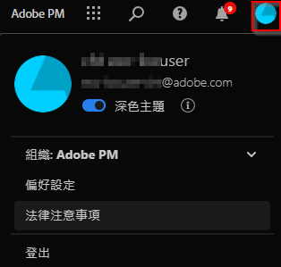

# 使用者偏好設定

[!UICONTROL 元件] > [!UICONTROL 使用者偏好設定] 頁面可讓您管理使用者的 Analysis Workspace 設定及其相關元件。使用者偏好設定適用於&#x200B;*所有*&#x200B;新專案或面板。

## 一般偏好設定

一般偏好設定適用於瀏覽器中您的 CJA 體驗。

| 偏好設定 | 選項 |
| --- | --- |
| 登陸頁面 | <ul><li>專案清單 (預設)</li><li>空白專案</li><li>特定專案</li></ul> |
| 提示 | <ul><li>已啟用 (預設)</li><li>停用</li></ul> |

## 專案偏好設定

專案偏好設定適用於在 Analysis Workspace 中建立的新專案和新面板。偏好設定可在 Workspace > 專案 > 專案資訊和設定 下依每個專案來管理。

| 區域 | 偏好設定 | 選項 |
| --- | --- | --- |
| **顯示** |  |  |
|  | [檢視密度](https://experienceleague.adobe.com/docs/analytics-platform/using/cja-workspace/build-workspace-project/view-density.html?lang=zh-Hant) | <ul><li>精簡</li><li>舒適</li><li>展開 (預設)</li></ul> |
|  | [調色盤](https://experienceleague.adobe.com/docs/analytics-platform/using/cja-workspace/build-workspace-project/color-palettes.html?lang=zh-Hant) | <ul><li>Adobe 提供的調色盤 (預設)</li><li>自訂界定的調色盤</li></ul> |
| **資料** |  |  |
|  | [日曆](https://experienceleague.adobe.com/docs/analytics-platform/using/cja-workspace/panels/panels.html?lang=zh-Hant?#calendar) | 現成日期範圍清單，包含 **[!UICONTROL 本月份]** (預設) |
|  | [面板類型](https://experienceleague.adobe.com/docs/analytics-platform/using/cja-workspace/panels/panels.html?lang=zh-Hant) | <ul><li>自由形式 (預設)</li><li>空白</li><li>快速深入分析</li></ul> |
|  | 數字格式 | <ul><li>1,000.00 (預設)</li><li>1.000,00</li><li>1 000,00</li></ul> |
|  | CSV 分隔符號 | <ul><li>逗號 (預設)</li><li>分號</li><li>冒號</li><li>直立線符號</li><li>時段</li><li>空格</li><li>定位</li></ul> |

## [!UICONTROL 深色佈景主題]

如果您偏好將您的 Customer Journey Analytics 使用者介面設定為深色背景，您可切換至[!UICONTROL 深色佈景主題]。

1. 按一下右上方的「Experience Cloud」使用者圖示。

   

1. 將&#x200B;**[!UICONTROL 深色佈景主題]**&#x200B;切換移動至右邊。

