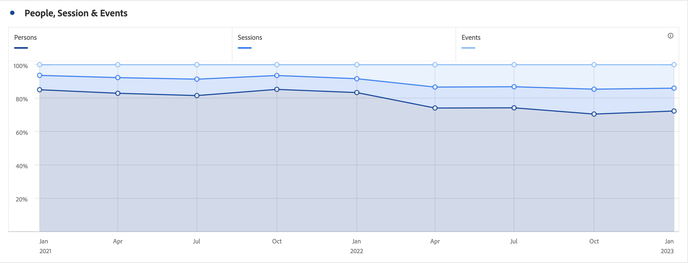

# 區域圖 (堆疊)

>[!BEGINSHADEBOX]

_本文記錄了_  _&#x200B;**Customer Journey Analytics** 中的區域圖和區域堆疊圖視覺效果。_ _請參閱本文中_  _&#x200B;**Adobe Analytics** 版本的[區域和堆疊區域](https://experienceleague.adobe.com/zh-hant/docs/analytics/analyze/analysis-workspace/visualizations/area)。_

>[!ENDSHADEBOX]

此區域圖視覺效果具有標準和堆疊選項。

## 區域 {#area}

<!-- markdownlint-disable MD034 -->

>[!CONTEXTUALHELP]
>id="workspace_area_button"
>title="區域圖"
>abstract="建立區域圖視覺效果來表示多個量度的交集。"

<!-- markdownlint-enable MD034 -->

 **[!UICONTROL 區域圖]**&#x200B;視覺效果類似線圖，但在線圖下方有一塊上色區域。有多個量度且以要視覺化方式表示多個量度之間交會的區域時，可新增區域圖。

## 堆疊區域圖 {#area-stacked}

<!-- markdownlint-disable MD034 -->

>[!CONTEXTUALHELP]
>id="workspace_areastacked_button"
>title="堆疊區域圖"
>abstract="建立區域圖視覺效果來表示多個量度的堆疊。"

<!-- markdownlint-enable MD034 -->

  **[!UICONTROL 區域堆疊圖]**&#x200B;視覺效果類似於區域圖，但每個系列都從前一個系列的上方開始。

使用 **[!UICONTROL 設定]**&#x200B;中的 **[!UICONTROL 100% 堆疊]**&#x200B;選項，將圖表轉換為 100% 堆疊視覺效果。

>[!MORELIKETHIS]
>
>[將視覺化新增至面板](/help/analysis-workspace/visualizations/freeform-analysis-visualizations.md#add-visualizations-to-a-panel)
>&#x200B;>[視覺效果設定](/help/analysis-workspace/visualizations/freeform-analysis-visualizations.md#settings)
>&#x200B;>[視覺化內容選單](/help/analysis-workspace/visualizations/freeform-analysis-visualizations.md#context-menu)
>
