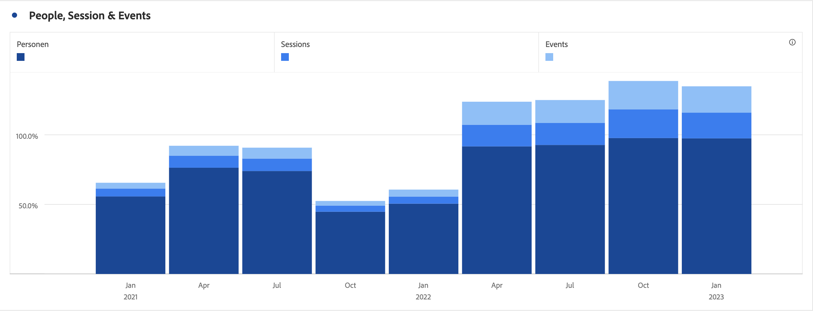

# 長條圖和堆疊長條圖

## 長條圖 {#section_2E96E55D4E8E488CBCA6A3508DDF3918}

此視覺效果顯示代表一或多個量度多個值的垂直長條。

視覺效果設定中的詳細程度下拉式清單可讓您將趨勢視覺效果 (例如折線圖、長條圖) 從每日變更為每週、每月等。

## 堆疊長條圖 {#section_9EA83779AE964635907EE5031A785A49}

此視覺效果類似長條圖，但數列長條堆疊在彼此頂端。

針對堆疊橫條圖的全新視覺效果設定可讓圖表以「100% 堆疊」的視覺效果方式呈現。

