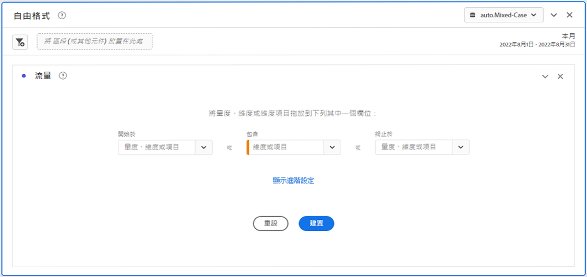
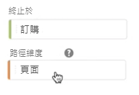
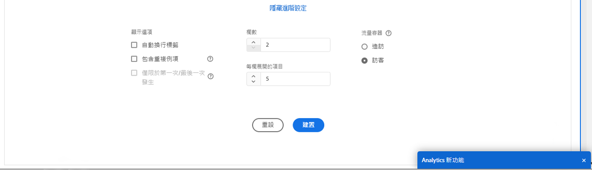
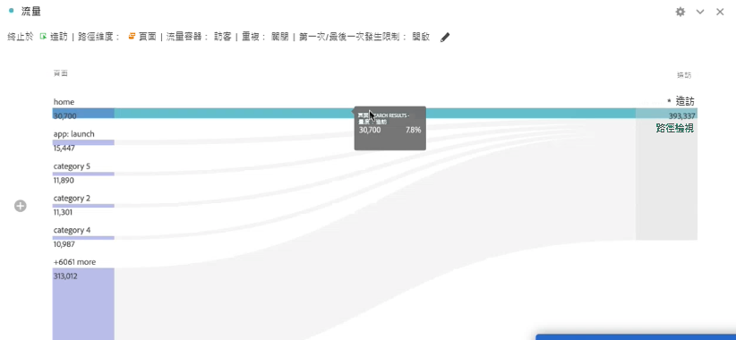
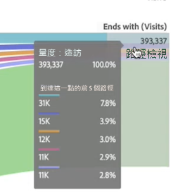

# 設定流量視覺效果

流量視覺效果可協助您瞭解源自或導致網站或應用程式上特定轉換事件的歷程。 它透過您的維度（和維度專案）或量度追蹤路徑。

流量視覺效果可讓您設定感興趣的路徑的起點或終點，或分析流經維度或維度專案的所有路徑。

## 建立流量視覺效果 {#configure}

1. 在專案中新增空白面板，選取左側欄中的「視覺效果」圖示，然後拖曳 [!UICONTROL **流量**] 將視覺效果放入「 」面板中。

   或

   透過下列位置的「將視覺效果新增至面板」一節中所述的任何方式新增視覺效果： [視覺效果概述](/help/analysis-workspace/visualizations/freeform-analysis-visualizations.md).

1. 使用以下其中一個選項錨定您的流量視覺效果：

   * [!UICONTROL **開頭為**] (量度、維度或項目)，或
   * [!UICONTROL **包含**] (量度、維度或項目)，或
   * [!UICONTROL **結束於**] (量度、維度或項目)

   這些類別都會顯示為螢幕上的「拖放區域」。您可以使用 3 種方式填入拖放區域：

   * 使用下拉式選單來選取量度或維度。
   * 從左側邊欄拖曳維度或量度。
   * 開始輸入維度或量度的名稱，然後在其出現在下拉式清單中時選取它。

   >[!IMPORTANT]
   >
   >計算量度無法用於  **[!UICONTROL 開頭為]** 或 **[!UICONTROL 結尾為]** 欄位。

1. 如果您選擇量度，則還需要提供 [!UICONTROL **路徑Dimension**] ，以用作前往或離開您所選元件的路徑，如下所示。 預設為&#x200B;[!UICONTROL **「頁面」**]。

   

1. （選用）選取 **[!UICONTROL 顯示進階設定]** 若要設定下列任一選項：

   

   | 設定 | 說明 |
   | --- | --- |
   | **[!UICONTROL 繞排標籤]** | 一般而言，系統會截斷「流量」元素的標籤以節省螢幕空間，但您可勾選此方塊以完整顯示標籤。預設 = 未勾選。 |
   | **[!UICONTROL 包含重複例項]** | 「流量」視覺效果是根據維度的例項而定。此設定可讓您選擇要包含或排除重複例項，如頁面重新載入次數。不過，無法從包含多值維度 (例如 listVars、listProps、s.product、銷售 eVars 等) 的「流量」視覺效果中移除重複項目。 
此選項預設為停用。
 |
   | **[!UICONTROL 僅限於第一次/最後一次發生]** | 將路徑限制為開頭/結束於維度/項目/量度的第一次/最後一次發生次數。請參閱以下小節， [「僅限於第一次/最後一次發生」的範例情境](#example-scenario-for-limit-to-firstlast-occurrence)，以取得更詳細的說明。 |
   | **[!UICONTROL 欄數]** | 流量圖中想要的欄數。 您最多可以指定5欄。 |
   | **[!UICONTROL 每欄展開的專案]** | 每欄中想要的專案數。 您可以指定每欄最多展開10個專案。 |
   | **[!UICONTROL 流量容器]** | <ul><li>瀏覽</li><li>訪客</li></ul> 可讓您切換瀏覽和訪客，分析訪客路徑。這些設定可協助您了解訪客層級的訪客參與程度 (跨越造訪)，或是將分析限制在單一造訪。 |

   >[!IMPORTANT]
   >
   >組合： **[!UICONTROL 欄數]** 和 **[!UICONTROL 每欄展開的專案]** 決定建立流量視覺效果所需的基礎要求數目。 這些數字愈大，呈現視覺效果所需的時間就愈長。

1. 選取 **[!UICONTROL 建置]**.

>[!INFO]
>
>**範例：** 假設您想要追蹤使用者在您網站上最受歡迎頁面之間所經過的路徑。
>
>若要這麼做，您可以
>
>1. 開始建立上述的流量視覺效果。
>1. 拖曳 [!UICONTROL **頁面**] 將維度移入 **[!UICONTROL 包含]** 欄位，然後選取 [!UICONTROL **建置**].
>1. 流量視覺效果建置時，會在視覺效果中心的焦點節點中顯示檢視次數最多的頁面。 您也會看見前幾個頁面通往該頁面（焦點節點的左側），以及前幾個頁面通往該焦點頁面（焦點節點的右側）。
>1. 分析流量中的資料，如所述 [檢視和變更流量輸出](#view-and-change-the-flow-output).

## 檢視和變更流量輸出 {#output}

流量組態的摘要會顯示在圖表的頂端。圖表中的路徑會依照比例顯示。具有較多活動的路徑看起來比較寬。

若要深入研究資料，您有幾個選項：

* 流量圖是互動式的。將滑鼠移到圖表上方，可變更顯示的詳細資料。

* 按一下圖表中的節點，會顯示該節點的詳細資料。再次按一下節點可將其摺疊。

  

* 您可以篩選欄以僅顯示某些結果，例如包含和排除、指定條件等。

* 按一下左側的加號 (+) 可展開欄。

* 使用下面解釋的按右鍵選項來進一步自訂輸出。

* 按一下組態摘要旁邊的鉛筆圖示，可進一步編輯流量或使用不同的選項來重建。

* 您也可以前往&#x200B;**[!UICONTROL 「專案]** > **[!UICONTROL 下載 CSV」]**，匯出並進一步分析您專案 .CSV 檔案的「流量」圖表。

## 篩選

將滑鼠游標停留在欄上方時，會出現一個篩選器。按一下篩選器，會出現與現在自由表格中相同的篩選器對話框。此篩選器的運作方式，與自由表格中的運作方式相同。

* 使用進階設定可在運算子清單中包含或排除某些條件。
* 當您從清單中篩選了一個項目，該特定欄會反映出篩選結果。(篩選器會將其縮小為僅顯示篩選允許的項目，或是將您在篩選器中所要項目以外的其他項目移除。
* 只要有資料流入其餘節點，所有下游和上游欄都應該保持不變。
* 套用後，篩選器圖示會在其篩選的欄上方顯示為藍色。
* 若要移除篩選器，請按一下篩選器圖示以開啟篩選器選單。移除套用的所有篩選器，然後按一下&#x200B;**[!UICONTROL 「儲存」]**。流量應會回到其先前的未篩選狀態。

## 右鍵選項 {#right-click}

| 選項 | 說明 |
|--- |--- |
| [!UICONTROL 焦點放在這個節點] | 將焦點變更至選取的節點。焦點節點會出現在流量圖的中央。 |
| [!UICONTROL 重新開始] | 將您帶回自由圖表產生器，讓您在那裡建立新的流量圖。 |
| [!UICONTROL 建立此路徑的篩選器] | 建立篩選器。 這會將您帶往「篩選產生器」，讓您在其中設定新篩選器。 |
| [!UICONTROL 劃分] | 依據可用的「維度」、「量度」或「時間」來劃分節點。 |
| [!UICONTROL 篩選欄] | 顯示的篩選選項與自由表格中提供的選項相同。 如需可用選項的詳細資訊，請參閱以下的「將簡單或進階篩選器套用至表格」一節： [篩選及排序表格](/help/analysis-workspace/visualizations/freeform-table/filter-and-sort.md). |
| [!UICONTROL 排除專案]/[!UICONTROL 還原已排除的專案] | 從欄中移除特定節點，並自動將其建立為欄頂端的篩選器。若要還原排除的項目，請再次按一下右鍵並選取&#x200B;**[!UICONTROL 「還原排除的項目」]**。您也可以開啟欄頂端的篩選器，並移除包含剛剛排除的項目的方塊。 |
| [!UICONTROL 趨勢] | 建立節點的趨勢圖。 |
| 顯示下一欄/顯示上一欄 | 顯示視覺效果的下一個（右）或上一個（左）欄。 |
| 隱藏欄 | 隱藏視覺效果中選取的欄。 |
| [!UICONTROL 展開整個欄] | 展開該欄以顯示所有節點。依預設，只會顯示前五個節點。 |
| 從選取項目中建立對象 | 根據選取的欄建立對象。 |
| [!UICONTROL 摺疊整個欄] | 隱藏該欄中的所有節點。 |

## 「僅限於第一次/最後一次發生」的範例情境

使用此選項時，請記住：

* **[!UICONTROL 「僅限於第一次/最後一次發生」]**&#x200B;只會計算系列中的第一次/最後一次發生次數。**[!UICONTROL 「開頭為」]**&#x200B;或&#x200B;**[!UICONTROL 「結束於」]**&#x200B;條件的所有其他發生次數都會被捨棄。
* 如果與&#x200B;**[!UICONTROL 「開頭為」]**&#x200B;流量一起使用，則僅包含符合開始條件的第一次發生次數。
* 如果與&#x200B;**[!UICONTROL 「結束於」]**&#x200B;流量一起使用，則僅包含符合結束條件的最後一次發生次數。
* 使用的系列因容器而異。若使用 **[!UICONTROL 造訪]** 容器，則一連串事件將是工作階段。 若使用 **[!UICONTROL 訪客]** 容器，則一連串事件將是所提供日期範圍內特定使用者的所有事件。
* 在「開頭為」或「結束於」欄位中使用量度或維度項目時，可以在進階設定中設定&#x200B;**[!UICONTROL 「僅限於第一次/最後一次發生」]**&#x200B;選項。

一系列事件的範例：

首頁 > 產品 > 加入購物車 > 產品 > 加入購物車 > 帳單 > 訂單確認

### 假設有一個採用以下設定的流量分析：

* 開始於[!UICONTROL 「加入購物車」] (維度項目)
* [!UICONTROL 「頁面」]路徑分析維度
* [!UICONTROL 「造訪」]容器

如果「僅限於第一次/最後一次發生」為停用，則這一連串事件會計算2次「加入購物車」。
預期流量輸出：
「加入購物車」(2) —>「產品」(1)
->「帳單」(1)

但是，如果已啟用「僅限於第一次/最後一次發生」，則分析中只會包含第一次「加入購物車」。
預期流量輸出：
「加入購物車」(1) —>「產品」(1)

### 請考量相同的一系列事件，但使用以下設定：

* 結束於「[!UICONTROL 加入購物車]」(維度項目)
* [!UICONTROL 「頁面」]路徑分析維度
* [!UICONTROL 「造訪」]容器

如果 **[!UICONTROL 僅限於第一次/最後一次發生]** 是 *已停用*，則這一連串事件會計算2次「加入購物車」。
預期流量輸出：
「產品」(2) &lt;—「加入購物車」(2)

但是，如果&#x200B;**[!UICONTROL 「僅限於第一次/最後一次發生」]**&#x200B;為&#x200B;*啟用*，則分析中只會包含最後一次[!UICONTROL 「加入購物車」]。
預期流量輸出：
「產品」(1) &lt;—「加入購物車」(1)
