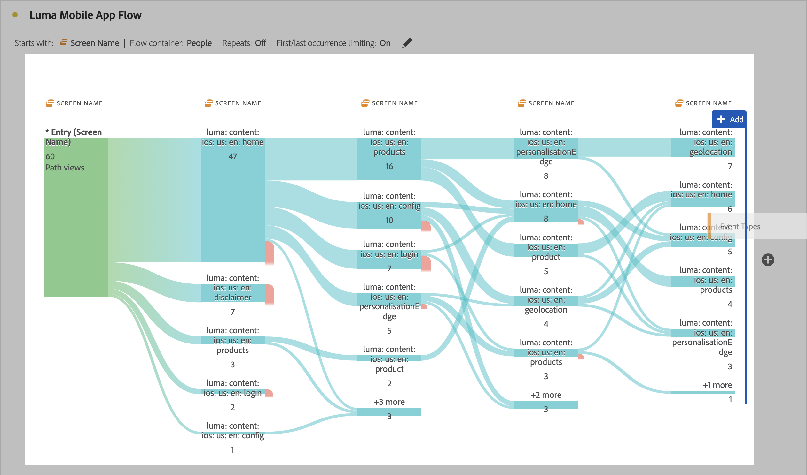

# 維度間流量

維度間流量可讓您檢查多個維度間的用戶路徑。本文說明此流量如何用於兩個使用案例：行動應用程式互動和事件，以及行銷活動如何推動網站造訪

<!--
A dimension label at the top of each Flow column makes using multiple dimensions in a flow visualization more intuitive:

-->

## 行動應用程式互動和事件

在此範例流程中，[!UICONTROL 畫面名稱]維度用於深入了解應用程式中使用者使用的各種畫面 (場景)。傳回的熱門畫面為 **[!UICONTROL Luma：內容：iOS：en：首頁]** (此為應用程式的首頁)：

若要探索此應用程式中的畫面和事件類型 (如新增至購物車、購買及其他等) 之間的互動，請拖放&#x200B;**[!UICONTROL 事件類型]**&#x200B;維度：

* 流量中任何可用的步驟之上，以取代該維度：

  

* 在目前流量視覺效果之外，以新增維度：

  

下列的流量視覺效果顯示新增&#x200B;**[!UICONTROL 事件類型]**&#x200B;維度的結果。視覺效果提供行動應用程式使用者在新增產品至購物車、關閉應用程式、顯示優惠等動作之前，如何在應用程式內各種畫面之間移動的深入分析。

## 行銷活動如何推動網頁造訪數

您想要分析哪些行銷活動可推動網站造訪數。您建立以&#x200B;**[!UICONTROL 行銷活動名稱]**&#x200B;作為維度的流量視覺效果

將最後一個 **[!UICONTROL 行銷活動名稱]**&#x200B;維度取代為&#x200B;**[!UICONTROL 格式化頁面名稱]** 維度，並在流量視覺效果終點的新增另一個&#x200B;**[!UICONTROL 格式化頁面名稱]** 維度。

您可以將滑鼠停留在任意流量上，以查看更多詳細資訊。例如哪些行銷活動導致購物車結帳。

