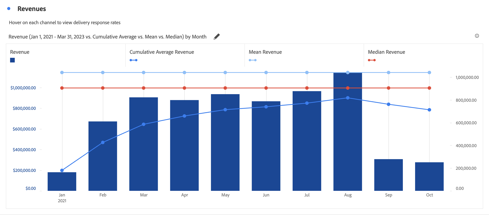

# 組合 {#combo}

<!-- markdownlint-disable MD034 -->

>[!CONTEXTUALHELP]
>id="cja_workspace_combo_button"
>title="組合"
>abstract="快速建立組合圖表視覺效果，而不需要先建立自由表格。"

<!-- markdownlint-enable MD034 -->

 **[!UICONTROL Combo]**&#x200B;視覺效果可讓您快速建立比較視覺效果，而不需要先建立表格。 您可以透過線條/條形組合，輕鬆檢視資料中的趨勢。

使用[!UICONTROL 組合]來：

* 將本週的訂單與上個月（以及去年）同時間的訂單進行比較。
* 在相同圖表上快速分析和比較多個量度（例如[!UICONTROL 人員]和[!UICONTROL 收入]）。
* 根據一段時間範圍內的函數，分析量度 (例如[!UICONTROL 累積平均值])。

請記住以下事項：

* 您可在單一[!UICONTROL 組合圖表]中新增多筆比較資料。
* 如果您新增一筆或更多比較資料，這些資料必須是相同類型，例如[!UICONTROL 時間比較]。
* 您最多只能新增 5 筆比較資料。
* 一個量度最多可以套用3個篩選器。
* 組合圖表中不支援計算量度。

## 使用

1. 新增 [!UICONTROL 組合]視覺效果。 請參閱[將視覺效果新增至面板](freeform-analysis-visualizations.md#add-visualizations-to-a-panel)

1. 從下拉式清單，選取 X 軸的維度和 Y 軸的量度。

1. 選取您要使用的[!UICONTROL 折線比較]型別。

   | 折線比較類型 | 定義 |
   | --- | --- |
   | **[!UICONTROL 時間比較]** | 最常見的比較類型 - 例如，將此時段與 4 週前進行比較。如果您已選取[!UICONTROL 時間比較]，請針對您要比較的時段進行次要比較。
 |
   | **[!UICONTROL 函數]** | 您可以將[!UICONTROL 平均值]等函數導入比較中。請參閱以下的支援函數清單。
 |
   | **[!UICONTROL 次要量度]** | 例如，您可以將[!UICONTROL 收入]與另一個量度比較。
 |

   {style="table-layout:auto"}

1. 選取「**[!UICONTROL 建立]**」。

   輸出內容類似於：

   中顯示比較期間

   目前期間會顯示在長條圖中。 折線圖代表比較期間。 折線圖上的點稱為&#x200B;*槓鈴*。

## 支援的函數

若您選取&#x200B;**[!UICONTROL 函式]**&#x200B;作為[!UICONTROL 折線比較型別]，則會傳回所選量度的函式。

| 函數 | 定義 |
| --- | --- |
| **[!UICONTROL 欄總和]** | 將某一欄中量度的所有數值相加（涵蓋維度的各個元素） |
| **[!UICONTROL 累積平均值]** | 傳回最後N列的平均值。 |
| **[!UICONTROL 中位數]** | 傳回一欄中量度的中位數。中位數是一組數字中間的數字。 一半數字的值大於或等於中位數，另一半數字的值小於或等於中位數。 |
| **[!UICONTROL 累積]** | N 列的累積總和。 |
| **[!UICONTROL 欄最大值]** | 傳回量度欄中一組維度元素的最大值。 |
| **[!UICONTROL 平均值]** | 傳回量度的算術平均值或平均值。 |
| **[!UICONTROL 欄最小值]** | 傳回量度欄中一組維度元素的最小值。 |

{style="table-layout:auto"}

以下為收入量度的累積平均值範例：

以下為累積平均值和平均值函數的組合圖表範例：

>[!MORELIKETHIS]
>
>[將視覺效果新增至面板](/help/analysis-workspace/visualizations/freeform-analysis-visualizations.md#add-visualizations-to-a-panel)
>[視覺效果設定](/help/analysis-workspace/visualizations/freeform-analysis-visualizations.md#settings)
>[視覺效果內容功能表](/help/analysis-workspace/visualizations/freeform-analysis-visualizations.md#context-menu)
>