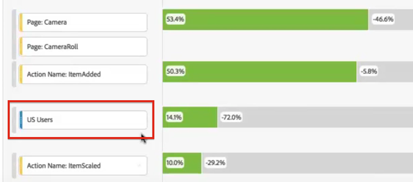

# 在流失分析中套用篩選

>[!NOTE]
>
>您正在檢視 Customer Journey Analytics 中 Analysis Workspace 的相關文件，其功能集與傳統 Adobe Analytics 中的 [Analysis Workspace 略有不同](https://experienceleague.adobe.com/docs/analytics/analyze/analysis-workspace/home.html?lang=zh-Hant)。[了解更多...](/help/getting-started/cja-aa.md)

您可以從觸點建立篩選器，將篩選器添加為觸點，並比較Analysis Workspace不同篩選器中的關鍵工作流。

>[!IMPORTANT]
>
>在Ducces中用作檢查點的篩選器必須使用級別低於Ducces可視化整體上下文的容器。 使用訪問者上下文附帶，用作檢查點的篩選器必須是訪問篩選器或基於命中的篩選器。 使用訪問上下文附帶，用作檢查點的篩選器必須基於命中的篩選器。 如果使用無效的組合，流失率會計為 100%。我們已向Succes可視化添加警告，當您添加不相容的篩選器作為觸點時，將顯示該警告。 某些無效的篩選器容器組合將導致無效的沈降圖，例如：

* 使用基於訪問者的過濾器作為訪問者上下文內的觸摸點
* 使用基於訪問者的過濾器作為訪問上下文中的觸摸點
* 使用基於訪問的過濾器作為訪問上下文內的觸點

## 從觸點建立篩選器 {#section_915E8FBF35CD4F34828F860C1CCC2272}

1. 從您特別感興趣的特定觸點建立篩選器，該篩選器可能對應用於其他報告非常有用。 要執行此操作，請按一下右鍵該觸點並選擇 **[!UICONTROL 從觸點建立篩選器]**。

   

   將開啟篩選器生成器，並預先填充與所選觸點匹配的預構建順序篩選器：

   

1. 為篩選器提供標題和說明並保存。

   現在，您可以在任何您希望的項目中使用此篩選器。

## 添加濾鏡作為觸點 {#section_17611C1A07444BE891DC21EE8FC03EFC}

例如，如果您想瞭解美國用戶的趨勢和對衝擊波的影響，只需將美國用戶拖入衝擊波：

或者，通過將美國用戶篩選器拖到另一個檢查點上，可以建立AND觸點。

## 比較沈降中的篩選器 {#section_E0B761A69B1545908B52E05379277B56}

您可以在Busces可視化中比較無限數量的篩選器。

1. 從中選擇要比較的篩選器 [!UICONTROL 篩選] 左邊的鐵軌。 在我們的示例中，我們選擇了2個篩選器：美國用戶和非美國用戶。
1. 將它們拖到頂部的「過濾器」放置區域。

   

1. 選用：您可將「所有造訪」保留作為預設容器，也可將其刪除。

   

1. 現在，您可以比較兩個篩選器的附帶效果，例如一個篩選器的效能優於另一個篩選器的情況，或者比較其他見解。
