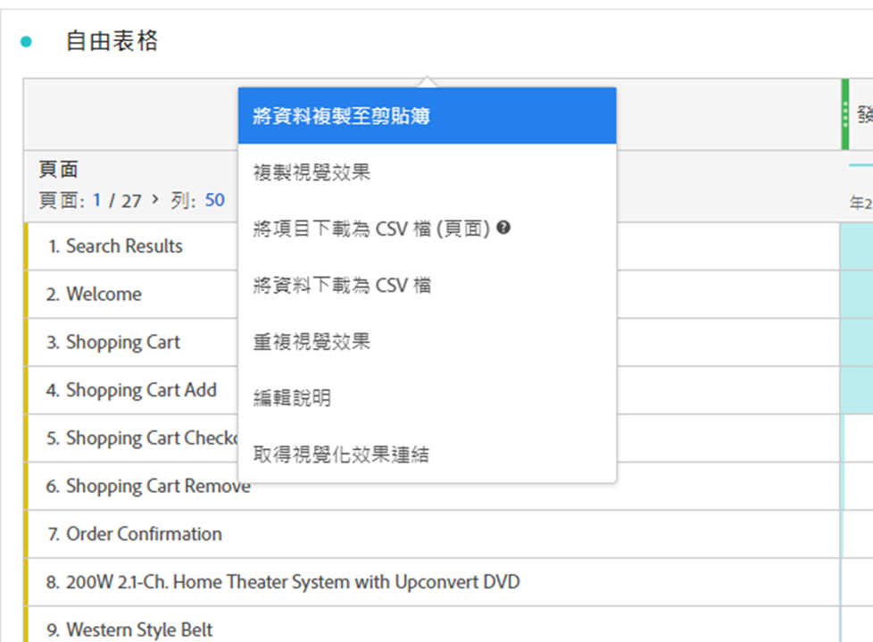
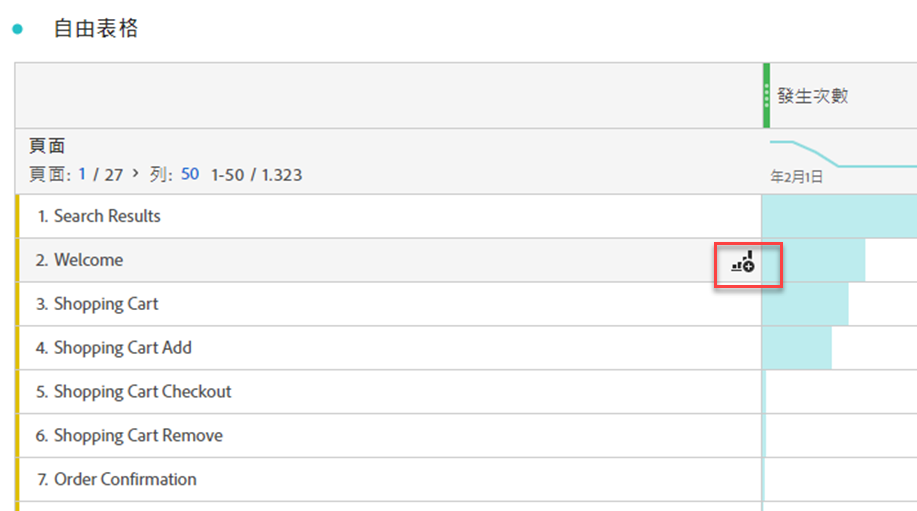

# 視覺效果概觀

Workspace提供許多視覺效果，可讓您產生資料的視覺化表示法。 例如長條圖、環圈圖、直方圖、折線圖、地圖、散點圖等。

## 型別

Analysis Workspace 中有以下視覺效果類型：

| 圖示 | 名稱 | 說明 |
| :---: | --- | ---| 
|  | [區域](/help/analysis-workspace/visualizations/area.md) | 區域圖視覺效果。 類似線圖，但在線圖下方有一塊上色區域。有多個量度且以要視覺化方式表示多個量度之間交會的區域時，可使用區域圖。 |
|  | [長條圖](/help/analysis-workspace/visualizations/bar.md) | 橫條圖視覺效果，其中包含代表一或多個量度多個值的垂直橫條。 |
|  | [棧疊長條圖](/help/analysis-workspace/visualizations/bar.md) | 棧疊長條圖視覺效果，其中包含代表一或多個量度多個值的垂直長條。 |
| 
 | [專案符號](/help/analysis-workspace/visualizations/bullet-graph.md) | 專案符號圖表視覺效果，顯示您感興趣的值與其他效能範圍（目標）相比較或進行測量的結果。 |
|  | [同類群組表格](/help/analysis-workspace/visualizations/cohort-table/cohort-analysis.md) | 同類群組視覺效果是指一段指定時間內，共用相同特徵的一組人。 同類群組表對於保留、流失或延遲分析相當實用。 |
|  | [組合](combo-charts.md) | 組合圖表可讓您快速建立比較視覺效果，而無需先建立表格。 |
|  | [環形圖](/help/analysis-workspace/visualizations/donut.md) | 環形圖視覺效果類似圓形圖，以整體的部分或篩選器顯示資料。 |
|  | [流失](/help/analysis-workspace/visualizations/fallout/fallout-flow.md) | 流失視覺效果可顯示在一系列預先定義的連續頁面中，人員從何處離開（流失）或繼續通過（流過）。 |
|  | [流量](/help/analysis-workspace/visualizations/c-flow/flow.md) | 流量視覺效果可顯示使用您網站和應用程式的精確客戶路徑。 |
| 
 | [自由表格](/help/analysis-workspace/visualizations/freeform-table/freeform-table.md) | 自由表格視覺效果是互動式視覺效果。 自由表格視覺效果是Workspace資料分析的基礎。 |
|  | [長條圖](/help/analysis-workspace/visualizations/histogram.md) | 長條圖視覺效果會根據量度數量，將人員、造訪或事件放入值區中。 |
|  | [橫條圖](/help/analysis-workspace/visualizations/horizontal-bar.md) | 橫條圖視覺效果會顯示代表一或多個量度多個值的橫條。 |
|  | [棧疊的水準橫條圖](/help/analysis-workspace/visualizations/horizontal-bar.md) | 棧疊橫條圖視覺效果會顯示代表一或多個量度多個值的橫條。 |
|  | [關鍵量度摘要](/help/analysis-workspace/visualizations/key-metric.md) | 關鍵量度摘要視覺效果結合了折線圖、摘要變更和摘要數字視覺效果。 |
|  | [折線圖](/help/analysis-workspace/visualizations/line.md) | 線條圖視覺效果使用線條圖表示量度，以顯示一段時間中值的變化。 線形圖會延 X 軸使用時間。 |
|  | [散佈圖](/help/analysis-workspace/visualizations/scatterplot.md) | 散佈圖視覺效果顯示維度專案與最多三個量度之間的關係。 |
|  | [區段標題](section-header.md) | 在面板中識別和連線截面。 |
|  | [摘要變更](/help/analysis-workspace/visualizations/summary-number-change.md) | 摘要變更視覺效果會將所選儲存格之間的變更顯示為一個大的數字或百分比。 |
| 
 | [摘要數字](/help/analysis-workspace/visualizations/summary-number-change.md) | 摘要數字視覺效果會將選取的儲存格顯示為一個大數字。 |
|  | [Text](/help/analysis-workspace/visualizations/text.md) | 文字視覺效果可讓您將使用者定義文字新增至Workspace。 除了運用面板/視覺效果的說明之外，還有助於為您的分析和深入見解新增額外內容 |
|  | [樹狀圖](/help/analysis-workspace/visualizations/treemap.md)
 | 樹狀圖視覺效果會將階層（樹狀結構）資料顯示為一組巢狀矩形。 |
|  | [Venn](/help/analysis-workspace/visualizations/venn.md) | 文氏圖表視覺效果會使用圓圈描繪最多3個篩選器的量度重疊。 |

<!-- Add beneath Horizontal bar in the table above: | [Journey canvas](/help/analysis-workspace/visualizations/journey-canvas/journey-canvas.md) | Similar to Fallout, Journey canvas shows where persons left (fell out) and continued through (fell through) a predefined sequence of pages. 
Unlike Fallout, Journey canvas supports not only linear journeys, but any number of entry points and paths. Furthermore, journeys can be created in Adobe Journey Optimizer and then analyzed in Journey canvas.
 | -->

## 將視覺效果新增至面板

1. 開啟您要新增視覺效果的Workspace專案。

1. 使用下列任一種方法來新增視覺效果：

   

   * 在左側面板中，選取 **視覺效果**，然後將視覺效果拖曳至您要新增視覺效果的面板。

   * 在您想要新增視覺效果的面板上，選取，然後選擇代表您要新增的視覺效果的圖示。 將滑鼠指標暫留在每個視覺效果的圖示上可檢視名稱。

   * 新增[空白面板](https://experienceleague.adobe.com/en/docs/analytics/analyze/analysis-workspace/panels/blank-panel)，然後選取您要新增的視覺效果。

   * 從您Analysis Workspace專案中現有視覺效果的內容功能表中，選取「**[!UICONTROL 複製視覺效果]**」或「**[!UICONTROL 複製視覺效果]**」。

   * 使用Workspace **[!UICONTROL 插入]**&#x200B;功能表插入視覺效果。

   * 從自由表格中的內容功能表，選取&#x200B;**[!UICONTROL 視覺化]**。 然後從子選單中選取視覺效果。 Workspace會根據表格中的目前選取專案，決定要提供哪個視覺效果，並解譯資料以建置要求的視覺效果。

## 圖例

視覺效果圖例可幫助您將來源表內的日期與視覺效果內的繪製序列產生關聯。此圖例是互動式 — 您可以選取圖例專案來顯示/隱藏視覺化效果中的序列，若要簡化資料的視覺化，這項功能相當實用。

此外，您可以重命名圖例標籤，以幫助您讓視覺效果更易使用。注意：圖例編輯&#x200B;**不**&#x200B;適用於： 樹狀圖、項目符號、累加變化/累加數、文字、自由圖形、長條圖、同類群組圖 (Cohort) 或流量圖 (Flow) 等視覺效果。

若要編輯圖例標籤：

1. 以滑鼠右鍵按一下圖例標籤。
1. 按一下&#x200B;**[!UICONTROL 「編輯標籤」]**。

   ![圖例標籤與[編輯標籤]選項。](assets/edit-label.png)

1. 輸入新的標籤文字。
1. 按下 **[!UICONTROL Enter]** 以儲存。

## 設定

每個視覺效果都有各自的設定。 若要存取視覺效果設定，請選取視覺效果標題中的 **[!UICONTROL 設定]**&#x200B;以顯示快顯視窗。

根據視覺效果，您可以設定

* 透過[**[!UICONTROL 資料來源]**](#data-source)索引標籤，以及視覺效果的資料來源詳細資料
* 透過[**[!UICONTROL 設定]**](#settings-1)索引標籤進行視覺效果設定。

### 資料來源

您可以控制哪些資料來源以及該資料來源中的專案或位置對應至視覺效果。 如需詳細資訊，請參閱[管理資料來源](t-sync-visualization.md)。

### 設定

可用的視覺效果設定取決於視覺效果。 下表總結了最常見的設定。 有些視覺效果確實有特定的設定。 如需詳細資訊，請參閱個別視覺效果檔案。

| 選項 | 說明 |
| --- | --- |
| **[!UICONTROL 視覺效果類型]** | 變更用來視覺化資料的視覺效果型別。 |
| **[!UICONTROL 粒度]** | 變更趨勢視覺效果的時間詳細程度。 這項變更也適用於資料來源表。 |
| **[!UICONTROL 百分比]** | 以百分比顯示值。 |
| **[!UICONTROL 100%棧疊]** | 將圖表轉換為100%棧疊的視覺效果。  僅適用於區域、長條圖和棧疊的水準長條圖視覺效果。 |
| **[!UICONTROL 可見圖例]** | 顯示圖例文字。 |
| **[!UICONTROL 限制項目數量上限]** | 限制視覺效果顯示的專案數。 選取時，定義最大專案數。 |
| **[!UICONTROL 顯示註解]** | 顯示為此視覺效果所做的註解。 |
| **[!UICONTROL 隱藏標題]** | 隱藏視覺效果的標題。 |
| **[!UICONTROL 將 y 軸固定於零]** | 強制y軸底部為零。 如果圖表上繪製的所有值都明顯大於零，則圖表預設會使y軸底部非零。 如果啟用此選項，Y軸會強製為零（且圖表會重新繪製）。 |
| **[!UICONTROL 顯示雙軸]** | 顯示兩個不同量度的左右兩側Y軸。 只有當您有兩個量度時，此選項才適用。 當繪製的量度大小不同時，雙軸會很有幫助。 |
| **[!UICONTROL 顯示 x 軸]** | 在視覺效果中顯示X軸。 |
| **[!UICONTROL 顯示 y 軸]** | 在視覺效果中顯示Y軸。 |
| **[!UICONTROL 在行]**&#x200B;上顯示槓鈴 | 在組合圖表視覺效果中的線條視覺效果上顯示槓鈴。 |
| **[!UICONTROL 標準化]** | 強制量度為相同比例。 當繪製的量度大小不同時，等比例很有幫助。 |
| **[!UICONTROL 顯示異常]** | 顯示異常偵測以強化線圖和自由格式表格。 線圖視覺效果內的異常偵測包含一個預期值 (虛線) 和一個預期範圍 (陰影帶)。 |
| **[!UICONTROL 顯示預測]** | 顯示預測值以強化線圖和自由表格。 |
| **[!UICONTROL 顯示最小值]** | 顯示視覺效果中的最小值。 |
| **[!UICONTROL 顯示最多]**&#x200B;個 | 顯示視覺效果中的最大值。 |
| **[!UICONTROL 顯示趨勢線]** | 在視覺效果中顯示趨勢線。 選取後，您可以從下拉式選單中選取趨勢線型別。 |

您可以自訂您建立的所有視覺效果設定。 如需詳細資訊，請參閱[使用者偏好設定](/help/analysis-workspace/user-preferences.md)。

## 內容功能表 {#right-click}

在視覺效果標題上使用內容功能表（可透過替代選取取得，例如，使用滑鼠按一下右鍵）來存取視覺效果的其他功能。 並非所有選項都適用於所有視覺效果。

| 選項 | 說明 |
| --- | --- |
| **[!UICONTROL 插入複製的視覺效果]** | 將複製的視覺效果貼上（插入）專案內另一個位置或完全不同的專案中。 |
| **[!UICONTROL 將資料複製到剪貼簿]** | 將資料從視覺效果複製到剪貼簿。 |
| **[!UICONTROL 將選取專案複製到剪貼簿]** | 將視覺效果中的選取範圍複製到剪貼簿。 |
| **[!UICONTROL 將專案下載為CSV檔（*維度名稱*）]** | 將視覺效果的維度專案（最多50,000個）下載至您的本機裝置。 所選維度最多50,000個維度專案。 |
| **[!UICONTROL 複製視覺效果]** | 複製視覺效果，以便將視覺效果插入專案內另一個位置或完全不同的專案中。 |
| **[!UICONTROL 下載資料CSV]** | 將視覺效果顯示的資料下載至本機裝置。 |
| **[!UICONTROL 匯出完整資料表]** | 將完整表格匯出至指定的雲端位置。 請參閱[將Customer Journey Analytics報告匯出至雲端](../export/export-cloud.md) |
| **[!UICONTROL 重複的視覺效果]** | 將視覺效果精確複製。 |
| **[!UICONTROL 編輯描述]** | 新增（或編輯）視覺效果的文字說明。 請參閱[文字](text.md)。 |
| **[!UICONTROL 取得視覺效果連結]** | 直接複製並共用視覺效果的連結。 共用連結對話方塊會顯示連結。 選取「複製」 ，將連結複製到剪貼簿。 |
| **[!UICONTROL 重新開始]** | 刪除目前視覺效果的設定，以便您從頭開始重新設定。 |

## 設定

有些視覺效果（例如同類群組表格、流失、流量等）會有一個設定對話方塊，可協助您建立視覺效果。 使用視覺效果頂端的來存取和變更組態。

## 視覺化

如果您不確定要挑選哪個視覺效果，請選取 **[!UICONTROL 在任何自由表格列（停留時可用）中視覺化]**。 此選取範圍是新增視覺效果的最快方式。 Analysis Workspace會針對哪個視覺效果最適合您的資料做出有根據的推測。 例如，如果您選取一列，就會建立趨勢圖[線圖](line.md)。 如果您選取了三個篩選器列，則會建立[Venn](venn.md)圖表。

