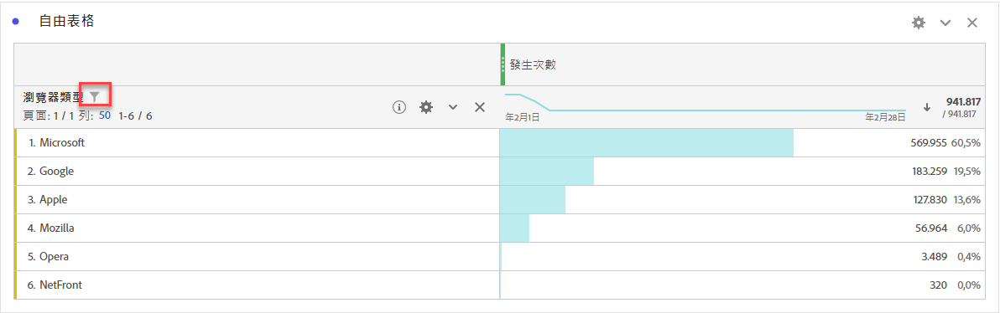
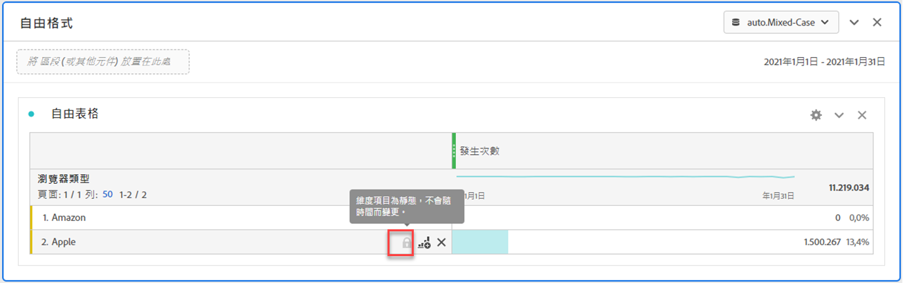
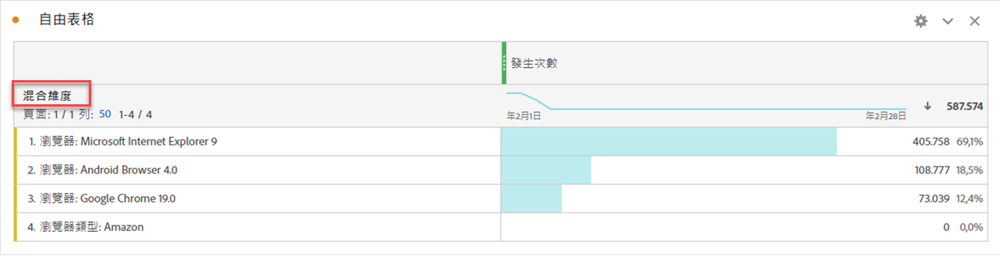

# 動態與靜態維度項目

在自由表格中，列和欄可以包含各種元件值。 這些值可以是動態 (隨時間變更) 或靜態 (不隨時間變更)，取決於您要建置的分析。

## 動態維度項目

動態維度項目會隨時間變更，取決於根據自由格式表格中已排序的量度。 分析特定時段排名最前的項目時，偏好使用動態維度項目。

將維度放入自由格式表格中時，會傳回動態列。 動態列代表對應至指定量度和時段之維度的熱門項目。 您也可以將維度放入自由格式表格中，維度會自動展開至排名前 5 的維度項目。

例如，將「瀏覽器型別」維度拖曳至表格時，頂端的「瀏覽器型別」維度專案（例如Microsoft、Apple、Google等） 會以動態方式傳回表格列。 如果放入欄中，排名前 5 的「瀏覽器類型」維度項目會以動態方式傳回。

動態維度專案具有列篩選器選項和，並且&#x200B;**不**&#x200B;有鎖定。<!--do they have the lock icon? --> 當您按一下動態維度專案旁的時，會自動套用篩選器。 有關將篩選器套用至表格的更多資訊，請參閱[篩選器和排序表格](/help/analysis-workspace/visualizations/freeform-table/filter-and-sort.md)。

## 靜態維度項目

靜態維度項目不會隨時間改變；它們是固定元件，一律會在自由格式表格中傳回。 想要一律分析相同項目時，偏好使用靜態維度項目，不論該項目是特定行銷活動或一週中的特定幾天皆然。

每當您手動選取特定元件值（維度、量度、區段、日期範圍）並放入表格時，結果會是列或欄的靜態清單。

例如，拖曳至特定的「瀏覽器類型」項目 (例如 Microsoft 和 Apple) 時，這 2 個特定項目一律會被提取至表格中。

如果您從選取列的內容選單中選擇選取「**[!UICONTROL 僅顯示選取列]**」，也可以建立靜態維度項目。

靜態維度項目&#x200B;**沒有**&#x200B;列篩選選項。 反之，每個項目均存在  和。 請選取「」，以從表格中移除該維度項目。

## 混合維度項目

可以將來自不同維度的維度項目新增至相同的表格。 在這些情況下，列標題會顯示「**[!UICONTROL 混合維度]**」。 這些維度項目為靜態。 例如，新增來自「瀏覽器群組」維度的特定維度項目，而其他維度項目來自「瀏覽器名稱」維度。

## 自由表格總計列

自由表格總計列中動態和靜態列的行為不相同。 根據預設：

* 動態列會在伺服器端加總，並刪除重複量度，例如工作階段或人員。
* 靜態列則在用戶端加總，且&#x200B;**不會**&#x200B;去除重複量度。 若要在伺服器端計算總計列，請將「列」設定更改為&#x200B;**「顯示總計」**。 [了解更多](/help/analysis-workspace/visualizations/freeform-table/workspace-totals.md)
