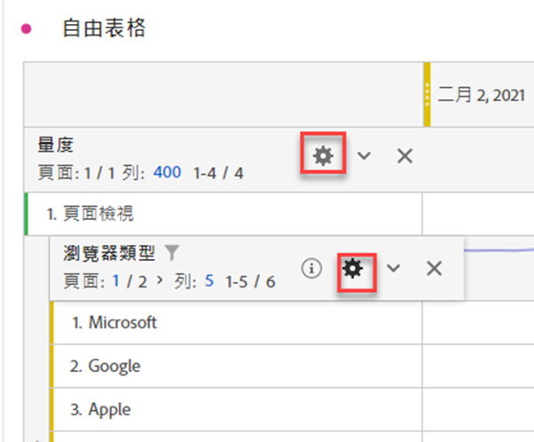
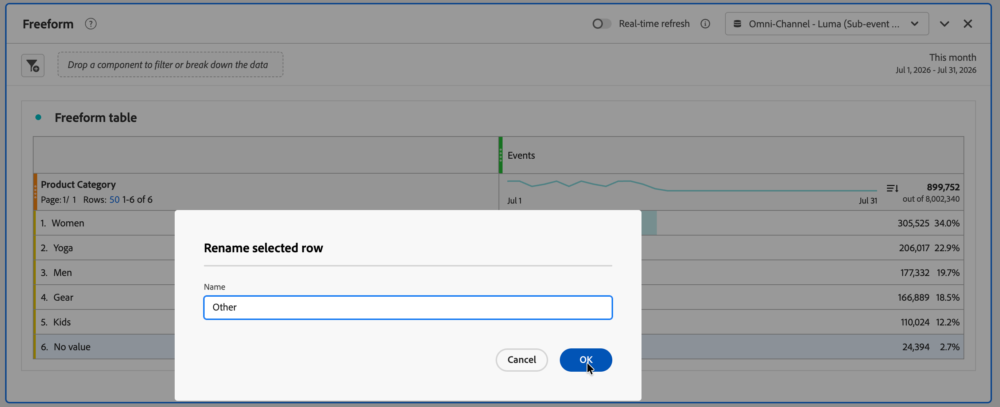
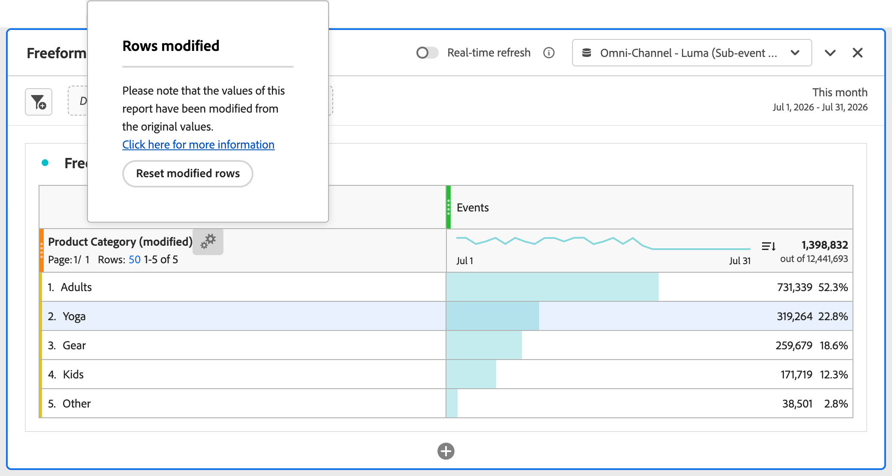

# 列設定

列設定依您拖放至表格中的元件而異。 若要存取資料表資料列設定，請選取每個物件內維度、區段、量度、時段或劃分旁的 **[!UICONTROL 設定]**。

| 設定 | 說明 |
| --- | --- |
| **[!UICONTROL 依位置劃分]** | 此設定預設為停用，且劃分會固定至靜態列項目。 例如，想像您根據行銷管道劃分前 3 個頁面維度項目 (「首頁」、「搜尋結果」、「結帳」)。 接著，您離開專案，兩週後再回來。 再次開啟專案時，前 3 個頁面已變更，現在「首頁」、「搜尋結果」和「結帳」是前 4 到 6 個頁面。 您的「行銷管道」劃分預設仍會顯示在「首頁」、「搜尋結果」和「結帳」下方，即使它們現在位於第4到6列。  相反地，**依位置**&#x200B;劃分總是會劃分前3個專案，無論前3個專案是什麼。 請參考範例，當您重啟專案時，行銷管道劃分將與表格中的前 3 頁面相連結。 而不是目前位於第 4 至 6 列的首頁、搜尋結果和結帳。 |
| **[!UICONTROL 百分比]** | **依欄計算百分比** (預設)：儲存格中的百分比是根據欄位總計計算。  **依列計算百分比**：會跨列計算儲存格百分比，而非以全部總計作為分母整欄計算。 此計算在趨勢分析百分比相當實用。 |
| **[!UICONTROL 欄總計]** | 這些設定僅適用於[靜態列](/help/analysis-workspace/visualizations/freeform-table/column-row-settings/manual-vs-dynamic-rows.md)。  **顯示為目前各列的總和**&#x200B;會顯示表格中的用戶端列數加總，因此總計&#x200B;*不會*&#x200B;刪除造訪次數或人數等重複量度。  **顯示總計**&#x200B;會顯示伺服器端的加總，表示刪除重複量度的總計。 |

>[!BEGINSHADEBOX]

請參閱  [自由格式表格中的列和欄設定](https://experienceleague.adobe.com/zh-hant/docs/analytics-learn/tutorials/analysis-workspace/building-freeform-tables/row-and-column-settings-in-freeform-tables){target="_blank"}示範影片。

{{videoaa}}

>[!ENDSHADEBOX]

## 變更列計數

變更顯示的列數量:

1. 按一下&#x200B;**[!UICONTROL 列]**&#x200B;旁邊的數字 (位於表格第一欄的頂端)。

   

1. 從下拉式功能表中，選取您希望表格顯示的列數。

## 內容選單

選取維度標題時，可用以下內容選單選項。

| 選項 | 說明 |
| --- | --- |
| **[!UICONTROL 複製選取項目至剪貼簿]** | 從視覺效果將選取項目複製至剪貼簿。 |
| **[!UICONTROL 將項目下載為 CSV (*維度名稱*)]** | 立即將視覺效果的維度項目 (最多 50,000 個) 下載至您的本機裝置。 選取維度的最大維度項目數為 50,000。 |
| **[!UICONTROL 將選取項目下載為 CSV]** | 立即將視覺效果的維度項目下載至您的本機裝置。 |
| **[!UICONTROL 建立所有維度項目的超連結]** | 建立所有維度項目的超連結。 請參閱[自由格式表格維度的超連結](../freeform-table-hyperlinks.md) |
| **[!UICONTROL 編輯所有維度項目的超連結]** | 編輯所有維度項目的超連結。 請參閱[自由格式表格維度的超連結](../freeform-table-hyperlinks.md) |
| **[!UICONTROL 移除所有維度項目的超連結]** | 移除所有維度項目的超連結。 請參閱[自由格式表格維度的超連結](../freeform-table-hyperlinks.md) |
| **[!UICONTROL 刪除]** | 從表格中刪除維度。 |
| **[!UICONTROL 視覺化]** | 使用任何可用的視覺效果將維度視覺化。 |
| **[!UICONTROL 僅顯示選取的列]** | 僅顯示視覺效果中的選取項目。 |
| **[!UICONTROL 從選取項目建立註解]** | 開啟「**[!UICONTROL 註解詳細資料]**」以新增註解。 |

在自由表格中選取一或多個維度專案（第一欄）或一或多個個別儲存格時，可使用下列其他內容功能表選項。

| 選項 | 說明 |
| --- | --- |
| **[!UICONTROL 複製選取項目至剪貼簿]** | 複製自由表格所選儲存格中的資訊。 |
| **[!UICONTROL 將項目下載為 CSV (*維度名稱*)]** | 立即將視覺效果的維度項目 (最多 50,000 個) 下載至您的本機裝置。 選取維度的最大維度項目數為 50,000。 |
| **[!UICONTROL 建立超連結]** | 建立此項目的超連結。 請參閱[自由格式表格維度的超連結](../freeform-table-hyperlinks.md) |
| **[!UICONTROL 編輯超連結]** | 編輯此項目的超連結。 請參閱[自由格式表格維度的超連結](../freeform-table-hyperlinks.md) |
| **[!UICONTROL 移除超連結]** | 刪除此項目的超連結。 請參閱[自由格式表格維度的超連結](../freeform-table-hyperlinks.md) |
| **[!UICONTROL 將選取項目下載為 CSV]** | 立即將視覺效果的維度項目下載至您的本機裝置。 |
| **[!UICONTROL 刪除選取]** | 刪除選取的列。 |
| **[!UICONTROL 從選取範圍建立警報]** | 開啟[警報產生器](/help/components/c-intelligent-alerts/alert-builder.md)，從選取範圍建立警報。 |
| **[!UICONTROL 劃分]** | 劃分維度項目。 從&#x200B;**[!UICONTROL 維度]**、**[!UICONTROL 量度]**、**[!UICONTROL 區段]**&#x200B;或&#x200B;**[!UICONTROL 日期範圍]**&#x200B;的清單中選取。 使用&#x200B;*搜尋*&#x200B;進行元件的替代搜尋。 |
| **[!UICONTROL 視覺化]** | 使用任何可用的視覺效果將選取專案視覺化。 |
| **[!UICONTROL 趨勢選取項目]** | 建立選取項目的趨勢折線圖視覺化效果。 |
| **[!UICONTROL 僅顯示選取的列]** | 僅顯示視覺效果中的選取的列。 |
| **[!UICONTROL 顯示所有列]** | 顯示視覺效果中的所有列。 |
| **[!UICONTROL 重新命名選取的列]** | 重新命名選取的列。 在&#x200B;**[!UICONTROL 重新命名選取的資料列]**&#x200B;對話方塊中輸入&#x200B;**[!UICONTROL 名稱]**。 選取「**[!UICONTROL 確定]**」以確認，或選取「**[!UICONTROL 取消]**」以取消。 重新命名自由表格中的列後，標題欄中的維度名稱會附加&#x200B;**[!UICONTROL （已修改）]**，且有圖示可用來重設維度標題欄中已修改的列。 請參閱[內嵌分類](#inline-classifications)。 |
| **[!UICONTROL 合併選取的列]** | 組合選取的列。 在&#x200B;**[!UICONTROL 合併選取的資料列]**&#x200B;對話方塊中輸入&#x200B;**[!UICONTROL 名稱]**。 選取「**[!UICONTROL 確定]**」以確認，或選取「**[!UICONTROL 取消]**」以取消。 自由表格中的列合併後，標題欄中的維度名稱會附加&#x200B;**[!UICONTROL （已修改）]**，並且有圖示可用來重設維度標題欄中已修改的列。 請參閱[內嵌分類](#inline-classifications)。 |
| **[!UICONTROL 將修改過的資料列建立為衍生欄位]** | *您必須是Customer Journey Analytics產品管理員才能檢視此內容功能表選項。* &#x200B;適用於自由表格中任何選取的資料列，這些資料列在重新命名或合併資料列之後經過修改。 選取後，[衍生欄位介面](/help/data-views/derived-fields/derived-fields.md#create-a-derived-field)會開啟，其中包含您已預先填入的自由表格修改內容。 請參閱[內嵌分類](#inline-classifications)。 |
| **[!UICONTROL 從選取項目建立註解]** | 開啟[Annotation Builder](/help/components/annotations/create-annotations.md#annotation-builder)以建立選取範圍的註解。 |
| **[!UICONTROL 從選取專案建立區段]** | 開啟[區段產生器](/help/components/segments/seg-builder.md)以從選取專案建立區段。 |
| **[!UICONTROL 從選取項目中建立客群]** | 開啟[對象產生器](/help/components/audiences/publish.md#audience-builder)，從選取專案建立對象。 |

選取量度欄標題時，可使用以下其他內容選單選項。

| 選項 | 說明 |
|---|---|
| **[!UICONTROL 從選取範圍建立量度]** | 從選取的量度建立新量度。 量度可為平均值、中位數、欄最大值、欄最小值、欄總和。 您也可以在計算量度產生器中選取「開啟」來建立計算量度。 |
| **[!UICONTROL 新增時段欄]** | 新增時段欄。 您將獲得面板行事曆範圍決定&#x200B;*日期範圍*&#x200B;的多個選項： <ul><li>**[!UICONTROL 之前的&#x200B;*日期範圍*至此日期範圍]**</li><li>**[!UICONTROL 這些&#x200B;*日期範圍*至此日期範圍]**</li><li>**[!UICONTROL 將日期範圍自訂為此日期範圍]**。 開啟&#x200B;**[!UICONTROL 日期範圍產生器]**，以指定日期範圍。</li></ul>請參閱[日期比較](/help/components/date-ranges/time-comparison.md)，以了解更多資訊。 |
| **[!UICONTROL 比較時段]** | 新增比較時段欄。 僅於維度並非根據時間使用。 您將獲得數個選項確定此&#x200B;*日期範圍*： <ul><li>**[!UICONTROL 之前的&#x200B;*日期範圍*至此日期範圍]**</li><li>**[!UICONTROL 將日期範圍自訂為此日期範圍]**。 開啟&#x200B;**[!UICONTROL 日期範圍產生器]**，以指定日期範圍。</li></ul>請參閱[日期比較](/help/components/date-ranges/time-comparison.md)，以了解更多資訊。 |
| **[!UICONTROL 修改歸因模型]** | 修改此欄的歸因模型。 |
| **[!UICONTROL 比較歸因模型]** | 指定一個新的歸因模型並與選取欄的歸因模型進行比較。 已新增包含新歸因模型量度的新欄位。 此外，還新增百分比變更欄以進行比較。 |
| **[!UICONTROL 重設欄寬]** | 重設欄寬為預設寬度。 |
| **[!UICONTROL 從選取項目建立註解]** | 開啟[Annotation Builder](/help/components/annotations/create-annotations.md#annotation-builder)以建立選取範圍的註解。 |
| **[!UICONTROL 從選取專案建立區段]** | 開啟[區段產生器](/help/components/segments/seg-builder.md)以從選取專案建立區段。 |
| **[!UICONTROL 從選取項目中建立客群]** | 開啟[對象產生器](/help/components/audiences/publish.md#audience-builder)，從選取專案建立對象。 |

## 變更列高

您可以將專案的[檢視密度](https://experienceleague.adobe.com/zh-hant/docs/analytics-platform/using/cja-workspace/build-workspace-project/view-density)設定為&#x200B;**[!UICONTROL 緊密]**、**[!UICONTROL 舒適]**&#x200B;和&#x200B;**[!UICONTROL 展開]**。

## 內嵌分類 {#inline-classifications-example}

{{release-limited-testing-section}}

內嵌分類可讓您重新命名或組合自由表格中的列。 以及從表格中修改的列建立衍生欄位。

以下範例說明如何使用&#x200B;**[!UICONTROL 重新命名選取的資料列]**、**[!UICONTROL 合併選取的資料列]**&#x200B;和&#x200B;**[!UICONTROL 建立修改資料列做為衍生欄位]**&#x200B;內容功能表選項。 以及如何重設修改後的自由表格。

* 將&#x200B;**[!UICONTROL 沒有值]**&#x200B;資料列重新命名為&#x200B;**[!UICONTROL 其他]**。

  1. 從選取的&#x200B;**[!UICONTROL 無值]**&#x200B;資料列的內容功能表中，選取&#x200B;**[!UICONTROL 重新命名選取的資料列]**。

     ![選取[重新命名選取的資料列內容]功能表選項](assets/context-rename.png)

  1. 在&#x200B;**[!UICONTROL 重新命名選取的列]**&#x200B;對話方塊中：

     

     1. 輸入<code>其他</code> 為&#x200B;**[!UICONTROL 名稱]**。
     1. 選取&#x200B;**[!UICONTROL 確定]**。

* 將&#x200B;**[!UICONTROL 男性]**&#x200B;和&#x200B;**[!UICONTROL 女性]**&#x200B;資料列合併為一個&#x200B;**[!UICONTROL 成年人]**&#x200B;資料列。

  1. 選取&#x200B;**[!UICONTROL 男性]**&#x200B;和&#x200B;**[!UICONTROL 女性]**&#x200B;列。
  1. 從任何選取資料列的內容功能表選取&#x200B;**[!UICONTROL 合併選取的資料列]**。

     

  1. 在&#x200B;**[!UICONTROL 結合選取的列]**&#x200B;對話方塊中：

     

     1. 輸入<code>成年人</code> 為&#x200B;**[!UICONTROL 名稱]**。
     1. 選取&#x200B;**[!UICONTROL 確定]**。

* 從自由表格中的修改建立衍生欄位。

  1. 選取&#x200B;**[!UICONTROL 從內容功能表，為已修改資料表中任何選取的資料列建立已修改資料列作為衍生欄位]**。

     ![選取[將修改資料列建立為衍生欄位功能表]選項](assets/context-derived.png)

  1. 根據表格中所做的所有修改，檢查、修改和儲存衍生欄位的定義。

     

* 將自由表格重設為修改前的狀態。

  1. 選取&#x200B;**[!UICONTROL _維度名稱&#x200B;_（已修改）]**&#x200B;旁的。
  1. 從&#x200B;**[!UICONTROL 已修改的列]**&#x200B;快顯視窗中選取&#x200B;**[!UICONTROL 重設已修改的列]**。

     
