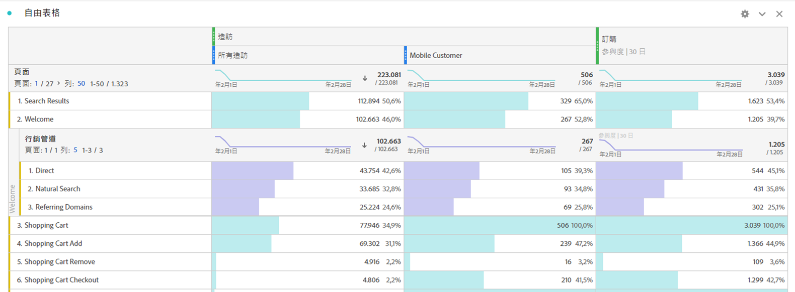
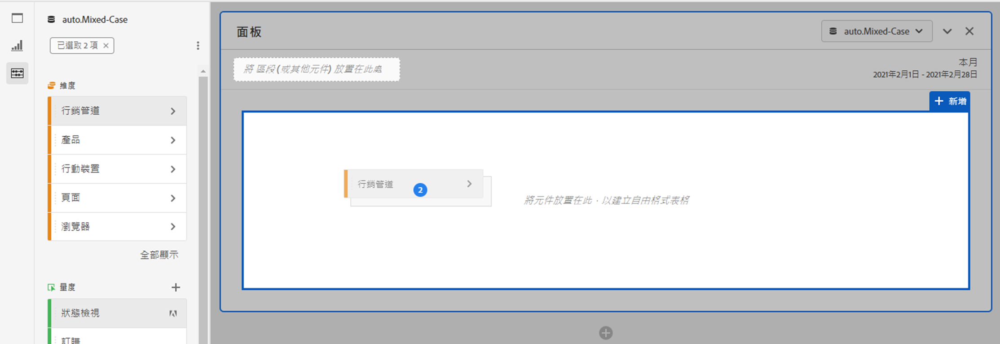

# 自由表格

在分析工作區中，自由表格是互動式資料分析的基礎。 您可以將[元件](https://docs.adobe.com/content/help/zh-Hant/analytics/analyze/analysis-workspace/components/analysis-workspace-components.html)的組合拖放至列和欄中，以建立自訂表格供您進行分析。 每個元件掉落後，表格會立即更新，讓您快速分析並深入挖掘。

## 自動化表格

建立表格的最快方式是直接將元件拖放至空白的專案、面板或自由表格。 自動將以建議的格式為您建立自由表格。 [觀看教學課程](https://experienceleague.adobe.com/docs/analytics-learn/tutorials/analysis-workspace/building-freeform-tables/auto-build-freeform-tables-in-analysis-workspace.html)。

## 自由表格產生器

如果您偏好先將數個元件新增至表格，然後再轉譯資料，則可啟用「自由表格產生器」。啟用產生器後，許多維度、劃分、量度和區段都可直接拖放使用，方便建立表格以供回答更複雜的問題。資料不會即時更新，但當您按一下&#x200B;**[!UICONTROL 「建立」]**，資料就會更新。

## 表格互動

您可以透過多種方式與自由表格互動及自訂表格：

* **行**
   * 您可以調整專案的[檢視密度](https://docs.adobe.com/content/help/zh-Hant/analytics/analyze/analysis-workspace/build-workspace-project/view-density.html)，在單一畫面中放入更多列。
   * 分頁之前，每個維度列最多可顯示 400 列。按一下「列」旁的數字，以顯示頁面上的更多列。 使用頁首中的頁面箭頭，導覽至不同的頁面。
   * 列可以依其他元件劃分。若要一次劃分許多列，只需選取多列，然後將下一個元件拖曳至選取的列上即可。進一步了解[劃分](https://docs.adobe.com/content/help/zh-Hant/analytics/analyze/analysis-workspace/components/dimensions/t-breakdown-fa.html)。
   * 您可以[篩選](https://docs.adobe.com/content/help/zh-Hant/analytics/analyze/analysis-workspace/visualizations/freeform-table/pagination-filtering-sorting.html)列，以顯示縮減的項目集。[「列設定」](https://docs.adobe.com/content/help/en/analytics/analyze/analysis-workspace/visualizations/freeform-table/column-row-settings/table-settings.html)底下提供其他設定。

* **欄**
   * 元件可堆疊在欄內，以建立分段量度、跨標籤分析等等。
   * [欄設定](https://docs.adobe.com/content/help/zh-Hant/analytics/analyze/analysis-workspace/build-workspace-project/column-row-settings/column-settings.html)底下可調整每個欄的檢視方式。
   * 您可善用[滑鼠右鍵功能表](https://docs.adobe.com/content/help/en/analytics-learn/tutorials/analysis-workspace/building-freeform-tables/using-the-right-click-menu.html)執行數個動作。無論是在表格標頭、列或欄上按一下，功能表都會提供不同動作。

## 匯出自由表格資料

進一步瞭解分析工作區的所有資料[匯出選項](https://experienceleague.adobe.com/docs/analytics/analyze/analysis-workspace/curate-share/download-send.html)。

* 按一下右鍵> **[!UICONTROL 將資料複製到剪貼簿]**&#x200B;導出顯示的表資料。 如果選擇了表，此選項將顯示「將選擇複製到剪貼簿」。 ******Ctrl+C**&#x200B;熱鍵還複製選定的資料。
* 以滑鼠右鍵按一下> **[!UICONTROL 以CSV格式下載資料]**，將顯示的表格資料下載為CSV。 如果進行表選擇，此選項會顯示「將選擇下載為CSV **[!UICONTROL 」。]**
* 以滑鼠右鍵按一下> **[!UICONTROL 「專案>下載CSV格式的項目」，最多可針對選取的維度匯出50,000個維度項目。]**

進一步瞭解分析工作區的所有資料[匯出選項](https://experienceleague.adobe.com/docs/analytics/analyze/analysis-workspace/curate-share/download-send.html)。

