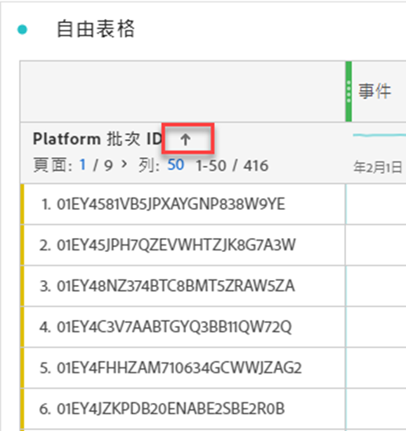

# 表格分頁、篩選及分類

>[!NOTE]
>
>您正在檢視 Customer Journey Analytics 中 Analysis Workspace 的相關文件，其功能集與傳統 Adobe Analytics 中的 [Analysis Workspace 略有不同](https://docs.adobe.com/content/help/zh-Hant/analytics/analyze/analysis-workspace/home.html)。[深入了解...](/help/getting-started/cja-aa.md)

如需 Analysis Workspace 中的表格分頁、篩選及分類概觀，請觀看此影片教學課程：

>[!VIDEO](https://video.tv.adobe.com/v/23968)

## 進階篩選選項 {#section_36E92E31442B4EBCB052073590C1F025}

按一下篩選器圖示，然後按一下自由表格中維度旁的&#x200B;**[!UICONTROL 「顯示進階」]**，即可讓您使用下列標準加以篩選。您可以套用多個篩選規則。

* 包含
* 不包含
* 包含所有字詞
* 包含任何字詞
* 包含片語
* 不包含任何字詞
* 不包含此片語
* 等於
* 不等於
* 開始於
* 終止於

## 自由表格中的維度排序

>[!NOTE]
>
>維度排序只適用於 Customer Journey Analytics 中的自由表格，不適用於傳統 Adobe Analytics。量度排序可在兩個版本的 Analytics 中完成。

1. 在專案中的任意自由表格中，按一下維度名稱旁的箭頭：

* 向下箭頭會依遞減順序排序，而向上箭頭（預設值）則依遞增順序排序。
* 您可以依字母順序或數值排序維度。例如，您可能在工作流程中有編號的步驟，而且可能想要依步驟編號排序。您可以依日期排序與日期相關的維度。或者，您也可以依字母順序排序資料來源，如上述螢幕擷圖所示。
