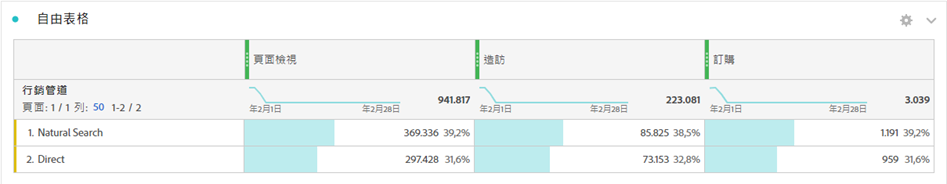

# Analysis Workspace 總計 {#workspace-totals}

<!-- markdownlint-disable MD034 -->

>[!CONTEXTUALHELP]
>id="workspace_freeformtable_grandtotal"
>title="總量"
>abstract="具靜態列的表格或劃分不支援總量"

<!-- markdownlint-enable MD034 -->

在自由表格中，每個劃分層級都會顯示總列數，當中會顯示兩個總計數字：

* **[!UICONTROL 表格總計]** ➊ - 此總計通常等於[!UICONTROL 總量]或是總量的子集。總計反映了自由表格內套用的任何表格區段，包括[!UICONTROL 不包含任何專案]選項。
* **[!UICONTROL 總量]** (**[!UICONTROL 來自]***數量*) ➋ - 此總計表示已收集的全部事件。在面板層級或自由表格內套用區段時，這項總計會經過調整，藉此反映所有符合區段條件的事件。

## 顯示總計

**[!UICONTROL 「欄設定」]**&#x200B;下方有「**[!UICONTROL 顯示總計]**」和「**[!UICONTROL 顯示總量]**」選項。如果未選中這些設定，總數將從表格中刪除，在總數不合理情況下可能必須這樣做。

[靜態列](/help/analysis-workspace/visualizations/freeform-table/column-row-settings/manual-vs-dynamic-rows.md)總計的行為方式不同，且須使用**[!UICONTROL 「列設定」]**&#x200B;來控制。

| 選項 | 說明 |
|---|---|
| **[!UICONTROL 顯示目前行數的總和作為總數]** | 顯示表格中的客戶端行數總和。此總和&#x200B;**不會**&#x200B;刪除如工作階段或人數等重複量度。 |
| **[!UICONTROL 顯示總量]** | 顯示伺服器端總數。此總和會刪除如工作階段或人數等重複量度。 |

請參閱「[自由表格中的動態與靜態維度項目](column-row-settings/manual-vs-dynamic-rows.md)」。

## 常見問答

| 問題 | 回答 |
|---|---|
| 灰色欄的百分比以哪些「*總計*」為依據？ | 這項「*總計*」取決於「**[!UICONTROL 列設定]**」中的「**[!UICONTROL 百分比]**」設定選取項目：<ul><li>依欄計算百分比 - 此為預設設定。百分比是以「表格總計」為依據。</li><li>依列計算百分比 - 百分比是以「總量」為依據。</li></ul> |
| **[!UICONTROL 「包含「沒有值」」]**&#x200B;設定對總計會有何影響？ | 如果取消勾選「**[!UICONTROL 包含「無值」]**」設定，「**[!UICONTROL 無值]**」列會從表格和「表格總計」中移除，且這種情形會持續在任何使用「[*總計*」量度類型的計算量度中生效](/help/components/calc-metrics/cm-workflow/m-metric-type-alloc.md)。 |
| 將自訂表格區段套用至自由表格時，我所有的計算量度和條件式格式是否都會針對該區段進行考量？ | 目前不會。**[!UICONTROL 包含「沒有值」]**&#x200B;已考慮在內，但自訂資料表區段不會影響下列專案：<ul><li>條件式格式使用的欄最大值 / 最小值範圍會檢查所有資料。</li><li>使用「**[!UICONTROL 總量]**」量度類型的計算量度 。</li><li>內含的函數可計算自由表格中所有列的計算量度：「欄加總」、「欄最大值」、「欄最小值」、「計數」、「平均值」、「中位數」、「百分位數」、「四分位數」、「列計數」、「標準差」、「變數」、「累積」、「累積平均值」、「迴歸變數」、「T 分數」、「T 檢定」、「Z 分數」和「Z 檢定」。</li></ul> |
| 在計算量度中，**[!UICONTROL 「總量」]**&#x200B;量度類型會反映什麼？ | **[!UICONTROL 總計]**&#x200B;會繼續參考&#x200B;**[!UICONTROL 總計]**，不會反映套用至表格或&#x200B;**[!UICONTROL 表格總計]**&#x200B;的區段。 |
| 如果資料經由自由表格複製貼上或透過 CSV 下載，系統會顯示哪項總計？ | 總列數只會反映「**[!UICONTROL 表格總計]**，並遵從欄的「**[!UICONTROL 顯示總計]**」設定。 |
