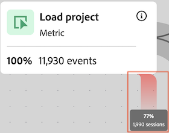

# 設定歷程畫布視覺化圖表

您可以利用歷程畫布視覺化圖表，針對您提供給使用者和客戶的歷程進行分析並獲取深入洞察。

## 歷程畫布概觀

請參閱[歷程畫布概觀](/help/analysis-workspace/visualizations/journey-canvas/journey-canvas.md)，了解更多關於歷程畫布的資訊，包括：

* 主要功能

* 潛在的洞察

* 歷程畫布和流失之間的差異

* 關於分析 Journey Optimizer 歷程的詳細資訊

* 還有更多內容

## 開始建立歷程畫布視覺化圖表

1. 將空白面板新增至您的專案，選取左側邊欄中的「[!UICONTROL **視覺化圖表**]」圖示，然後將「[!UICONTROL **歷程畫布**]」視覺化圖表拖曳至面板中。

   或

   按照[視覺化圖表概觀](/help/analysis-workspace/visualizations/freeform-analysis-visualizations.md)中[將視覺化圖表新增到面板](/help/analysis-workspace/visualizations/freeform-analysis-visualizations.md#add-visualizations-to-a-panel)一節所說明的任一方式，新增歷程畫布視覺化圖表。

   

1. 指定下列基本資訊以設定歷程畫布：

   | 欄位 | 函數 |
   |---------|----------|
   | [!UICONTROL **主要量度**] | 決定在計算歷程中各節點的百分比和數量值時使用的量度。
**注意**：包含在每個百分比和數量值中的資料範圍，依照您在「**[!UICONTROL 歷程畫布容器]**」欄位中選取的量度而定。例如，若將&#x200B;**[!UICONTROL 個人]**&#x200B;設定為容器，則歷程中顯示的統計資料涵蓋特定個人的多個工作階段。而若將&#x200B;**[!UICONTROL 工作階段]**&#x200B;設定為容器，則歷程中顯示的統計資料會限定為特定個人的單一已定義工作階段。

請參考下列範例，瞭解主要量度如何影響各節點之百分比和數量值：
<ul><li>若&#x200B;_人員_&#x200B;為主要量度，而&#x200B;_個人_&#x200B;為容器，則只有事件符合歷程中每個後續節點之條件的人員會在整個歷程中推進。當個人從未到達歷程中任何緊接的下一個節點時，就會在節點上發生流失。這些人可能在網站上已執行其他動作，但不符合任何緊隨其後之節點所定義的條件。</li><li>若&#x200B;_人員_&#x200B;為主要量度，而&#x200B;_工作階段_&#x200B;是容器，則只有在單一工作階段中有事件符合歷程中各節點之條件的人員，才會在整個歷程中推進。當使用者從未在單一工作階段中到達歷程中緊接的下一個節點時，節點上會發生流失。這些人可能有於工作階段內在網站上執行其他動作，但不符合任何緊隨其後之節點所定義的條件。</li></ul> 
主要量度會在以下層面對歷程畫布視覺化圖表造成影響：
<ul><li>各節點上顯示的總數。  
例如，若事件為主要量度，則各節點會顯示其事件符合該節點 (以及在歷程中導向該節點的各前一個節點) 之條件的人員數量。
</li><li>各節點上顯示的百分比。(建立視覺化圖表後，您可以使用「**[!UICONTROL 百分比值]**」下拉式功能表來選擇顯示總數百分比、前一個節點的百分比或開始節點的百分比。)
例如，若事件為主要量度，則每個節點會顯示其事件符合該節點 (以及在歷程中導向該節點的各個前一個節點) 之條件的人員百分比。
</li><li>將維度新增至視覺化圖表時，會根據主要量度新增視覺化圖表的前 3 大節點。</li></ul> |
   | [!UICONTROL **次要量度**] | 決定計算歷程中各節點的百分比和數量值時使用的次要量度。次要量度為自由選用。 
**注意**：包含在每個百分比和數量值中的資料範圍，依照您在「**[!UICONTROL 歷程畫布容器]**」欄位中選取的量度而定。例如，若將&#x200B;**[!UICONTROL 個人]**&#x200B;設定為容器，則歷程中顯示的統計資料涵蓋特定個人的多個工作階段。而若將&#x200B;**[!UICONTROL 工作階段]**&#x200B;設定為容器，則歷程中顯示的統計資料會限定為特定個人的單一已定義工作階段。

設定次要量度時，會從以下層面影響歷程畫布視覺化圖表：
<ul><li>在主要量度之下各節點顯示的總數。 
例如，若帳戶為次要量度，則會在節點上顯示到達歷程中該節點之所有人員的帳戶數量。
</li><li>在主要量度之下各節點顯示的百分比。(建立視覺化圖表後，您可以選擇顯示總數百分比或開始節點的百分比。)</li>
例如，若工作階段為次要量度，則各節點會顯示到達歷程中該節點的工作階段之百分比 (總數百分比或開始節點的百分比)。
</li></ul> |
   | [!UICONTROL **Journey Optimizer 歷程**]<!-- name? --> | 選取您要在歷程畫布中用做分析基礎的 Journey Optimizer 歷程。具有下列任一狀態的歷程皆可使用：「已上線」、「已停止」或「已結束」 
或者，如果您想要空白的畫布以便在 Analysis Workspace 中建立自己的分析，可將此選項保留空白。
 
當您在歷程畫布中分析 Journey Optimizer 歷程時，該歷程顯示的順序、序列和結構與 Journey Optimizer 相同。如需更多資訊，請參閱[歷程畫布概觀](/help/analysis-workspace/visualizations/journey-canvas/journey-canvas.md)中的[分析 Journey Optimizer 歷程](/help/analysis-workspace/visualizations/journey-canvas/journey-canvas.md#analyze-journey-optimizer-journeys)。

**注意**：唯有在偵測到 Journey Optimizer 資料出現在您新增視覺化圖表的 Analysis Workspace 面板內所選取的相同資料視圖中，才會顯示此選項。如需關於變更 Analysis Workspace 中面板上資料視圖的資訊，請參閱 [Analysis Workspace 概觀](/help/analysis-workspace/home.md)。
 |

1. (選用) 選取「[!UICONTROL **顯示進階設定**]」，然後指定下列資訊：

   | 欄位 | 函數 |
   |---------|----------|
   | [!UICONTROL **歷程畫布容器**] | 選擇您想要在整個歷程中專心處理的容器。您選擇的容器會決定在歷程中擷取的資料範圍。這會影響視覺化圖表中顯示的統計資料。(如果您的容器名稱與下方顯示的預設名稱不同，則這些是在您的資料視圖中自訂的名稱。)<ul><li>**工作階段：**&#x200B;將視覺化圖表的統計資料限定在特定個人的單一已定義工作階段內。這表示各節點上顯示的數量和百分比 (根據主要和次要量度)，必須發生在各人的單一工作階段中。換言之，一個人在單一歷程中可以多次被計算。
此容器使用工作階段量度。
</li><li>**人員：**(預設) 視覺化圖表的統計資料可以涵蓋特定個人的多個工作階段。這表示各節點上顯示的數量和百分比 (根據主要和次要量度) 可以發生在任何數量的工作階段中，只要這些工作階段屬於同一個人。換言之，一個人在單一歷程中只能被計算一次。
此容器使用人員量度。
</li></ul> |

1. 選取「[!UICONTROL **建置**]」。

   若您選取 Journey Optimizer 歷程，該歷程的顯示順序、序列和結構與 Journey Optimizer 相同。(唯有擁有 Journey Optimizer 存取權的使用者才能選取 Journey Optimizer 歷程。)

   <!-- add screen shot -->

   如果您未選取 Journey Optimizer 歷程，則會顯示空白畫布，讓您開始將節點新增至歷程。(唯有擁有 Journey Optimizer 存取權的使用者才能選取 Journey Optimizer 歷程。)

   <!-- add screen shot -->

1. 無論您是從空白畫布建立新的分析，或者要分析 Journey Optimizer 歷程，都可以依照[設定視覺化圖表設定](#configure-visualization-settings)中所述方法設定歷程。

## 配置視覺化圖表設定

歷程畫布標頭中有各種設定選項。

若要配置歷程畫布視覺化圖表的設定：

1. 在 Analysis Workspace 中，開啟現有的歷程畫布視覺化圖表，或[開始建立新的視覺化圖表](#begin-building-a-journey-canvas-visualization)。

   您可在標頭中找到可用來設定歷程畫布視覺化圖表的選項：

   

1. 設定下列任一顯示於視覺化圖表上方的項目：

   | 設定 | 功能 |
   |---------|----------|
   | [!UICONTROL **百分比值**] | 歷程中各節點上顯示的百分比值。

 
設定歷程中節點上顯示的百分比值時，請考量下列事項：
<ul><li>主要量度的各節點會顯示一個百分比。若有設定次要量度，也會顯示其百分比。(如需主要和次要量度設定的詳細資訊，請參閱[開始建立歷程畫布視覺化圖表](#begin-building-a-journey-canvas-visualization)。)</li><li>百分比包含在面板的日期範圍內，資料視圖中包含的所有人員或工作階段。使用&#x200B;_人員_&#x200B;或&#x200B;_工作階段_&#x200B;取決於容器設定。(如需關於容器設定的詳細資訊，請參閱[開始建立歷程畫布視覺化圖表](#begin-building-a-journey-canvas-visualization)。)</li></ul> 
從下列選項中選擇：
 <ul><li>[!UICONTROL **開始節點的百分比**]：計算各節點上顯示的相對於開始節點的百分比。百分比以您選取的主要和次要量度為依據。 
_開始節點_&#x200B;是指在其之前沒有任何連接節點的節點。

歷程可包含多個開始節點。但是，如果歷程包含 2 個或多個導向共同節點的開始節點，則會使用&#x200B;[!UICONTROL **總數百分比**]。如果您想要使用&#x200B;[!UICONTROL **開始節點的百分比**]，請更新歷程，讓歷程中各節點都可以回溯至同一個開始節點。
</li><li>[!UICONTROL **前一個節點的百分比**]：計算各節點顯示的相對於前一個節點的百分比。百分比以您選取的主要和次要量度為依據。</li><li>[!UICONTROL **總數百分比**]：計算每個節點上顯示的相對於資料視圖中所有資料的百分比。百分比以您選取的主要和次要量度為依據。</li></ul> |
   | [!UICONTROL **箭頭設定**] | 您可以將歷程畫布中節點之間顯示的箭頭設定為顯示自訂標籤和值。 

_標籤_&#x200B;是出現在箭頭上的自訂名稱。特定箭頭上只會顯示一個標籤。標籤可以是下列任何一項，並依照下列偏好順序顯示：
<ol><li>從歷程畫布新增的自訂名稱 (如[在箭頭上新增或更新標籤](#add-or-update-a-label-on-an-arrow)所述)</li><li>Journey Optimizer 標籤</li><li>Journey Optimizer 條件</li></ol>
_值_&#x200B;是顯示在箭頭上的數量和百分比，表示從歷程中一個節點移至下一個節點的人員或工作階段。(換言之，是指在特定步驟時沒有從歷程中流失的使用者。) 

下列選項適用於並非源自 Journey Optimizer 的歷程，以及在歷程畫布中未大幅修改的 Journey Optimizer 歷程：(重大修改包括新增或移除節點、新增或移除箭頭，或變更節點的元件。)
<ul><li>[!UICONTROL **無標籤**]：歷程中的箭頭未顯示任何標籤。 此選項只有在歷程已修改時才能使用 </li><li>[!UICONTROL **只有標籤**]：歷程中的箭頭顯示標籤。</li></ul>
下列選項適用於在歷程畫布中經過重大修改的 Journey Optimizer 歷程：(重大修改包括新增或移除節點、新增或移除箭頭，或變更節點的元件。)(**注意**：唯有在偵測到 Journey Optimizer 資料出現在您新增視覺化圖表的 Analysis Workspace 面板內所選取的相同資料視圖中，才會顯示此選項。如需關於變更 Analysis Workspace 中面板上資料視圖的資訊，請參閱 [Analysis Workspace 概觀](/help/analysis-workspace/home.md)。)
<ul><li>[!UICONTROL **無標籤或值**]：歷程中的箭頭未顯示標籤或值。</li><li>[!UICONTROL **只有標籤**]：歷程中的箭頭只有顯示標籤。沒有顯示值。</li><li>[!UICONTROL **只有值**]：歷程中的箭頭上只顯示值。沒有顯示標籤。</li><li>[!UICONTROL **值和標籤**]：歷程中的箭頭上皆有顯示標籤和值。</li></ul> |
   | [!UICONTROL **顯示流失**] | 流失資料顯示從歷程的各節點流失的百分比和數量。流失資料是以與歷程的容器設定相關聯的量度，而非主要或次要量度為依據。 

依預設，容器是&#x200B;_個人_，因此用於流失資料的量度是&#x200B;_人員_。如果容器變更為&#x200B;_工作階段_，則用於流失資料的量度為&#x200B;_工作階段_，以此類推。

例如，以&#x200B;_個人_&#x200B;做為容器設定，「流失」會顯示歷程中各節點上從未到達緊接的下一個節點的人數和百分比。這些人可能在網站上已執行其他動作，但不符合任何緊隨其後之節點所定義的條件。
 
如需關於歷程畫布容器設定的詳細資訊，請參閱[開始建立歷程畫布視覺化圖表](#begin-building-a-journey-canvas-visualization)。 |
   | **縮放控制項** | 下列縮放控制項位於畫布的右上角：<ul><li>**放大**：將視覺化圖表的特定區域放大顯示。
您也可以使用滑鼠控制項，例如在觸控板上捏合。
</li><li>**縮小**：縮小視覺化圖表，讓畫布騰出更多空間。
您也可以使用滑鼠控制項，例如在觸控板上捏合。
</li><li>**符合螢幕**：調整目前的縮放和平移設定，讓視覺化圖表填滿螢幕。</li></ul>
若要在放大或縮小後橫跨畫布進行平移，請按一下滑鼠並拖曳至所需的位置。
 |

1. 繼續進行[新增節點](#add-nodes)。

## 新增節點

歷程畫布視覺化圖表中的節點代表使用者歷程的事件或動作。

您可以透過下列方式建立節點：將 Workspace 元件從左側邊欄拖曳至畫布；允許歷程畫布根據現有節點選擇最主要的下一個或上一個節點；或複製現有節點。

### 從左側邊欄拖拉元件

1. 在 Analysis Workspace 中，開啟現有的歷程畫布視覺化圖表，或[開始建立新的視覺化圖表](#begin-building-a-journey-canvas-visualization)。

1. 從左側邊欄將量度、維度、維度項目、區段或日期範圍拖曳至畫布上。支援以[衍生欄位](/help/data-views/derived-fields/derived-fields.md)為基礎的量度。但是，不支援計算量度，以及任何以[摘要資料集](/help/data-views/summary-data.md)為基礎的量度或維度。

   按住 Shift 或按住 Command (Mac 版) 或 Ctrl (Windows 版)，即可在左側邊欄選取多個元件。

   視覺化圖表會根據主要量度進行更新，如下所示 (視元件類型和您放置元件的畫布區域而定)：

   | 元件類型 | 元件放置位置 | 新增節點後的視覺化圖表更新 |
   |---------|----------|----------|
   | 量度 | 畫布的空白區域 | 節點會顯示在元件放置處，且未與任何現有節點連接。 |
   | 量度 | 現有節點 | 元件會自動與現有節點結合。(如需更多資訊請參閱[合併節點](#combine-nodes)。)
 |
   | 量度 | 2 個現有節點之間的箭頭 | 節點會顯示在兩個現有節點之間的元件放置處，且連接至兩個現有節點。(如需更多資訊請參閱[連接節點](#connect-nodes)。)
 |
   | 維度 | 畫布的空白區域 | 系統會在元件放置處，根據前 3 大維度項目建立 3 個節點，且未與任何現有節點連接。(**注意：**&#x200B;如果只顯示 1 或 2 個節點，表示只有 1 或 2 個維度項目具有可用資料。如果沒有顯示任何節點，表示任何維度項目皆無可用的資料。於此情況下，請嘗試將其新增至歷程的不同點、調整視覺化圖表的日期範圍，或選擇不同的維度。)
按住 Shift 鍵，將維度放在畫布上，新增為具有 3 個維度項目的單一節點。

 |
   | 維度 | 現有節點 | 劃分功能會自動套用至顯示前 5 個維度項目的節點。<!--what happens if you hold Shift?-->
若要在新的自由格式表格視覺化圖表中檢視劃分，請選取節點上的「[!UICONTROL **在自由格式表格中開啟**]」連結。
 |
   | 維度 | 連接 2 個現有節點的箭頭 | 系統會針對 (最終到達第二個節點的人員或工作階段的) 第一個節點之後的第一個事件中，前 3 大的維度項目建立 3 個節點。節點顯示在兩個現有節點之間放置元件處，且各節點連接至兩個現有節點。(**注意：**&#x200B;如果只顯示 1 或 2 個節點，表示只有 1 或 2 個維度項目具有可用資料。如果沒有顯示任何節點，表示任何維度項目皆無可用的資料。於此情況下，請嘗試將其新增至歷程的不同點、調整視覺化圖表的日期範圍，或選擇不同的維度。)
按住 Shift 鍵，將維度放在畫布上，新增為具有 3 個維度項目的單一節點。(如需更多資訊請參閱[連接節點](#connect-nodes)。)
 |
   | 維度項目 | 畫布的空白區域 | 節點會顯示在元件放置處，且未與任何現有節點連接。 |
   | 維度項目 | 現有節點 | 元件會自動與現有節點結合。 |
   | 維度項目 | 連接 2 個現有節點的箭頭 | 節點會顯示在兩個現有節點之間的元件放置處，且連接至兩個現有節點。(如需更多資訊請參閱[連接節點](#connect-nodes)。)
 |
   | 區段 | 畫布的空白區域 | 節點會顯示在元件放置處，且未與任何其他節點連接。
節點上顯示的數量和百分比包含主要量度的總計，會以您選取的區段進行區隔。
 
例如，如果選取「人員」做為歷程的主要量度，則將「今天」的區段新增至畫布的空白區域，會顯示今天有事件的所有人員。
 |
   | 區段 | 現有節點 | 將區段套用至現有節點。 |
   | 區段 | 連接 2 個節點的箭頭 | 節點會顯示在兩個現有節點之間的元件放置處，且連接至兩個現有節點。(如需更多資訊請參閱[連接節點](#connect-nodes)。)

將區段套用至路徑上放置元件的點。
 |
   | 日期範圍 | 畫布的空白區域 | 節點會顯示在元件放置處，且未與任何其他節點連接。
節點上顯示的數量和百分比包含主要量度的總計，會以您選取的日期範圍進行區隔。
 
例如，如果選擇「人員」做為歷程的主要量度，則將「本月」的日期範圍新增至畫布的空白區域，會顯示當月有事件的所有人員。
 |
   | 日期範圍 | 現有節點 | 將日期範圍套用至現有節點。 |
   | 日期範圍 | 連接 2 個節點的箭頭 | 節點會顯示在兩個現有節點之間的元件放置處，且連接至兩個現有節點。(如需更多資訊請參閱[連接節點](#connect-nodes)。)

將日期範圍套用至路徑上放置元件的點。
 |
   | 多個元件 | 畫布的空白區域 | **如果沒有任何元件是維度：**
各元件會在元件放置處顯示為獨立節點，且未與任何現有節點連接。

按住 Shift 鍵，將元件放到畫布上，將其新增為合併節點。 

**如果您要新增的任何元件是維度：**

各元件會在元件放置處顯示為獨立節點，且未與任何現有節點連接。

一次只能新增一個維度。新增維度時，系統會在元件放置處，根據前 3 大維度項目建立 3 個節點。

按住 Shift 鍵，將元件放到畫布上，將其新增為合併節點。前 3 大維度項目會與各節點結合。(如需更多資訊請參閱[合併節點](#combine-nodes)。)
 |
   | 多個元件 | 現有節點 | 所有元件都會與現有節點結合。
如果您新增的任何元件是維度，則前 3 大維度項目會與節點結合。
 
一次只能新增一個維度。
 |
   | 多個元件 | 連接 2 個現有節點的箭頭 | **如果沒有任何元件是維度：**
各元件會在元件放置處顯示為獨立節點，且每個節點皆與兩個現有節點連接。(如需更多資訊請參閱[連接節點](#connect-nodes)。)

按住 Shift 鍵，將元件放到畫布上，將其新增為合併節點。(元件必須屬於相同類型，才能合併至單一節點。) (如需更多資訊，請參閱[合併節點](#combine-nodes)。)

**如果您要新增的任何元件是維度：**

各元件會在元件放置處顯示為獨立節點，且每個節點皆與兩個現有節點連接。

一次只能新增一個維度。新增維度時，系統會針對 (最終到達第二個節點的人員或工作階段的) 第一個節點之後的第一個事件中，前 3 大的維度項目建立 3 個節點。各節點都連接到兩個現有節點。(如需更多資訊請參閱[連接節點](#connect-nodes)。)

按住 Shift 鍵，將元件放到畫布上，將其新增為合併節點。前 3 大維度項目會與各節點結合，而各節點皆連接至兩個現有節點。(如需更多資訊請參閱[合併節點](#combine-nodes)。)
 |

   節點會顯示為矩形方塊，並提供下列資訊：

   * 元件名稱

   * 元件類型 (例如量度或維度)

   * 主要量度統計資料 (總數和百分比)

   * 次要量度統計資料 (總數和百分比)

   閃爍或發光的節點表示該節點正在載入資料。

1. 重複此程序，繼續新增節點來建置您的歷程。

1. 繼續自訂歷程，如下一個區段所述。您可以連接節點、重新命名節點、套用劃分、建立客群、新增時間限制等。

### 根據現有節點顯示熱門的節點

您可以根據畫布上已存在的節點，自動顯示與其相鄰的熱門節點。您可以將熱門節點新增至歷程畫布，或在自由格式表格中檢視。

歷程畫布在決定要顯示哪些節點時會使用主要量度。

此選項適用於畫布上的下列物件：

* 單一節點

* 節點之間的箭頭

#### 顯示現有節點之後的熱門節點

您可以選取節點，並在歷程中顯示緊隨該節點之後熱門維度項目。您可以將前 3 大維度項目新增至歷程畫布做為獨立節點，或在自由格式表格中檢視所有熱門的維度項目。

1. 在節點上按一下滑鼠右鍵，即可顯示歷程中該節點之後的熱門維度項目。

   該節點在歷程中不得有任何現有節點接續其後。

1. 選取「[!UICONTROL **顯示此節點之後的熱門節點**]」。

1. 選取您要顯示維度項目的位置：

   * [!UICONTROL **在歷程畫布中**]：將歷程中此節點之後的前 3 大節點新增至畫布。各節點都會連接到您在畫布上選取做為單獨分支的節點。

   * [!UICONTROL **在自由格式表格中**]：建立自由格式表格視覺化圖表，顯示歷程中此節點之後的所有熱門維度項目。

1. 從維度清單中選取所需的維度。

   根據您在上一步中選擇的內容，前 3 大維度項目會新增到畫布中成為 3 個獨立節點，或者所有熱門維度項目都會顯示在自由格式表格中。

#### 顯示現有節點之前的熱門節點

您可以選取節點，並顯示在歷程中其前一個節點的熱門維度項目。您可以將前 3 大維度項目新增至歷程畫布做為獨立節點，或在自由格式表格中檢視所有熱門的維度項目。

1. 在節點上按一下滑鼠右鍵，顯示歷程中該節點之前的熱門維度項目。

   在歷程中此節點不能有任何連接進來的現有節點。

1. 選取「[!UICONTROL **顯示此節點之前的熱門節點**]」。

1. 選取您要顯示維度項目的位置：

   * [!UICONTROL **在歷程畫布中**]：將歷程中此節點之前的前 3 大節點新增至畫布。各節點都會連接到您在畫布上選取做為單獨分支的節點。

   * [!UICONTROL **在自由格式表格中**]：建立自由格式表格視覺化圖表，顯示歷程中此節點之前所有的熱門維度項目。

1. 從維度清單中選取所需的維度。

   根據您在上一步中選擇的內容，前 3 大維度項目會新增到畫布中成為 3 個獨立節點，或者所有熱門維度項目都會顯示在自由格式表格中。

#### 顯示現有節點之間的熱門節點

您可以選取箭頭，並顯示歷程中 2 個現有節點之間的熱門維度項目。您可以將前 3 大維度項目新增至歷程畫布做為獨立節點，或在自由格式表格中檢視所有熱門的維度項目。

1. 以滑鼠右鍵按一下您要顯示熱門維度項目之 2 個節點間的箭頭。

1. 選取「[!UICONTROL **顯示這些節點之間的熱門節點**]」。

1. 選取您要顯示維度項目的位置：

   * [!UICONTROL **在歷程畫布中**]：將介於 2 個現有節點之間的前 3 大節點新增至畫布。畫布上每個節點都會以獨立分支的形式連接到周圍的節點。

   * [!UICONTROL **在自由格式表格中**]：建立自由格式表格視覺化圖表，顯示介於 2 個現有節點之間的所有熱門維度項目。

1. 從維度清單中選取所需的維度。

   根據您在上一步中選擇的內容，前 3 大維度項目會新增到畫布中成為 3 個獨立節點，或者所有熱門維度項目都會顯示在自由格式表格中。

### 重複節點

畫布上的下列物件可使用重複選項：

* 單一節點

* 多個節點

若要重複節點：

1. 請選取一個或多個您要重複的節點。

   若要選取多個節點，請按住 Command (在 Mac 上) 或 Ctrl (在 Windows 上)。

1. 在其中一個選取的節點上按一下滑鼠右鍵，然後選取「[!UICONTROL **重複**]」。

## 設計歷程

節點順序及節點間的連線會影響歷程畫布資料。歷程應以視覺化方式準確地反映您要報告的事件順序。

將節點新增至畫布後，您可以重新排列節點、合併節點、連接節點，以及在節點之間新增時間限制。

### 重新排列節點

歷程畫布中的歷程包含由節點和箭頭組成且可彈性調整的圖表，用來呈現事件、維度項目和區段的任何組合。

您可以拖曳畫布上的節點，重新排列歷程的事件和條件。

當您重新排列歷程中節點的順序時，資料會據此更新。

### 合併節點

歷程畫布中的合併節點是使用者歷程 (節點) 中的單一點，包含 2 個或更多透過邏輯連接在一起的元件。

#### 建立合併節點

您可以執行下列任一操作，在歷程畫布中合併節點：

* 從左側邊欄將單一元件拖曳至畫布上的節點。

* 從左側邊欄同時拖曳多個元件至畫布上的節點。

* 按住 Shift 鍵並從左側邊欄同時拖曳多個元件至畫布的空白區域。

<!-- * On the canvas, select the nodes that you want to combine, right-click one of the selected nodes, then select **Combine**. Is there a limit on how many you can combine? -->

#### 合併節點時的邏輯

合併節點時套用至節點的邏輯會根據您要合併的元件類型而有所不同，如下所示：

>[!TIP]
>
>您可以在節點上按一下滑鼠右鍵，然後選取「[!UICONTROL **從節點建立區段**]」，即可檢視合併節點的邏輯。此邏輯會顯示在&#x200B;[!UICONTROL **定義**]&#x200B;區段中。

| 要合併的元件類型 | 使用的邏輯 (運算子) |
|---------|----------|
| 量度 + 量度 | 以 OR 條件連結 |
| 維度項目 + 維度項目 (來自相同的上層維度) | 以 OR 條件連結 |
| 維度項目 + 維度項目 (來自不同的上層維度) | 以 AND 條件連結 |
| 區段 + 區段 | 以 AND 條件連結 |
| 維度 + 量度、日期範圍或區段 | 以 AND 條件連結 |
| 日期範圍 + 量度、區段或維度 | 以 AND 條件連結 |
| 區段 + 量度、日期範圍或維度 | 以 AND 條件連結 |

### 連接節點

您可以連接畫布上已存在的節點，也可以在將節點新增至畫布時連接節點。

您可以連接節點，以便定義歷程的事件序列。

#### 節點之間的箭頭

各節點以箭頭連接。箭頭方向和寬度都有意義：

* **方向**：表示歷程的事件序列

* **寬度**：表示從一個節點到另一個節點的百分比份量

  

#### 連接節點時的邏輯

當您連接歷程畫布中的節點時，會使用 THEN 運算子來連接節點。這也稱為[循序細分](/help/components/segments/seg-sequential-build.md)。

我們將節點視為「最終路徑」進行連接，意即只要訪客最後從一個節點移動到另一個節點，就會納入計算，而不管 2 個節點之間發生什麼事件。使用者沿著路徑移動的配給時間，由容器設定決定。<!-- It can also be controlled by [adding a time constraint](#add-a-time-constraint-between-nodes). -->

您可以在節點上按一下滑鼠右鍵，然後選取「[!UICONTROL **從節點建立區段**]」，即可檢視連接節點的邏輯。此邏輯會顯示在&#x200B;[!UICONTROL **定義**]&#x200B;區段中。

#### 連接現有節點

歷程不能循環回到先前連接的節點。

若要連接歷程畫布中的節點：

1. 在歷程畫布視覺化圖表中，將游標停留於歷程序列中您要連接至另一個節點的首個節點上。

   所選節點的兩側會出現 4 個藍色點。

1. 將 4 個藍點中任何一個拖曳至您要連接之節點 4 個側邊中的任何一邊。

   會出現一個箭頭，連接這 2 個節點。如需更多資訊，請參閱[節點之間的箭頭](#arrows-between-nodes)。

#### 在新增節點時連接節點

將節點新增至畫布時，您可以將其放在兩個連接節點之間。節點會新增到介於 2 個現有節點之間的歷程流程中。

如需更多資訊，請參閱[新增節點](#add-nodes)。

<!--

### Add a time constraint between nodes

>[!AVAILABILITY]
>
>This feature is not yet available.

You can set a time constraint between nodes. When a time constraint is in place, people are considered to have fallen out of the journey if they follow the defined journey but take longer than the allotted time period to move between the nodes.

The option to add a time constraint is available for the following objects on the canvas:

* The arrow between nodes

To add a time constraint:

1. In a Journey canvas visualization, right-click the arrow between 2 nodes, then select [!UICONTROL **Add time constraint**].

from Travis: You can set time to be within X amount of time or after X amount of time (those are the only two options I think, but we can check with Brandon). 
1. Choose from the following options: 

-->

## 管理節點或箭頭

<!--

### Change the color of a node or arrow

>[!AVAILABILITY]
>
>This feature is not yet available.

You can visually customize a journey by changing the color of any node or arrow on the canvas. For example, you could adjust colors to indicate a desirable or undesirable event.

The option to change the color is available for the following objects on the canvas:

* Individual nodes

* The arrow between nodes

To change the color of a node or arrow:

1. In a Journey canvas visualization, right-click the node or arrow whose color you want to change.

1. Select [!UICONTROL **Change color**]. 

1. Select the desired color. 

   The following colors are available: 

-->

### 重新命名節點

將元件拖曳至歷程畫布視覺化圖表，便會建立與元件名稱同名的節點。您可以重新命名節點，以便更加符合節點所代表的歷程步驟。

畫布上的下列物件可以使用重新命名的選項：

* 單一節點

若要重新命名節點：

1. 在歷程畫布視覺化圖表中，在您重新命名的節點上按一下滑鼠右鍵。

1. 選取「[!UICONTROL **重新命名**]」。

1. 指定新名稱，然後按下 Enter。<!--is that right?-->

### 新增或更新箭頭上的標籤

您可以將歷程畫布中節點之間顯示的箭頭設定為顯示自訂標籤和值。

標籤是出現在箭頭上的自訂名稱。特定箭頭上只會顯示一個標籤。

關於箭頭上顯示之標籤和值的詳細資訊，請參閱[配置視覺化圖表設定](#configure-visualization-settings)中的「箭頭設定」。

畫布上的下列物件可以使用新增或更新標籤的選項：

* 節點之間的箭頭

若要將標籤新增至箭頭：

1. 在歷程畫布視覺化圖表中，在您要新增標籤的箭頭上按一下滑鼠右鍵。

1. 選取「**[!UICONTROL 新增標籤]**」。

1. 指定標籤的名稱，然後按下 Enter。

   如果箭頭目前設定為隱藏標籤，則會顯示訊息，提示您要顯示標籤。

若要更新箭頭上的現有標籤：

1. 在歷程畫布視覺化圖表中，在您要新增標籤的箭頭上按一下滑鼠右鍵。

1. 選取「**[!UICONTROL 更新標籤]**」。

1. 指定標籤的名稱，然後按下 Enter。

   如果箭頭目前設定為隱藏標籤，則會顯示訊息，提示您要顯示標籤。

### 套用劃分

畫布上的下列物件可使用將劃分套用至資料的選項：

* 單一節點

* 多個節點

* 節點之間的箭頭

* 節點之間的多個箭頭

套用劃分時，請考量下列事項：

* 劃分會套用至主要量度。次要量度不受影響。

* 套用劃分不會變更歷程。反而只是顯示套用劃分的節點之資料的劃分情形。

* 如果節點已有劃分，套用新的劃分會取代現有的劃分。

* 如果在歷程的較早時間點進行變更，則會更新劃分資料。

#### 將劃分套用至一個或多個節點或箭頭

1. 在歷程畫布視覺化圖表中，選取一個或多個要套用劃分的節點，然後在其中一個選取的節點上按一下滑鼠右鍵。

   或

   在歷程畫布視覺化圖表中，選取您要套用劃分的 2 個節點之間的一個或多個箭頭，然在其中一個選取的箭頭上按一下滑鼠右鍵。

   若要選取多個節點或箭頭，請按住 Command (在 Mac 上) 或 Ctrl (在 Windows 上)。

1. 選取「[!UICONTROL **劃分**]」。

1. 選擇要檢視劃分的位置：

   * [!UICONTROL **在歷程畫布中**]

   * [!UICONTROL **在自由格式表格中**]

1. 選取要用於劃分的維度。

   如果您選擇在歷程畫布中檢視劃分，則前 5 大維度項目會顯示在節點上。節點提供一個可在自由格式表格中開啟劃分的選項。

   如果您選擇在自由格式表格中檢視劃分，熱門維度項目會顯示在新的自由格式表格中，緊接在歷程畫布視覺化圖表之後。

#### 將劃分套用至單一節點

您可以從左側邊欄將一個維度拖曳至畫布上您要套用劃分的節點上。

如需更多資訊，請參閱[新增節點](#add-nodes)。

#### 移除劃分

若要移除已套用的劃分：

1. 在已套用劃分的節點上按一下滑鼠右鍵。

1. 選取「**[!UICONTROL 移除劃分]**」。

### 建立客群

畫布上的下列物件可使用建立客群的選項：

* 單一節點

* 多個節點

* 節點之間的箭頭

* 節點之間的多個箭頭

從多個節點或箭頭建立客群時，會使用 OR 運算子連結。

若要建立客群：

1. 在歷程畫布視覺化圖表中，選取一個或多個要建立客群的節點，然後在其中一個選取的節點上按一下滑鼠右鍵。

   或

   在歷程畫布視覺化圖表中，選取您要建立客群的 2 個節點之間的一個或多個箭頭，然後在其中一個選取的箭頭上按一下滑鼠右鍵。

   若要選取多個節點或箭頭，請按住 Command (在 Mac 上) 或 Ctrl (在 Windows 上)。

   >[!NOTE]
   >
   >客群不能包含計算量度或任何以[摘要資料集](/help/data-views/summary-data.md)為基礎的量度。如果您嘗試從歷程畫布的任何區域建立客群，而該區域包含計算量度或以摘要資料集為基礎的量度，則計算量度不會包含在客群定義中。

1. 選取「[!UICONTROL **從節點建立客群**]」，或「[!UICONTROL **從箭頭建立客群**]」。

1. 繼續建立和發佈客群，如[建立和發佈客群](/help/components/audiences/publish.md)中所述。

### 檢視趨勢資料

您可以透過折線圖檢視歷程畫布中物件的趨勢資料。<!--, with some prebuilt anomaly detection data (this is the definition in Fallout) -->

畫布上的下列物件可以使用分析趨勢的選項：

* 單一節點

* 多個節點

* 節點之間的箭頭

* 節點之間的多個箭頭

若要檢視趨勢資料：

1. 在歷程畫布視覺化圖表中，選取一個或多個您要檢視趨勢資料的節點，然後在其中一個選取的節點上按一下滑鼠右鍵。

   或

   在歷程畫布視覺化圖表中，選取您想要檢視趨勢資料的兩個節點之間的一個或多個箭頭，然後在其中一個選取的箭頭上按一下滑鼠右鍵。

   若要選取多個節點或箭頭，請按住 Command (在 Mac 上) 或 Ctrl (在 Windows 上)。

1. 選取「[!UICONTROL **趨勢**]」。

### 根據節點或箭頭建立區段

您可以根據歷程中的節點或箭頭來建立新區段。區段建立後，您就可以在 Analysis Workspace 的任何位置使用。

從歷程畫布建立的區段使用[循序細分](/help/components/segments/seg-sequential-build.md)。這表示區段會使用 THEN 運算子，將人們流經的事件 (歷程) 序列連接在一起，再到達選取的節點或箭頭。所有符合所選節點或箭頭的事件都會納入區段中。

如果您根據有多個路徑流入其中的節點建立區段，則所有路徑都會納入區段中。使用 OR 運算子連接個別路徑。

若要建立區段：

1. 在歷程畫布視覺化圖表中，在您要用來建立區段的節點或箭頭上按一下滑鼠右鍵。

1. 選取「[!UICONTROL **從節點建立區段**]」，或「[!UICONTROL **從箭頭建立區段**]」。

   接著會顯示區段產生器。在&#x200B;[!UICONTROL **定義**]&#x200B;區段中，區段的定義是根據您選取的節點或箭頭及其在歷程中的內容建立的。

1. 指定區段的標題，並進行任何其他變更。如需建立區段的更多資訊，請參閱[區段產生器](/help/components/segments/seg-builder.md)。

1. 選取「[!UICONTROL **儲存**]」，儲存區段。

### 刪除節點

您可以在歷程中一次刪除一個或多個節點。當您刪除歷程中 2 個節點之間連接的節點時，剩餘 2 個節點會直接連接。

若要刪除歷程畫布中的節點：

1. 在歷程畫布視覺化圖表中，選取一個或多個要刪除的節點，然後在其中一個選取的節點上按一下滑鼠右鍵。

1. 選取「[!UICONTROL **刪除**]」。

### 刪除節點之間的箭頭

您可以在歷程中一次刪除一個或多個箭頭。當您刪除 2 個節點之間的箭頭時，這些節點將不再連接。如果箭頭是較長路徑的一部分，則路徑會中斷連接。

若要刪除歷程畫布中節點之間的箭頭：

1. 在歷程畫布視覺化圖表中，選取您要刪除的 2 個節點之間的一個或多個箭頭，然後在其中一個選取的箭頭上按一下滑鼠右鍵。

1. 選取「[!UICONTROL **刪除**]」。

## 從 Journey Optimizer 開啟歷程

在 Journey Optimizer 中檢視歷程時，您可以選擇在歷程畫布中檢視歷程。

1. 在 Journey Optimizer 中，開啟您要在歷程畫布中分析的歷程。

1. 選取「[!UICONTROL **在 CJA 中分析**]」。<!-- ?? -->
