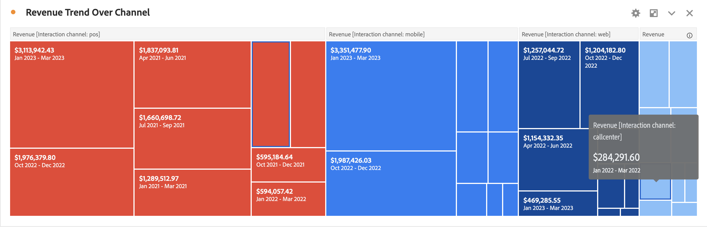

# 樹狀圖 {#treemap}

<!-- markdownlint-disable MD034 -->

>[!CONTEXTUALHELP]
>id="workspace_treemap_button"
>title="樹狀圖"
>abstract="建立樹狀圖視覺效果以顯示具有嵌套矩形的階層式 (樹形結構) 資料。"

<!-- markdownlint-enable MD034 -->

>[!BEGINSHADEBOX]

_本文會在_  _**Customer Journey Analytics**&#x200B;中記錄樹狀圖視覺效果。_ _若需本文的_  _**Adobe Analytics**&#x200B;版本，請參閱[樹狀圖](https://experienceleague.adobe.com/zh-hant/docs/analytics/analyze/analysis-workspace/visualizations/treemap)。_

>[!ENDSHADEBOX]

使用  **[!UICONTROL 樹狀圖]**&#x200B;視覺效果，以一組巢狀矩形顯示階層式 (樹狀結構) 資料。

每個樹狀分支都會呈現一個矩形，接著再與代表子分支的較小矩形並排顯示。

透過樹狀圖，您可以看到其他方式不容易發現的模式。 透過維度的顏色和大小，您可以發現維度是如何相關聯，以及某個維度是否特別相關。 樹狀圖還有一個優點是，透過結構可以有效地利用空間。

>[!BEGINSHADEBOX]

請參閱 [樹狀圖視覺效果](https://experienceleague.adobe.com/en/docs/customer-journey-analytics-learn/tutorials/analysis-workspace/visualizations/add-treemap-visualizations){target="_blank"}的示範影片。

>[!ENDSHADEBOX]

>[!MORELIKETHIS]
>
>[將視覺效果新增至面板](/help/analysis-workspace/visualizations/freeform-analysis-visualizations.md#add-visualizations-to-a-panel)
>[視覺效果設定](/help/analysis-workspace/visualizations/freeform-analysis-visualizations.md#settings)
>[視覺化內容選單](/help/analysis-workspace/visualizations/freeform-analysis-visualizations.md#context-menu)
>

