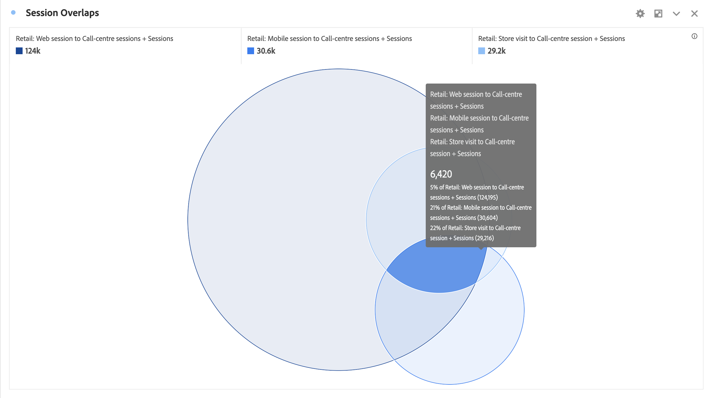

# 文氏圖表 {#venn}

<!-- markdownlint-disable MD034 -->

>[!CONTEXTUALHELP]
>id="workspace_venn_button"
>title="文氏圖表"
>abstract="建立文氏圖表視覺效果，以快速在視覺上比較兩個元素及其重疊的大小。"

<!-- markdownlint-enable MD034 -->

>[!BEGINSHADEBOX]

_本文會在_  _&#x200B;**Customer Journey Analytics**&#x200B;中記錄Venn視覺效果。_ _若需本文的_  _&#x200B;**Adobe Analytics**&#x200B;版本，請參閱[Venn](https://experienceleague.adobe.com/zh-hant/docs/analytics/analyze/analysis-workspace/visualizations/venn)。_

>[!ENDSHADEBOX]

 **[!UICONTROL 文氏圖表]**&#x200B;視覺效果可讓您 (自元件面板) 拖曳最多 3 個區段和一個量度來建置文氏圖表。

>[!NOTE]
>
>Analysis Workspace使用區域比例文氏圖表。 如果文氏圖表具有以兩個維度表示的三個或更多圓圈，則無法一律以完美比例繪製文氏圖表。
> 
>Workspace會嘗試建立最接近的文氏圖表，但結果可能並不一定在視覺上準確。

您可以在區段上停留，以取得百分比等計量的進一步洞察。

若要從[!UICONTROL 文式圖表] 視覺效果產生[!UICONTROL 自由格式表格]，選取標上顏色的  (**[!UICONTROL 文式圖表]**&#x200B;旁) 標題並選取「**[!UICONTROL 顯示資料來源]**」。 您將看到&#x200B;**[!UICONTROL 文式圖表資料]**&#x200B;自由格式表格，其中包括用於建立[!UICONTROL 文式圖表]視覺效果的資料。

<!--
To normalize the Venn diagram (take the size out of it), go select  and select **[!UICONTROL Normalization]**.

-->

>[!BEGINSHADEBOX]

請參閱  [&#x200B; 文式圖表視覺效果](https://experienceleague.adobe.com/en/docs/analytics-learn/tutorials/analysis-workspace/visualizations/venn-diagram-visualization){target="_blank"}的示範影片。

{{videoaa}}

>[!ENDSHADEBOX]

>[!MORELIKETHIS]
>
>[將視覺效果新增至面板](/help/analysis-workspace/visualizations/freeform-analysis-visualizations.md#add-visualizations-to-a-panel)
>[視覺效果設定](/help/analysis-workspace/visualizations/freeform-analysis-visualizations.md#settings)
>[視覺化內容選單](/help/analysis-workspace/visualizations/freeform-analysis-visualizations.md#context-menu)
>

