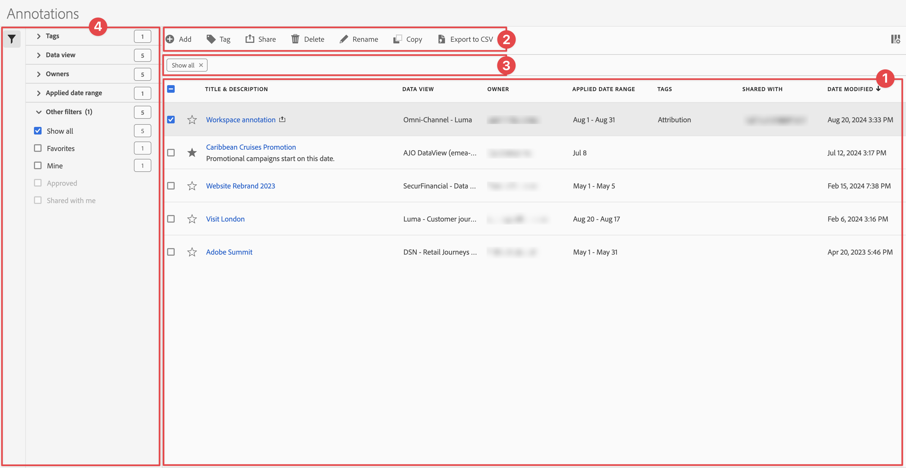

# 管理註解

您可以從中央「[!UICONTROL 註解]」管理介面共用、篩選、標記、核准、複製、刪除註解或將註解標記為最愛項目。若要管理註解：

* 在主介面中選取&#x200B;**[!UICONTROL 元件]**，然後選取&#x200B;**[!UICONTROL 註解]**。

>[!NOTE]
>
>您在特定 Workspace 專案中建立的註解不會出現在[!UICONTROL 註解]管理員中，除非您已將註解設定為可供所有專案使用。
>

## 註解管理器

註解管理器具有以下介面元素：

### 註解清單

註解清單➊會顯示您所擁有的所有註解、納入您所有專案範圍的註解，以及與您共用的註解。清單有以下欄位：

| 欄 | 說明 |
| --- | --- | 
|  | 選取將註解設為最愛項目或取消最愛項目。 |
| **[!UICONTROL 標題和說明]** | 在註解產生器中提供。如要編輯標題和說明，請選取標題連結 - 開啟[註解產生器](/help/components/annotations/create-annotations.md#annotation-builder)。共用註解以表示。 |
| **[!UICONTROL 資料釋圖]** | 此註解所套用的資料釋圖。 |
| **[!UICONTROL 所有者]** | 註解的所有者。做為使用者，您只能看到您擁有的註解或與您共用的註解。 |
| **[!UICONTROL 套用的日期範圍]** | 此註解套用的日期或日期範圍。 |
| **[!UICONTROL 標記]** | 此註解的標記。 |
| **[!UICONTROL 共用對象]** | 您共用註解的個人或群組。選取開啟「**[!UICONTROL 共用元件]**」對話框。 |
| **[!UICONTROL 修改日期]** | 顯示上次修改註解的日期和時間。 |

{style="table-layout:auto"}

使用指定要顯示的欄位。

### 動作列

您可以使用動作列➋對註解執行動作。動作列包含以下動作：

| 圖示 | 動作 | 說明 |
|:--:|---|---|
|  | **[!UICONTROL 新增]** | 使用[註解產生器](create-annotations.md#annotation-builder)新增其他註解。 |
|  | [!UICONTROL *依標題搜尋*] | 當未選取清單中任何註解時，使用此搜尋欄位搜尋註解。 |
|  | **[!UICONTROL 標記]** | 標記所選取的註解。在&#x200B;**[!UICONTROL 標記元件]**&#x200B;對話框中，選取或取消選取所選取註解的標記。選取&#x200B;**[!UICONTROL 儲存]**&#x200B;以儲存所選取註解的標記。 |
|  | **[!UICONTROL 共用]** | 共用所選取的註解。在&#x200B;**[!UICONTROL 共用元件]**&#x200B;對話框中，您可以*搜尋個人或群組*，或者您可以選取&#x200B;**[!UICONTROL 組織]**&#x200B;或&#x200B;**[!UICONTROL 群組]**。選取&#x200B;**[!UICONTROL 儲存]**&#x200B;以儲存所選取註解的共用詳細資訊。如需更多詳細資訊，請參閱[共用註解](#share-annotations)。 |
|  | **[!UICONTROL 刪除]** | 刪除所選取的註解。系統會提示您進行確認。 |
|  | **[!UICONTROL 重新命名]** | 重新命名所選取的單一註解。選取後，您可以用內嵌方式重新命名。 |
|  | **[!UICONTROL 複製]** | 複製所選取的註解。使用相同的名稱和字尾建立新註解 (複製) |
|  | **[!UICONTROL 匯出至 CSV]** | 將註解匯出至 `Annotations List.csv` 檔案。 |

### 使用中的篩選欄

篩選欄➌顯示使用中的篩選條件 (如果有)。您可以使用快速移除篩選條件。如果指定多個篩選條件，您可以使用&#x200B;**[!UICONTROL 移除全部]**&#x200B;來移除所有篩選條件。

### 篩選面板

您可以使用&#x200B;**[!UICONTROL 篩選]**&#x200B;左側面板➍來篩選註解。篩選面板顯示篩選的類型和執行該篩選的註解數量。選取以切換篩選面板的顯示內容。

若要對篩選清單進行篩選：

1. 選取開啟「篩選」面板。如果您需要更多空間顯示篩選清單，可以再次選取來關閉面板。
1. 您可以使用任何可用的 [篩選部分](#filter-sections)來篩選註解。

   >[!INFO]
   >
   >*項目*&#x200B;是指[註解清單](manage-annotations.md#annotations-list)中所顯示的註解項目。
   > 

#### 篩選部分

{{tagfiltersection}}
{{dataviewfiltersection}}
{{ownerfiltersection}}
{{daterangefiltersection}}
{{otherfiltersfiltersection}}

[註解清單](manage-annotations.md#annotations-list)會根據您的篩選設定進行自動更新。您可以在[使用中的篩選欄](manage-annotations.md#active-filter-bar)中查看已設定的篩選。

## 編輯註解

編輯註解有兩個方式：

* 在 Workspace 專案中，使用[元件資訊](/help/components/use-components-in-workspace.md#component-info)圖示。

* 在[[!UICONTROL 註解]清單](#annotations-list)中選取註解標題。

您使用[註解產生器](/help/components/annotations/create-annotations.md#annotation-builder)來編輯註解。

## 共用註解

共用註解或使用與您共用的註解時適用以下情況：

* 您與其他使用者共用的專案中僅限專案的註解，會向那些使用者顯示。使用者無法編輯或刪除這些僅限專案的註解。
* 如果您儲存註解並直接與使用者共用，該使用者必須具有管理員權限，才能編輯和刪除註解。

* 如果是與您共用專案，則在該專案中建立的註解僅顯示在該專案中。若是直接與您共用註解，則該註解在可以顯示註解的所有專案中均會出現。

## 註解和時區

所有註解在建立時均有時間戳記，但不包含小時或時區資訊。在報告時，將使用為面板設定的資料視圖的時區。
