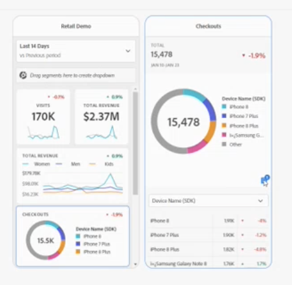

# 在移動記分卡中共用注釋

可以顯示在Workspace-Mobile Scorecard中建立的注釋。 這允許您直接在記分卡中將上下文資料細微差別和洞見共用到組織和市場活動。

Mobile Scorecard中的注釋與具有某些附加功能的Workspace注釋類似。 例如，在Workspace中，可以為日期範圍建立表級注釋。 在移動記分卡中，可查看類別級注釋。 這為Mobile Scorecard用戶提供了其他上下文。
__add示例 — 或描述差異的更多資訊

?Mobile有哪些額外功能？

## 向移動記分卡添加註釋

在Mobile Scorecard中顯示的注釋是使用工作區注釋建立方法在工作區中建立的。 有關建立注釋的資訊，請參見 [建立注釋](create-annotations.md)。

1. 開啟注釋。 要開啟注釋，請參閱 [開啟或關閉注釋](https://experienceleague.adobe.com/docs/analytics-platform/using/cja-components/annotations/overview.html?lang=en#turn-annotations-on-or-off)。

1. 建立注釋並將其分配給全局項目(_G)。 要在工作區中建立注釋，請參見 [建立注釋](create-annotations.md)。

1. 選擇 **顯示批注** 顯示移動記分卡中的注釋。

要確認是否選中了顯示批注，請轉到 **項目** > **項目資訊和設定**。

## 查看移動記分卡中的注釋

在「工作區」中，可在生成器中驗證注釋。 您還可以使用「預覽」模式查看帶批注的Mobile Scorecard。

要查看移動設備上的批注，請在「移動記分卡」中按一下批注表徵圖。 向左或向右輕掃可查看其他批注。 這允許您快速查看所有注釋。

查看__donut時，應用於度量的注釋摘要位於右下角。

## Mobile Scorecard注釋注意事項

* 如果注釋應用於某個類別，而用戶從該類別視圖切換，則注釋將消失。 注釋僅顯示在關聯的類別中。

* 預設情況下，注釋被關閉。

## 批注顏色

建立注釋時，為記分卡中顯示的注釋指定特定顏色。 灰色中出現的注釋表示多個注釋被分配給同一類別。 否則，注釋將以在「工作區」中設定的顏色顯示。
