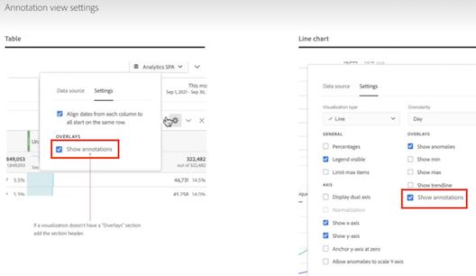

# 註解總覽

註解讓您能夠有效地將內容相關的資料細微差別和深入解析傳達給您的組織。 註解可讓您將行事曆事件和特定的維度/量度連結起來。您可以用資料問題、國定假日、行銷活動推出等來標註日期或日期範圍。接著，您可以使用圖形方式顯示事件，並查看行銷活動或其他事件是否已對您的網站流量、行動應用程式使用情形、收入或任何其他量度造成影響。

例如，假設您要與您的組織共用專案。如果您因為行銷活動而導致流量激增，就可以建立「行銷活動推出日期」註解，並將其範圍設定為整個資料視圖。您的使用者檢視包含該日期的任何資料集時，會在他們的專案中看到該註解以及他們的資料。

請記住以下事項：

* 註解可以與單一日期或日期範圍相關聯。

* 註解可套用至整個資料集或指定的量度、維度或篩選器。

* 註解可套用至建立註解所在的專案 (預設) 或所有專案。

* 註解可套用至建立註解所在的資料視圖 (預設) 或所有資料視圖。

## 權限

根據預設，只有管理員才能建立註解。使用者有權檢視註解，就像檢視其他 Analytics 元件一樣 (例如篩選器、計算量度等)。

但是，管理員可以透過 [Adobe Admin Console](https://experienceleague.adobe.com/docs/analytics/admin/admin-console/permissions/analytics-tools.html) 將「[!UICONTROL 註解建立]」權限 (Analytics 工具) 授予使用者。

## 開啟或關閉註解 {#annotations-on-off}

可在幾個等級開啟或關閉註解：

* 視覺效果等級：[!UICONTROL 視覺化]設定 > [!UICONTROL 顯示註解]

* 專案等級：[!UICONTROL 專案資訊與設定] > [!UICONTROL 顯示註解]

* 使用者等級：[!UICONTROL 元件] > [!UICONTROL 使用者偏好設定] > [!UICONTROL 資料] > [!UICONTROL 顯示註解]

