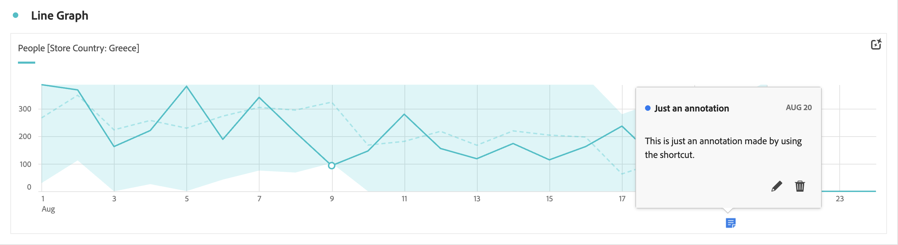
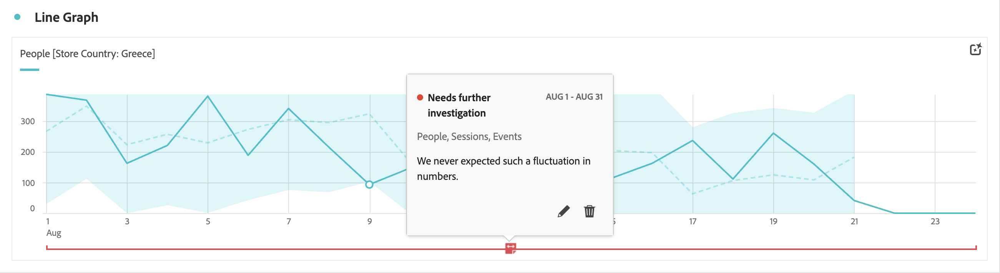

# 檢視註解

根據註解跨越一天還是跨越日期範圍，註解的體現方式略有不同。

## 在折線圖或表格中檢視註解

| 視覺化呈現 類型 | 說明 |
| --- | --- |
| **折線圖&#x200B;** **單日** | 當您在折線圖視覺化呈現中選取時，您會看到一個包含註解詳細資訊的快顯視窗。  如要在[註解產生器](create-annotations.md#annotation-builder) 中編輯註解，選取。若要刪除註解，請選取。 |
| **折線圖&#x200B;** **日期範圍** | 當您選取時，您會看到一個快顯視窗，其中包含註解詳細資訊，及底部有一行指示日期範圍。 如要在[註解產生器](create-annotations.md#annotation-builder) 中編輯註解，選取。若要刪除註解，請選取。 |
| **自由格式表格** | 在自由格式表格中，您可以透過視覺效果右上方的註解按鈕存取所有註解。選取以查看所有註解 (滾動清單)。  對於每個註解，您可以選取在[註解產生器](create-annotations.md#annotation-builder)中編輯註解和以刪除註解。 |

{style="table-layout:auto"}

## 在 PDF 檢視註解

當您以 PDF 形式下載專案或以 PDF 形式傳送專案時，PDF 的註解匯總在「註解摘要」區段。

