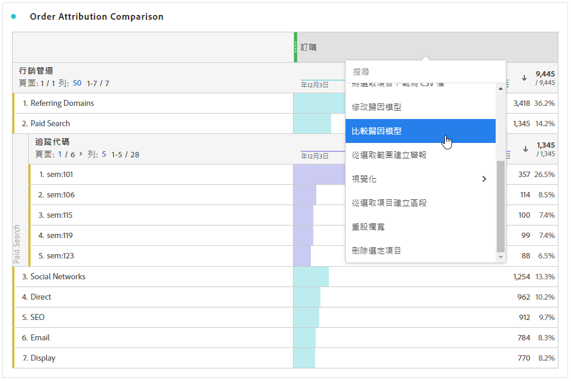

# 量度

量度可讓您量化 Analysis Workspace 中的資料點。它們最常用作視覺效果中的欄，並和維度相連結。

## 量度類型

Adobe 提供了多種可用於 Analysis Workspace 中的量度類型：

* **標準量度**：標準量度的範例為人員、工作階段、事件。

* **計算量度** ：以標準量度、靜態數字或演演算法函式為基礎的使用者定義量度。

* **計算量度範本**   ：Adobe定義的量度，其行為與計算量度類似。 您可以在Workspace專案中照原樣使用，或儲存副本以自訂其邏輯。

您可以檢視量度是否核准。 如果您想要瞭解量度的詳細資訊，請將滑鼠移至量度上，然後選取。

量度在Analysis Workspace中的使用有彈性。 將量度拖曳至空白的自由格式表格，以檢視專案日期期間的量度趨勢。 您也可以拖曳出現維度時的量度，以檢視與每個維度專案比較的量度。 將量度拖曳至現有量度標頭上方會取代量度，並將量度拖曳至標頭旁，可讓您並排看到兩個量度。

## 使用 Analysis Workspace 中的量度

在 Analysis Workspace 中能以多種方式使用量度。如需有關如何將量度和其他型別的元件新增到Analysis Workspace的資訊，請參閱[在Analysis Workspace中使用元件](/help/components/use-components-in-workspace.md)。

## 建立計算量度

計算量度可讓您使用簡單的運運算元或統計函式，輕鬆檢視量度彼此間的關聯性。

建立計算量度有數種方式。 您選擇的方法會決定計算量度是否可從所有專案的元件清單中使用，或僅用於建立該量度的專案。

### 為所有專案建立計算量度

您可以使用計算量度產生器建立計算量度。 以這種方式建立時，計算量度會顯示在元件清單中，然後可用於整個組織的專案。

如需如何存取計算量度產生器的詳細資訊，請參閱[建立量度](/help/components/calc-metrics/cm-workflow/cm-build-metrics.md)。

### 為單一專案建立計算量度

您可以建立快速計算量度，這些量度只適用於建立所在的專案。

若要建立單一專案的計算量度：

1. 在Analysis Workspace中，開啟您要建立計算量度的專案。

1. 在自由表格中，以滑鼠右鍵按一下一或多個標題欄儲存格，然後選取&#x200B;**[!UICONTROL 從選取範圍建立量度]**

   

1. 若要僅為此專案建立計算量度，請從下列選項中選擇：

   * [!UICONTROL **除**]

   * [!UICONTROL **減去**]

   * [!UICONTROL **新增**]

   * [!UICONTROL **乘**]

   或者，若要開啟計算量度產生器並為所有專案建立計算量度，請選取「在計算量度產生器中開啟」[!UICONTROL ****]，然後繼續執行[建立量度](/help/components/calc-metrics/cm-workflow/cm-build-metrics.md)。

[計算量度：實作較少的量度](https://experienceleague.adobe.com/docs/analytics-learn/tutorials/components/calculated-metrics/calculated-metrics-implementationless-metrics.html?lang=zh-Hant) (3:42)

## 比較不同歸因模型的量度

如果您想要輕鬆快速地比較不同的歸因模型，請用滑鼠右鍵按一下量度，然後選取&#x200B;**[!UICONTROL 比較歸因模型]**：

此快速鍵可讓您輕鬆快速地比較不同的歸因模型，而無須再次拖曳量度和進行設定。
