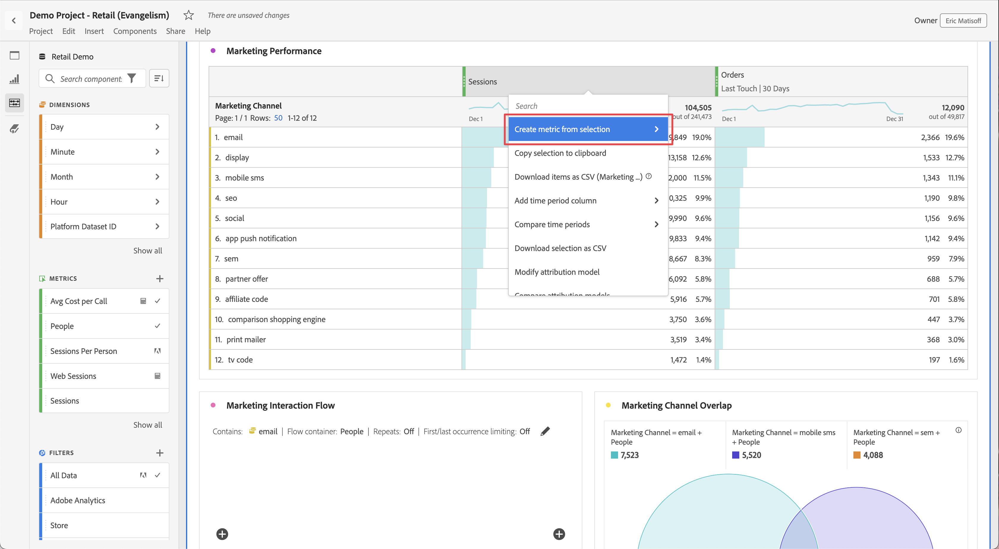
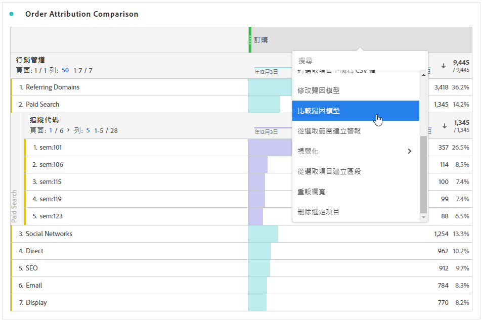

# 量度

量度可讓您量化 Analysis Workspace 中的資料點。 它們最常用作視覺效果中的欄，並和維度相連結。

## 在 Analysis Workspace 中使用量度

量度在Analysis Workspace中的使用有彈性。 將量度拖曳至空白的自由格式表格，以檢視專案日期期間的量度趨勢。 您也可以拖曳出現維度時的量度，以檢視與每個維度專案比較的量度。 將量度拖曳至現有量度標頭上方會取代量度，並將量度拖曳至標頭旁，可讓您並排看到兩個量度。

如需有關如何將量度和其他型別的元件新增到Analysis Workspace的資訊，請參閱[在Analysis Workspace中使用元件](/help/components/use-components-in-workspace.md)。

## 量度類型

Adobe 提供了多種可用於 Analysis Workspace 中的量度類型：

* **標準量度**：標準量度的範例為人員、工作階段、事件。

  與Adobe Analytics不同，Customer Journey Analytics可讓您在連線和資料檢視範圍內，以靈活的方式定義標準量度。

   * **人員**： Customer Journey Analytics中的人員量度是人員ID的相異計數。 當您在連線中設定資料集時，根據您選擇做為人員ID的內容，人員量度可能有不同的意義。
   * **工作階段**：您會在資料檢視中定義工作階段量度，做為工作階段設定組態的一部分。 請參閱[工作階段設定](/help/data-views/session-settings.md)。
   * **事件**： Customer Journey Analytics中的事件量度是由事件所組成，這些事件是您已設定為連線之一部分的任何事件資料集的一部分。

  如需標準量度的完整清單，請參閱[標準量度](#standard-metrics)。

* **計算量度** ：以標準量度、靜態數字或演演算法函式為基礎的使用者定義量度。

* **計算量度範本**  ：Adobe定義的量度，其行為與計算量度類似。 您可以在Workspace專案中照原樣使用，或儲存復本來自訂邏輯。 請參閱[預設計算量度](calc-metrics/cm-workflow/../default-calcmetrics.md)。

您可以檢視量度是否核准。 如果您想要瞭解量度的詳細資訊，請將滑鼠移至量度上，然後選取。 如需詳細資訊，請參閱[元件資訊](use-components-in-workspace.md#component-info)。

## 標準量度

Customer Journey Analytics中的標準量度完整清單：
{{standard-metrics}}

## 建立計算量度

計算量度可讓您使用簡單的運運算元或統計函式，輕鬆設定量度彼此間的關聯性。 如需詳細資訊，請參閱[計算量度概觀](/help/components/calc-metrics/calc-metr-overview.md)。

建立計算量度有數種方式。 您選擇的方法會決定計算量度是否可從所有專案的元件清單中使用，或僅用於建立該量度的專案。

### 為所有專案建立計算量度

您可以使用[計算量度產生器](/help/components/calc-metrics/cm-workflow/cm-build-metrics.md)來[建立計算量度](/help/components/calc-metrics/cm-workflow/cm-workflow.md)。 用這個方式建立的計算量度會出現在元件清單中，而且之後可用於整個組織的專案。

### 為單一專案建立計算量度

您可以快速建立計算量度，該量度僅適用於建立該量度的專案。

若要建立單一專案的計算量度：

1. 在Analysis Workspace中，開啟您要建立計算量度的專案。

1. 在自由表格中，以滑鼠右鍵按一下單一欄的欄標題。

   或

   按住Shift鍵同時選取兩欄，然後以滑鼠右鍵按一下其中一個選取的欄。

1. 選取&#x200B;**[!UICONTROL 從選取專案建立量度]**

   

1. 若只要建立此專案的計算量度，請從可用的選項中選擇。

   選取單一欄時，可使用下列選項：

   * [!UICONTROL **平均值**]：建立新資料行，以顯示資料行維度元素集合中的平均值。 這會使用[Mean](/help/components/calc-metrics/cm-functions.md#mean)函式。

   * [!UICONTROL **中位數**]：建立新資料行，顯示資料行維度元素集合的中位值。 這會使用[Median](/help/components/calc-metrics/cm-functions.md#median)函式。

   * [!UICONTROL **資料行max**]：建立新資料行，以顯示資料行維度元素集合中的最大值。 這會使用[Column Maximum](/help/components/calc-metrics/cm-functions.md#column-maximum)函式。

   * [!UICONTROL **資料行min**]：建立新資料行，以顯示資料行維度元素集合中的最小值。 這會使用[Column Minimum](/help/components/calc-metrics/cm-functions.md#column-minimum)函式。

   * [!UICONTROL **資料行總和**]:Creates&#x200B;新資料行，將資料行內量度的所有數值相加（跨越維度元素）。 這會使用[資料行Sum](/help/components/calc-metrics/cm-functions.md#column-sum)函式。

   選取兩欄時，可使用下列選項：

   * [!UICONTROL **除**]：建立新資料行，將兩個選取資料行的值相除。

   * [!UICONTROL **減**]：建立新資料行，以減去兩個選取資料行的值。

   * [!UICONTROL **新增**]：建立新資料行，將兩個選取資料行的值相加。

   * [!UICONTROL **乘**]：建立將兩個選取資料行的值相乘的新資料行。

   * [!UICONTROL **百分比變更**]：建立新資料行，顯示兩個選取資料行之間的百分比變更。

## 比較不同歸因模型的量度

若要快速比較量度的一個歸因模型與另一個歸因模型，請從量度的內容功能表中選取&#x200B;**[!UICONTROL 比較歸因模型]**。

此快速鍵可讓您比較不同的歸因模型，而無須再次拖曳量度和進行設定。

