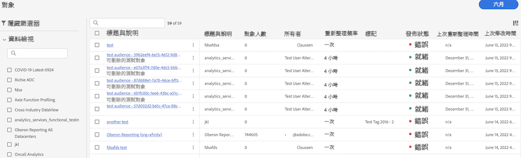

# 在 Customer Journey Analytics 中管理對象

管理先前建立的對象，可讓您

* 為自動對象重新整理/更新進行&#x200B;**排程或取消排程**。 排程的最長到期時間為 1 年。
* 在對象重新整理排程快到期時，**續訂對象重新整理排程**。系統處理即將到期對象的方法與即將到期的排程報告相似，管理員會在排程到期的一個月前收到電子郵件。
* 查看&#x200B;**重新整理間隔**&#x200B;和&#x200B;**上次更新對象的時間**
* 深入瞭解 **產生對象所需的時間** Customer Journey Analytics以及讓對象出現在即時客戶設定檔以進行啟動所需的時間長度。
* 檢視Customer Journey Analytics中的對象是否為 **由即時客戶個人檔案主動使用** 或（理想情況下）任何使用Customer Journey Analytics所建立對象的Experience Platform應用程式。

## 管理 UI

| UI 設定 | 定義 |
| --- | --- |
| 隱藏/顯示篩選器 | 您可以在左側邊欄中顯示或隱藏下列篩選器： <ul><li>[!UICONTROL 資料檢視]</li><li>[!UICONTROL 所有者]</li><li>[!UICONTROL 重新整理頻率]</li><li>[!UICONTROL 標記]</li></ul> |
| [!UICONTROL 標題和說明] | 建立對象時為其提供的標題和說明。 |
| [!UICONTROL 資料檢視] | 建立此對象的資料檢視。 |
| [!UICONTROL 對象規模] | 此對象的總人數。 |
| [!UICONTROL 所有者] | 對象的所有者 - 建立對象的人。 |
| [!UICONTROL 重新整理頻率] | 建立對象時設定的重新整理間隔。 |
| [!UICONTROL 標記] | 套用到此對象的任何標記。 |
| [!UICONTROL 發佈狀態] | 可以顯示[!UICONTROL 「就緒」]、[!UICONTROL 「進行中」]或[!UICONTROL 「錯誤」]。 |
| [!UICONTROL  上次重新整理時間] | 對象上次重新整理的時間。 |
| [!UICONTROL 上次修改日期] | 上次編輯或修改對象的時間。 |

{style="table-layout:auto"}
