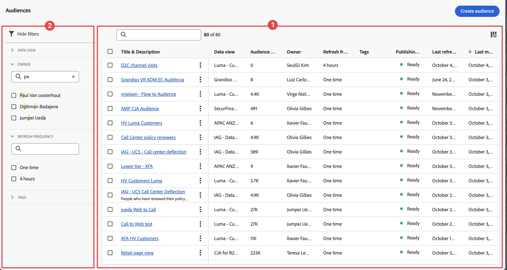

# 管理發布的對象

可以使用「**[!UICONTROL 元件]** > **[!UICONTROL 客群]**」在 Customer Journey Analytics 中管理客群。

## 了解客群管理任務

管理先前建立的客群可讓您：

* 為自動客群重新整理/更新進行&#x200B;**排程或取消排程**。 排程的最長期限為 1 年。
* 在客群更新排程快過期時，**續訂該排程。**。系統處理即將過期客群的方法與即將過期的排程報告相似，管理員會在排程過期前的一個月收到電子郵件。
* 查看&#x200B;**重新整理間隔**&#x200B;和&#x200B;**上次更新客群的時間**
* 透過 Customer Journey Analytics 深入分析&#x200B;**吸引客群所需時間**。以及讓客群出現在 Real-time Customer Platform 以達到啟動目的所需的時間。
* 查看 **Real-time Customer Platform** 是否會積極使用 Customer Journey Analytics 中的客群。或 (理想情況下) 任何使用由 Customer Journey Analytics 所建立客群的 Experience Platform 應用程式。

如果您有[客群檢視](/help/technotes/access-control.md#user-level-access)的存取權限，就可以查看客群。如果您有[客群建立](/help/technotes/access-control.md#user-level-access)的存取權限，您就可以編輯和刪除客群。

## 在客群清單中檢視客群

對象清單➊會顯示現有的對象。

若要檢視客群清單：

1. 在Customer Journey Analytics中，選取&#x200B;**[!UICONTROL 元件]** > **[!UICONTROL 已發佈的對象]**。

1. (選擇性) 使用  來設定要顯示的欄。

1. (選擇性) 使用來搜尋客群。

   以下各欄提供關於每個客群的資訊：

   | 欄 | 說明 |
   | --- | --- |
   |  | 當選取一個或多個客群時，客群介面底部會出現一個藍色操作欄。如需詳細資訊，請參閱「[操作](#actions)」。 |
   | **[!UICONTROL 標題和說明]** | 您建立客群時輸入的標題和說明。 |
   | **[!UICONTROL 資料檢視]** | 建立此客群的資料檢視。 |
   | **[!UICONTROL 客群規模]** | 此客群的總人數。 |
   | **[!UICONTROL 所有者]** | 客群的所有者 - 建立客群的人。 |
   | **[!UICONTROL 重新整理頻率]** | 建立客群時設定的重新整理間隔。 |
   | **[!UICONTROL 標記]** | 套用到此客群的任何標記。 |
   | **[!UICONTROL 發佈狀態]** | 可以顯示  **[!UICONTROL 準備就緒]**、 **[!UICONTROL 進行中]**&#x200B;或  **[!UICONTROL 錯誤]**。 |
   | **[!UICONTROL 上次重新整理時間]** | 客群上次重新整理的時間戳記。 |
   | **[!UICONTROL 上次修改日期]** | 客群上次編輯或修改的時間戳記。 |

## 編輯客群

您可以隨時編輯客群設定。當您編輯客群 (一次性客群或定期客群) 時，需要重新發佈。

若要編輯客群：

1. 在Customer Journey Analytics中，選取&#x200B;**[!UICONTROL 元件]** > **[!UICONTROL 已發佈的對象]**。

   會顯示客群頁面。

1. 選取您想要編輯之客群的標題。

   會顯示&#x200B;**[!UICONTROL 編輯客群]**&#x200B;對話框。

1. 您可以更新客群的任何可用欄位。關於您可以更新之欄位的資訊，請參閱[建立及發佈客群](/help/components/audiences/publish.md)文章中的[客群產生器](/help/components/audiences/publish.md#audience-builder)。

1. 選取「**[!UICONTROL 重新發佈]**」。

## 動作

下列是「已排程的專案管理員」中的常見動作。您可以從內容選單中選取操作：

| 圖示 | 動作 | 說明 |
|:---:|---|---|
|  | **[!UICONTROL 標記]** | 標記所選取的客群。在&#x200B;**[!UICONTROL 「更新」標記中：*客群名稱&#x200B;*]**對話框中，從下拉式選單中選取標記，或輸入一個或多個新標記。選取「**[!UICONTROL 儲存&#x200B;]**」以便儲存。 |
|  | **[!UICONTROL 刪除]** | 刪除所選取的客群。 |
|  | **[!UICONTROL 重新命名]** | 重新命名選取的客群。使用「**[!UICONTROL 重新命名」：「*客群名稱&#x200B;*]**」對話框來重新命名客群，然後選取「**[!UICONTROL 儲存&#x200B;]**」以便儲存。 |

選取一個或多個已排程專案時，可以從藍色操作列執行下列操作。

| 圖示 | 動作 | 說明 |
|:---:|---|---|
|  | **[!UICONTROL *x *已選取]** | 選擇以取消選取您所選的客群。 |
|  | **[!UICONTROL 刪除]** | 刪除所選取的客群。 |
|  | **[!UICONTROL 匯出至 CSV]** | 將選取的客群匯出至名為 `audiences.csv` 的檔案中。 |

## 篩選客群清單

您可以使用篩選面板[來篩選](#audiences-list)對象清單➋。 若要顯示或隱藏篩選器面板，請使用「」。

篩選器面板由以下部分組成。

### 資料檢視

| 資料檢視 | 說明 |
|---|---|
| {width="300"} | 「**[!UICONTROL 資料檢視]**」部分可讓您篩選資料檢視。 <ul><li>您可以使用「」來搜尋您想要用來篩選的資料檢視。</li><li>您可以選取多個資料檢視。</li></ul> |

### 所有者

| 所有者 | 說明 |
|---|---|
| {width="300"} | 「**[!UICONTROL 所有者]**」部分可讓您篩選所有者。 <ul><li>您可以使用「」來搜尋您想要用來篩選的所有者。</li><li>您可以選取多個所有者。 </li></ul> |

## 重新整理頻率

| 重新整理頻率 | 說明 |
|---|---|
| {width="300"} | 「**[!UICONTROL 重新整理頻率]**」部分可讓您對重新整理頻率進行篩選。 <ul><li>您可以使用「」來搜尋您想要用來篩選的重新整理頻率。</li><li>只有為「[客群](#audiences-list)」清單中客群 定義的重新整理頻率會顯示為可用選項。</li></ul> |

### 標記

| 標記 | 說明 |
|---|---|
| {width="300"} | 「**[!UICONTROL 標記]**」部分可讓您按標記進行篩選。 <ul><li>您可以使用「」來搜尋您想要用來篩選的標記。 |
