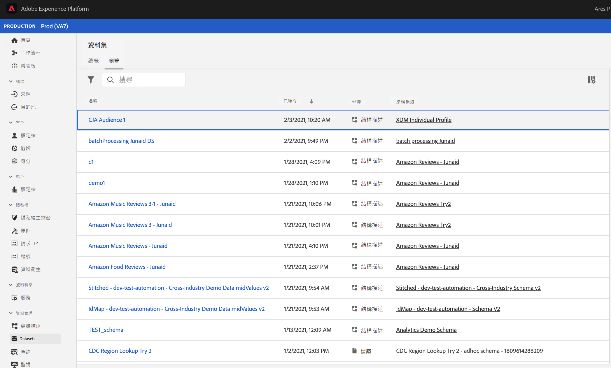

# 管理在Customer Journey Analytics中建立的受眾

管理以前建立的受眾允許您

* **計畫或取消計畫** 自動訪問群刷新/更新。 計畫的最大期限為1年。
* **續訂受眾刷新計畫** 即將到期。 過期的受眾會像過期的計畫報告一樣 — 管理員在計畫過期前一個月收到一封電子郵件。
* **查看上次更新受眾的時間**
* 深入瞭解 **製作觀眾所花的時間** 從Customer Journey Analytics(CJA)，以及為激活目的在即時客戶配置檔案中顯示受眾所花費的時間。
* 查看CJA中的觀眾是否 **正被即時客戶配置檔案主動使用** 或（理想情況下）使用CJA建立的受眾的任何Experience Platform應用程式。

## 管理UI

螢幕擷取畫面

| UI設定 | 定義 |
| --- | --- |
| 隱藏/顯示篩選器 | 用於在左滑軌中顯示或隱藏以下濾鏡： <ul><li>資料檢視</li><li>所有者</li><li>重新整理頻率</li><li>標記</li></ul> |
| 標題與說明 |  |
| 資料檢視 |
| 對象人數 |  |
| 所有者 |  |
| 刷新頻率 |  |
| 標記 |  |
| 上次刷新時間 |  |
| 上次修改時間 |  |

{style=&quot;table-layout:auto&quot;}

## 在Experience Platform中查看和使用CJA受眾

通過轉到 [!UICONTROL 段] > [!UICONTROL 建立段] > [!UICONTROL 觀眾] 頁籤 [!UICONTROL CJA觀眾]。

如果選擇將此「受眾」導出到AEP資料湖，它將顯示為符合XDM個人配置檔案架構類的資料集：

