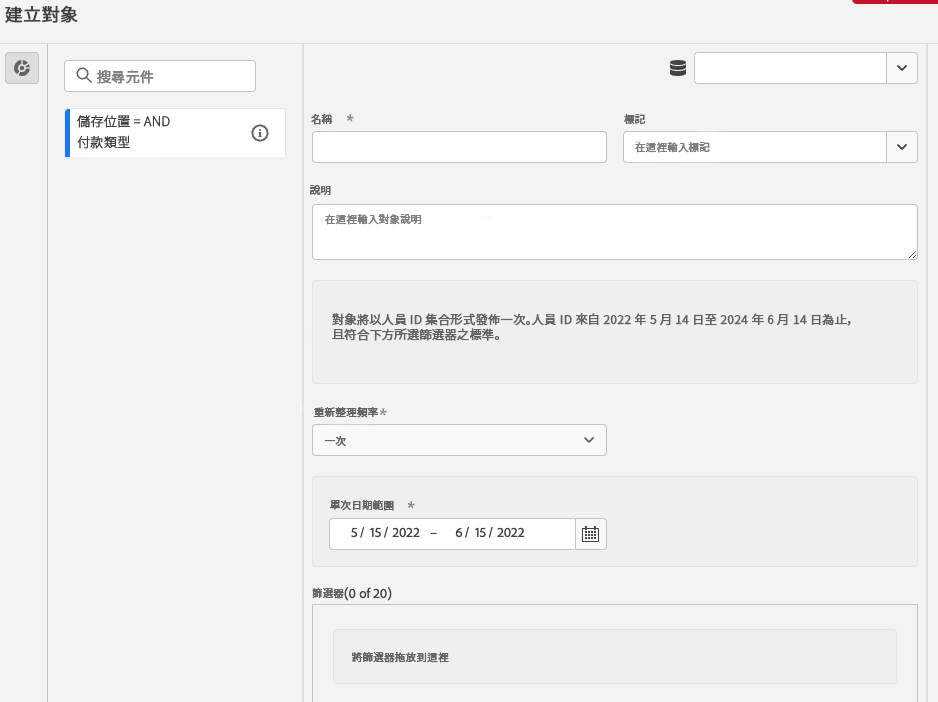
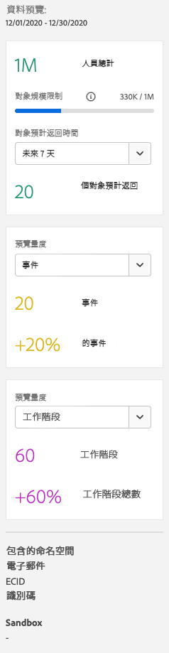
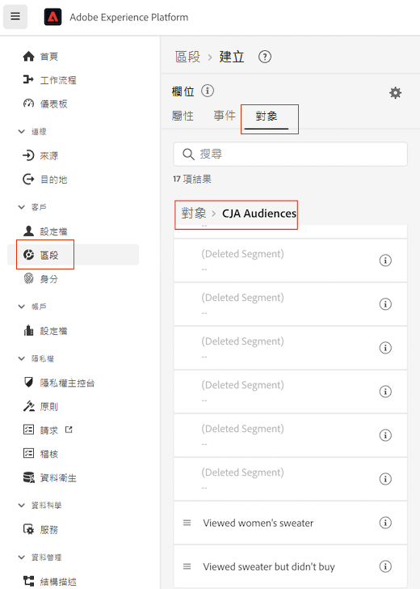

# 建立及發佈對象

本主題說明如何將在 Customer Journey Analytics (CJA) 中發現的對象建立並發佈到 Adobe Experience Platform 中的[即時客戶個人檔案](https://experienceleague.adobe.com/docs/experience-platform/profile/home.html?lang=zh-Hant)，以用於客戶目標定位和個人化。

請閱讀此[總覽](/help/components/audiences/audiences-overview.md)，熟悉 CJA 對象的概念。

## 建立對象 {#create}

1. 您可以透過三種方法建立對象：

   | 建立方法 | 詳細資料 |
   | --- | --- |
   | 從主要&#x200B;**[!UICONTROL 「元件] > [!UICONTROL 對象」]**&#x200B;選單 | 系統會開啟 Audience Manager 頁面。 按一下「**[!UICONTROL 建立對象]**」，[!UICONTROL 對象產生器]隨即開啟。 |
   | 從自由格式表格 | 以右鍵按一下自由格式表格中的項目，然後選擇「**[!UICONTROL 從選取項目建立對象]**」。 此方法會使用您在表格中選擇的維度或維度項目預先填入篩選器。 |
   | 從篩選器建立/編輯 UI | 勾選顯示「**[!UICONTROL 從這個篩選器建立對象]**」的方塊。 使用此方法預先填入篩選器。 |

   {style=&quot;table-layout:auto&quot;}

1. 建置對象。

   請先配置設定，然後才能發佈對象。

   

   | 設定 | 說明 |
   | --- | --- |
   | [!UICONTROL 名稱] | 對象名稱。 |
   | [!UICONTROL 標記] | 任何您針對組織目的想要套用到對象的標籤。 您可以使用現有的標籤或輸入新的標籤。 |
   | [!UICONTROL 說明] | 新增對象的優質說明，以與其他對象區分開來。 |
   | [!UICONTROL 重新整理頻率] | 您想要重新整理對象的頻率。<ul><li>您可以選擇建立單次、不需重新整理的對象 (預設)。 例如，這可能適合用於特定單次行銷活動。</li><li>您也可以選擇其他重新整理間隔。 根據您的CJA權限，4小時重新整理的頻率限制為75到150次對象重新整理。</li></ul> |
   | 到期日 | 對象停止重新整理的時間。 預設到期日是從建立日期算起的 1 年後。系統處理即將到期對象的方法與即將到期的排程報告相似，管理員會在對象到期的一個月前收到通知電子郵件。 |
   | 重新整理回顧期間 | 在建立此對象時，指定資料回溯期間的長度。 最長 90 天。 |
   | [!UICONTROL 一次性日期範圍] | 您想要發佈一次性對象的日期範圍。 |
   | [!UICONTROL 篩選器] | 篩選器是對象的主要輸入項目。 可最多新增 20 個篩選器。 這些篩選器可以加入 `And` 或 `Or` 運算子。 |
   | [!UICONTROL 檢視範例 ID] | 此對象中的範例 ID。 使用搜尋列來搜尋範例 ID。 |

   {style=&quot;table-layout:auto&quot;}

1. 解讀資料預覽。

   對象預覽會顯示在右側邊欄中。 它允許對您建立的對象進行摘要分析。

   

   | 預覽設定 | 說明 |
   | --- | --- |
   | [!UICONTROL 資料預覽]視窗 | 對象的日期範圍。 |
   | [!UICONTROL 總人數] | 此對象中總人數的摘要數字。 最多可以高達 2 千萬人。如果您的對象超過 2 千萬人，您必須先減少對象規模，才能發佈。 |
   | [!UICONTROL 對象規模限制] | 顯示此對象規模距離 2 千萬人限制還差多少。 |
   | [!UICONTROL 預估的對象回訪] | 此設定對於將此對象中回訪您網站的客戶做為目標很有用。 (換句話說，又會在這個資料集中看到這些對象。) 
在這裡，您可以選取可能回訪的估計客戶數量的時間範圍 (接下來 7 天、接下來 2 週、下個月)。 |
   | [!UICONTROL 預估回訪] | 此數字可提供從下拉式清單中所選時間範圍內的回訪客戶估計數量。 我們查看該對象的歷史流失率來預測這個數字。 |
   | [!UICONTROL 預覽量度] | 此設定可讓您查看特定量度，以了解此對象是否對此量度貢獻了不成比例的數量，例如「[!UICONTROL 收入]」或「[!UICONTROL 網站平均逗留時間]」。 它為您提供量度的彙總計數，以及它所代表的總數的百分比。 您可以選取資料檢視中可用的任何量度。 |
   | [!UICONTROL 包含的命名空間] | 與對象中的人員相關聯的特定命名空間。 範例包括 ECID、CRM ID、電子郵件地址等。 |
   | [!UICONTROL 沙箱] | 此對象所在的 [Experience Platform 沙箱](https://experienceleague.adobe.com/docs/experience-platform/sandbox/home.html?lang=zh-Hant)。 當您將此對象發佈到 Platform 時，您只能在此沙箱的範圍內使用它。 |

   {style=&quot;table-layout:auto&quot;}

1. 仔細檢查您的對象組態，然後按一下&#x200B;**[!UICONTROL 「發佈」]**。

   如果一切順利，您會收到一則對象已發佈的確認訊息。 只需一兩分鐘，此對象就會出現在 Experience Platform 中。 (即使是擁有數百萬成員的對象，應該也不需要 5 分鐘。)

1. 按一下同一則訊息中的&#x200B;**[!UICONTROL 「在 AEP 中檢視對象」]**，您將被帶到 Adobe Experience Platform 中的[「區段 UI」](https://experienceleague.adobe.com/docs/experience-platform/segmentation/ui/overview.html?lang=zh-Hant)。 請參閱下方以了解更多資訊。

## 建立對象後會發生什麼事 {#after-audience-created}

建立對象後，Adobe會為每個新CJA對象建立Experience Platform串流區段。

* AEP區段與CJA對象共用相同的名稱/說明，但名稱會附加在CJA對象ID後，以確保其唯一。

* 如果CJA對象名稱/說明變更，AEP區段名稱/說明也會反映該變更。

* 如果使用者刪除了CJA對象，「AEP」區段不會刪除。 原因是CJA對象稍後可能會取消刪除。

## 在 Experience Platform 中使用 CJA 對象 {#audiences-aep}

CJA會取用已發佈對象中的所有命名空間和ID組合，並串流至即時客戶設定檔(RTCP)。 CJA會根據選取為的項目，將對象傳送至具有主要身分設定的Experience Platform [!UICONTROL 人員ID] 連接配置時。

接著 RTCP 會檢查每個命名空間/ID 組合，並尋找它可能屬於的個人檔案。 個人檔案基本上是一組連結的命名空間、ID 和裝置。 如果找到個人檔案，則會將命名空間和 ID 新增到此個人檔案中的其他 ID，做為區段會籍屬性。 例如，現在可以跨所有裝置和頻道以「user@adobe.com」做為目標。 如果找不到個人檔案，則會建立一個新的。

您可以在 Platform 中檢視 CJA 對象，方法是前往「**[!UICONTROL 區段]** > **[!UICONTROL 建立區段]** > **[!UICONTROL 對象]**&#x200B;標籤 > **[!UICONTROL CJA 對象]**」。

您可以將 CJA 對象拖到 AEP 區段的區段定義。

## 常見問答 {#faq}

對象發佈的常見問題。

+++**如果使用者不再是 CJA 中的對象成員，會發生什麼情況？**

發生這種情況時，會從 CJA 傳送退出事件到 Experience Platform。

+++

+++**如果您刪除 CJA 中的對象，會有什麼影響？**

刪除 CJA 對象時，該對象不會在 Experience Platform UI 中顯示。然而，實際上不會刪除在 Platform 中與該對象相關聯的設定檔。

+++

+++**如果RTCDP中沒有對應的設定檔，是否會建立新的設定檔？**

是的。

+++

+++**CJA會以管道事件或也會前往資料湖的一般檔案形式傳送對象資料嗎？**

CJA會透過管道將資料串流至RTCP，這些資料也會收集至資料湖的系統資料集中。

+++

+++**CJA會傳送哪些身分識別？**

中使用的身分/命名空間配對 [連線設定](https://experienceleague.adobe.com/docs/analytics-platform/using/cja-connections/create-connection.html?lang=zh-Hant#create-connection). 具體而言，使用者選取要作為其「人員ID」之欄位時的步驟。

+++

+++**選擇哪個ID作為主要身分？**

請參閱以上內容。我們只會傳送每個CJA「person」一個身分識別。

+++

+++**RTCP是否也會處理CJA訊息？ CJA可以透過受眾共用將身分新增至設定檔身分圖嗎？**

否。我們只會為每個「人」發送一個標識，因此RTCP將沒有圖形邊可供使用。

+++

## 後續步驟

* 若要管理此對象，請前往[「管理 UI」](/help/components/audiences/manage.md)。
